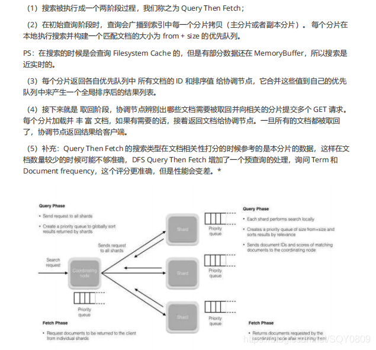

### Elasticsearch


### 1、elasticsearch 了解多少，说说你们公司 es 的集群架构，索引数据大小，分片有多少，以及一些调优手段 。

面试官：想了解应聘者之前公司接触的 ES 使用场景、规模，有没有做过比较大规模的索引设计、规划、调优。
解答：如实结合自己的实践场景回答即可。
比如：ES 集群架构 13 个节点，索引根据通道不同共 20+索引，根据日期，每日递增 20+，索引：10分片，每日递增 1 亿+数据，每个通道每天索引大小控制：150GB 之内。
仅索引层面调优手段：
1.1、设计阶段调优
（1）根据业务增量需求，采取基于日期模板创建索引，通过 roll over API 滚动索引；

（2）使用别名进行索引管理；

（3）每天凌晨定时对索引做 force_merge 操作，以释放空间；

（4）采取冷热分离机制，热数据存储到 SSD，提高检索效率；冷数据定期进行 shrink操作，以缩减存储；

（5）采取 curator 进行索引的生命周期管理；

（6）仅针对需要分词的字段，合理的设置分词器；

（7）Mapping 阶段充分结合各个字段的属性，是否需要检索、是否需要存储等。

1.2、写入调优
（1）写入前副本数设置为 0；

（2）写入前关闭 refresh_interval 设置为-1，禁用刷新机制；

（3）写入过程中：采取 bulk 批量写入；

（4）写入后恢复副本数和刷新间隔；

（5）尽量使用自动生成的 id。

1.3、查询调优
（1）禁用 wildcard；

（2）禁用批量 terms（成百上千的场景）；

（3）充分利用倒排索引机制，能 keyword 类型尽量 keyword；

（4）数据量大时候，可以先基于时间敲定索引再检索；

（5）设置合理的路由机制。

1.4、其他调优
部署调优，业务调优等。
上面的提及一部分，面试者就基本对你之前的实践或者运维经验有所评估了。

### 2、elasticsearch 的倒排索引是什么

  


lucene 从 4+版本后开始大量使用的数据结构是 FST。FST 有两个优点：

（1）空间占用小。通过对词典中单词前缀和后缀的重复利用，压缩了存储空间；

（2）查询速度快。O(len(str))的查询时间复杂度。

### 3、elasticsearch 索引数据多了怎么办，如何调优，部署

面试官：想了解大数据量的运维能力。

解答：索引数据的规划，应在前期做好规划，正所谓“设计先行，编码在后”，这样才能有效的避免突如其来的数据激增导致集群处理能力不足引发的线上客户检索或者其他业务受到影响。

如何调优，正如问题 1 所说，这里细化一下：

3.1 动态索引层面
基于模板+时间+rollover api 滚动创建索引，举例：设计阶段定义：blog 索引的模板格式为： blog_index_时间戳的形式，每天递增数据。这样做的好处：不至于数据量激增导致单个索引数据量非 常大，接近于上线 2 的32 次幂-1，索引存储达到了 TB+甚至更大。

一旦单个索引很大，存储等各种风险也随之而来，所以要提前考虑+及早避免。

3.2 存储层面
冷热数据分离存储，热数据（比如最近 3 天或者一周的数据），其余为冷数据。

对于冷数据不会再写入新数据，可以考虑定期 force_merge 加 shrink 压缩操作，节省存储空间和检索效率。

3.3 部署层面
一旦之前没有规划，这里就属于应急策略。
结合 ES 自身的支持动态扩展的特点，动态新增机器的方式可以缓解集群压力，注意：如果之前主节点等规划合理，不需要重启集群也能完成动态新增的。

### 4、elasticsearch 是如何实现 master 选举的

  

```
GET /_cat/nodes?v&h=ip,port,heapPercent,heapMax,id,name
ip port heapPercent heapMax id name复制代码
```

### 5、详细描述一下 Elasticsearch 索引文档的过程

  

5、详细描述一下 Elasticsearch 索引文档的过程

### 6、详细描述一下 Elasticsearch 搜索的过程？

面试官：想了解 ES 搜索的底层原理，不再只关注业务层面了。

解答：

搜索拆解为“query then fetch” 两个阶段。

query 阶段的目的：定位到位置，但不取。

步骤拆解如下：

（1）假设一个索引数据有 5 主+1 副本 共 10 分片，一次请求会命中（主或者副本分片中）的一个。

（2）每个分片在本地进行查询，结果返回到本地有序的优先队列中。

（3）第 2）步骤的结果发送到协调节点，协调节点产生一个全局的排序列表。

fetch 阶段的目的：取数据。

路由节点获取所有文档，返回给客户端。

### 7、Elasticsearch 在部署时，对 Linux 的设置有哪些优化方法

面试官：想了解对 ES 集群的运维能力。

解答：

（1）关闭缓存 swap;

（2）堆内存设置为：Min（节点内存/2, 32GB）;

（3）设置最大文件句柄数；

（4）线程池+队列大小根据业务需要做调整；

（5）磁盘存储 raid 方式——存储有条件使用 RAID10，增加单节点性能以及避免单节点存储故障。

### 8、lucence 内部结构是什么？

面试官：想了解你的知识面的广度和深度。

解答：

Lucene 是有索引和搜索的两个过程，包含索引创建，索引，搜索三个要点。可以基于这个脉络展开一些。

### 9、Elasticsearch 是如何实现 Master 选举的？

（1）Elasticsearch 的选主是 ZenDiscovery 模块负责的，主要包含 Ping（节点之间通过这个 RPC 来发 现彼此）和 Unicast（单播模块包含一个主机列表以控制哪些节点需要 ping 通）这两部分；

（2）对所有可以成为 master 的节点（node.master: true）根据 nodeId 字典排序，每次选举每个节 点都把自己所知道节点排一次序，然后选出第一个（第 0 位）节点，暂且认为它是 master 节点。

（3）如果对某个节点的投票数达到一定的值（可以成为 master 节点数 n/2+1）并且该节点自己也选 举自己，那这个节点就是 master。否则重新选举一直到满足上述条件。

（4）补充：master 节点的职责主要包括集群、节点和索引的管理，不负责文档级别的管理；data 节点可以关闭 http 功能*。

### 10、Elasticsearch 中的节点（比如共 20 个），其中的 10 个

选了一个 master，另外 10 个选了另一个 master，怎么办？

（1）当集群 master 候选数量不小于 3 个时，可以通过设置最少投票通过数量（discovery.zen.minimum_master_nodes）超过所有候选节点一半以上来解决脑裂问题；

（3）当候选数量为两个时，只能修改为唯一的一个 master 候选，其他作为 data节点，避免脑裂问题。

### 11、客户端在和集群连接时，如何选择特定的节点执行请求的？

TransportClient 利用 transport 模块远程连接一个 elasticsearch 集群。它并不加入到集群中，只是简单的获得一个或者多个初始化的 transport 地址，并以 轮询 的方式与这些地址进行通信。

### 12、详细描述一下 Elasticsearch 索引文档的过程。

协调节点默认使用文档 ID 参与计算（也支持通过 routing），以便为路由提供合适的分片

shard = hash(document_id) % (num_of_primary_shards)复制代码
1
（1）当分片所在的节点接收到来自协调节点的请求后，会将请求写入到 MemoryBuffffer，然后定时（默认是每隔 1 秒）写入到 Filesystem Cache，这个从 MomeryBuffffer 到 Filesystem Cache 的过程就叫做 refresh；

（2）当然在某些情况下，存在 Momery Buffffer 和 Filesystem Cache 的数据可能会丢失，ES 是通过translog 的机制来保证数据的可靠性的。其实现机制是接收到请求后，同时也会写入到 translog 中 ， 当 Filesystem cache 中的数据写入到磁盘中时，才会清除掉，这个过程叫做 flflush；

（3）在 flflush 过程中，内存中的缓冲将被清除，内容被写入一个新段，段的 fsync将创建一个新的提交点，并将内容刷新到磁盘，旧的 translog 将被删除并开始一个新的 translog。

（4）flflush 触发的时机是定时触发（默认 30 分钟）或者 translog 变得太大（默认为 512M）时；补充：关于 Lucene 的 Segement：

（1）Lucene 索引是由多个段组成，段本身是一个功能齐全的倒排索引。

（2）段是不可变的，允许 Lucene 将新的文档增量地添加到索引中，而不用从头重建索引。

（3）对于每一个搜索请求而言，索引中的所有段都会被搜索，并且每个段会消耗CPU 的时钟周、文件句柄和内存。这意味着段的数量越多，搜索性能会越低。

（4）为了解决这个问题，Elasticsearch 会合并小段到一个较大的段，提交新的合并段到磁盘，并删除那些旧的小段。

### 13、Elasticsearch 是一个分布式的 RESTful 风格的搜索和数据分析引擎。

（1）查询 ： Elasticsearch 允许执行和合并多种类型的搜索 — 结构化、非结构化、地理位置、度量指标 — 搜索方式随心而变。

（2）分析 ： 找到与查询最匹配的十个文档是一回事。但是如果面对的是十亿行日志，又该如何解读呢？Elasticsearch 聚合让您能够从大处着眼，探索数据的趋势和模式。

（3）速度 ： Elasticsearch 很快。真的，真的很快。

（4）可扩展性 ： 可以在笔记本电脑上运行。 也可以在承载了 PB 级数据的成百上千台服务器上运行。

（5）弹性 ： Elasticsearch 运行在一个分布式的环境中，从设计之初就考虑到了这一点。

（6）灵活性 ： 具备多个案例场景。数字、文本、地理位置、结构化、非结构化。所有的数据类型都欢迎。

（7）HADOOP & SPARK ： Elasticsearch + Hadoop

### 14、Elasticsearch是一个高度可伸缩的开源全文搜索和分析引擎。它允许您快速和接近实时地存储、搜索和分析大量数据。

这里有一些使用Elasticsearch的用例：

（1）你经营一个网上商店，你允许你的顾客搜索你卖的产品。在这种情况下，您可以使用Elasticsearch来存储整个产品目录和库存，并为它们提供搜索和自动完成建议。

（2）你希望收集日志或事务数据，并希望分析和挖掘这些数据，以查找趋势、统计、汇总或异常。在这种情况下，你可以使用loghide (Elasticsearch/ loghide /Kibana堆栈的一部分)来收集、聚合和解析数据，然后让loghide将这些数据输入到Elasticsearch中。一旦数据在Elasticsearch中，你就可以运行搜索和聚合来挖掘你感兴趣的任何信息。

（3）你运行一个价格警报平台，允许精通价格的客户指定如下规则:“我有兴趣购买特定的电子设备，如果下个月任何供应商的产品价格低于X美元，我希望得到通知”。在这种情况下，你可以抓取供应商的价格，将它们推入到Elasticsearch中，并使用其反向搜索(Percolator)功能来匹配价格走势与客户查询，并最终在找到匹配后将警报推送给客户。

（4）你有分析/业务智能需求，并希望快速调查、分析、可视化，并对大量数据提出特别问题(想想数百万或数十亿的记录)。在这种情况下，你可以使用Elasticsearch来存储数据，然后使用Kibana (Elasticsearch/ loghide /Kibana堆栈的一部分)来构建自定义仪表板，以可视化对您来说很重要的数据的各个方面。此外，还可以使用Elasticsearch聚合功能对数据执行复杂的业务智能查询。

15、详细描述一下 Elasticsearch 更新和删除文档的过程。
（1）删除和更新也都是写操作，但是 Elasticsearch 中的文档是不可变的，因此不能被删除或者改动以展示其变更；

（2）磁盘上的每个段都有一个相应的.del 文件。当删除请求发送后，文档并没有真的被删除，而是在.del 文件中被标记为删除。该文档依然能匹配查询，但是会在结果中被过滤掉。当段合并时，在.del 文件中被标记为删除的文档将不会被写入新段。

（3）在新的文档被创建时，Elasticsearch 会为该文档指定一个版本号，当执行更新时，旧版本的文档在.del 文件中被标记为删除，新版本的文档被索引到一个新段。旧版本的文档依然能匹配查询，但是会在结果中被过滤掉

### 16、详细描述一下 Elasticsearch 搜索的过程。

  

### 17、在 Elasticsearch 中，是怎么根据一个词找到对应的倒排索引的？

（1）Lucene的索引过程，就是按照全文检索的基本过程，将倒排表写成此文件格式的过程。

（2）Lucene的搜索过程，就是按照此文件格式将索引进去的信息读出来，然后计算每篇文档打分(score)的过程。

### 18、Elasticsearch 在部署时，对 Linux 的设置有哪些优化方法？

（1）64 GB 内存的机器是非常理想的， 但是 32 GB 和 16 GB 机器也是很常见的。少于 8 GB 会适得其反。

（2）如果你要在更快的 CPUs 和更多的核心之间选择，选择更多的核心更好。多个内核提供的额外并发远胜过稍微快一点点的时钟频率。

（3）如果你负担得起 SSD，它将远远超出任何旋转介质。 基于 SSD 的节点，查询和索引性能都有提升。如果你负担得起，SSD 是一个好的选择。

（4）即使数据中心们近在咫尺，也要避免集群跨越多个数据中心。绝对要避免集群跨越大的地理距离。

（5）请确保运行你应用程序的 JVM 和服务器的 JVM 是完全一样的。 在Elasticsearch 的几个地方，使用 Java 的本地序列化。

（6）通过设置 gateway.recover_after_nodes、gateway.expected_nodes、gateway.recover_after_time 可以在集群重启的时候避免过多的分片交换，这可能会让数据恢复从数个

小时缩短为几秒钟。

（7）Elasticsearch 默认被配置为使用单播发现，以防止节点无意中加入集群。只有在同一台机器上运行的节点才会自动组成集群。最好使用单播代替组播。

（8）不要随意修改垃圾回收器（CMS）和各个线程池的大小。

（9）把你的内存的（少于）一半给 Lucene（但不要超过 32 GB！），通过ES_HEAP_SIZE 环境变量设置。

（10）内存交换到磁盘对服务器性能来说是致命的。如果内存交换到磁盘上，一个100 微秒的操作可能变成 10 毫秒。 再想想那么多 10 微秒的操作时延累加起来。 不难看出 swapping 对于性能是多么可怕。

（11）Lucene 使用了大 量 的文件。同时，Elasticsearch 在节点和 HTTP 客户端之间进行通信也使用了大量的套接字。 所有这一切都需要足够的文件描述符。你应该增加你的文件描述符，设置一个很大的值，如 64,000。

### 19、对于 GC 方面，在使用 Elasticsearch 时要注意什么？

（1）倒排词典的索引需要常驻内存，无法 GC，需要监控 data node 上 segmentmemory 增长趋势。

（2）各类缓存，fifield cache, fifilter cache, indexing cache, bulk queue 等等，要设置合理的大小，并且要应该根据最坏的情况来看 heap 是否够用，也就是各类缓存全部占满的时候，还有 heap 空间可以分配给其他任务吗？避免采用 clear cache等“自欺欺人”的方式来释放内存。

（3）避免返回大量结果集的搜索与聚合。确实需要大量拉取数据的场景，可以采用scan & scroll api来实现。

（4）cluster stats 驻留内存并无法水平扩展，超大规模集群可以考虑分拆成多个集群通过 tribe node连接。

（5）想知道 heap 够不够，必须结合实际应用场景，并对集群的 heap 使用情况做持续的监控。

（6）根据监控数据理解内存需求，合理配置各类circuit breaker，将内存溢出风险降低到最低

### 20、Elasticsearch 对于大数据量（上亿量级）的聚合如何实现？

Elasticsearch 提供的首个近似聚合是 cardinality 度量。它提供一个字段的基数，即该字段的 distinct或者 unique 值的数目。它是基于 HLL 算法的。HLL 会先对我们的输入作哈希运算，然后根据哈希运算 的结果中的 bits 做概率估算从而得到基数。其特点是：可配置的精度，用来控制内存的使用（更精确 ＝ 更多内存）；小的数据集精度是非常高的；我们可以通过配置参数，来设置去重需要的固定内存使用量。无论数千还是数十亿的唯一值，内存使用量只与你配置的精确度相关。

### 21、在并发情况下，Elasticsearch 如果保证读写一致？

（1）可以通过版本号使用乐观并发控制，以确保新版本不会被旧版本覆盖，由应用层来处理具体的冲突；

（2）另外对于写操作，一致性级别支持 quorum/one/all，默认为 quorum，即只有当大多数分片可用时才允许写操作。但即使大多数可用，也可能存在因为网络等原因导致写入副本失败，这样该副本被认为故障，分片将会在一个不同的节点上重建。

（3）对于读操作，可以设置 replication 为 sync(默认)，这使得操作在主分片和副本分片都完成后才会返回；如果设置 replication 为 async 时，也可以通过设置搜索请求参数_preference 为 primary 来查

询主分片，确保文档是最新版本。

### 22、如何监控 Elasticsearch 集群状态？

Marvel 让你可以很简单的通过 Kibana 监控 Elasticsearch。你可以实时查看你的集群健康状态和性 能，也可以分析过去的集群、索引和节点指标。

### 23、介绍下你们电商搜索的整体技术架构。

 [ 某电商商品搜索系统架构设计_顺kai的博客-CSDN博客_搜索系统架构](https://blog.csdn.net/qq_39408435/article/details/125451265) 

### 24、介绍一下你们的个性化搜索方案？

基于word2vec和Elasticsearch实现个性化搜索

（1）基于word2vec、Elasticsearch和自定义的脚本插件，我们就实现了一个个性化的搜索服务，相对于原有的实现，新版的点击率和转化率都有大幅的提升；

（2）基于word2vec的商品向量还有一个可用之处，就是可以用来实现相似商品的推荐；

（3）使用word2vec来实现个性化搜索或个性化推荐是有一定局限性的，因为它只能处理用户点击历史这样的时序数据，而无法全面的去考虑用户偏好，这个还是有很大的改进和提升的空间；

### 25、是否了解字典树？

常用字典数据结构如下所示：

Trie 的核心思想是空间换时间，利用字符串的公共前缀来降低查询时间的开销以达到提高效率的目的。

它有 3 个基本性质：

1）根节点不包含字符，除根节点外每一个节点都只包含一个字符。

2）从根节点到某一节点，路径上经过的字符连接起来，为该节点对应的字符串。

3）每个节点的所有子节点包含的字符都不相同。

或者用数组来模拟动态。而空间的花费，不会超过单词数×单词长度。

（2）实现：对每个结点开一个字母集大小的数组，每个结点挂一个链表，使用左儿子右兄弟表示法记

录这棵树；

（3）对于中文的字典树，每个节点的子节点用一个哈希表存储，这样就不用浪费太大的空间，而且查

询速度上可以保留哈希的复杂度 O(1)

### 26、拼写纠错是如何实现的？

（1）拼写纠错是基于编辑距离来实现；编辑距离是一种标准的方法，它用来表示经过插入、删除和替换操作从一个字符串转换到另外一个字符串的最小操作步数；

（2）编辑距离的计算过程：比如要计算 batyu 和 beauty 的编辑距离，先创建一个7×8 的表（batyu长度为 5，coffffee 长度为 6，各加 2），接着，在如下位置填入黑色数字。其他格的计算过程是取以下

三个值的最小值：

如果最上方的字符等于最左方的字符，则为左上方的数字。否则为左上方的数字+1。（对于 3,3 来说为0）

左方数字+1（对于 3,3 格来说为 2）

上方数字+1（对于 3,3 格来说为 2）

最终取右下角的值即为编辑距离的值 3。

  


