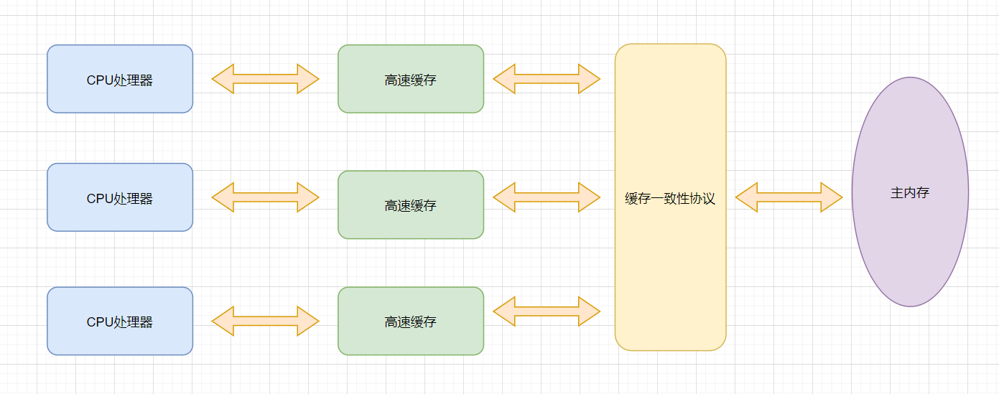
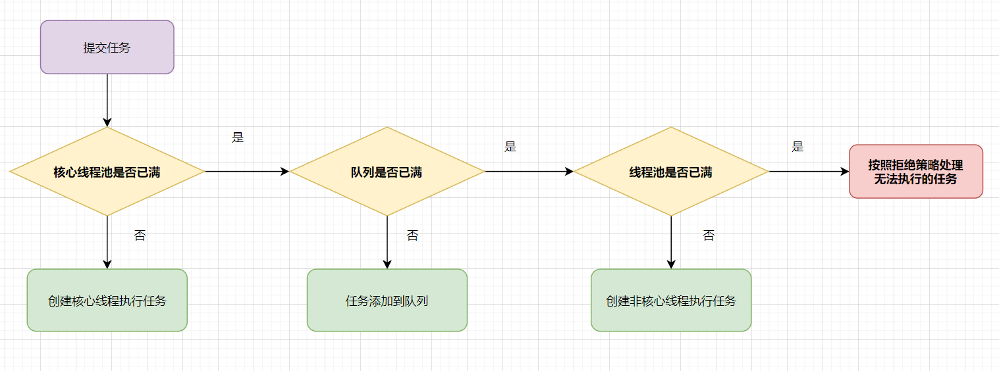

### Java 并发 && 多线程
1. ### synchronized 的实现原理以及锁优化？

   **实现原理**

   synchronize是如何实现同步操作的呢？它通过以下三种方式实现同步：

   1. 对于普通同步方法，锁是当前实例对象。
   2. 对于静态同步方法，锁是当前类的class对象。
   3. 对于同步代码块，锁是synchronized{}中所配置的对象

   

   那么它具体是怎么实现在同步方法或者同步代码块中保证最多只会有一个线程来访问呢？每个对象都是一个监视器锁（Monitor），其实JVM是通过进入和退出Monitor对象来实现方法和代码块的同步。

   具体来说就是JVM对synchronized修饰的方法或者代码块在编译后会插入monitorenter和monitorexit两条指令，即在进入同步方法或者同步代码块之前插入monitorenter，在退出时插入monitorexit，这样就能保证每次只有一个线程能够访问同步方法或者同步代码块
   

   锁优化
   为了减少获取锁和释放锁带来的性能消耗，在JDK1.6后引入了偏向锁和轻量级锁，在JDK1.6以后，锁一共有四种状态，级别从低到高：无锁状态、偏向锁状态、轻量级锁状态、重量级锁状态。锁可以从低到高升级，但是不能降级，就是偏向锁可以升级到轻量级锁，但是轻量级锁不能降级到偏向锁。在阅读接下的部分之前，建议对Java对象头进行简单了解。

   偏向锁
   引入偏向锁的作者发现，在大多数情况下是不存在竞争的，都是由一个线程多次获得，为了使获得锁的代价更低，于是引入了偏向锁。

   获得锁，当一个线程要进入同步代码块获得锁的时候，会检查对象头中是否存储当前线程ID，如果没有，判断一下偏向锁标志位是否为1，如果不是，说明这个锁还没有被任何线程获取，于是采用CAS的方式替换Mark Word，如果替换成功，将对象Mark Word中的线程ID指向自己，并且将是否偏向的标志置为1，如果发现偏向锁标志位以及为1，则尝试CAS的方式将当前对象头的偏向锁指向当前线程。在下次线程要获得锁的时候直接判断对象头中存储的是否是自己的线程ID，如果是就直接进入，不用重新获取。

   锁释放，偏向锁只有在其他线程尝试竞争偏向锁的时候，持有偏向锁的线程才会释放锁。偏向锁的撤销必须等待全局安全点（无正在执行的字节码）。它首先会暂停拥有偏向锁的线程，然后检查持有偏向锁的线程是否活着，如果不是，那么就将对象头设置为无锁状态；如果仍然活着，继续执行完成，最后会将对象头设置为无锁状态或者标记已经不适合作为偏向锁，这是有虚拟机来决定，最后唤醒等待线程。

   可以看出偏向锁的优势在于一个线程多次获得同一个锁，在已经持有偏向锁的情况下，只需要判断当前对象头的线程ID是否是当前线程，这和不加锁只存在纳秒级的差距。

   轻量级锁
   获得锁，当代码进入同步块时，如果同步对象为无锁状态时，当前线程会在栈帧中创建一个锁记录区域，同时将锁对象的对象头中Mark Word拷贝到锁记录中，再尝试使用CAS将Mark Word更新为指向锁记录的指针。

   如果更新成功，表示获得锁成功，如果失败，说明当前锁存在竞争，当前线程尝试使用自旋来获得锁。

   锁释放，会使用CAS操作将锁记录区域的记录的信息替换回对象头，如果成功，则说明没有发生竞争如果失败，那么就导致锁膨胀为重量级锁。

   因为CAS自旋会消耗CPU资源，在线程没有竞争的情况下相比互斥来说会好很多，但是在线程竞争激烈的情况下，不仅有互斥的开销，还有CAS的开销，甚至比重量锁更慢。

   自旋锁与自适应锁
   在一台物理主机上拥有2个以上的CPU时，能让2个以上同时并行执行，那么在获得同一个锁发生竞争时，让没有或得到锁的线程不放弃CPU的执行时间，看看持有锁的线程是否会很快释放锁，为了让线程等待，我们只需让线程执行一个忙循环（自旋），这种技术就叫做自旋锁。一直等待自旋会浪费CPU资源，不可能让线程一直自旋等待，自旋等待的次数默认值为10次。

   JDK1.6引入了自适应自选锁，它的等待时间由前一次等待这个锁的时间和锁的拥有者来决定，例如在同一个锁对象上，自旋刚刚成功获得过锁，那么JVM会认为这次自旋也很有可能成功，那么等待的时间会相应增加，反之，如果对于某个锁自旋很少获得成功，那么有可能直接省略自旋，以避免浪费CPU资源。

   链接：https://blog.csdn.net/Hollake/article/details/90711538

2. ### ThreadLocal原理，使用注意点，应用场景有哪些？

   原理： ThreadLocal类操作的是Thread的成员变量threadLocals。每个线程Thread都有自己的threadLocals，从而互相不影响 

   作用：ThreadLocal是解决线程安全问题一个很好的思路，它通过为每个线程提供一个独立的变量副本解决了变量并发访问的冲突问题。在很多情况下，ThreadLocal比直接使用synchronized同步机制解决线程安全问题更简单，更方便，且结果程序拥有更高的并发性。

   场景：在Java的多线程编程中，为保证多个线程对共享变量的安全访问，通常会使用synchronized来保证同一时刻只有一个线程对共享变量进行操作。这种情况下可以将[类变量](https://links.jianshu.com/go?to=https%3A%2F%2Fbaike.baidu.com%2Fitem%2F%E7%B1%BB%E5%8F%98%E9%87%8F)放到ThreadLocal类型的对象中，使变量在每个线程中都有独立拷贝，不会出现一个线程读取变量时而被另一个线程修改的现象。最常见的ThreadLocal使用场景为用来解决数据库连接、Session管理等。

3. ### synchronized和ReentrantLock的区别？

   1. 用法不同：synchronized 可以用来修饰普通方法、静态方法和代码块，而 ReentrantLock 只能用于代码块。
   2. 获取锁和释放锁的机制不同：synchronized 是自动加锁和释放锁的，而 ReentrantLock 需要手动加锁和释放锁。
   3. 锁类型不同：synchronized 是非公平锁，而 ReentrantLock 默认为非公平锁，也可以手动指定为公平锁。
   4. 响应中断不同：ReentrantLock 可以响应中断，解决死锁的问题，而 synchronized 不能响应中断。
   5. 底层实现不同：synchronized 是 JVM 层面通过监视器实现的，而 ReentrantLock 是基于 AQS 实现的。

4. ### 说说CountDownLatch与CyclicBarrier 区别

   - CountDownLatch的计数器只能使用一次。而CyclicBarrier的计数器可以使用reset()方法重置。所以CyclicBarrier能处理更为复杂的业务场景，比如如果计算发生错误，可以重置计数器，并让线程们重新执行一次。
   - CyclicBarrier还提供其他有用的方法，比如getNumberWaiting方法可以获得CyclicBarrier阻塞的线程数量。isBroken方法用来知道阻塞的线程是否被中断。比如以下代码执行完之后会返回true。
   - CountDownLatch会阻塞主线程，CyclicBarrier不会阻塞主线程，只会阻塞子线程。
   - 某线程中断CyclicBarrier会抛出异常，避免了所有线程无限等待。

5. ### Fork/Join框架的理解

   从JDK1.7开始，Java提供Fork/Join框架用于并行执行任务，它的思想就是讲一个大任务分割成若干小任务，最终汇总每个小任务的结果得到这个大任务的结果。

   这种思想和MapReduce很像（input --> split --> map --> reduce --> output）

   主要有两步：

   - 第一、任务切分；
   - 第二、结果合并

   它的模型大致是这样的：线程池中的每个线程都有自己的工作队列（PS：这一点和ThreadPoolExecutor不同，ThreadPoolExecutor是所有线程公用一个工作队列，所有线程都从这个工作队列中取任务），当自己队列中的任务都完成以后，会从其它线程的工作队列中偷一个任务执行，这样可以充分利用资源。

   

6. ### 为什么我们调用start()方法时会执行run()方法，为什么我们不能直接调用run()方法？

   因为类Thread中的start方法中，调用了Thread中的run方法。**顺便说下，类A继承了Tread类，在A中写run方法，就会覆盖掉Thread中的run方法，所以此时调用start方法后，实现的是自己的run方法体里面的代码 

   如果我们直接调用子线程的run()方法，其方法还是运行在主线程中，代码在程序中是顺序执行的，所以不会有解决耗时操作的问题。所以不能直接调用线程的run()方法，只有子线程开始了，才会有异步的效果。当thread.start()方法执行了以后，子线程才会执行run()方法，这样的效果和在主线程中直接调用run()方法的效果是截然不同的。

7. ### Java中的volatile关键是什么作用？怎样使用它？在Java中它跟synchronized方法有什么不同？volatile 的实现原理

   volatile是面试官非常喜欢问的一个问题，可以回答以下这几点：

   - vlatile变量的作用
   - 现代计算机的内存模型（嗅探技术，MESI协议，总线）
   - Java内存模型（JMM）
   - 什么是可见性？
   - 指令重排序
   - volatile的内存语义
   - as-if-serial
   - Happens-before
   - volatile可以解决原子性嘛？为什么？
   - volatile底层原理，如何保证可见性和禁止指令重排（内存屏障）

   **vlatile变量的作用？**

   - 保证变量对所有线程可见性
   - 禁止指令重排

   **现代计算机的内存模型**

   

   - 其中高速缓存包括L1，L2，L3缓存~
   - 缓存一致性协议，可以了解MESI协议
   - 总线（Bus）是计算机各种功能部件之间传送信息的公共通信干线，CPU和其他功能部件是通过总线通信的。
   - 处理器使用嗅探技术保证它的内部缓存、系统内存和其他处理器的缓存数据在总线上保持一致。

   **Java内存模型（JMM）**

   

   **什么是可见性？**

   可见性就是当一个线程 修改一个共享变量时，另外一个线程能读到这个修改的值。

   **指令重排序**

   指令重排是指在程序执行过程中,为了提高性能, 编译器和CPU可能会对指令进行重新排序。
   

   **volatile的内存语义**

   - 当写一个 volatile 变量时，JMM 会把该线程对应的本地内存中的共享变量值刷新到主内存。
   - 当读一个 volatile 变量时，JMM 会把该线程对应的本地内存置为无效。线程接下来将从主内存中读取共享变量。

   **as-if-serial**

   如果在本线程内观察，所有的操作都是有序的；即不管怎么重排序（编译器和处理器为了提高并行度），（单线程）程序的执行结果不会被改变。

   ```
   double pi  = 3.14;    //A
   double r   = 1.0;     //B
   double area = pi * r * r; //C
   ```

   步骤C依赖于步骤A和B，因为指令重排的存在，程序执行顺讯可能是A->B->C,也可能是B->A->C,但是C不能在A或者B前面执行，这将违反as-if-serial语义。
   

   **Happens-before**

   Java语言中，有一个先行发生原则（happens-before）：

   - **程序次序规则**：在一个线程内，按照控制流顺序，书写在前面的操作先行发生于书写在后面的操作。
   - **管程锁定规则**：一个unLock操作先行发生于后面对同一个锁额lock操作
   - **volatile变量规则**：对一个变量的写操作先行发生于后面对这个变量的读操作
   - **线程启动规则**：Thread对象的start()方法先行发生于此线程的每个一个动作
   - **线程终止规则**：线程中所有的操作都先行发生于线程的终止检测，我们可以通过Thread.join()方法结束、Thread.isAlive()的返回值手段检测到线程已经终止执行
   - **线程中断规则**：对线程interrupt()方法的调用先行发生于被中断线程的代码检测到中断事件的发生
   - **对象终结规则**：一个对象的初始化完成先行发生于他的finalize()方法的开始
   - **传递性**：如果操作A先行发生于操作B，而操作B又先行发生于操作C，则可以得出操作A先行发生于操作C

   **volatile可以解决原子性嘛？为什么？**

   不可以，可以直接举i++那个例子，原子性需要synchronzied或者lock保证

   ```
   public class Test {
       public volatile int race = 0;
        
       public void increase() {
           race++;
       }
        
       public static void main(String[] args) {
           final Test test = new Test();
           for(int i=0;i<10;i++){
               new Thread(){
                   public void run() {
                       for(int j=0;j<100;j++)
                           test.increase();
                   };
               }.start();
           }
           
           //等待所有累加线程结束
           while(Thread.activeCount()>1)  
               Thread.yield();
           System.out.println(test.race);
       }
   }
   
   ```

   **volatile底层原理，如何保证可见性和禁止指令重排（内存屏障）**

   volatile 修饰的变量，转成汇编代码，会发现多出一个lock前缀指令。lock指令相当于一个内存屏障，它保证以下这几点：

   - 1.重排序时不能把后面的指令重排序到内存屏障之前的位置
   - 2.将本处理器的缓存写入内存
   - 3.如果是写入动作，会导致其他处理器中对应的缓存无效。

   2、3点保证可见性，第1点禁止指令重排~

   有兴趣的朋友可以看我这篇文章哈:[Java程序员面试必备：Volatile全方位解析](

8. ### CAS？CAS 有什么缺陷，如何解决？

   cas是**另一个无锁解决方案，更准确的是采用乐观锁技术**，实现线程安全的问题。cas有三个操作数----**内存对象（V）、预期原值（A）、新值（B）**。

   > CAS原理就是对v对象进行赋值时，先判断原来的值是否为A，如果为A，就把新值B赋值到V对象上面，如果原来的值不是A（代表V的值放生了变化），就不赋新值。

   CAS的缺点有如ABA问题，自旋锁消耗问题、多变量共享一致性问题.

   1.ABA：

   问题描述：线程t1将它的值从A变为B，再从B变为A。同时有线程t2要将值从A变为C。但CAS检查的时候会发现没有改变，但是实质上它已经发生了改变 。可能会造成数据的缺失。

   解决方法：CAS还是类似于乐观锁，同数据乐观锁的方式给它加一个版本号或者时间戳，如AtomicStampedReference

   2.自旋消耗资源：

   问题描述：多个线程争夺同一个资源时，如果自旋一直不成功，将会一直占用CPU。

   解决方法：破坏掉for死循环，当超过一定时间或者一定次数时，return退出。JDK8新增的LongAddr,和ConcurrentHashMap类似的方法。当多个线程竞争时，将粒度变小，将一个变量拆分为多个变量，达到多个线程访问多个资源的效果，最后再调用sum把它合起来。

   虽然base和cells都是volatile修饰的，但感觉这个sum操作没有加锁，可能sum的结果不是那么精确。

   2.多变量共享一致性问题：

   解决方法： CAS操作是针对一个变量的，如果对多个变量操作，

   1) 可以加锁来解决。

   2) 封装成对象类解决

9. ### 如何检测死锁？怎么预防死锁？死锁四个必要条件

   - 1、互斥条件：一个资源每次只能被一个进程使用。
   - 2、保持和请求条件：一个进程因请求资源而阻塞时，对已获得资源保持不放。
   - 3、不可剥夺性：进程已获得资源，在未使用完成前，不能被剥夺。
   - 4、循环等待条件（闭环）：若干进程之间形成一种头尾相接的循环等待资源关系。

   如何避免死锁？只要破坏其中任意一个条件，就可以避免死锁

   一种非常简单的避免死锁的方式就是：指定获取锁的顺序，并强制线程按照指定的顺序获取锁。因此，如果所有的线程都是以同样的顺序加锁和释放锁，就不会出现死锁了。

10. ### 如果线程过多,会怎样?

    **1、线程的生命周期开销非常高** 

    **2、消耗过多的 CPU 资源** 

    如果可运行的线程数量多于可用处理器的数量，那么有线程将会被闲置。大量空 

    闲的线程会占用许多内存，给垃圾回收器带来压力，而且大量的线程在竞争 CPU

    资源时还将产生其他性能的开销。

    **3、降低稳定性** 

    JVM 在可创建线程的数量上存在一个限制，这个限制值将随着平台的不同而不同，

    并且承受着多个因素制约，包括 JVM 的启动参数、Thread 构造函数中请求栈的 

    大小，以及底层操作系统对线程的限制等。如果破坏了这些限制，那么可能抛出 

    OutOfMemoryError 异常。

11. ### 说说 Semaphore原理及使用场景？

     `Semaphore` 直译为信号。实际上 `Semaphore` 可以看做是一个信号的集合。不同的线程能够从 `Semaphore` 中获取若干个信号量。当 `Semaphore` 对象持有的信号量不足时，尝试从 `Semaphore` 中获取信号的线程将会阻塞。直到其他线程将信号量释放以后，阻塞的线程会被唤醒，重新尝试获取信号量。

     **使用场景**

     通常用于那些资源有明确访问数量限制的场景，常用于限流 。

     比如：数据库连接池，同时进行连接的线程有数量限制，连接不能超过一定的数量，当连接达到了限制数量后，后面的线程只能排队等前面的线程释放了数据库连接才能获得数据库连接。

     比如：停车场场景，车位数量有限，同时只能容纳多少台车，车位满了之后只有等里面的车离开停车场外面的车才可以进入。

12. ### AQS组件，实现原理

     AQS，即AbstractQueuedSynchronizer，是构建锁或者其他同步组件的基础框架，它使用了一个int成员变量表示同步状态，通过内置的FIFO队列来完成资源获取线程的排队工作。可以回答以下这几个关键点哈：

     - state 状态的维护。
     - CLH队列
     - ConditionObject通知
     - 模板方法设计模式
     - 独占与共享模式。
     - 自定义同步器。
     - AQS全家桶的一些延伸，如：ReentrantLock等。

     **state 状态的维护**

     - state，int变量，锁的状态，用volatile修饰，保证多线程中的可见性。
     - getState()和setState()方法采用final修饰，限制AQS的子类重写它们两。
     - compareAndSetState（）方法采用乐观锁思想的CAS算法操作确保线程安全,保证状态
       设置的原子性。

     对CAS有兴趣的朋友，可以看下我这篇文章哈~
     [CAS乐观锁解决并发问题的一次实践](https://juejin.im/post/6844903869340712967#comment)


    #### CLH队列
    
    
    
    > **CLH(Craig, Landin, and Hagersten locks) 同步队列** 是一个FIFO双向队列，其内部通过节点head和tail记录队首和队尾元素，队列元素的类型为Node。AQS依赖它来完成同步状态state的管理，当前线程如果获取同步状态失败时，AQS则会将当前线程已经等待状态等信息构造成一个节点（Node）并将其加入到CLH同步队列，同时会阻塞当前线程，当同步状态释放时，会把首节点唤醒（公平锁），使其再次尝试获取同步状态。


    #### ConditionObject通知
    
    我们都知道，synchronized控制同步的时候，可以配合Object的wait()、notify()，notifyAll() 系列方法可以实现等待/通知模式。而Lock呢？它提供了条件Condition接口，配合await(),signal(),signalAll() 等方法也可以实现等待/通知机制。ConditionObject实现了Condition接口，给AQS提供条件变量的支持 。
    
    
    
    ConditionObject队列与CLH队列的爱恨情仇：
    
    - 调用了await()方法的线程，会被加入到conditionObject等待队列中，并且唤醒CLH队列中head节点的下一个节点。
    - 线程在某个ConditionObject对象上调用了singnal()方法后，等待队列中的firstWaiter会被加入到AQS的CLH队列中，等待被唤醒。
    - 当线程调用unLock()方法释放锁时，CLH队列中的head节点的下一个节点(在本例中是firtWaiter)，会被唤醒。


    #### 模板方法设计模式
    
    什么是模板设计模式？
    
    > 在一个方法中定义一个算法的骨架，而将一些步骤延迟到子类中。模板方法使得子类可以在不改变算法结构的情况下，重新定义算法中的某些步骤。
    
    AQS的典型设计模式就是模板方法设计模式啦。AQS全家桶（ReentrantLock，Semaphore）的衍生实现，就体现出这个设计模式。如AQS提供tryAcquire，tryAcquireShared等模板方法，给子类实现自定义的同步器。
    
    #### 独占与共享模式
    
    - 独占式: 同一时刻仅有一个线程持有同步状态，如ReentrantLock。又可分为公平锁和非公平锁。
    - 共享模式:多个线程可同时执行，如Semaphore/CountDownLatch等都是共享式的产物。
    
    #### 自定义同步器
    
    你要实现自定义锁的话，首先需要确定你要实现的是独占锁还是共享锁，定义原子变量state的含义，再定义一个内部类去继承AQS，重写对应的模板方法即可啦
    
    #### AQS全家桶的一些延伸。
    
    Semaphore，CountDownLatch，ReentrantLock
    
    可以看下这篇文章哈，[AQS解析与实战](https://juejin.im/post/6844903903188746247)


​    

13. ### 假设有T1、T2、T3三个线程，你怎样保证T2在T1执行完后执行，T3在T2执行完后执行？

    可以使用**join方法**解决这个问题。比如在线程A中，调用线程B的join方法表示的意思就是**：A等待B线程执行完毕后（释放CPU执行权），在继续执行。**

    代码如下：

    ```
    public class ThreadTest {
    
        public static void main(String[] args) {
    
            Thread spring = new Thread(new SeasonThreadTask("春天"));
            Thread summer = new Thread(new SeasonThreadTask("夏天"));
            Thread autumn = new Thread(new SeasonThreadTask("秋天"));
    
            try
            {
                //春天线程先启动
                spring.start();
                //主线程等待线程spring执行完，再往下执行
                spring.join();
                //夏天线程再启动
                summer.start();
                //主线程等待线程summer执行完，再往下执行
                summer.join();
                //秋天线程最后启动
                autumn.start();
                //主线程等待线程autumn执行完，再往下执行
                autumn.join();
            } catch (InterruptedException e)
            {
                e.printStackTrace();
            }
        }
    }
    
    class SeasonThreadTask implements Runnable{
    
        private String name;
    
        public SeasonThreadTask(String name){
            this.name = name;
        }
    
        @Override
        public void run() {
            for (int i = 1; i <4; i++) {
                System.out.println(this.name + "来了: " + i + "次");
                try {
                    Thread.sleep(100);
                } catch (InterruptedException e) {
                    e.printStackTrace();
                }
            }
        }
    }
    
    ```

    运行结果：

    ```
    春天来了: 1次
    春天来了: 2次
    春天来了: 3次
    夏天来了: 1次
    夏天来了: 2次
    夏天来了: 3次
    秋天来了: 1次
    秋天来了: 2次
    秋天来了: 3次
    ```

    

    

14. ### LockSupport作用是？

    - LockSupport作用

    - park和unpark，与wait，notify的区别

    - Object blocker作用？

      LockSupport是个工具类，它的主要作用是挂起和唤醒线程， 该工具类是创建锁和其他同步类的基础。

      ```
      public static void park(); //挂起当前线程，调用unpark(Thread thread)或者当前线程被中断，才能从park方法返回
      public static void parkNanos(Object blocker, long nanos);  // 挂起当前线程，有超时时间的限制
      public static void parkUntil(Object blocker, long deadline); // 挂起当前线程，直到某个时间
      public static void park(Object blocker); //挂起当前线程
      public static void unpark(Thread thread); // 唤醒当前thread线程
      ```

      看个例子吧：

      ```
      public class LockSupportTest {
      
          public static void main(String[] args) {
      
              CarThread carThread = new CarThread();
              carThread.setName("劳斯劳斯");
              carThread.start();
      
              try {
                  Thread.currentThread().sleep(2000);
                  carThread.park();
                  Thread.currentThread().sleep(2000);
                  carThread.unPark();
              } catch (InterruptedException e) {
                  e.printStackTrace();
              }
          }
      
          static class CarThread extends Thread{
      
              private boolean isStop = false;
      
              @Override
              public void run() {
      
                  System.out.println(this.getName() + "正在行驶中");
      
                  while (true) {
      
                      if (isStop) {
                          System.out.println(this.getName() + "车停下来了");
                          LockSupport.park(); //挂起当前线程
                      }
                      System.out.println(this.getName() + "车还在正常跑");
      
                      try {
                          Thread.sleep(1000L);
                      } catch (InterruptedException e) {
                          e.printStackTrace();
                      }
      
                  }
              }
      
              public void park() {
                  isStop = true;
                  System.out.println("停车啦，检查酒驾");
      
              }
      
              public void unPark(){
                  isStop = false;
                  LockSupport.unpark(this); //唤醒当前线程
                  System.out.println("老哥你没酒驾，继续开吧");
              }
      
          }
      }
      
      ```

      运行结果：

      ```
      劳斯劳斯正在行驶中
      劳斯劳斯车还在正常跑
      劳斯劳斯车还在正常跑
      停车啦，检查酒驾
      劳斯劳斯车停下来了
      老哥你没酒驾，继续开吧
      劳斯劳斯车还在正常跑
      劳斯劳斯车还在正常跑
      劳斯劳斯车还在正常跑
      劳斯劳斯车还在正常跑
      劳斯劳斯车还在正常跑
      劳斯劳斯车还在正常跑
      ```

      LockSupport的park和unpark的实现，有点类似wait和notify的功能。但是

      > - park不需要获取对象锁
      > - 中断的时候park不会抛出InterruptedException异常，需要在park之后自行判断中断状态
      > - 使用park和unpark的时候，可以不用担心park的时序问题造成死锁
      > - LockSupport不需要在同步代码块里
      > - unpark却可以唤醒一个指定的线程，notify只能随机选择一个线程唤醒

      Object blocker作用？

      > 方便在线程dump的时候看到具体的阻塞对象的信息。

15. ### Condition接口及其实现原理

    - Condition接口与Object监视器方法对比

    - Condition接口使用demo

    - Condition实现原理

      #### Condition接口与Object监视器方法对比

      Java对象（Object），提供wait()、notify()，notifyAll() 系列方法，配合synchronized，可以实现等待/通知模式。而Condition接口配合Lock，通过await(),signal(),signalAll() 等方法，也可以实现类似的等待/通知机制。

      | 对比项                                       | 对象监视方法            | Condition                                                    |
      | -------------------------------------------- | ----------------------- | ------------------------------------------------------------ |
      | 前置条件                                     | 获得对象的锁            | 调用Lock.lock()获取锁,调用Lock.newCondition()获得Condition对象 |
      | 调用方式                                     | 直接调用，object.wait() | 直接调用，condition.await()                                  |
      | 等待队列数                                   | 1个                     | 多个                                                         |
      | 当前线程释放锁并进入等待状态                 | 支持                    | 支持                                                         |
      | 在等待状态中不响应中断                       | 不支持                  | 支持                                                         |
      | 当前线程释放锁并进入超时等待状态             | 支持                    | 支持                                                         |
      | 当前线程释放锁并进入等待状态到将来的某个时间 | 不支持                  | 支持                                                         |
      | 唤醒等待队列中的一个线程                     | 支持                    | 支持                                                         |
      | 唤醒等待队列中的全部线程                     | 支持                    | 支持                                                         |


      #### Condition接口使用demo
    
      ```
      public class ConditionTest {
          Lock lock = new ReentrantLock();
          Condition condition = lock.newCondition();
      
          public void conditionWait() throws InterruptedException {
              lock.lock();
              try {
                  condition.await();
              } finally {
                  lock.unlock();
              }
          }
      
          public void conditionSignal() throws InterruptedException {
              lock.lock();
              try {
                  condition.signal();
              } finally {
                  lock.unlock();
              }
          }
      }
      
      ```
    
      #### Condition实现原理
    
      其实，同步队列和等待队列中节点类型都是同步器的静态内部类 AbstractQueuedSynchronizer.Node，接下来我们图解一下Condition的实现原理~
    
      **等待队列的基本结构图**
      
    
      > 一个Condition包含一个等待队列，Condition拥有首节点（firstWaiter）和尾节点 （lastWaiter）。当前线程调用Condition.await()方法，将会以当前线程构造节点，并将节点从尾部加入等待队
    
      **AQS 结构图**
    
      ConditionI是跟Lock一起结合使用的，底层跟同步器（AQS）相关。同步器拥有一个同步队列和多个等待队列~
      


      **等待**
    
      
    
      >  当调用await()方法时，相当于同步队列的首节点（获取了锁的节点）移动到Condition的等待队列中。


      **通知**
    
      
    
      > 调用Condition的signal()方法，将会唤醒在等待队列中等待时间最长的节点（首节点），在
      > 唤醒节点之前，会将节点移到同步队列中。

16. ### 说说并发与并行的区别?

     并发是指在一段时间内宏观上多个程序同时运行。并行指的是同一个时刻，多个任务确实真的在同时运行 。

    

17. ### 为什么要用线程池？Java的线程池内部机制，参数作用，几种工作阻塞队列，线程池类型以及使用场景

    回答这些点：

    - 为什么要用线程池？
    - Java的线程池原理
    - 线程池核心参数
    - 几种工作阻塞队列
    - 线程池使用不当的问题
    - 线程池类型以及使用场景

    #### 为什么要用线程池？

    线程池：一个管理线程的池子。

    - 管理线程，避免增加创建线程和销毁线程的资源损耗。
    - 提高响应速度。
    - 重复利用。

    #### Java的线程池执行原理

    
    为了形象描述线程池执行，打个比喻：

    - 核心线程比作公司正式员工
    - 非核心线程比作外包员工
    - 阻塞队列比作需求池
    - 提交任务比作提需求
      

    #### 线程池核心参数

    ```
    public ThreadPoolExecutor(int corePoolSize, int maximumPoolSize,
       long keepAliveTime,
       TimeUnit unit,
       BlockingQueue<Runnable> workQueue,
       ThreadFactory threadFactory,
       RejectedExecutionHandler handler) 
    ```

    - corePoolSize： 线程池核心线程数最大值
    - maximumPoolSize： 线程池最大线程数大小
    - keepAliveTime： 线程池中非核心线程空闲的存活时间大小
    - unit： 线程空闲存活时间单位
    - workQueue： 存放任务的阻塞队列
    - threadFactory： 用于设置创建线程的工厂，可以给创建的线程设置有意义的名字，可方便排查问题。
    - handler：线城池的饱和策略事件，主要有四种类型拒绝策略。

    **四种拒绝策略**

    - AbortPolicy(抛出一个异常，默认的)
    - DiscardPolicy(直接丢弃任务)
    - DiscardOldestPolicy（丢弃队列里最老的任务，将当前这个任务继续提交给线程池）
    - CallerRunsPolicy（交给线程池调用所在的线程进行处理)

    #### 几种工作阻塞队列

    - ArrayBlockingQueue（用数组实现的有界阻塞队列，按FIFO排序量）
    - LinkedBlockingQueue（基于链表结构的阻塞队列，按FIFO排序任务，容量可以选择进行设置，不设置的话，将是一个无边界的阻塞队列）
    - DelayQueue（一个任务定时周期的延迟执行的队列）
    - PriorityBlockingQueue（具有优先级的无界阻塞队列）
    - SynchronousQueue（一个不存储元素的阻塞队列，每个插入操作必须等到另一个线程调用移除操作，否则插入操作一直处于阻塞状态）


    #### 线程池使用不当的问题
    
    线程池适用不当可能导致内存飙升问题哦
    
    有兴趣可以看我这篇文章哈:[源码角度分析-newFixedThreadPool线程池导致的内存飙升问题](https://juejin.im/post/6844903930502070285)
    
    #### 线程池类型以及使用场景
    
    - newFixedThreadPool
    
    > 适用于处理CPU密集型的任务，确保CPU在长期被工作线程使用的情况下，尽可能的少的分配线程，即适用执行长期的任务。
    
    - newCachedThreadPool
    
    > 用于并发执行大量短期的小任务。
    
    - newSingleThreadExecutor
    
    > 适用于串行执行任务的场景，一个任务一个任务地执行。
    
    - newScheduledThreadPool
    
    > 周期性执行任务的场景，需要限制线程数量的场景
    
    - newWorkStealingPool 
    
    > 建一个含有足够多线程的线程池，来维持相应的并行级别，它会通过工作窃取的方式，使得多核的 CPU 不会闲置，总会有活着的线程让 CPU 去运行,本质上就是一个 ForkJoinPool。)
    
    有兴趣可以看我这篇文章哈:[面试必备：Java线程池解析](https://juejin.im/post/6844903889678893063)


​    

18. ### 如何保证多线程下 i++ 结果正确？

    解决方法
    1、 使用循环CAS，实现i++原子操作
    Java从JDK1.5开始提供了java.util.concurrent.atomic包来提供线程安全的原子操作类。这些原子操作类都是是用CAS来实现，i++的原子性操作。以AtomicInteger为例子，讲一下 public final int getAndIncrement(){} 方法的实现。
    Atomic包参考 https://www.cnblogs.com/chenpi/p/5375805.html

    ```
    public final int getAndIncrement() {
            for (;;) {
                int current = get();
                int next = current + 1;
                if (compareAndSet(current, next))
                    return current;
            }
        }
    ```

    
    2、使用锁机制，实现i++原子操作

    2、使用锁机制，实现i++原子操作

    ```
    // 使用Lock实现，多线程的数据同步
        public static ReentrantLock lock = new ReentrantLock();
    ```

    
    3、使用synchronized，实现i++原子操作

    3、使用synchronized，实现i++原子操作

    ```
    for (int i = 0; i < times; i++) {
                // 进行自加的操作
                synchronized (SynchronizedTest.class) {
                    count++;
                }
    
    }
    ```

    

19. ### 10 个线程和2个线程的同步代码，哪个更容易写？

     **从写代码的角度来说，两者的复杂度是相同的，因为同步代码与线程数量是相互独立的。但是同步策略的选择依赖于线程的数量，因为越多的线程意味着更大的竞争，所以你需要利用同步技术，如锁分离，这要求更复杂的代码和专业知识** 

20. ### 什么是多线程环境下的伪共享（false sharing）？

    - 什么是伪共享
    - 如何解决伪共享问题

    伪共享定义？

    > CPU的缓存是以缓存行(cache line)为单位进行缓存的，当多个线程修改相互独立的变量，而这些变量又处于同一个缓存行时就会影响彼此的性能。这就是伪共享

    现代计算机计算模型，大家都有印象吧？我之前这篇文章也有讲过，有兴趣可以看一下哈，[Java程序员面试必备：Volatile全方位解析](https://juejin.im/post/6859390417314512909)

    

    - CPU执行速度比内存速度快好几个数量级，为了提高执行效率，现代计算机模型演变出CPU、缓存（L1，L2，L3），内存的模型。
    - CPU执行运算时，如先从L1缓存查询数据，找不到再去L2缓存找，依次类推，直到在内存获取到数据。
    - 为了避免频繁从内存获取数据，聪明的科学家设计出缓存行，缓存行大小为64字节。

    也正是因为缓存行，就导致伪共享问题的存在，如图所示：
    

    假设数据a、b被加载到同一个缓存行。

    - 当线程1修改了a的值，这时候CPU1就会通知其他CPU核，当前缓存行（Cache line）已经失效。
    - 这时候，如果线程2发起修改b，因为缓存行已经失效了，所以**core2 这时会重新从主内存中读取该 Cache line 数据**。读完后，因为它要修改b的值，那么CPU2就通知其他CPU核，当前缓存行（Cache line）又已经失效。
    - 酱紫，如果同一个Cache line的内容被多个线程读写，就很容易产生相互竞争，频繁回写主内存，会大大降低性能。


    #### 如何解决伪共享问题
    
    既然伪共享是因为相互独立的变量存储到相同的Cache line导致的，一个缓存行大小是64字节。那么，我们就可以**使用空间换时间**，即数据填充的方式，把独立的变量分散到不同的Cache line~
    
    共享内存demo例子:
    
    ```
    public class FalseShareTest  {
    
        public static void main(String[] args) throws InterruptedException {
            Rectangle rectangle = new Rectangle();
            long beginTime = System.currentTimeMillis();
            Thread thread1 = new Thread(() -> {
                for (int i = 0; i < 100000000; i++) {
                    rectangle.a = rectangle.a + 1;
                }
            });
    
            Thread thread2 = new Thread(() -> {
                for (int i = 0; i < 100000000; i++) {
                    rectangle.b = rectangle.b + 1;
                }
            });
    
            thread1.start();
            thread2.start();
            thread1.join();
            thread2.join();
    
            System.out.println("执行时间" + (System.currentTimeMillis() - beginTime));
        }
    
    }
    
    class Rectangle {
        volatile long a;
        volatile long b;
    }
    ```
    
    运行结果：
    
    ```
    执行时间2815
    ```
    
    一个long类型是8字节，我们在变量a和b之间不上7个long类型变量呢，输出结果是啥呢？如下：
    
    ```
    class Rectangle {
        volatile long a;
        long a1,a2,a3,a4,a5,a6,a7;
        volatile long b;
    }
    ```
    
    运行结果：
    
    ```
    执行时间1113
    ```
    
    可以发现利用填充数据的方式，让读写的变量分割到不同缓存行，可以很好挺高性能~

21. ### 线程池如何调优，最大数目如何确认？

    在《Java Concurrency in Practice》一书中，有一个评估线程池线程大小的公式

    >  **Nthreads=Ncpu*Ucpu*(1+w/c)**
    >
    >  - Ncpu = CPU总核数

    - Ucpu =cpu使用率，0~1
    - W/C=等待时间与计算时间的比率

    假设cpu 100%运转，则公式为

    ```
    Nthreads=Ncpu*(1+w/c)
    ```

    **估算的话，酱紫：**

    - 如果是**IO密集型应用**（如数据库数据交互、文件上传下载、网络数据传输等等），IO操作一般比较耗时，等待时间与计算时间的比率（w/c）会大于1，所以最佳线程数估计就是 Nthreads=Ncpu*（1+1）= 2Ncpu 。
    - 如果是**CPU密集型应用**（如算法比较复杂的程序），最理想的情况，没有等待，w=0，Nthreads=Ncpu。又对于计算密集型的任务，在拥有N个处理器的系统上，当线程池的大小为N+1时，通常能实现最优的效率。所以 Nthreads = Ncpu+1

    有具体指参考呢？举个例子

    > 比如平均每个线程CPU运行时间为0.5s，而线程等待时间（非CPU运行时间，比如IO）为1.5s，CPU核心数为8，那么根据上面这个公式估算得到：线程池大小=(1+1.5/05)*8 =32。

    参考了网上这篇文章，写得很棒，有兴趣的朋友可以去看一下哈：

    - [根据CPU核心数确定线程池并发线程数](https://www.cnblogs.com/dennyzhangdd/p/6909771.html)

    

22. ### Java 内存模型？

    内存模型限制的是共享变量，也就是存储在堆内存中的变量，在 Java 语言中，所有的实例变量、静态变量和数组元素都存储在堆内存之中。而方法参数、异常处理参数这些局部变量存储在方法栈帧之中，因此不会在线程之间共享，不会受到内存模型影响，也不存在内存可见性问题。

    通常，在线程之间的通讯方式有共享内存和消息传递两种，很明显，Java 采用的是第一种即**共享的内存模型**，在共享的内存模型里，多线程之间共享程序的公共状态，通过读-写内存的方式来进行隐式通讯。

    从抽象的角度来看，JMM 其实是`定义了线程和主内存之间的关系`，首先，多个线程之间的共享变量存储在主内存之中，同时每个线程都有一个自己私有的本地内存，本地内存中存储着该线程读或写共享变量的副本（注意：本地内存是 JMM 定义的抽象概念，实际上并不存在）。抽象模型如下图所示：

    

    在这个抽象的内存模型中，在两个线程之间的通信（共享变量状态变更）时，会进行如下两个步骤：

    1. 线程 A 把在本地内存更新后的共享变量副本的值，刷新到主内存中。
    2. 线程 B 在使用到该共享变量时，到主内存中去读取线程 A 更新后的共享变量的值，并更新线程 B 本地内存的值。

    JMM 本质上是在硬件（处理器）内存模型之上又做了一层抽象，使得应用开发人员只需要了解 JMM 就可以编写出正确的并发代码，而无需过多了解硬件层面的内存模型。

23. ### 怎么实现所有线程在等待某个事件的发生才会去执行？

    方案一：读写锁
    　　刚开始主线程先获取写锁，然后所有子线程获取读锁，然后等事件发生时主线程释放写锁；

    方案二：CountDownLatch
    　　CountDownLatch初始值设为1，所有子线程调用await方法等待，等事件发生时调用countDown方法计数减为0；

    方案三：Semaphore
    　　Semaphore初始值设为N，刚开始主线程先调用acquire(N)申请N个信号量，其它线程调用acquire()阻塞等待，等事件发生时同时主线程释放N个信号量；

    ### 24.说一下 Runnable和 Callable有什么区别？

    - Callable接口方法是call()，Runnable的方法是run()；
    - Callable接口call方法有返回值，支持泛型，Runnable接口run方法无返回值。
    - Callable接口call()方法允许抛出异常；而Runnable接口run()方法不能继续上抛异常；

    ```
    @FunctionalInterface
    public interface Callable<V> {
        /**
         * 支持泛型V，有返回值，允许抛出异常
         */
        V call() throws Exception;
    }
    
    @FunctionalInterface
    public interface Runnable {
        /**
         *  没有返回值，不能继续上抛异常
         */
        public abstract void run();
    }
    
    ```

    看下demo代码吧，这样应该好理解一点哈~

    ```
    /*
     *  @Author 捡田螺的小男孩
     *  @date 2020-08-18
     */
    public class CallableRunnableTest {
    
        public static void main(String[] args) {
            ExecutorService executorService = Executors.newFixedThreadPool(5);
    
            Callable <String> callable =new Callable<String>() {
                @Override
                public String call() throws Exception {
                    return "你好，callable";
                }
            };
    
            //支持泛型
            Future<String> futureCallable = executorService.submit(callable);
    
            try {
                System.out.println(futureCallable.get());
            } catch (InterruptedException e) {
                e.printStackTrace();
            } catch (ExecutionException e) {
                e.printStackTrace();
            }
    
            Runnable runnable = new Runnable() {
                @Override
                public void run() {
                    System.out.println("你好呀,runnable");
                }
            };
    
            Future<?> futureRunnable = executorService.submit(runnable);
            try {
                System.out.println(futureRunnable.get());
            } catch (InterruptedException e) {
                e.printStackTrace();
            } catch (ExecutionException e) {
                e.printStackTrace();
            }
            executorService.shutdown();
    
        }
    }
    ```

    运行结果：

    ```
    你好，callable
    你好呀,runnable
    null
    ```


    ### 

24. ### 线程的生命周期，线程的几种状态。

    [线程的生命周期](https://user-gold-cdn.xitu.io/2020/5/14/172108007fefffe5?w=1280&h=617&f=png&s=254427)

25. ### ReentrantLock实现原理

    - 什么是ReentrantLock
    - ReentrantLock的特性
    - ReentrantLock的实现原理

    首先，ReentrantLock是一种可重入的排它锁，主要用来解决多线程对共享资源竞争的问题。

    它的核心特性有几个：

    1. 它支持可重入，也就是获得锁的线程在释放锁之前再次去竞争同一把锁的时候，不需要加锁就可以直接访问。
    2. 它支持公平和非公平特性
    3. 它提供了阻塞竞争锁和非阻塞竞争锁的两种方法，分别是lock()和tryLock()。

    然后，ReentrantLock的底层实现有几个非常关键的技术。

    1. 锁的竞争，ReentrantLock是通过互斥变量，使用CAS机制来实现的。
    2. 没有竞争到锁的线程，使用了AbstractQueuedSynchronizer这样一个队列同步器来存储，底层是通过双向链表来实现的。当锁被释放之后，会从AQS队列里面的头部唤醒下一个等待锁的线程。
    3. 公平和非公平的特性，主要是体现在竞争锁的时候，是否需要判断AQS队列存在等待中的线程。
    4. 最后，关于锁的重入特性，在AQS里面有一个成员变量来保存当前获得锁的线程，当同一个线程下次再来竞争锁的时候，就不会去走锁竞争的逻辑，而是直接增加重入次数。

26. ### java并发包concurrent及常用的类

    并发包诸类概览：[java.util.concurrent 并发包诸类概览](https://link.zhihu.com/?target=http%3A//www.raychase.net/1912)

    线程池：[Java并发编程：线程池的使用](https://link.zhihu.com/?target=http%3A//www.cnblogs.com/dolphin0520/p/3932921.html)

    锁：[Java并发编程：Lock - Matrix](https://link.zhihu.com/?target=http%3A//www.cnblogs.com/dolphin0520/p/3923167.html)

    集合：[java中并发包简要分析01](https://link.zhihu.com/?target=http%3A//www.cnblogs.com/huangfox/archive/2012/08/16/2642666.html)

27. ### wait(),notify()和suspend(),resume()之间的区别

    - wait() 使得线程进入阻塞等待状态，并且释放锁
    - notify()唤醒一个处于等待状态的线程，它一般跟wait（）方法配套使用。
    - suspend()使得线程进入阻塞状态，并且不会自动恢复，必须对应的resume() 被调用，才能使得线程重新进入可执行状态。suspend()方法很容易引起死锁问题。
    - resume()方法跟suspend()方法配套使用。

    **suspend()不建议使用**,suspend()方法在调用后，线程不会释放已经占有的资 源（比如锁），而是占有着资源进入睡眠状态，这样容易引发死锁问题。

28. ### FutureTask是什么？

     FutureTask 表示一个异步运算的任务。FutureTask 里面可以传入一个 Callable 的具体实现类，可以对这个异步运算的任务的结果进行等待获取、判断是否已经完成、取消任务等操作。只有当运算完成的时候结果才能取回，如果运算尚未完成 get 方法将会阻塞。一个 FutureTask 对象可以对调用了 Callable 和 Runnable 的对象进行包装，由于 FutureTask 也是Runnable 接口的实现类，所以 FutureTask 也可以放入线程池中。 

29. ### 一个线程如果出现了运行时异常会怎么样

    Java中Throwable分为Exception和Error： 
    出现Error的情况下，程序会停止运行。 
    Exception分为RuntimeException和非运行时异常。 
    非运行时异常必须处理，比如thread中sleep()时，必须处理InterruptedException异常，才能通过编译。 
    而RuntimeException可以处理也可以不处理，因为编译并不能检测该类异常，比如NullPointerException、ArithmeticException）和 ArrayIndexOutOfBoundException等。（运行时异常在编译阶段是无法检测出来的，非运行时异常在编译阶段是可以检测出来的，比如你使用了一个sleep()函数，会强制要求你throws，并且try catch）

    由此题目所诉情形下发生的应该是RuntimeException，属于未检测异常，编译器不会检查该异常，可以处理，也可不处理。 
    所以这里存在两种情形： 

    ① 如果该异常被捕获或抛出，则程序继续运行。 
    ② 如果异常没有被捕获该线程将会停止执行。 

    Thread.UncaughtExceptionHandler是用于处理未捕获异常造成线程突然中断情况的一个内嵌接口。当一个未捕获异常将造成线程中断的时候JVM会使用Thread.getUncaughtExceptionHandler()来查询线程的UncaughtExceptionHandler，并将线程和异常作为参数传递给handler的uncaughtException()方法进行处理
    

30. ### 生产者消费者模型的作用是什么

    1 、通过平衡生产者的生产能力和消费者的消费能力来提升整个系统的运行效率，这是生产者消费者模型

    最重要的作用

    2 、解耦，这是生产者消费者模型附带的作用，解耦意味着生产者和消费者之间的联系少，联系越少越可

    以独自发展而不需要收到相互的制约

31. ### ReadWriteLock是什么

     ReadWriteLock 是一个读写锁接口 

    1.当读写问题出现时，需要对读写权限进行管理
    2.读写锁分为读锁和写锁，上读锁时允许多个用户进行读操作，上写锁时，只允许一个用户进行写操作。
    3.发生阻塞的三种情况
    读写锁的三种状态：
    a.当读写锁是写加锁状态时，在这个锁被解锁之前，所有试图对这个锁加锁的线程都会被阻塞
    b.当读写锁在读加锁状态时，所有试图以读模式对它进行加锁的线程都可以得到访问权，但是以写模式对它进行加锁的线程将会被阻塞
    c.当读写锁在读模式的锁状态时，如果有另外的线程试图以写模式加锁，读写锁通常会阻塞随后的读模式锁的请求，这样可以避免读模式锁长期占用，而等待的写模式锁请求则长期阻塞。

    读写锁最适用于对数据结构的读操作次数多于写操作的场合，因为，读模式锁定时可以共享，而写模式锁定时只能某个线程独占资源，因而，读写锁也可以叫做个共享-独占锁。
    

32. ### Java中用到的线程调度算法是什么？

    1、时间片轮转调度算法（RR）：

    给每个进程固定的执行时间，根据进程到达的先后顺序让进程在单位时间片内执行，执行完成后便调度下一个进程执行，时间片轮转调度不考虑进程等待时间和执行时间，属于抢占式调度。

     优点是兼顾长短作业；

    缺点是平均等待时间较长，上下文切换较费时。适用于分时系统。

     

    2、先来先服务调度算法（FCFS）：

    根据进程到达的先后顺序执行进程，不考虑等待时间和执行时间，会产生饥饿现象。属于非抢占式调度，

     优点是公平，实现简单；

    缺点是不利于短作业。

     

    3、优先级调度算法（HPF）：

    在进程等待队列中选择优先级最高的来执行。

     

    4、多级反馈队列调度算法：

    将时间片轮转与优先级调度相结合，把进程按优先级分成不同的队列，先按优先级调度，优先级相同的，按时间片轮转。

     优点是兼顾长短作业，有较好的响应时间，可行性强，适用于各种作业环境。

     

    5、高响应比优先调度算法：

    根据“响应比=（进程执行时间+进程等待时间）/ 进程执行时间”这个公式得到的响应比来进行调度。高响应比优先算法在等待时间相同的情况下，作业执行的时间越短，响应比越高，满足段任务优先，同时响应比会随着等待时间增加而变大，优先级会提高，能够避免饥饿现象。

    优点是兼顾长短作业

    缺点是计算响应比开销大，适用于批处理系统。
    

33. ### 线程池中的阻塞队列如果满了怎么办？

    （1）如果使用的是无界队列LinkedBlockingQueue，也就是无界队列的话，没关系，继续添加任务到阻塞队列中等待执行，因为LinkedBlockingQueue 可以近乎认为是一个无穷大的队列，可以无限存放任务

    （ 2 ） 如果使用的是有界队列比如ArrayBlockingQueue ， 任务首先会被添加到ArrayBlockingQueue 中，ArrayBlockingQueue 满了，会根据maximumPoolSize 的值增加线程数量，如果增加了线程数量还是处理不过来，ArrayBlockingQueue 继续满，那么则会使用拒绝策略RejectedExecutionHandler 处理满了的任务，默认是AbortPolicy
    

34. ### 线程池中 submit()和 execute()方法有什么区别？

    - execute只能提交Runnable类型的任务，无返回值。submit既可以提交Runnable类型的任务，也可以提交Callable类型的任务，会有一个类型为Future的返回值，但当任务类型为Runnable时，返回值为null。
    - execute在执行任务时，如果遇到异常会直接抛出，而submit不会直接抛出，只有在使用Future的get方法获取返回值时，才会抛出异常

35. ### 介绍一下 AtomicInteger 类的原理？

    - [浅谈AtomicInteger实现原理open in new window](https://github.com/summerHearts/JavaArchitecture/blob/master/Concurrent/浅谈AtomicInteger实现原理.md)
    - [Java实现CAS的原理](https://tobebetterjavaer.com/thread/cas.html)

36. ### 多线程锁的升级原理是什么？

    锁的级别从低到高：

    无锁 -> 偏向锁 -> 轻量级锁 -> 重量级锁

    锁分级别原因：

    没有优化以前，synchronized是重量级锁（悲观锁），使用 wait 和 notify、notifyAll 来切换线程状态非常消耗系统资源；线程的挂起和唤醒间隔很短暂，这样很浪费资源，影响性能。所以 JVM 对 synchronized 关键字进行了优化，把锁分为 无锁、偏向锁、轻量级锁、重量级锁 状态。

    **无锁**：没有对资源进行锁定，所有的线程都能访问并修改同一个资源，但同时只有一个线程能修改成功，其他修改失败的线程会不断重试直到修改成功。

    **偏向锁**：对象的代码一直被同一线程执行，不存在多个线程竞争，该线程在后续的执行中自动获取锁，降低获取锁带来的性能开销。偏向锁，指的就是偏向第一个加锁线程，该线程是不会主动释放偏向锁的，只有当其他线程尝试竞争偏向锁才会被释放。

    偏向锁的撤销，需要在某个时间点上没有字节码正在执行时，先暂停拥有偏向锁的线程，然后判断锁对象是否处于被锁定状态。如果线程不处于活动状态，则将对象头设置成无锁状态，并撤销偏向锁；

    如果线程处于活动状态，升级为轻量级锁的状态。

    **轻量级锁**：轻量级锁是指当锁是偏向锁的时候，被第二个线程 B 所访问，此时偏向锁就会升级为轻量级锁，线程 B 会通过自旋的形式尝试获取锁，线程不会阻塞，从而提高性能。

    当前只有一个等待线程，则该线程将通过自旋进行等待。但是当自旋超过一定的次数时，轻量级锁便会升级为重量级锁；当一个线程已持有锁，另一个线程在自旋，而此时又有第三个线程来访时，轻量级锁也会升级为重量级锁。

    **重量级锁**：指当有一个线程获取锁之后，其余所有等待获取该锁的线程都会处于阻塞状态。

    重量级锁通过对象内部的监视器（monitor）实现，而其中 monitor 的本质是依赖于底层操作系统的 Mutex Lock 实现，操作系统实现线程之间的切换需要从用户态切换到内核态，切换成本非常高。

    锁状态对比：

    |          | 偏向锁                                                       | 轻量级锁                                                     | 重量级锁                                       |
    | :------- | :----------------------------------------------------------- | :----------------------------------------------------------- | :--------------------------------------------- |
    | 适用场景 | 只有一个线程进入同步块                                       | 虽然很多线程，但是没有冲突：多条线程进入同步块，但是线程进入时间错开因而并未争抢锁 | 发生了锁争抢的情况：多条线程进入同步块并争用锁 |
    | 本质     | 取消同步操作                                                 | CAS操作代替互斥同步                                          | 互斥同步                                       |
    | 优点     | 不阻塞，执行效率高（只有第一次获取偏向锁时需要CAS操作，后面只是比对ThreadId） | 不会阻塞                                                     | 不会空耗CPU                                    |
    | 缺点     | 适用场景太局限。若竞争产生，会有额外的偏向锁撤销的消耗       | 长时间获取不到锁空耗CPU                                      | 阻塞，上下文切换，重量级操作，消耗操作系统资源 |

    

37. Java 内存模型 happens-before原则

     无法就所有场景来规定某个线程修改的变量何时对其他线程可见，但是我们可以指定某些规则，这规则就是happens-before，从JDK 5 开始，JMM就使用happens-before的概念来阐述多线程之间的内存可见性。 

    happens-before原则定义如下：

    **1. 如果一个操作happens-before另一个操作，那么第一个操作的执行结果将对第二个操作可见，而且第一个操作的执行顺序排在第二个操作之前。** 
    **2. 两个操作之间存在happens-before关系，并不意味着一定要按照happens-before原则制定的顺序来执行。如果重排序之后的执行结果与按照happens-before关系来执行的结果一致，那么这种重排序并不非法。**

    下面是happens-before原则规则：

    1. 程序次序规则：一个线程内，按照代码顺序，书写在前面的操作先行发生于书写在后面的操作；
    2. 锁定规则：一个unLock操作先行发生于后面对同一个锁额lock操作；
    3. volatile变量规则：对一个变量的写操作先行发生于后面对这个变量的读操作；
    4. 传递规则：如果操作A先行发生于操作B，而操作B又先行发生于操作C，则可以得出操作A先行发生于操作C；
    5. 线程启动规则：Thread对象的start()方法先行发生于此线程的每个一个动作；
    6. 线程中断规则：对线程interrupt()方法的调用先行发生于被中断线程的代码检测到中断事件的发生；
    7. 线程终结规则：线程中所有的操作都先行发生于线程的终止检测，我们可以通过Thread.join()方法结束、Thread.isAlive()的返回值手段检测到线程已经终止执行；
    8. 对象终结规则：一个对象的初始化完成先行发生于他的finalize()方法的开始；

38. ### 公平锁/非公平锁

    公平锁：多个线程按照申请锁的顺序去获得锁，线程会直接进入队列去排队，永远都是队列的第一位才能得到锁。

    - 优点：所有的线程都能得到资源，不会饿死在队列中。
    - 缺点：吞吐量会下降很多，队列里面除了第一个线程，其他的线程都会阻塞，cpu唤醒阻塞线程的开销会很大。

    非公平锁：多个线程去获取锁的时候，会直接去尝试获取，获取不到，再去进入等待队列，如果能获取到，就直接获取到锁。

    - 优点：可以减少CPU唤醒线程的开销，整体的吞吐效率会高点，CPU也不必取唤醒所有线程，会减少唤起线程的数量。
    - 缺点：你们可能也发现了，这样可能导致队列中间的线程一直获取不到锁或者长时间获取不到锁，导致饿死。

39. ### 可重入锁

      如果一个线程获得过该锁，可以再次获得，主要是用途就是在递归方面，还有就是防止死锁，比如在一个同步方法块中调用了另一个相同锁对象的同步方法块

40. ### 独享锁、共享锁

    共享锁可以由多个线程获取使用，而独享锁只能由一个线程获取。
    对ReentrantReadWriteLock其读锁是共享锁，其写锁是独占锁
    读锁的共享锁可保证并发读是非常高效的，读写，写读，写写的过程是互斥的。其中获得写锁的线程还能同时获得读锁，然后通过释放写锁来降级。读锁则不能升级

41. ### 偏向锁/轻量级锁/重量级锁

     -  在jdk1.6中做了第synchronized的优化，偏向锁指的是当前只有这个线程获得，没有发生争抢，此时将方法头的markword设置成0，然后每次过来都cas一下就好，不用重复的获取锁
     -  轻量级锁：在偏向锁的基础上，有线程来争抢，此时膨胀为轻量级锁，多个线程获取锁时用cas自旋获取，而不是阻塞状态
     -  重量级锁：轻量级锁自旋一定次数后，膨胀为重量级锁，其他线程阻塞，当获取锁线程释放锁后唤醒其他线程。（线程阻塞和唤醒比上下文切换的时间影响大的多，涉及到用户态和内核态的切换）
     -  自旋锁：在没有获取锁的时候，不挂起而是不断轮询锁的状态

42. ### 如何保证内存可见性

    - volatile  通过内存屏障
    - synchronized 通过修饰的程序段同一时间只能由同一线程运行，释放锁前会刷新到主内存

    

43. ### 说说几种常见的线程池及使用场景?

     1、newSingleThreadExecutor
    创建一个单线程化的线程池，它只会用唯一的工作线程来执行任务，保证所有任务按照指定顺序(FIFO, LIFO, 优先级)执行。 

     2、newFixedThreadPool
    创建一个定长线程池，可控制线程最大并发数，超出的线程会在队列中等待。 

     3、newCachedThreadPool
    创建一个可缓存线程池，如果线程池长度超过处理需要，可灵活回收空闲线程，若无可回收，则新建线程 

     4、newScheduledThreadPool
    创建一个定长线程池，支持定时及周期性任务执行 

44. ### 使用无界队列的线程池会导致内存飙升吗？

     无界队列你无限往里面丢任务，如果任务执行的慢 有可能任务太多 就oom了。  为了防止这种oom的情况出现，才有 有界队列这种说法，他的作用就是一旦发现有界队列里面的任务 已经到了极限，那么就开始把新来的任务丢弃掉，注意既然是丢弃，那么显然就有丢弃策略了，也就是我们的RejectedExecutionHandler 

45. ### 为什么阿里发布的 Java开发手册中强制线程池不允许使用 Executors 去创建？

    Executors利用工厂模式向我们提供了4种线程池实现方式，但是并不推荐使用，原因是使用Executors创建线程池不会传入这个参数而使用默认值所以我们常常忽略这一参数，而且默认使用的参数会导致资源浪费，不可取。

46. ### Future有缺陷嘛？

    1、Future只提供了get方法来获取结果，并且是阻塞的。所以在并发情况下只能等待所有线程执行完后才能获取结果，除此之外别无它法；
    2、无法对多个任务进行链式调用。也就是说不能让第二个任务获取第一个任务执行完成后的结果后再去执行，它的执行是无法指定先后顺序的；
    3、无异常处理机制。Future接口中没有异常处理的方法，所以当Futrue中的任务出错时，无法精准的定位错误位置；

    **解决：** Future接口调用get（）方法取得处理的结果值时是阻塞性的，如果调用Future对象的get（）方法时，如果这个线程还没执行完成，就一直主线程main阻塞到此线程完成为止，就算和它同时进行的其它线程已经执行完了，也要等待这个耗时线程执行完才能获取结果，大大影响运行效率。那么使用多线程就没什么意义了。幸运的是JDK并发包也提供了CompletionService接口可以解决这个问题，它的take()方法哪个线程先完成就先获取谁的Futrue对象。 

47. ### 如何创建线程池

    **方式一：通过构造方法实现**

    

    **方式二：通过 Executor 框架的工具类 Executors 来实现**

    我们可以创建三种类型的 ThreadPoolExecutor：

    - **FixedThreadPool** ： 该方法返回一个固定线程数量的线程池。该线程池中的线程数量始终不变。当有一个新的任务提交时，线程池中若有空闲线程，则立即执行。若没有，则新的任务会被暂存在一个任务队列中，待有线程空闲时，便处理在任务队列中的任务。
    - **SingleThreadExecutor：** 方法返回一个只有一个线程的线程池。若多余一个任务被提交到该线程池，任务会被保存在一个任务队列中，待线程空闲，按先入先出的顺序执行队列中的任务。
    - **CachedThreadPool：** 该方法返回一个可根据实际情况调整线程数量的线程池。线程池的线程数量不确定，但若有空闲线程可以复用，则会优先使用可复用的线程。若所有线程均在工作，又有新的任务提交，则会创建新的线程处理任务。所有线程在当前任务执行完毕后，将返回线程池进行复用。

    对应 Executors 工具类中的方法如图所示：

    

    ### [#](https://javaguide.cn/java/concurrent/java-concurrent-questions-03.html#threadpoolexecutor-类分析)ThreadPoolExecutor 类分析

    `ThreadPoolExecutor` 类中提供的四个构造方法。我们来看最长的那个，其余三个都是在这个构造方法的基础上产生（其他几个构造方法说白点都是给定某些默认参数的构造方法比如默认制定拒绝策略是什么），这里就不贴代码讲了，比较简单。

    

    ```java
    /**
     * 用给定的初始参数创建一个新的ThreadPoolExecutor。
     */
    public ThreadPoolExecutor(int corePoolSize,
                          int maximumPoolSize,
                          long keepAliveTime,
                          TimeUnit unit,
                          BlockingQueue<Runnable> workQueue,
                          ThreadFactory threadFactory,
                          RejectedExecutionHandler handler) {
        if (corePoolSize < 0 ||
            maximumPoolSize <= 0 ||
            maximumPoolSize < corePoolSize ||
            keepAliveTime < 0)
                throw new IllegalArgumentException();
        if (workQueue == null || threadFactory == null || handler == null)
            throw new NullPointerException();
        this.corePoolSize = corePoolSize;
        this.maximumPoolSize = maximumPoolSize;
        this.workQueue = workQueue;
        this.keepAliveTime = unit.toNanos(keepAliveTime);
        this.threadFactory = threadFactory;
        this.handler = handler;
    }
    ```

    **下面这些对创建 非常重要，在后面使用线程池的过程中你一定会用到！所以，务必拿着小本本记清楚。**

    #### [#](https://javaguide.cn/java/concurrent/java-concurrent-questions-03.html#threadpoolexecutor构造函数重要参数分析)`ThreadPoolExecutor`构造函数重要参数分析

    **`ThreadPoolExecutor` 3 个最重要的参数：**

    - **`corePoolSize` :** 核心线程数定义了最小可以同时运行的线程数量。
    - **`maximumPoolSize` :** 当队列中存放的任务达到队列容量的时候，当前可以同时运行的线程数量变为最大线程数。
    - **`workQueue`:** 当新任务来的时候会先判断当前运行的线程数量是否达到核心线程数，如果达到的话，新任务就会被存放在队列中。

    `ThreadPoolExecutor`其他常见参数:

    1. **`keepAliveTime`**:当线程池中的线程数量大于 `corePoolSize` 的时候，如果这时没有新的任务提交，核心线程外的线程不会立即销毁，而是会等待，直到等待的时间超过了 `keepAliveTime`才会被回收销毁；
    2. **`unit`** : `keepAliveTime` 参数的时间单位。
    3. **`threadFactory`** :executor 创建新线程的时候会用到。
    4. **`handler`** :饱和策略。关于饱和策略下面单独介绍一下。

    #### [#](https://javaguide.cn/java/concurrent/java-concurrent-questions-03.html#threadpoolexecutor-饱和策略)`ThreadPoolExecutor` 饱和策略

    **`ThreadPoolExecutor` 饱和策略定义:**

    如果当前同时运行的线程数量达到最大线程数量并且队列也已经被放满了任务时，`ThreadPoolTaskExecutor` 定义一些策略:

    - **`ThreadPoolExecutor.AbortPolicy`：** 抛出 `RejectedExecutionException`来拒绝新任务的处理。
    - **`ThreadPoolExecutor.CallerRunsPolicy`：** 调用执行自己的线程运行任务，也就是直接在调用`execute`方法的线程中运行(`run`)被拒绝的任务，如果执行程序已关闭，则会丢弃该任务。因此这种策略会降低对于新任务提交速度，影响程序的整体性能。如果您的应用程序可以承受此延迟并且你要求任何一个任务请求都要被执行的话，你可以选择这个策略。
    - **`ThreadPoolExecutor.DiscardPolicy`：** 不处理新任务，直接丢弃掉。
    - **`ThreadPoolExecutor.DiscardOldestPolicy`：** 此策略将丢弃最早的未处理的任务请求。

    举个例子： Spring 通过 `ThreadPoolTaskExecutor` 或者我们直接通过 `ThreadPoolExecutor` 的构造函数创建线程池的时候，当我们不指定 `RejectedExecutionHandler` 饱和策略的话来配置线程池的时候默认使用的是 `ThreadPoolExecutor.AbortPolicy`。在默认情况下，`ThreadPoolExecutor` 将抛出 `RejectedExecutionException` 来拒绝新来的任务 ，这代表你将丢失对这个任务的处理。 对于可伸缩的应用程序，建议使用 `ThreadPoolExecutor.CallerRunsPolicy`。当最大池被填满时，此策略为我们提供可伸缩队列。（这个直接查看 `ThreadPoolExecutor` 的构造函数源码就可以看出，比较简单的原因，这里就不贴代码了）

    ### [#](https://javaguide.cn/java/concurrent/java-concurrent-questions-03.html#一个简单的线程池-demo)一个简单的线程池 Demo

    为了让大家更清楚上面的面试题中的一些概念，我写了一个简单的线程池 Demo。

    首先创建一个 `Runnable` 接口的实现类（当然也可以是 `Callable` 接口，我们上面也说了两者的区别。）

    ```
    MyRunnable.java
    ```

    

    ```java
    import java.util.Date;
    
    /**
     * 这是一个简单的Runnable类，需要大约5秒钟来执行其任务。
     * @author shuang.kou
     */
    public class MyRunnable implements Runnable {
    
        private String command;
    
        public MyRunnable(String s) {
            this.command = s;
        }
    
        @Override
        public void run() {
            System.out.println(Thread.currentThread().getName() + " Start. Time = " + new Date());
            processCommand();
            System.out.println(Thread.currentThread().getName() + " End. Time = " + new Date());
        }
    
        private void processCommand() {
            try {
                Thread.sleep(5000);
            } catch (InterruptedException e) {
                e.printStackTrace();
            }
        }
    
        @Override
        public String toString() {
            return this.command;
        }
    }
    ```

    编写测试程序，我们这里以阿里巴巴推荐的使用 `ThreadPoolExecutor` 构造函数自定义参数的方式来创建线程池。

    ```
    ThreadPoolExecutorDemo.java
    ```

    

    ```java
    import java.util.concurrent.ArrayBlockingQueue;
    import java.util.concurrent.ThreadPoolExecutor;
    import java.util.concurrent.TimeUnit;
    
    public class ThreadPoolExecutorDemo {
    
        private static final int CORE_POOL_SIZE = 5;
        private static final int MAX_POOL_SIZE = 10;
        private static final int QUEUE_CAPACITY = 100;
        private static final Long KEEP_ALIVE_TIME = 1L;
        public static void main(String[] args) {
    
            //使用阿里巴巴推荐的创建线程池的方式
            //通过ThreadPoolExecutor构造函数自定义参数创建
            ThreadPoolExecutor executor = new ThreadPoolExecutor(
                    CORE_POOL_SIZE,
                    MAX_POOL_SIZE,
                    KEEP_ALIVE_TIME,
                    TimeUnit.SECONDS,
                    new ArrayBlockingQueue<>(QUEUE_CAPACITY),
                    new ThreadPoolExecutor.CallerRunsPolicy());
    
            for (int i = 0; i < 10; i++) {
                //创建 MyRunnable 对象（MyRunnable 类实现了Runnable 接口）
                Runnable worker = new MyRunnable("" + i);
                //执行Runnable
                executor.execute(worker);
            }
            //终止线程池
            executor.shutdown();
            while (!executor.isTerminated()) {
            }
            System.out.println("Finished all threads");
        }
    }
    ```

    可以看到我们上面的代码指定了：

    1. `corePoolSize`: 核心线程数为 5。
    2. `maximumPoolSize` ：最大线程数 10
    3. `keepAliveTime` : 等待时间为 1L。
    4. `unit`: 等待时间的单位为 TimeUnit.SECONDS。
    5. `workQueue`：任务队列为 `ArrayBlockingQueue`，并且容量为 100;
    6. `handler`:饱和策略为 `CallerRunsPolicy`。

    **Output：**

    

    ```text
    pool-1-thread-3 Start. Time = Sun Apr 12 11:14:37 CST 2020
    pool-1-thread-5 Start. Time = Sun Apr 12 11:14:37 CST 2020
    pool-1-thread-2 Start. Time = Sun Apr 12 11:14:37 CST 2020
    pool-1-thread-1 Start. Time = Sun Apr 12 11:14:37 CST 2020
    pool-1-thread-4 Start. Time = Sun Apr 12 11:14:37 CST 2020
    pool-1-thread-3 End. Time = Sun Apr 12 11:14:42 CST 2020
    pool-1-thread-4 End. Time = Sun Apr 12 11:14:42 CST 2020
    pool-1-thread-1 End. Time = Sun Apr 12 11:14:42 CST 2020
    pool-1-thread-5 End. Time = Sun Apr 12 11:14:42 CST 2020
    pool-1-thread-1 Start. Time = Sun Apr 12 11:14:42 CST 2020
    pool-1-thread-2 End. Time = Sun Apr 12 11:14:42 CST 2020
    pool-1-thread-5 Start. Time = Sun Apr 12 11:14:42 CST 2020
    pool-1-thread-4 Start. Time = Sun Apr 12 11:14:42 CST 2020
    pool-1-thread-3 Start. Time = Sun Apr 12 11:14:42 CST 2020
    pool-1-thread-2 Start. Time = Sun Apr 12 11:14:42 CST 2020
    pool-1-thread-1 End. Time = Sun Apr 12 11:14:47 CST 2020
    pool-1-thread-4 End. Time = Sun Apr 12 11:14:47 CST 2020
    pool-1-thread-5 End. Time = Sun Apr 12 11:14:47 CST 2020
    pool-1-thread-3 End. Time = Sun Apr 12 11:14:47 CST 2020
    pool-1-thread-2 End. Time = Sun Apr 12 11:14:47 CST 2020
    ```

    ### [#](https://javaguide.cn/java/concurrent/java-concurrent-questions-03.html#线程池原理分析)线程池原理分析

    承接 4.6 节，我们通过代码输出结果可以看出：**线程池首先会先执行 5 个任务，然后这些任务有任务被执行完的话，就会去拿新的任务执行。** 大家可以先通过上面讲解的内容，分析一下到底是咋回事？（自己独立思考一会）

    现在，我们就分析上面的输出内容来简单分析一下线程池原理。

    **为了搞懂线程池的原理，我们需要首先分析一下 `execute`方法。** 在 4.6 节中的 Demo 中我们使用 `executor.execute(worker)`来提交一个任务到线程池中去，这个方法非常重要，下面我们来看看它的源码：

    

    ```java
    // 存放线程池的运行状态 (runState) 和线程池内有效线程的数量 (workerCount)
    private final AtomicInteger ctl = new AtomicInteger(ctlOf(RUNNING, 0));
    
    private static int workerCountOf(int c) {
        return c & CAPACITY;
    }
    
    private final BlockingQueue<Runnable> workQueue;
    
    public void execute(Runnable command) {
        // 如果任务为null，则抛出异常。
        if (command == null)
            throw new NullPointerException();
        // ctl 中保存的线程池当前的一些状态信息
        int c = ctl.get();
    
        //  下面会涉及到 3 步 操作
        // 1.首先判断当前线程池中执行的任务数量是否小于 corePoolSize
        // 如果小于的话，通过addWorker(command, true)新建一个线程，并将任务(command)添加到该线程中；然后，启动该线程从而执行任务。
        if (workerCountOf(c) < corePoolSize) {
            if (addWorker(command, true))
                return;
            c = ctl.get();
        }
        // 2.如果当前执行的任务数量大于等于 corePoolSize 的时候就会走到这里
        // 通过 isRunning 方法判断线程池状态，线程池处于 RUNNING 状态并且队列可以加入任务，该任务才会被加入进去
        if (isRunning(c) && workQueue.offer(command)) {
            int recheck = ctl.get();
            // 再次获取线程池状态，如果线程池状态不是 RUNNING 状态就需要从任务队列中移除任务，并尝试判断线程是否全部执行完毕。同时执行拒绝策略。
            if (!isRunning(recheck) && remove(command))
                reject(command);
                // 如果当前线程池为空就新创建一个线程并执行。
            else if (workerCountOf(recheck) == 0)
                addWorker(null, false);
        }
        //3. 通过addWorker(command, false)新建一个线程，并将任务(command)添加到该线程中；然后，启动该线程从而执行任务。
        //如果addWorker(command, false)执行失败，则通过reject()执行相应的拒绝策略的内容。
        else if (!addWorker(command, false))
            reject(command);
    }
    ```

    

    通过下图可以更好的对上面这 3 步做一个展示，下图是我为了省事直接从网上找到，原地址不明。

    

    现在，让我们在回到 4.6 节我们写的 Demo， 现在是不是很容易就可以搞懂它的原理了呢？

    没搞懂的话，也没关系，可以看看我的分析：

    > 我们在代码中模拟了 10 个任务，我们配置的核心线程数为 5 、等待队列容量为 100 ，所以每次只可能存在 5 个任务同时执行，剩下的 5 个任务会被放到等待队列中去。当前的5个任务中如果有任务被执行完了，线程池就会去拿新的任务执行。

    
