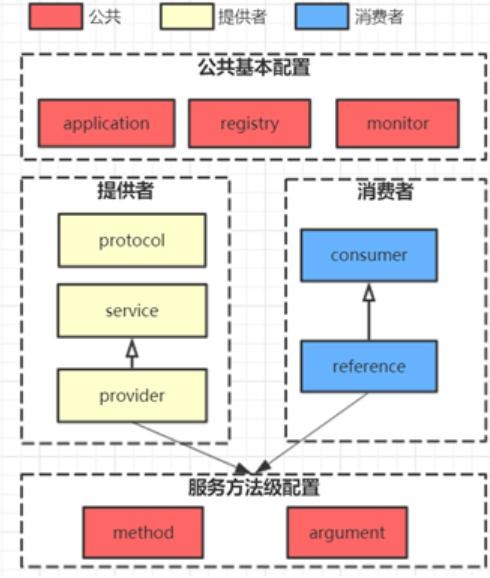

### dubbo框架
1. ### 1. 为什么要用 Dubbo？

   随着服务化的进一步发展，服务越来越多，服务之间的调用和依赖关系也越来越复杂，诞生了面向服务的架构体系(SOA)，也因此衍生出了一系列相应的技术，如对服务提供、服务调用、连接处理、通信协议、序列化方式、服务发现、服务路由、日志输出等行为进行封装的服务框架。就这样为分布式系统的服务治理框架就出现了，Dubbo 也就这样产生了。

   ### 2. Dubbo 是什么？

   Dubbo 是一款高性能、轻量级的开源 RPC 框架，提供服务自动注册、自动发现等高效服务治理方案， 可以和 Spring 框架无缝集成。

   ### 3. Dubbo 的使用场景有哪些？

   - 透明化的远程方法调用：就像调用本地方法一样调用远程方法，只需简单配置，没有任何API侵入。
   - 软负载均衡及容错机制：可在内网替代 F5 等硬件负载均衡器，降低成本，减少单点。
   - 服务自动注册与发现：不再需要写死服务提供方地址，注册中心基于接口名查询服务提供者的IP地址，并且能够平滑添加或删除服务提供者。

   ### 4. Dubbo 核心功能有哪些？

   - Remoting：网络通信框架，提供对多种NIO框架抽象封装，包括“同步转异步”和“请求-响应”模式的信息交换方式。Cluster：服务框架，提供基于接口方法的透明远程过程调用，包括多协议支持，以及软负载均衡，失败容错，地址路由，动态配置等集群支持。
   - Registry：服务注册，基于注册中心目录服务，使服务消费方能动态的查找服务提供方，使地址透明，使服务提供方可以平滑增加或减少机器。

   ### 5. Dubbo 核心组件有哪些？

   

   - Provider：暴露服务的服务提供方
   - Consumer：调用远程服务消费方
   - Registry：服务注册与发现注册中心
   - Monitor：监控中心和访问调用统计
   - Container：服务运行容器

   ### 6. Dubbo 服务器注册与发现的流程？

   - 服务容器Container负责启动，加载，运行服务提供者。
   - 服务提供者Provider在启动时，向注册中心注册自己提供的服务。
   - 服务消费者Consumer在启动时，向注册中心订阅自己所需的服务。
   - 注册中心Registry返回服务提供者地址列表给消费者，如果有变更，注册中心将基于长连接推送变更数据给消费者。
   - 服务消费者Consumer，从提供者地址列表中，基于软负载均衡算法，选一台提供者进行调用，如果调用失败，再选另一台调用。
   - 服务消费者Consumer和提供者Provider，在内存中累计调用次数和调用时间，定时每分钟发送一次统计数据到监控中心Monitor。

   ## 架构设计

   ### 7. Dubbo 的整体架构设计有哪些分层?

   

   - 接口服务层（Service）：该层与业务逻辑相关，根据 provider 和 consumer 的业务设计对应的接口和实现
   - 配置层（Confifig）：对外配置接口，以 ServiceConfifig 和 ReferenceConfifig 为中心
   - 服务代理层（Proxy）：服务接口透明代理，生成服务的客户端 Stub 和 服务端的 Skeleton，以
   - ServiceProxy 为中心，扩展接口为 ProxyFactory
   - 服务注册层（Registry）：封装服务地址的注册和发现，以服务 URL 为中心，扩展接口为
   - RegistryFactory、Registry、RegistryService
   - 路由层（Cluster）：封装多个提供者的路由和负载均衡，并桥接注册中心，以Invoker 为中心，扩展接口为 Cluster、Directory、Router 和 LoadBlancce
   - 监控层（Monitor）：RPC 调用次数和调用时间监控，以 Statistics 为中心，扩展接口为MonitorFactory、Monitor 和 MonitorService
   - 远程调用层（Protocal）：封装 RPC 调用，以 Invocation 和 Result 为中心，扩展接口为Protocal、Invoker 和 Exporter
   - 信息交换层（Exchange）：封装请求响应模式，同步转异步。以 Request 和Response 为中心，
   - 扩展接口为 Exchanger、ExchangeChannel、ExchangeClient 和 ExchangeServer
   - 网络 传输 层（Transport）：抽象 mina 和 netty 为统一接口，以 Message 为中心，扩展接口为Channel、Transporter、Client、Server 和 Codec
   - 数据序列化层（Serialize）：可复用的一些工具，扩展接口为 Serialization、ObjectInput、 ObjectOutput 和 ThreadPool

   ### 8. Dubbo Monitor 实现原理？

   Consumer 端在发起调用之前会先走 fifilter 链；provider 端在接收到请求时也是先走 fifilter 链，然后才进行真正的业务逻辑处理。默认情况下，在 consumer 和 provider 的 fifilter 链中都会Monitorfifilter。

   1. MonitorFilter 向 DubboMonitor 发送数据
   2. DubboMonitor 将数据进行聚合后（默认聚合 1min 中的统计数据）暂存到ConcurrentMap<Statistics, AtomicReference> statisticsMap，然后使用一个含有 3 个线程（线程名字：DubboMonitorSendTimer）的线程池每隔 1min 钟，调用 SimpleMonitorService 遍历statisticsMap 中的统计数据，每发送完毕一个，就重置当前的 Statistics 的AtomicReference
   3. SimpleMonitorService 将这些聚合数据塞入 BlockingQueue queue 中（队列大写为 100000）
   4. SimpleMonitorService 使用一个后台线程（线程名为：DubboMonitorAsyncWriteLogThread）将 queue 中的数据写入文件（该线程以死循环的形式来写）
   5. SimpleMonitorService 还会使用一个含有 1 个线程（线程名字：DubboMonitorTimer）的线程池每隔 5min 钟，将文件中的统计数据画成图表

   ## 三、分布式框架

   ### 9. Dubbo 类似的分布式框架还有哪些？

   比较著名的就是 Spring Cloud。

   ### 10. Dubbo 和 Spring Cloud 有什么关系？

   - Dubbo 是 SOA 时代的产物，它的关注点主要在于服务的调用，流量分发、流量监控和熔断。而Spring Cloud 诞生于微服务架构时代，考虑的是微服务治理的方方面面，另外由于依托了
   - Spring、Spring Boot 的优势之上，两个框架在开始目标就不一致，Dubbo 定位服务治理、Spring Cloud 是打造一个生态。

   ### 12. Dubbo 和 Dubbox 之间的区别？

   Dubbox 是继 Dubbo 停止维护后，当当网基于 Dubbo 做的一个扩展项目，如加了服务可 Restful调用，更新了开源组件等。

   ## 四、注册中心

   ### 13. Dubbo 有哪些注册中心？

   - Multicast 注册中心：Multicast 注册中心不需要任何中心节点，只要广播地址，就能进行服务注册和发现,基于网络中组播传输实现。
   - Zookeeper 注册中心：基于分布式协调系统 Zookeeper 实现，采用 Zookeeper 的 watch 机制实现数据变更。
   - Redis 注册中心：基于 Redis 实现，采用 key/map 存储，key 存储服务名和类型，map 中 key 存储服务 url，value 服务过期时间。基于 Redis 的发布/订阅模式通知数据变更。
   - Simple 注册中心。
   - 推荐使用 Zookeeper 作为注册中心

   ### 14. Dubbo 的注册中心集群挂掉，发布者和订阅者之间还能通信么？

   - 可以通讯。启动 Dubbo 时，消费者会从 Zookeeper 拉取注册的生产者的地址接口等数据，缓存在本地。每次调用时，按照本地存储的地址进行调用。

   ## 五、集群

   ### 15. Dubbo集群提供了哪些负载均衡策略？

   - Random LoadBalance: 随机选取提供者策略，有利于动态调整提供者权重。截面碰撞率高，调用次数越多，分布越均匀。
   - RoundRobin LoadBalance: 轮循选取提供者策略，平均分布，但是存在请求累积的问题。
   - LeastActive LoadBalance: 最少活跃调用策略，解决慢提供者接收更少的请求。
   - ConstantHash LoadBalance: 一致性 Hash 策略，使相同参数请求总是发到同一提供者，一台机器宕机，可以基于虚拟节点，分摊至其他提供者，避免引起提供者的剧烈变动。

   ### 16. Dubbo的集群容错方案有哪些？

   - Failover Cluster：失败自动切换，当出现失败，重试其它服务器。通常用于读操作，但重试会带来更长延迟。
   - Failfast Cluster：快速失败，只发起一次调用，失败立即报错。通常用于非幂等性的写操作，比如新增记录。
   - Failsafe Cluster：失败安全，出现异常时，直接忽略。通常用于写入审计日志等操作。
   - Failback Cluster：失败自动恢复，后台记录失败请求，定时重发。通常用于消息通知操作。
   - Forking Cluster：并行调用多个服务器，只要一个成功即返回。通常用于实时性要求较高的读操作，但需要浪费更多服务资源。可通过 forks=”2″ 来设置最大并行数。
   - Broadcast Cluster：广播调用所有提供者，逐个调用，任意一台报错则报错 。通常用于通知所有提供者更新缓存或日志等本地资源信息。

   ## 六、配置

   ### 17. Dubbo 配置文件是如何加载到 Spring 中的？

   Spring 容器在启动的时候，会读取到 Spring 默认的一些 schema 以及 Dubbo 自定义的schema，每个 schema 都会对应一个自己的 NamespaceHandler，NamespaceHandler 里面通过 BeanDefifinitionParser 来解析配置信息并转化为需要加载的 bean 对象！

   ### 18. 说说核心的配置有哪些？

   

   ### 19. Dubbo 超时设置有哪些方式？

   **Dubbo 超时设置有两种方式：**

   - 服务提供者端设置超时时间，在Dubbo的用户文档中，推荐如果能在服务端多配置就尽量多配置，因为服务提供者比消费者更清楚自己提供的服务特性。
   - 服务消费者端设置超时时间，如果在消费者端设置了超时时间，以消费者端为主，即优先级更高。因为服务调用方设置超时时间控制性更灵活。如果消费方超时，服务端线程不会定制，会产生警告。

   ### 20. 服务调用超时会怎么样？

   dubbo 在调用服务不成功时，默认是会重试两次。

   ## 七、通信协议

   ### 21. Dubbo 使用的是什么通信框架?

   默认使用 Netty 作为通讯框架。

   ### 22. Dubbo 支持哪些协议，它们的优缺点有哪些？

   - Dubbo： 单一长连接和 NIO 异步通讯，适合大并发小数据量的服务调用，以及消费者远大于提供者。传输协议 TCP，异步 Hessian 序列化。Dubbo推荐使用dubbo协议。
   - RMI： 采用 JDK 标准的 RMI 协议实现，传输参数和返回参数对象需要实现 Serializable 接口，使用 Java 标准序列化机制，使用阻塞式短连接，传输数据包大小混合，消费者和提供者个数差不多，可传文件，传输协议 TCP。 多个短连接 TCP 协议传输，同步传输，适用常规的远程服务调用和 RMI 互操作。在依赖低版本的 Common-Collections 包，Java 序列化存在安全漏洞。
   - WebService：基于 WebService 的远程调用协议，集成 CXF 实现，提供和原生 WebService 的互操作。多个短连接，基于 HTTP 传输，同步传输，适用系统集成和跨语言调用。
   - HTTP： 基于 Http 表单提交的远程调用协议，使用 Spring 的 HttpInvoke 实现。多个短连接，传输协议 HTTP，传入参数大小混合，提供者个数多于消费者，需要给应用程序和浏览器 JS 调用。
   - Hessian：集成 Hessian 服务，基于 HTTP 通讯，采用 Servlet 暴露服务，Dubbo 内嵌 Jetty 作为服务器时默认实现，提供与 Hession 服务互操作。多个短连接，同步 HTTP 传输，Hessian 序列化，传入参数较大，提供者大于消费者，提供者压力较大，可传文件。
   - Memcache：基于 Memcache实现的 RPC 协议。
   - Redis：基于 Redis 实现的RPC协议

   ## 八、设计模式

   ### 23. Dubbo 用到哪些设计模式？

   Dubbo 框架在初始化和通信过程中使用了多种设计模式，可灵活控制类加载、权限控制等功能。

   

   

   ## 九、运维管理

   ### 24. 服务上线怎么兼容旧版本？

   可以用版本号（version）过渡，多个不同版本的服务注册到注册中心，版本号不同的服务相互间不引用。这个和服务分组的概念有一点类似。

   ### 25. Dubbo telnet 命令能做什么？

   dubbo 服务发布之后，我们可以利用 telnet 命令进行调试、管理。Dubbo2.0.5 以上版本服务提供端口支持 telnet 命令

   ### 26. Dubbo 支持服务降级吗？

   以通过 dubbo:reference 中设置 mock=“return null”。mock 的值也可以修改为 true，然后再跟接口同一个路径下实现一个 Mock 类，命名规则是 “接口名称+Mock” 后缀。然后在 Mock 类里实现自己的降级逻辑

   ### 27. Dubbo 如何优雅停机？

   Dubbo 是通过 JDK 的 ShutdownHook 来完成优雅停机的，所以如果使用kill -9 PID 等强制关闭指令，是不会执行优雅停机的，只有通过 kill PID 时，才会执行。

   ## 十、SPI

   ### 28. Dubbo SPI 和 Java SPI 区别？

   JDK SPI：

   JDK 标准的 SPI 会一次性加载所有的扩展实现，如果有的扩展很耗时，但也没用上，很浪费资源。所以只希望加载某个的实现，就不现实了

   DUBBO SPI：

   1、对 Dubbo 进行扩展，不需要改动 Dubbo 的源码

   2、延迟加载，可以一次只加载自己想要加载的扩展实现。

   3、增加了对扩展点 IOC 和 AOP 的支持，一个扩展点可以直接 setter 注入其它扩展点。

   4、Dubbo 的扩展机制能很好的支持第三方 IoC 容器，默认支持 Spring Bean。

   ## 十一、其他

   ### 29. Dubbo 支持分布式事务吗？

   - 目前暂时不支持，可与通过 tcc-transaction 框架实现
   - 介绍：tcc-transaction 是开源的 TCC 补偿性分布式事务框架
   - TCC-Transaction 通过 Dubbo 隐式传参的功能，避免自己对业务代码的入侵。

   ### 30. Dubbo 可以对结果进行缓存吗？

   - 为了提高数据访问的速度。Dubbo 提供了声明式缓存，以减少用户加缓存的工作量<dubbo:reference cache=“true” />
   - 其实比普通的配置文件就多了一个标签 cache=“true”

   ### 31. Dubbo 必须依赖的包有哪些？

   - Dubbo 必须依赖 JDK，其他为可选。

   ### 32. Dubbo 支持哪些序列化方式？

   - 默认使用 Hessian 序列化，还有 Duddo、FastJson、Java 自带序列化。

   ### 33. Dubbo 在安全方面有哪些措施？

   - Dubbo 通过 Token 令牌防止用户绕过注册中心直连，然后在注册中心上管理授权。
   - Dubbo 还提供服务黑白名单，来控制服务所允许的调用方。

   ### 34. 服务调用是阻塞的吗？

   - 默认是阻塞的，可以异步调用，没有返回值的可以这么做。Dubbo 是基于 NIO 的非阻塞实现并行调用，客户端不需要启动多线程即可完成并行调用多个远程服务，相对多线程开销较小，异步调用会返回一个 Future 对象。

   ### 35. 服务提供者能实现失效踢出是什么原理？

   - 服务失效踢出基于 zookeeper 的临时节点原理。

   ### 36. 同一个服务多个注册的情况下可以直连某一个服务吗？

   - 可以点对点直连，修改配置即可，也可以通过 telnet 直接某个服务。

   ### 37. Dubbo 服务降级，失败重试怎么做？

   - 可以通过 dubbo:reference 中设置 mock=“return null”。mock 的值也可以修改为 true，然后再跟接口同一个路径下实现一个 Mock 类，命名规则是 “接口名称+Mock” 后缀。然后在 Mock 类里实现自己的降级逻辑

   ### 38.Dubbo 使用过程中都遇到了些什么问题？

   - 在注册中心找不到对应的服务,检查 service 实现类是否添加了@service 注解无法连接到注册中心,检查配置文件中的对应的测试 ip 是否正确

   ## 十二、RPC

   ### 39. 为什么要有RPC

   - http接口是在接口不多、系统与系统交互较少的情况下，解决信息孤岛初期常使用的一种通信手段；优点就是简单、直接、开发方便。利用现成的http协议进行传输。但是如果是一个大型的网站，内部子系统较多、接口非常多的情况下，RPC框架的好处就显示出来了，首先就是长链接，不必每次通信都要像http一样去3次握手什么的，减少了网络开销；其次就是RPC框架一般都有注册中心，有丰富的监控管理；发布、下线接口、动态扩展等，对调用方来说是无感知、统一化的操作。第三个来说就是安全性。最后就是最近流行的服务化架构、服务化治理，RPC框架是一个强力的支撑。
   - socket只是一个简单的网络通信方式，只是创建通信双方的通信通道，而要实现rpc的功能，还需要对其进行封装，以实现更多的功能。
   - RPC一般配合netty框架、spring自定义注解来编写轻量级框架，其实netty内部是封装了socket的，较新的jdk的IO一般是NIO，即非阻塞IO，在高并发网站中，RPC的优势会很明显

   ### 40. 什么是RPC

   

   ### 41. PRC架构组件

   一个基本的RPC架构里面应该至少包含以下4个组件：

   1、客户端（Client）:服务调用方（服务消费者）

   2、客户端存根（Client Stub）:存放服务端地址信息，将客户端的请求参数数据信息打包成网络消息，再通过网络传输发送给服务端

   3、服务端存根（Server Stub）:接收客户端发送过来的请求消息并进行解包，然后再调用本地服务进行处理4、服务端（Server）:服务的真正提供者

   

   具体调用过程：

   1、服务消费者（client客户端）通过调用本地服务的方式调用需要消费的服务；

   2、客户端存根（client stub）接收到调用请求后负责将方法、入参等信息序列化（组装）成能够进行网络传输的消息体；

   3、客户端存根（client stub）找到远程的服务地址，并且将消息通过网络发送给服务端；

   4、服务端存根（server stub）收到消息后进行解码（反序列化操作）；

   5、服务端存根（server stub）根据解码结果调用本地的服务进行相关处理；

   6、本地服务执行具体业务逻辑并将处理结果返回给服务端存根（server stub）；

   7、服务端存根（server stub）将返回结果重新打包成消息（序列化）并通过网络发送至消费方；

   8、客户端存根（client stub）接收到消息，并进行解码（反序列化）；

   9、服务消费方得到最终结果；

   ### 42. RPC和SOA、SOAP、REST的区别

   1、REST

   可以看着是HTTP协议的一种直接应用，默认基于JSON作为传输格式,使用简单,学习成本低效率高,但是安全性较低。

   2、SOAP

   SOAP是一种数据交换协议规范,是一种轻量的、简单的、基于XML的协议的规范。而SOAP可以看着是一个重量级的协议，基于XML、SOAP在安全方面是通过使用XML-Security和XML-Signature两个规范组成了WS-Security来实现安全控制的,当前已经得到了各个厂商的支持 。它有什么优点？简单总结为：易用、灵活、跨语言、跨平台。

   3、SOA

   面向服务架构，它可以根据需求通过网络对松散耦合的粗粒度应用组件进行分布式部署、组合和使用。服务层是SOA的基础，可以直接被应用调用，从而有效控制系统中与软件代理交互的人为依赖性。SOA是一种粗粒度、松耦合服务架构，服务之间通过简单、精确定义接口进行通讯，不涉及底层程接口和通讯模型。SOA可以看作是B/S模型、XML（标准通用标记语言的子集）/Web Service技术之后的自然延伸。

   4、REST 和 SOAP、RPC 有何区别呢?

   没什么太大区别，他们的本质都是提供可支持分布式的基础服务，最大的区别在于他们各自的的特点所带来的不同应用场景 。

   ### 43. RPC框架需要解决的问题？

   1、如何确定客户端和服务端之间的通信协议？

   2、如何更高效地进行网络通信？

   3、服务端提供的服务如何暴露给客户端？

   4、客户端如何发现这些暴露的服务？

   5、如何更高效地对请求对象和响应结果进行序列化和反序列化操作？

   ### 44. RPC的实现基础？

   1、需要有非常高效的网络通信，比如一般选择Netty作为网络通信框架；

   2、需要有比较高效的序列化框架，比如谷歌的Protobuf序列化框架；

   3、可靠的寻址方式（主要是提供服务的发现），比如可以使用Zookeeper来注册服务等等；

   4、如果是带会话（状态）的RPC调用，还需要有会话和状态保持的功能；

   ### 45. RPC使用了哪些关键技术？

   1、动态代理

   生成Client Stub（客户端存根）和Server Stub（服务端存根）的时候需要用到Java动态代理技术，可以使用JDK提供的原生的动态代理机制，也可以使用开源的：CGLib代理，Javassist字节码生成技术。

   2、序列化和反序列化

   在网络中，所有的数据都将会被转化为字节进行传送，所以为了能够使参数对象在网络中进行传输，需要对这些参数进行序列化和反序列化操作。序列化：把对象转换为字节序列的过程称为对象的序列化，也就是编码的过程。反序列化：把字节序列恢复为对象的过程称为对象的反序列化，也就是解码的过程。 目前比较高效的开源序列化框架：如Kryo、FastJson和Protobuf等。反序列化：把字节序列恢复为对象的过程称为对象的反序列化，也就是解码的过程。 目前比较高效的开源序列化框架：如Kryo、FastJson和Protobuf等。

   3、NIO通信

   出于并发性能的考虑，传统的阻塞式 IO 显然不太合适，因此我们需要异步的 IO，即 NIO。Java 提供了 NIO 的解决方案，Java 7 也提供了更优秀的 NIO.2 支持。可以选择Netty或者MINA来解决NIO数据 传输的问题。

   4、服务注册中心

   可选：Redis、Zookeeper、Consul 、Etcd。一般使用ZooKeeper提供服务注册与发现功能，解决单点故障以及分布式部署的问题(注册中心)。

   ### 46. 主流RPC框架有哪些

   

   ### 47. RPC的实现原理架构图

   

   也就是说两台服务器A，B，一个应用部署在A服务器上，想要调用B服务器上应用提供的函数/方法，由于不在一个内存空间，不能直接调用，需要通过网络来表达调用的语义和传达调用的数据。

   比如说，A服务器想调用B服务器上的一个方法：

   1、建立通信

   首先要解决通讯的问题：即A机器想要调用B机器，首先得建立起通信连接。主要是通过在客户端和服务器之间建立TCP连接，远程过程调用的所有交换的数据都在这个连接里传输。连接可以是按需连接，调用结束后就断掉，也可以是长连接，多个远程过程调用共享同一个连接。通常这个连接可以是按需连接（需要调用的时候就先建立连接，调用结束后就立马断掉），也可以是长 连接（客户端和服务器建立起连接之后保持长期持有，不管此时有无数据包的发送，可以配合心跳检测机制定期检测建立的连接是否存活有效），多个远程过程调用共享同一个连接。

   2、服务寻址

   要解决寻址的问题，也就是说，A服务器上的应用怎么告诉底层的RPC框架，如何连接到B服务器（如主机或IP地址）以及特定的端口，方法的名称名称是什么。通常情况下我们需要提供B机器（主机名或IP地址）以及特定的端口，然后指定调用的方法或者函数的名称以及入参出参等信息，这样才能完成服务的一个调用。可靠的寻址方式（主要是提供服务的发现）是RPC的实现基石，比如可以采用Redis或者Zookeeper来注册服务等等。

   2.1、从服务提供者的角度看：

   当服务提供者启动的时候，需要将自己提供的服务注册到指定的注册中心，以便服务消费者能够通过服务注册中心进行查找；当服务提供者由于各种原因致使提供的服务停止时，需要向注册中心注销停止的服务；服务的提供者需要定期向服务注册中心发送心跳检测，服务注册中心如果一段时间未收到来自服务提供者的心跳后，认为该服务提供者已经停止服务，则将该服务从注册中心上去掉。

   2.2、从调用者的角度看：

   服务的调用者启动的时候根据自己订阅的服务向服务注册中心查找服务提供者的地址等信息；

   当服务调用者消费的服务上线或者下线的时候，注册中心会告知该服务的调用者；

   服务调用者下线的时候，则取消订阅。

   3、网络传输

   3.1、序列化

   当A机器上的应用发起一个RPC调用时，调用方法和其入参等信息需要通过底层的网络协议如TCP传输到B机器，由于网络协议是基于二进制的，所有我们传输的参数数据都需要先进行序列化（Serialize）或者编组（marshal）成二进制的形式才能在网络中进行传输。然后通过寻址操作和网络传输将序列化或者编组之后的二进制数据发送给B机器。

   3.2、反序列化

   当B机器接收到A机器的应用发来的请求之后，又需要对接收到的参数等信息进行反序列化操作（序列化的逆操作），即将二进制信息恢复为内存中的表达方式，然后再找到对应的方法（寻址的一部分）进行本地调用（一般是通过生成代理Proxy去调用, 通常会有JDK动态代理、CGLIB动态代理、Javassist生成字节码技术等），之后得到调用的返回值。

   4、服务调用

   B机器进行本地调用（通过代理Proxy和反射调用）之后得到了返回值，此时还需要再把返回值发送回A机器，同样也需要经过序列化操作，然后再经过网络传输将二进制数据发送回A机器，而当A机器接收到这些返回值之后，则再次进行反序列化操作，恢复为内存中的表达方式，最后再交给A机器上的应用进行相关处理（一般是业务逻辑处理操作）。

   ### 49.Dubbo的服务请求失败怎么处理

   Dubbo是一个RPC框架，它为我们的应用提供了远程通信能力的封装，同时，Dubbo在RPC通信的基础上，逐步在向一个生态在演进，它涵盖了服务注册、动态路由、容错、服务降级、负载均衡等能力，基本上在微服务架构下面临的问题，Dubbo都可以解决。

   而对于Dubbo服务请求失败的场景，默认提供了重试的容错机制，也就是说，如果基于Dubbo进行服务间通信出现异常，服务消费者会对服务提供者集群中其他的节点发起重试，确保这次请求成功，默认的额外重试次数是2次。

   除此之外，Dubbo还提供了更多的容错策略，我们可以根据不同的业务场景来进行选择。

   快速失败策略，服务消费者只发起一次请求，如果请求失败，就直接把错误抛出去。这种比较适合在非幂等性场景中使用

   失败安全策略，如果出现服务通信异常，直接把这个异常吞掉不做任何处理

   失败自动恢复策略，后台记录失败请求，然后通过定时任务来对这个失败的请求进行重发。

   并行调用多个服务策略，就是把这个消息广播给服务提供者集群，只要有任何一个节点返回，就表示请求执行成功。

   广播调用策略，逐个调用服务提供者集群，只要集群中任何一个节点出现异常，就表示本次请求失败

   要注意的是，默认基于重试策略的容错机制中，需要注意幂等性的处理，否则在事务型的操作中，容易出现多次数据变更的问题。
   

   ### 50.dubbo的负载均衡有几种算法?（随机，轮询，最少活跃请求数，一致性hash）

   Dubbo提供了4种负载均衡机制：

   - 权重随机算法：`RandomLoadBalance`
   - 最少活跃调用数算法：`LeastActiveLoadBalance`
   - 一致性哈希算法：`ConsistentHashLoadBalance`
   - 加权轮询算法：`RoundRobinLoadBalance`

   Dubbo的负载均衡算法均实现自`LoadBalance`接口

   ### 51.Dubbo 和 Spring Cloud 有什么区别？

   两者都是现在主流的微服务框架，但却存在不少差异：

   - **初始定位不同**：SpringCloud定位为微服务架构下的一站式解决方案；Dubbo 是 SOA 时代的产物，它的关注点主要在于服务的调用和治理
   - **生态环境不同**：SpringCloud依托于Spring平台，具备更加完善的生态体系；而Dubbo一开始只是做RPC远程调用，生态相对匮乏，现在逐渐丰富起来。
   - **调用方式**：SpringCloud是采用Http协议做远程调用，接口一般是Rest风格，比较灵活；Dubbo是采用Dubbo协议，接口一般是Java的Service接口，格式固定。但调用时采用Netty的NIO方式，性能较好。
   - 组件差异比较多，例如SpringCloud[注册中心](https://cloud.tencent.com/product/tse?from=10680)一般用Eureka，而Dubbo用的是Zookeeper

   SpringCloud生态丰富，功能完善，更像是品牌机，Dubbo则相对灵活，可定制性强，更像是组装机。

   - **SpringCloud**：Spring公司开源的微服务框架，SpirngCloud 定位为微服务架构下的一站式解决方案。
   - Dubbo：阿里巴巴开源的RPC框架，Dubbo 是 SOA 时代的产物，它的关注点主要在于服务的调用，流量分发、流量监控和熔断

   两者的生态对比：

   ;

   Spring Cloud 的功能很明显比 Dubbo 更加强大，涵盖面更广，而且作为 Spring 的旗舰项目，它也能够与 Spring Framework、Spring Boot、Spring Data、Spring Batch 等其他 Spring 项目完美融合，这些对于微服务而言是至关重要的。

   使用 Dubbo 构建的微服务架构就像组装电脑，各环节选择自由度很高，但是最终结果很有可能因为一条内存质量不行就点不亮了，总是让人不怎么放心，但是如果使用者是一名高手，那这些都不是问题。

   而 Spring Cloud 就像品牌机，在 Spring Source 的整合下，做了大量的兼容性测试，保证了机器拥有更高的稳定性，但是如果要在使用非原装组件外的东西，就需要对其基础原理有足够的了解。

   ## dubbo和Feign远程调用的差异

   Feign是SpringCloud中的远程调用方式，基于成熟Http协议，所有接口都采用Rest风格。因此接口规范更统一，而且只要符合规范，实现接口的微服务可以采用任意语言或技术开发。但受限于http协议本身的特点，请求和响应格式臃肿，其通信效率相对会差一些。

   Dubbo框架默认采用Dubbo自定义通信协议，与Http协议一样底层都是TCP通信。但是Dubbo协议自定义了Java数据序列化和反序列化方式、数据传输格式，因此Dubbo在数据传输性能上会比Http协议要好一些。

   不过这种性能差异除非是达极高的并发量级，否则无需过多考虑。

   相关资料：

   > Dubbo采用自定义的Dubbo协议实现远程通信，是一种典型的RPC调用方案，而SpringCloud中使用的Feign是基于Rest风格的调用方式。

   **1）Rest风格**

   REST是一种架构风格，指的是一组架构约束条件和原则。满足这些约束条件和原则的应用程序或设计就是 RESTful。

   Rest的风格可以完全通过HTTP协议实现，使用 HTTP 协议处理数据通信。REST架构对资源的操作包括获取、创建、修改和删除资源的操作正好对应HTTP协议提供的GET、POST、PUT和DELETE方法。

   因此请求和想要过程只要遵循http协议即可，更加灵活。

   SpringCloud中的Feign就是Rest风格的调用方式。

   **2）RPC**

   Remote Procedure Call，远程过程调用，就是像调用本地方法一样调用远程方法。

   RPC一般要确定下面几件事情：

   - **数据传输方式**：多数RPC框架选择TCP作为传输协议，性能比较好。
   - **数据传输内容**：请求方需要告知需要调用的函数的名称、参数、等信息。
   - **序列化方式**：客户端和服务端交互时将参数或结果转化为字节流在网络中传输，那么数据转化为字节流的或者将字节流转换成能读取的固定格式时就需要进行序列化和反序列化

   因为有序列化和反序列化的需求，因此对数据传输格式有严格要求，不如Http灵活

   Dubbo协议就是RPC的典型代表。

   我们看看Dubbo协议和Feign的调用区别：

   ;

   ## Eureka和Zookeeper注册中心的区别

   SpringCloud和Dubbo都支持多种注册中心，不过目前主流来看SpringCloud用Eureka较多，Dubbo则以Zookeeper为主。两者存在较大的差异：

   - **从集群设计来看**：Eureka集群各节点平等，没有主从关系，因此可能出现数据不一致情况；ZK为了满足一致性，必须包含主从关系，一主多从。集群无主时，不对外提供服务
   - **CAP原则来看**：Eureka满足AP原则，为了保证整个服务可用性，牺牲了集群数据的一致性；而Zookeeper满足CP原则，为了保证各节点数据一致性，牺牲了整个服务的可用性。
   - **服务拉取方式来看**：Eureka采用的是服务主动拉取策略，消费者按照固定频率（默认30秒）去Eureka拉取服务并缓存在本地；ZK中的消费者首次启动到ZK订阅自己需要的服务信息，并缓存在本地。然后监听服务列表变化，以后服务变更ZK会推送给消费者。

   ### dubbo都支持什么协议，推荐用哪种？

   dubbo协议：
   单一TCP长连接和NIO异步通讯
   适合大并发小数据量的服务调用，以及服务消费者远大于提供者的情况
   Hessian二进制序列化

   缺点是不适合传送大数据包的服务

   rmi协议：
   采用JDK标准的rmi协议实现，传输参数和返回参数对象需要实现Serializable接口
   使用java标准序列化机制，使用阻塞式短连接，传输数据包不限，消费者和提供者个数相当
   多个短连接，TCP协议传输，同步传输，适用常规的远程服务调用和rmi互操作

   缺点是在依赖低版本的Common-Collections包，java反序列化存在安全漏洞，需升级commons-collections3 到3.2.2版本或commons-collections4到4.1版本。

   webservice协议：
   基于WebService的远程调用协议(Apache CXF的frontend-simple和transports-http)实现，提供和原生WebService的互操作
   多个短连接，基于HTTP传输，同步传输，适用系统集成和跨语言调用。


   http协议：
   基于Http表单提交的远程调用协议，使用Spring的HttpInvoke实现
   对传输数据包不限，传入参数大小混合，提供者个数多于消费者

   缺点是不支持传文件，只适用于同时给应用程序和浏览器JS调用

   hessian：
   集成Hessian服务，基于底层Http通讯，采用Servlet暴露服务，Dubbo内嵌Jetty作为服务器实现,可与Hession服务互操作
   通讯效率高于WebService和Java自带的序列化
   适用于传输大数据包(可传文件)，提供者比消费者个数多，提供者压力较大

   缺点是参数及返回值需实现Serializable接口，自定义实现List、Map、Number、Date、Calendar等接口

   thrift协议：
   对thrift原生协议的扩展添加了额外的头信息
   使用较少，不支持传null值

   memcache：
   基于memcached实现的RPC协议

   redis：
   基于redis实现的RPC协议

   ### Dubbo默认使用什么注册中心，还有别的选择吗？

    推荐使用zookeeper作为注册中心，还有redis、multicast、simple注册中心。 

   ### Dubbo启动时如果依赖的服务不可用会怎样？

    会在启动时检查依赖的服务是否可用，不可用时会抛出异常，阻止 Spring 初始化 完成，默认 check="true"，可以通过 check="false" 关闭检查。 

   ### Dubbo默认使用的是什么通信框架，还有别的选择吗？

    Dubbo 默认使用 Netty 框架，也是推荐的选择，另外内容还集成有Mina、Grizzly。 

   ### Dubbo如何一条链接并发多个调用。

    包头中添加一个标识id，服务器端响应请求时也要携带这个id，供客户端多线程领取对应的响应数据提供线索。 

   ### Dubbo 的使用场景有哪些？

   - RPC 分布式服务，拆分应用进行服务化，提高开发效率，调优性能，节省竞争资源
   - 配置管理，解决服务的地址信息剧增，配置困难的问题
   - 服务依赖，解决服务间依赖关系错踪复杂的问题
   - 服务扩容，解决随着访问量的不断增大，动态扩展服务提供方的机器的问题

   ### Dubbo 核心功能有哪些？

   主要就是如下3个核心功能：

   - **Remoting：**网络通信框架，提供对多种NIO框架抽象封装，包括“同步转异步”和“请求-响应”模式的信息交换方式。
   - **Cluster：服务框架**，提供基于接口方法的透明远程过程调用，包括多协议支持，以及软负载均衡，失败容错，地址路由，动态配置等集群支持。
   - **Registry：服务注册**，基于注册中心目录服务，使服务消费方能动态的查找 服务提供方，使地址透明，使服务提供方可以平滑增加或减少机器。

   ### Dubbo 核心组件有哪些？

   - Provider：服务的提供方
   - Consumer：调用远程服务的服务消费方
   - Registry：服务注册和发现的注册中心
   - Monitor：统计服务调用次数和调用时间的监控中心
   - Container：服务运行容器

   ### Dubbo 服务器注册与发现的流程？

   

   

   该图来自 Dubbo 官网，供你参考，如果你说你熟悉 Dubbo, 面试官经常会让你画这个图，记好了。

    

   

   **流程说明：**

   - Provider(提供者)绑定指定端口并启动服务
   - 指供者连接注册中心，并发本机IP、端口、应用信息和提供服务信息发送至注册中心存储
   - Consumer(消费者），连接注册中心 ，并发送应用信息、所求服务信息至注册中心
   - 注册中心根据 消费 者所求服务信息匹配对应的提供者列表发送至Consumer 应用缓存。
   - Consumer 在发起远程调用时基于缓存的消费者列表择其一发起调用。
   - Provider 状态变更会实时通知注册中心、在由注册中心实时推送至Consumer

   **设计的原因：**

   - Consumer 与Provider 解偶，双方都可以横向增减节点数。
   - 注册中心对本身可做对等集群，可动态增减节点，并且任意一台宕掉后，将自动切换到另一台
   - 去中心化，双方不直接依懒注册中心，即使注册中心全部宕机短时间内也不会影响服务的调用
   - 服务提供者无状态，任意一台宕掉后，不影响使用

   

   ### Dubbo 的注册中心集群挂掉，发布者和订阅者之间还能通信么？

   可以的，消费者在启动时，消费者会从zk拉取注册的生产者的地址接口等数据，缓存在本地。

   每次调用时，按照本地存储的地址进行调用

   可以的，消费者本地有一个生产者的列表，他会按照列表继续工作，倒是无法从注册中心去同步最新的服务列表，短期的注册中心挂掉是不要紧的，但一定要尽快修复

   挂掉是不要紧的，但前提是你没有增加新的服务，如果你要调用新的服务，则是不能办到的

   ### Dubbo源码使用了哪些设计模式

    [Dubbo中用到了哪些设计模式？ - 腾讯云开发者社区-腾讯云 (tencent.com)](https://cloud.tencent.com/developer/article/1845309) 

   ### Dubbo集群提供了哪些负载均衡策略？

   ```bash
   1、random loadbalance：安权重设置随机概率（默认）；
   2、roundrobin loadbalance：轮寻，按照公约后权重设置轮训比例；
   3、lastactive loadbalance：最少活跃调用数，若相同则随机；
   4、consistenthash loadbalance：一致性hash，相同参数的请求总是发送到同一提供者。
   ```

   ### Dubbo的集群容错方案有哪些？

   Failover Cluster，失败自动切换，当出现失败，重试其它服务器。通常用于读操作，但重试会带来更长延迟。
   Failfast Cluster，快速失败，只发起一次调用，失败立即报错。通常用于非幂等性的写操作，比如新增记录。
   Failsafe Cluster，失败安全，出现异常时，直接忽略。通常用于写入日志等。
   Failback Cluster，失败自动恢复，后台记录失败请求，定时重发。通常用于消息通知等。
   Forking Cluster，并行调用多个服务器，只要一个成功即返回。通常用于实时性要求较高的读操作，但需要浪费更多服务资源。可通过 forks 来设置最大并行数。
   Broadcast Cluster，广播调用所有提供者，逐个调用，任意一台报错则报错。通常用于通知所有提供者更新缓存本地资源信息。

   ### Dubbo 支持哪些序列化方式？

   - Hessian 序列化：是修改过的 hessian lite，默认启用
   - json 序列化：使用 FastJson 库
   - java 序列化：JDK 提供的序列化，性能不理想
   - dubbo 序列化：未成熟的高效 java 序列化实现，不建议在生产环境使用

   