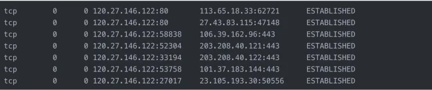

### 常用Linux 命令
### Linux基本面试问题

### 1.什么是Linux？

**回答：** Linux是基于Linux内核的操作系统。它是一个开源操作系统，可以在不同的硬件平台上运行。它为用户提供了免费的低成本操作系统。这是一个用户友好的环境，他们可以在其中轻松修改和创建源代码的变体。

### 2.谁发明了Linux？解释Linux的历史？

**回答：**  Linus Torvalds创建了Linux。莱纳斯·托瓦尔兹（Linus Torvalds）于1991年在芬兰赫尔辛基大学（University of Helsinki）求学。他开始自行编写代码以免费获得Unix的学术版本。后来，它作为Linux Kernel变得流行。

### 3. Linux和Unix有什么区别？

**回答：** Linux与Unix

| Linux                                            | Unix系统                             |
| :----------------------------------------------- | :----------------------------------- |
| 提供付费和免费分发。                             | 不同级别的Unix使用不同的付费结构。   |
| Linux主要使用带有可选命令行界面的GUI             | Unix使用命令行界面                   |
| Linux OS是便携式的，可以在不同的硬盘中执行       | Unix OS不可移植。                    |
| Linux由全球Linux社区开发。                       | Unix由AT＆T开发人员开发。            |
| Linux是免费的。它是在GNU许可下通过互联网下载的。 | 大多数类似Unix的操作系统不是免费的。 |
| Linux用于家用PC，电话等。                        | Unix用于服务器系统。                 |

和其他一些区别。

**Linux是Unix的克隆版本**。但是，如果考虑可移植操作系统接口（POSIX）标准，则可以将Linux视为UNIX。

- **Linux只是核心**

所有Linux发行版都包括GUI系统，GNU实用程序，安装和管理工具，GNU c / c ++编译器，编辑器（vi）以及各种应用程序，例如OpenOffice，Firefox。

UNIX操作系统被认为是完整的OS，因为一切都来自一个供应商。

- **安全与防火墙**

Linux随附了基于Netfilter和IPTables的开源防火墙工具，可保护您的服务器和台式机免受黑客和黑客的攻击。UNIX操作系统带有自己的防火墙产品。 

- **备份与恢复**

UNIX和Linux带有自己的一套工具，用于将数据备份到磁带和其他备份介质。但是，Linux和UNIX共享一些通用工具，例如tar，转储/还原和cpio等。

### 4. Linux操作系统的核心是什么？

**回答：**内核是Linux操作系统的核心。

### 5.什么是Linux内核？

**回答：**内核是操作系统的心脏。它充当软件和硬件之间的桥梁。如果软件请求硬件，则内核将在软件和硬件之间传递数据。例如，如果您想播放一首歌曲，则应启动默认播放器，它会请求内核播放一首歌曲，现在，内核将与硬件联系以寻求许可或寻求硬件组件，就像您插入任何耳机一样。装置。大多数Android手机使用Linux内核。 

是的，内核可以编辑，因为它是根据通用公共许可证发行的。

### 6.什么是BASH？

**回答：**  Bash是Brian Fox为GNU项目编写的Unix shell和命令处理器。它是免费软件，可以代替Bourne Shell。这是一个解释后的未编译过程，也可以在终端窗口中运行。这使用户可以编写命令并引起动作。Bash能够从Shell脚本读取命令。

### 7.什么是LILO？

**回答：**  LILO表示Linux Loader是用于Linux操作系统的引导加载程序。大多数Linux操作系统使用LILO将操作系统引导到主内存中以启动操作。

### 8.什么是CLI？

**回答：**  CLI表示命令语言解释器。它与计算机程序进行交互，用户在其中以文本行的形式发出命令。它也与计算机终端交互，该界面接受文本行并将其作为命令转换为操作系统。 

### **9.**  开源的优势是什么？

**回答：**   Linux是最早的开源技术之一，许多程序员添加了对用户完全开放的软件，这意味着您可以下载文件并随意更改代码。它为用户提供了多种选择，并提高了安全性。

### 10.开源的缺点是什么？

**回答：** 下面提到的开源操作系统的缺点

1. 使用困难 
2. 相容性问题
3. 责任与保证
4. 隐藏费用

### 11.什么是Shell？

**回答：**  Shell是一个计算机程序，充当用户和内核之间的接口。用户可以通过在Shell上编写程序，命令和脚本来与内核进行通信。它接受人类可读的命令，并将其转换为内核可理解的语言。

### 12. Linux中有几种类型的Shell？ 

**回答：**它们是Linux中的五个Shell：

- **C Shell（csh）：**类似于C语法，并提供拼写检查和作业控制。
- **Korn Shell（ksh）：**是一种高级编程语言Shell。
- **Z Shell（Zsh）：**它提供了一些独特的性质，例如观察登录/注销监视，文件名生成，启动文件，结束注释。 
- **Bourne Again Shell（bash）：**这是Linux发行版的默认设置。
- **友好的交互式Shell（Fish）：**它提供基于Web的配置，自动建议等。 

### 13. Linux的基本组件是什么？

**回答：**   Linux的基本组件

1. **内核：**它是Linux的核心组件，它充当软件和硬件之间的接口。  
2. **Shell：**它充当用户和内核之间的接口。
3. **GUI：**   它代表图形用户界面，这是用户与系统交互的另一种方式。但这与图像，按钮，用于交互的文本框不同。
4. **系统实用程序：**这些是允许用户管理计算机的软件功能。
5. **应用程序：**旨在执行一组任务的一组功能。

### 14.发出命令时如何打开命令提示符？

**回答：**通过按CTRL + ALT + T或在菜单搜索栏中提供终端来启动终端。

### 15.什么是交换空间？

**回答：**当物理Ram内存用完时，将使用交换空间。它将Ram非活动页面移动到交换空间。它可以以专用交换分区或交换文件的形式考虑。

### 16.什么是GUI？

**回答：** GUI表示图形用户界面。它是一种人机界面，使用可以通过鼠标操作的窗口，图像，图标和菜单。电子产品中的大多数现代应用程序都通过GUI与用户通信。GUI是使用按钮，菜单，消息框等的图形和文本交互的组合。

### 17.解释Linux中的文件权限类型？

**回答：**每个文件或目录都具有3个权限

他们是 

1. **Read--**它是指只有他们可以读取该文件。
2. **Write--**这是指他们可以写入文件或修改目录的文件。
3. **Execute--**影响用户执行文件或查看目录文件的能力。 

### 18.环境变量是什么？

**回答：**它们是动态值，会影响计算机上程序的过程。它们存在于每个操作系统中，并且它们的类型可能有所不同。可以创建，编辑，保存和删除它们，还可以提供有关系统行为的信息。

### 20.什么是符号链接？ 

**回答：**它将使用其路径重定向到另一个文件。目标文件不包含任何数据。符号链接重定向到文件系统中某个位置的另一个条目。如果删除了目标文件，则将删除指向该文件的链接，但不会删除该文件。

### 21.什么是硬链接？

**回答：**硬链接是Linux上现有文件的另一个名称。我们可以为任何文件创建如此多的硬链接。他们可以为其他硬链接创建链接。

### 22.什么是重定向？

**回答：**重定向可以定义为更改标准输入和输出设备。要使用重定向元字符，您可以重定向文件或程序。 

### 23.什么是守护程序？

**回答：**守护程序是一个后台进程，它接受来自其他计算机的服务请求，大多数操作系统使用其他形式的守护程序。  

### 24.描述根帐户？

**回答：** Root是用户名，默认情况下可以访问所有文件和命令。超级用户可以执行许多操作，但是普通用户不能执行诸如安装软件，更改文件权限等操作。

25.解释[虚拟桌面](https://cloud.tencent.com/product/cvd?from=10680)吗？

**回答：**当您面临如何管理桌面上的多个窗口的问题时，虚拟桌面是一种用户界面，虚拟桌面可以作为替代方法。虚拟桌面存储远程服务器，并允许您在干净的状态上使用一个或多个程序。 

26.使用vi编辑器时有哪些不同的模式？

**回答：** vi编辑器中有三种模式。他们是 

- 命令模式/常规模式
- 插入模式/编辑模式。
- 防爆模式/更换模式。 

27.什么是inode和进程ID？

**回答：** inode是赋予每个文件的唯一名称，进程id是赋予每个进程的唯一名称。 

\28. Linux中的进程状态是什么？

**回答：**  Linux中的五个过程状态。他们是

1. 新建/就绪：已创建一个新进程并准备运行。
2. 正在运行：正在执行该进程。
3. 阻止/等待：进程正在等待用户输入。 
4. 终止/完成：进程已完成执行或被操作系统终止。 
5. 僵尸：进程已删除，但仍在进程表中存在有关该进程的信息。

;

29.解释Linux中的流程管理系统调用吗？

**回答：**  Linux中的流程管理系统调用：

- **fork（）：**用于创建新进程。
- **exec（）：**执行新进程。
- **wait（）：**等到进程执行。
- **exit（）：**退出进程。

系统调用以获取进程ID：

- **getpid（）：**查找唯一的进程ID。 
- **getppid（）：**查找唯一的父进程ID。 

30.解释Linux中的文件权限组？

**回答：** 每个文件和目录都有三个基于用户的权限组。

**他们是：**

1. **所有者：**所有者只需要访问文件或目录，就不会影响其他用户的操作。
2. **组：**这些权限仅适用于已分配给文件或目录的组。它们不会影响其他用户的操作。
3. **所有用户：**这些权限适用于系统上的所有用户。

31.什么是Linux中的文件系统？

**回答：** Linux文件系统存储和处理数据。没有文件系统，它将无法知道文件的起始位置和文件的结束位置。

32.解释Linux中不同的文件系统类型吗？

订阅我们的YouTube频道以获取新的更新。

**回答：**在Linux中，有许多文件系统：

Ext，Ext2，Ext3，Ext4，JFS，XFS，btrfs，ufs，autofs，devpts，ntfs和交换。

[**Linux初学者教程**](https://mindmajix.com/linux-tutorial)

### Linux管理员面试问题

### 32.为什么需要LVM？

**回答：** LVM代表大容量管理，它是一种存储管理设备。用户可以创建，调整大小和删除LVM分区。它增加了抽象性，灵活性和控制性。LVM用于将现有存储设备收集到该组中并分配逻辑单元。 

### 33.什么是umask？

**回答：** unmask代表用户文件创建模式。用户创建任何文件时，它具有默认文件权限。因此，取消屏蔽将对新创建的文件指定很少的限制（它控制文件权限）。

| 1个  | umask [-S] [mask] |
| :--- | :---------------- |
|      |                   |

### 34.如何为用户永久设置面罩？ 

**回答：**如果调用unmask命令时不带任何参数，则表示它将显示当前掩码。 

要永久设置取消遮罩，我们有两种类型。

**他们是：**

- Ocotal表示。
- 符号表示。

### 35.在Linux中什么是网络绑定？

**回答：** 网络绑定是将两个以上的网络接口组合成一个网络接口的过程。它通过增加网络吞吐量和带宽来提供性能改进和冗余。无需担心一个接口关闭或拔出，因为另一个接口可以工作。绑定界面的行为取决于绑定方法。 

### 36. Linux中的网络绑定有哪些不同的模式？

答： 

- **Mode-0（balance-rr）：**这是默认模式，基于轮询策略。它提供容错和负载平衡功能。它使用轮询方式来传输数据包。
- **模式1（active-backup）：**它基于主动备份策略，只有一个从机将在频带中起作用，而另一个将在其他从机发生故障时起作用。它还提供了容错能力。
- **模式2（balance-xor）：**设置源Mac地址和目标Mac地址之间的异或模式，以提供容错能力。
- **模式3（broadcast）：**它基于广播策略，并在从属接口中传输所有内容。它还提供了容错能力，并且只能用于特定目的。
- **模式4（802.3ad）：**这是一种动态聚合模式，它创建了具有相同速度的聚合组。它使用传输哈希方法选择从站以进行传出流量。
- **模式5（balance-tlb）：**传出流量是根据从站上的当前负载，而传入流量是从站接收的。这称为自适应发送负载平衡模式。 
- **模式6（balance-alb）：**这是一种自适应负载平衡模式。它不需要任何开关支持。 

### 37.如何查看默认路由和路由表？

**回答：**   要显示默认路由和路由表，我们使用以下命令。

| 1个 			2 			3 			4 			5 | $ route-n 			  			$ nestat-rn 			  			$ ip |
| :---------------------------------------------------------- | :----------------------------------------------------------- |
|                                                             |                                                              |

### 38.如何检查Linux服务器中正在侦听哪些端口？

**回答：**我们有两个命令来检查Linux Server中正在侦听哪些端口。以下是两个命令 

| 1个 			2 | # netstat --listen 			# netstat -l |
| :---------------- | :------------------------------------------ |
|                   |                                             |

### 39.内核模块位于何处？

**回答：** **lib / modules / kernel-version /，**此目录存储有关Linux系统下已编译驱动器的所有信息。使用lsmod命令，我们还可以看到已安装的内核模块。 

### 40.如何在Linux中更改默认运行级别？

**回答：**要更改Linux中的默认运行级别，请使用init命令。 

### 41.如何使用nfs共享目录？

**回答：**   要使用NFS共享目录，请首先编辑配置文件和'/ etc / exports'并添加目录名称' */*'。现在，重新启动NFS服务。

### 42. SMTP，DNS，FTP，DHCP，SSH和Squid使用的默认端口是什么？

**Ans。 详情如下**

| 服务  | 端口                                          |
| :---- | :-------------------------------------------- |
| SMTP  | 25                                            |
| DNS   | 53                                            |
| FTP   | 20(Data Transfer) 21(Connections Established) |
| DHCP  | 68(dhcp client), 67(DHCP server)              |
| SSH   | 22                                            |
| Squid | 3128                                          |

### 43.如何在Linux中锁定用户帐户？

**回答：**为了安全起见，已完成锁定用户帐户的操作，以便未经授权的用户无法登录。因此，我们有几种方法可以锁定用户帐户。其中一些在下面。 

1. 使用passwd命令锁定或禁用密码。
2. 使用usermod命令或chage命令使用户帐户过期。
3. 使用nologin命令（/ sbin / nologin）更改外壳。

### Linux命令面试问题

44.什么是ls命令及其作用？

**回答：**这是Linux中的基本命令之一。它用于列出文件系统中的所有文件和目录。zom

**句法：** 

```javascript
<span style =“ color：＃ecf0f1; background-color：＃000000;”> ls [OPTIONS] [FILES] </ span>
```

复制

我们可以在不传递参数的情况下使用它，然后它将列出当前工作目录中的所有文件。文件将按字母顺序显示。 

```javascript
<span style =“ background-color：＃000000; color：＃ecf0f1;”>是</ span>
```

复制

要列出特定目录文件，请在语法中使用目录名称，请按照以下语法中的说明进行操作。

ls / etc 我们还可以使用语法传递多个目录名称，但以空格分隔。 

**ls / etc / var / etc / passwd**

 45.在Linux中，tail命令是什么？

**回答：** Tail命令打印给定数据的最后N行，默认情况下它打印10行。 

**句法：** 

**尾部[OPTION] ... [FILE]**

***例：\*** 

**$ cat names.txt**

```javascript
Tableau <br> SQL Server <br> Linux管理<br>现在，在不提供任何选项或输入的情况下检查语法。
```

复制

**$ tail state.txt**

```javascript
<span style =“ font-family：'courier new'，courier，monospace;”> <span style =“ color：＃222222; font-family：Verdana;”> <span style =“ white-space：pre-wrap ;“> <strong> <em>输出：</ em> </ strong> <br> </ span> </ span> </ span> Tableau <br> sql server <br> linux管理<span style =” font-family：'courier new'，courier，monospace;“> <span style =” color：＃222222; font-family：Verdana;“> <span style =” white-space：pre-wrap;“> <br > </ span> </ span> </ span>
```

复制

\46. Linux中的grep命令是什么？

**回答：** grep命令是一个过滤器，用于全局搜索正则表达式。

***句法：\***

**grep [选项]模式[文件]**

\47. Linux中的ps命令是什么？ 

**回答：** ps命令显示系统的当前进程状态。并显示进程ID和其他一些相关数据。 

***句法：\*** 

**Ps [选项]**

***输出：\***

| 1个 			2 			3 			4 			5 			6 			7 | [root@rhe17~]# ps 			  			PID TTY    TIME CMD 			  			12330 pts/0  00:00:00 bash 			  			21621 pts/0  00:00:00 ps |
| :----------------------------------------------------------- | :----------------------------------------------------------- |
|                                                              |                                                              |

如：ps -ef|grep tomcat （查询tomcat进程）

;

### 48. Linux中的env命令是什么？

**回答：** env是一个shell命令，用于打印当前环境变量的列表，它可以在另一个环境中运行另一个进程，而无需对当前环境进行任何修改。 

| 1个  | env [OPTION]... [-] [NAME=VALUE]... [COMMAND [ARG]...] |
| :--- | :----------------------------------------------------- |
|      |                                                        |

选件

| 标签                    | 描述                                  |
| :---------------------- | :------------------------------------ |
| -i，-ignore-environment | 从一个空的环境开始。                  |
| -0，--null              | 输出行以0（空）字节而不是换行符结尾。 |
| -u，--unset = NAME      | 从环境中删除变量NAME                  |
| --help                  | 显示帮助消息并退出。                  |

### 49.什么是Linux中的top命令？

**回答：**用于显示系统进程的top命令，它显示并更新排序的进程信息。 

### 50. Linux中的netstat命令是什么？

**回答：** netstat命令提供有关网络和路由表，接口静态信息以及有关系统的更多信息。

### 51. 在Linux中，lsof命令是什么？

**回答：** **lsof**表示文件列表，我们可以知道哪个进程打开了哪个文件。

| 1个 			2 | #lsof 			- |
| :---------------- | :------------------ |
|                   |                     |

52.解释chmod命令吗？

**回答：**此命令用于更改文件和目录的权限。这是一个重要的命令，因此，我将对其进行简要说明。因此，总的来说，共有三种权限，即读，写和执行，并由数字表示，如下所示。

1. **4-**读取权限
2. **2-**写入权限
3. **1-**执行权限

**句法：**

| 1个 			2 			3 			4 			5 			6 			7 | $ chmod options permissions file name   			  			$ chmod [OPTION]... MODE[,MODE]... FILE... 			  			$ chmod [OPTION]... OCTAL-MODE FILE... 			  			$ chmod [OPTION]... --reference=RFILE FILE… |
| :----------------------------------------------------------- | :----------------------------------------------------------- |
|                                                              |                                                              |

### 53.解释chown命令吗？

**回答：** Chown命令：命令“ chown”代表变更文件的所有者和组。此命令用于更改指定用户或组的一个或多个文件或文件夹的所有权。 

**句法：**

| 1个 			2 			3 			4 | $ chown [OPTION]… [OWNER][:[GROUP]] FILE… 			                                Or 			  			  $ chown [OPTION]… –reference=RFILE FILE… |
| :-------------------------------------------- | :----------------------------------------------------------- |
|                                               |                                                              |

54.在Linux中什么是cp命令？

**回答：** **cp命令：** cp命令用于复制文件和目录。它还用于备份文件或目录。

**句法：**

**$ cp文件名**

### 55.如何在Linux中从系统中删除文件或目录？

**回答：**  rm命令：rm命令用于删除命令行上指定的目录或文件。删除任何文件或目录时，请务必小心。

**句法：**

**rm文件名-** 

| 命令                                | 描述                                 |
| :---------------------------------- | :----------------------------------- |
| rm文件名                            | 删除单个文件。                       |
| rm filename1，filename2，filename 3 | 删除多个文件。                       |
| rm * .pdf                           | 删除当前目录中的所有pdf文件。        |
| rm -i 文件名                        | -i表示在删除文件之前先进行确认       |
| rm -i 文件名                        | 删除文件而不提示                     |
| rm -fv * .txt                       | 删除当前目录中的所有.txt文件而不提示 |

### 56. Linux中的mkdir是什么？

**回答：** mkdir，命令允许用户在Linux中创建目录。用户可以一次创建多个目录，并可以设置目录的权限。

**句法：** 

**mkdir [选项...] [目录...]**

| 选项                            | 描述                                                         |
| :------------------------------ | :----------------------------------------------------------- |
| Directory                       | 要创建的目录的名称                                           |
| -m=mode, --mode=mode            | 为创建的目录设置文件模式（权限等）                           |
| -p, --parents                   | 创建父目录                                                   |
| --v，--verbose                  | 详细输出。打印已创建目录的消息。                             |
| --Z= context, --context=context | 如果使用的是SELinux，则此选项将每个创建的目录的安全性上下文设置为context。 |
| --help                          | 显示帮助消息并退出                                           |
| --version                       | 它显示版本信息并退出                                         |

### 57.在Linux中解释rmdir命令？

**回答：**  rmdir用于删除命令行上指定的每个目录。 

**句法：** 

| 1个  | rmdir [-p] [-v \| –verbose] [–ignore-fail-on-non-empty] directories |
| :--- | :----------------------------------------------------------- |
|      |                                                              |

### 58.如何退出vi编辑器？

**回答：**我们可以使用两个命令退出vi编辑器。他们是

- **Wq \*：\*** wq命令保存当前工作并从vi编辑器退出。
- **q！：** q！命令不会保存当前的工作，但是会从vi编辑器中退出。

### 59.如何从vi中的文件中删除信息？

**回答：** 以下命令用于在vi编辑器中从文件中删除信息。

1. 命令x删除当前字符。
2. 命令dd删除当前行。

### 60.征募一些Linux文件内容命令？

**回答：**文件内容命令

1. **head：**显示文件的顶行。
2. **tail：**显示文件的最后几行。
3. **cat：**串联两个以上的文件。
4. **更多**：以寻呼机形式显示内容以在终端中查看。 

## Linux技术面试常见问题解答

### 61.招募一些Linux发行商（Distros）及其用法？

**回答：**我们有很多Linux发行商，其中，我们讨论了一些重要的发行商。

- **Linux Mint：**稳定且强大。Linux Mint使用伴侣桌面和肉桂。 
- **Debian：**它代表了健壮性，稳定性和上油良好的发布周期。这是用户友好的。Debian版本8将被版本9取代。
- **Ubuntu：**它基于Debian，适用于台式机和服务器版本。  
- **openSUSE：**对于新用户和现有用户来说，这是一个不错的选择。
- **Manjaro：**它为新手和有经验的用户提供了愉快的体验。

### 62.为什么我们使用LINUX？ 

**回答：** 我们有很多原因，其中列出了几个重要的原因。以下是

- **高稳定性**：非常稳定，不会导致崩溃，它可以像首次安装时一样快速运行。 
- **安全性：**这是一台可靠的服务器，可以为用户提供高安全性。在系统上使用Linux很容易避免病毒和恶意软件。攻击者无法更改系统中的任何更改，除非该用户以root用户身份登录。
- **易于操作：** Linux易于操作，并且我们可以轻松地安装到系统上，因为Linux的所有变体都有自己的软件存储库。您可以单击几次以定期更新系统，也可以设置自动更新。
- **硬件兼容性：** Linux可以在任何硬件上使用，它没有任何硬件限制。它有效地使用了所有系统资源。
- **开源：**源代码可用，因为它位于免费和开源软件（FOSS）下。

;

###  

### 63. Linux操作系统有哪些功能？

**回答：**以下是Linux操作系统的功能

- **可移植性：**软件可以相同的方式在不同类型的硬件上运行。它可以随身携带笔式驱动器和存储卡。
- **开源：**免费提供源代码及其基于社区的开发项目。 
- **多用户：**多个用户可以同时使用ram，应用程序和运行程序。 
- 多重编程**：**多个程序或应用程序可以同时运行。 
- **Shell：**它具有特殊的解释程序，您可以在其中执行系统的程序和命令。 
- **安全性：**它提供[身份验证](https://cloud.tencent.com/product/mfas?from=10680)，授权和加密，以提供数据的安全性。 

### 64.区分BASH和DOS？

**答：** 

| 重击                      | 多斯                 |
| :------------------------ | :------------------- |
| 命令区分大小写            | 命令不区分大小写     |
| 反斜杠（/）表示目录分隔符 | '/'代表命令参数      |
| 正斜杠“”表示转义字符      | ''代表目录分隔符     |
| 不遵循文件中的约定命名    | 遵循文件中的命名约定 |

### 65.内部命令和外部命令是什么意思？

**答：** 

- **内部命令：**直接由外壳运行的命令称为内部命令，没有单独的进程来运行命令。 
- **外部命令：** 内核运行的命令称为外部命令，每个命令都有其自己唯一的进程ID。

### Linux网络面试问题

### 66. Linux中的PIPE是什么意思？

**回答：**这是一种重定向形式，在Linux中使用，用于组合两个以上的命令，一个命令的输出可以作为下一个命令的输入。 

**句法：**

| 1个  | command_1 \| command_2 \| command_3 \| .... \| command_N |
| :--- | :------------------------------------------------------- |
|      |                                                          |

### 67.描述父子进程如何相互通信？

**回答：** 父进程通过使用管道，套接字，[消息队列](https://cloud.tencent.com/product/cmq?from=10680)等与子进程进行通信。 

### 68.什么是无状态Linux服务器？

**回答：**这是一台集中式服务器，在工作站上没有任何存在状态。当特定系统的状态拍摄快照时，用户可能希望所有其他计算机都处于该特定状态，因此可能会出现这种情况。

### 69.解释无状态Linux服务器的功能吗？

**答：** 

1. 存储每个系统的原型。
2. 存储拍摄的快照。 
3. 存储主目录。
4. 使用LDAP，其中包含有关哪个快照应在哪个系统上运行的信息。 

### 70.什么是僵尸进程？

**回答：** 这是一个执行已完成但进程表中甚至存在信息的进程。由于子进程需要读取子进程的状态，因此发生在子进程中。一旦使用wait系统调用完成了该任务，则僵尸进程将从进程表中删除。这被称为僵尸进程。

### 71.解释Ctrl + Alt + Del组合键在Linux操作系统上的工作吗？

**回答：** 在Linux中，Ctrl + Alt + Del键用于重新启动计算机，并且在重新引导系统之前它不会显示任何确认消息。 

### 72.为什么Linux被认为比其他操作系统更安全？

**回答：**   Linux是一种开源操作系统，如今它在技术市场中正在迅速增长。我们有几个理由说明Linux比其他操作系统更安全的原因。

- **帐户特权：** Linux仅允许少数用户访问系统。因此，该病毒无法攻击整个系统，它可能仅导致系统中的几个文件。 
- **强大的社区：** Linux用户在打开文件之前首先完成了文件。这样他们就可以避免系统遭受漏洞攻击。 
- **iptables：** Linux使用的iptables，因为它检查系统的安全圈。 
- **不同的工作环境：** Linux系统具有不同的工作环境，例如Linux Mint，Debian，Arch等，这些工作环境可以防御病毒。
- **在Linux中记录：**它维护日志历史记录，因为以后可以轻松查看系统文件的详细信息。 
- **很少的用户：** Linux用户比其他用户少，因为这种安全性会更多。

### 73.在Linux中，tail命令是什么？

**回答：** tail命令显示文件的最后部分。通常，用户不需要每个日志行即可进行故障排除。相反，您想查看日志中有关应用程序最近请求的内容。

**尾例：**

```javascript
$ tail -n 100 / var / log / httpd / access_log
```

复制

### 74.在Linux中什么是cat命令？

**回答：**  在Linux中，cat命令连接并打印文件。用户可能发出cat检查您的依赖项文件的内容或确认您已经在本地构建的应用程序的版本。

**猫示例：**

| 1个 			2 			3 | $ cat requirements.txt 			flask 			flask_pymongo |
| :------------------------------ | :----------------------------------------------------------- |
|                                 |                                                              |

[重要的Linux命令](https://mindmajix.com/linux-commands) 

###  

### 75. Linux中的grep命令是什么？

**回答：**  grep搜索文件模式。如果要在另一个命令的输出中查找特定模式，则grep突出显示相关行。使用此grep命令搜索日志文件，特定进程等。

**grep示例：** 

| 1个 			2 | $ cat tomcat.log \| grep org.apache.catalina.startup.Catalina.start 			12-Jan-2018 17:08:35.542 INFO [main] org.apache.catalina.startup.Catalina.start Server startup in 681 ms |
| :---------------- | :----------------------------------------------------------- |
|                   |                                                              |

### 76. Linux中的ps命令是什么？

**回答：**  ps命令显示进程状态。使用此ps命令来确定正在运行的应用程序或确认预期的进程。

**ps命令示例：**

| 1个 			2 			3 | $ ps -ef 			  			$ ps -ef \| grep tomcat |
| :------------------------------ | :--------------------------------------------------------- |
|                                 |                                                            |

### 77.在Linux中什么是env命令？

**Ans：**  env命令允许用户设置或打印环境变量。在故障排除期间，用户会发现它对于检查错误的环境变量是否阻止您的应用程序启动很有用。

**env命令示例：**

| 1个 			2 			3 			4 			5 			6 			7 			8 			9 | $ env 			PYTHON_PIP_VERSION=9.0.1 			HOME=/root 			DB_NAME=test 			PATH=/usr/local/bin:/usr/local/sbin 			LANG=C.UTF-8 			PYTHON_VERSION=3.4.6 			PWD=/ 			DB_URI=mongodb://database:27017/test |
| :----------------------------------------------------------- | :----------------------------------------------------------- |
|                                                              |                                                              |

### 78.什么是Linux中的top命令？

**回答：**  top命令显示和更新排序的过程信息。使用此top命令来确定正在运行的进程以及它们消耗了多少内存和CPU。

### 79. Linux中的netstat命令是什么？

**回答：**  Linux中的netstat命令显示网络状态。此netstat命令显示正在使用的网络端口及其传入连接。

### 80.在Linux中，lsof命令是什么？

**回答：**命令ls列出了与您的应用程序关联的打开文件。

### 81.在Linux中df命令是什么？

**回答：**  用户可以使用df命令对磁盘空间问题进行故障排除。此处df表示显示可用磁盘空间。

**df命令示例：**

```javascript
df -h
```

复制

### 82.在Linux中du命令是什么？

Linux中的**Ans：** du命令用于检索有关哪些文件使用目录中磁盘空间的更多详细信息。

**du命令示例：**

| 1个 			2 			3 			4 			5 			6 			7 			8 | $ du -sh /var/log/* 			1.8M  /var/log/anaconda 			384K  /var/log/audit 			4.0K  /var/log/boot.log 			0 /var/log/chrony 			4.0K  /var/log/cron 			4.0K  /var/log/maillog 			64K /var/log/messages |
| :----------------------------------------------------------- | :----------------------------------------------------------- |
|                                                              |                                                              |

### 83.在Linux中什么是iptables命令？

**回答：**  iptables命令阻止或允许Linux主机上的流量，类似于网络防火墙。此iptables命令可能会阻止某些应用程序接收或传输请求。

Linux与Windows

| LINUX                  | 视窗                       |
| :--------------------- | :------------------------- |
| Linux是  免费提供的    | 必须购买Windows            |
| 这是  一个开源操作系统 | 它不是开源操作系统         |
| 一个可以定制Linux      | 没有自定义项               |
| 提供高级安全性         | 无法防御病毒和恶意软件攻击 |
| 主分区和逻辑分区可启动 | 仅在主分区时可以启动       |
| BackSlash分隔目录      | 正斜杠分隔目录             |
| 文件名区分大小写       | 命名文件时不分大小写       |

### 84. cd-命令做什么？

**回答：**  cd-命令转到上一个目录。

### 85. cd命令有什么作用？

**回答：**  转到$ HOME目录

### 86.（cd dir &&命令）做什么？

**回答：**  cd dir &&命令转到dir，执行命令并返回当前目录。

### 88. pushed命令有什么作用？

**回答：**推送命令将当前目录放到堆栈上，以便您可以弹出它。

## Linux管理员面试问题

### 89.什么是ls -lSr命令？

**回答：**  ls-ISr命令按大小显示文件，最后显示最大文件。

### 90.什么是du -s * | 排序-k1,1rn | 头命令用于？

**回答：**  该命令显示当前目录中的顶级磁盘用户。

### 91. du -hs / home / * |是什么？sort -k1,1h命令吗？

**回答：**  此命令排序路径通过易于解释磁盘使用情况来实现。

### 92.什么是df -h命令？

**回答：**此命令显示已挂载文件系统上的可用空间。

### 93.什么是df -i命令？

**回答：** df -I命令显示已挂载文件系统上的空闲索引节点。

### 94. fdisk -l命令的作用是什么？

**回答：**  fdisk -I命令显示磁盘分区的大小和类型（以root身份运行）。

 [查看Linux示例简历](https://mindmajix.com/linux-sample-resumes)

### 95.如何在Linux中使用一个端口杀死程序？

**回答：** **使用此命令可以通过一个端口杀死程序：sudo fuser -k 8000 / tcp**

### 96.如何限制命令的内存使用量？

**回答：**  ulimit -Sv 1000＃1000 KBs = 1 MB     ulimit -Sv unlimited＃删除限制

### 97.如何在Linux中获得文件的完整路径？

```javascript
<strong style =“ font-family：-apple-system，BlinkMacSystemFont，“ Segoe UI”，Roboto，Oxygen，Ubuntu，Cantarell，“ Open Sans”，“ Helvetica Neue”，sans-serif；颜色：＃e74c3c;”>回答：</ strong>：使用以下命令：readlink -f file.txt
```

复制

### 98.如何列出tar.gz的内容并仅提取一个文件？

**回答：**  使用以下命令：

- tar tf file.tgz
- tar xf file.tgz文件名

### 99.您如何找到谁登录？

**回答：**  使用此命令可查找登录人员：w

### 100.如何检查每个目录对文件的权限？

**回答：**  检测权限错误很有用，例如在配置Web服务器时。

| 1个  | namei -l /path/to/file.txt |
| :--- | :------------------------- |
|      |                            |

### 101.每次修改文件时如何运行命令？

**回答：**  使用此命令可以执行以下操作：

| 1个 			2 			3 			4 			5 			6 			7 | while inotifywait -e close_write document.tex 			  			do 			  			make 			  			done |
| :----------------------------------------------------------- | :----------------------------------------------------------- |
|                                                              |                                                              |

### 102.如何将文本复制到剪贴板？

**回答：**使用此命令：cat file.txt | xclip-选择剪贴板

### 103.您如何检查资源使用情况？

**回答：**使用此命令检查资源使用情况：/ usr / bin / time -v ls

### 104.如何在有限的时间内运行命令？

**回答：**使用此命令：超时10秒./script.sh

＃设置为 true时每30分钟重新启动一次；超时30m ./script.sh; 完成

### 105.如何在Linux中将两个已排序文件中的两行合并？

**回答：**使用此命令：comm file1 file2。

## **Linux的基本组件是什么？**

就像任何其他典型的操作系统一样，Linux拥有所有这些组件：内核，shell和GUI，系统实用程序和应用程序。Linux比其他操作系统更具优势的是每个方面都附带其他功能，所有代码都可以免费下载。

## **Linux 的体系结构**

从大的方面讲，Linux 体系结构可以分为两块：


- 用户空间(User Space) ：用户空间又包括用户的应用程序(User Applications)、C 库(C Library) 。
- 内核空间(Kernel Space) ：内核空间又包括系统调用接口(System Call Interface)、内核(Kernel)、平台架构相关的代码(Architecture-Dependent Kernel Code) 。

## **为什么 Linux 体系结构要分为用户空间和内核空间的原因？**

1、现代 CPU 实现了不同的工作模式，不同模式下 CPU 可以执行的指令和访问的寄存器不同。

2、Linux 从 CPU 的角度出发，为了保护内核的安全，把系统分成了两部分。

用户空间和内核空间是程序执行的两种不同的状态，我们可以通过两种方式完成用户空间到内核空间的转移：1）系统调用；2）硬件中断。


## **BASH和DOS之间的基本区别是什么？**

BASH和DOS控制台之间的主要区别在于3个方面：

- BASH命令区分大小写，而DOS命令则不区分;
- 在BASH下，/ character是目录分隔符，\作为转义字符。在DOS下，/用作命令参数分隔符，\是目录分隔符
- DOS遵循命名文件中的约定，即8个字符的文件名后跟一个点，扩展名为3个字符。BASH没有遵循这样的惯例。

## **Linux 开机启动过程？**

了解即可。

1、主机加电自检，加载 BIOS 硬件信息。

2、读取 MBR 的引导文件(GRUB、LILO)。

3、引导 Linux 内核。

4、运行第一个进程 init (进程号永远为 1 )。

5、进入相应的运行级别。

6、运行终端，输入用户名和密码。


## **Linux系统缺省的运行级别？**

- 关机。
- 单机用户模式。
- 字符界面的多用户模式(不支持网络)。
- 字符界面的多用户模式。
- 未分配使用。
- 图形界面的多用户模式。
- 重启。

## **Linux 使用的进程间通信方式？**

> 了解即可，不需要太深入。

1、管道(pipe)、流管道(s_pipe)、有名管道(FIFO)。

2、信号(signal) 。

3、消息队列。

4、共享内存。

5、信号量。

6、套接字(socket) 。


## **Linux 有哪些系统日志文件？**

比较重要的是 /var/log/messages 日志文件。

该日志文件是许多进程日志文件的汇总，从该文件可以看出任何入侵企图或成功的入侵。

另外，如果胖友的系统里有 ELK 日志集中收集，它也会被收集进去。


## **Linux系统安装多个桌面环境有帮助吗？**

通常，一个桌面环境，如KDE或Gnome，足以在没有问题的情况下运行。尽管系统允许从一个环境切换到另一个环境，但这对用户来说都是优先考虑的问题。有些程序在一个环境中工作而在另一个环境中无法工作，因此它也可以被视为选择使用哪个环境的一个因素。

## **什么是交换空间？**

交换空间是Linux使用的一定空间，用于临时保存一些并发运行的程序。当RAM没有足够的内存来容纳正在执行的所有程序时，就会发生这种情况。

## **什么是root帐户**

root帐户就像一个系统管理员帐户，允许你完全控制系统。你可以在此处创建和维护用户帐户，为每个帐户分配不同的权限。每次安装Linux时都是默认帐户。

## **什么是LILO？**

LILO是Linux的引导加载程序。它主要用于将Linux操作系统加载到主内存中，以便它可以开始运行。

## **什么是BASH？**

BASH是Bourne Again SHell的缩写。它由Steve Bourne编写，作为原始Bourne Shell（由/ bin / sh表示）的替代品。它结合了原始版本的Bourne Shell的所有功能，以及其他功能，使其更容易使用。从那以后，它已被改编为运行Linux的大多数系统的默认shell。

## **什么是CLI？**

命令行界面（英语**：command-line interface**，缩写]：CLI）是在图形用户界面得到普及之前使用最为广泛的用户界面，它通常不支持鼠标，用户通过键盘输入指令，计算机接收到指令后，予以执行。也有人称之为字符用户界面（CUI）。

通常认为，命令行界面（CLI）没有图形用户界面（GUI）那么方便用户操作。因为，命令行界面的软件通常需要用户记忆操作的命令，但是，由于其本身的特点，命令行界面要较图形用户界面节约计算机系统的资源。在熟记命令的前提下，使用命令行界面往往要较使用图形用户界面的操作速度要快。所以，图形用户界面的操作系统中，都保留着可选的命令行界面。

## **什么是GUI？**

图形用户界面（Graphical User Interface，简称 GUI，又称图形用户接口）是指采用图形方式显示的计算机操作用户界面。

图形用户界面是一种人与计算机通信的界面显示格式，允许用户使用鼠标等输入设备操纵屏幕上的图标或菜单选项，以选择命令、调用文件、启动程序或执行其它一些日常任务。与通过键盘输入文本或字符命令来完成例行任务的字符界面相比，图形用户界面有许多优点。


## **开源的优势是什么？**

开源允许你将软件（包括源代码）免费分发给任何感兴趣的人。然后，人们可以添加功能，甚至可以调试和更正源代码中的错误。它们甚至可以让它运行得更好，然后再次自由地重新分配这些增强的源代码。这最终使社区中的每个人受益。


## **GNU项目的重要性是什么？**

这种所谓的自由软件运动具有多种优势，例如可以自由地运行程序以及根据你的需要自由学习和修改程序。它还允许你将软件副本重新分发给其他人，以及自由改进软件并将其发布给公众。


## **磁盘、目录、文件**

## **简单 Linux 文件系统？**

在 Linux 操作系统中，所有被操作系统管理的资源，例如网络接口卡、磁盘驱动器、打印机、输入输出设备、普通文件或是目录都被看作是一个文件。

也就是说在 Linux 系统中有一个重要的概念**：一切都是文件**。其实这是 Unix 哲学的一个体现，而 Linux 是重写 Unix 而来，所以这个概念也就传承了下来。在 Unix 系统中，把一切资源都看作是文件，包括硬件设备。UNIX系统把每个硬件都看成是一个文件，通常称为设备文件，这样用户就可以用读写文件的方式实现对硬件的访问。

Linux 支持 5 种文件类型，如下图所示：


## **Linux 的目录结构是怎样的？**

> 这个问题，一般不会问。更多是实际使用时，需要知道。

Linux 文件系统的结构层次鲜明，就像一棵倒立的树，最顶层是其根目录

常见目录说明：


- /bin： 存放二进制可执行文件(ls,cat,mkdir等)，常用命令一般都在这里；
- /etc： 存放系统管理和配置文件；
- /home： 存放所有用户文件的根目录，是用户主目录的基点，比如用户user的主目录就是/home/user，可以用~user表示；
- **/usr **： 用于存放系统应用程序；
- /opt： 额外安装的可选应用程序包所放置的位置。一般情况下，我们可以把tomcat等都安装到这里；
- /proc： 虚拟文件系统目录，是系统内存的映射。可直接访问这个目录来获取系统信息；
- /root： 超级用户（系统管理员）的主目录（特权阶级o）；
- /sbin: 存放二进制可执行文件，只有root才能访问。这里存放的是系统管理员使用的系统级别的管理命令和程序。如ifconfig等；
- /dev： 用于存放设备文件；
- /mnt： 系统管理员安装临时文件系统的安装点，系统提供这个目录是让用户临时挂载其他的文件系统；
- /boot： 存放用于系统引导时使用的各种文件；
- **/lib **： 存放着和系统运行相关的库文件 ；
- /tmp： 用于存放各种临时文件，是公用的临时文件存储点；
- /var： 用于存放运行时需要改变数据的文件，也是某些大文件的溢出区，比方说各种服务的日志文件（系统启动日志等。）等；
- /lost+found： 这个目录平时是空的，系统非正常关机而留下“无家可归”的文件（windows下叫什么.chk）就在这里。

## **什么是 inode ？**

> 一般来说，面试不会问 inode 。但是 inode 是一个重要概念，是理解 Unix/Linux 文件系统和硬盘储存的基础。

理解inode，要从文件储存说起。

文件储存在硬盘上，硬盘的最小存储单位叫做"扇区"（Sector）。每个扇区储存512字节（相当于0.5KB）。

操作系统读取硬盘的时候，不会一个个扇区地读取，这样效率太低，而是一次性连续读取多个扇区，即一次性读取一个"块"（block）。这种由多个扇区组成的"块"，是文件存取的最小单位。"块"的大小，最常见的是4KB，即连续八个 sector组成一个 block。

文件数据都储存在"块"中，那么很显然，我们还必须找到一个地方储存文件的元信息，比如文件的创建者、文件的创建日期、文件的大小等等。这种储存文件元信息的区域就叫做inode，中文译名为"索引节点"。

每一个文件都有对应的inode，里面包含了与该文件有关的一些信息。

## **简述 Linux 文件系统通过 i 节点把文件的逻辑结构和物理结构转换的工作过程？**


> **如果看的一脸懵逼，也没关系。一般来说，面试官不太会问这个题目。**

Linux 通过 inode 节点表将文件的逻辑结构和物理结构进行转换。

inode 节点是一个 64 字节长的表，表中包含了文件的相关信息，其中有文件的大小、文件所有者、文件的存取许可方式以及文件的类型等重要信息。在 inode 节点表中最重要的内容是磁盘地址表。在磁盘地址表中有 13 个块号，文件将以块号在磁盘地址表中出现的顺序依次读取相应的块。

Linux 文件系统通过把 inode 节点和文件名进行连接，当需要读取该文件时，文件系统在当前目录表中查找该文件名对应的项，由此得到该文件相对应的 inode 节点号，通过该 inode 节点的磁盘地址表把分散存放的文件物理块连接成文件的逻辑结构。

## **什么是硬链接和软链接？**

1）硬链接

由于 Linux 下的文件是通过索引节点(inode)来识别文件，硬链接可以认为是一个指针，指向文件索引节点的指针，系统并不为它重新分配 inode 。每添加一个一个硬链接，文件的链接数就加 1 。

不足：1）不可以在不同文件系统的文件间建立链接；2）只有超级用户才可以为目录创建硬链接。

2）软链接

软链接克服了硬链接的不足，没有任何文件系统的限制，任何用户可以创建指向目录的符号链接。因而现在更为广泛使用，它具有更大的灵活性，甚至可以跨越不同机器、不同网络对文件进行链接。

不足：因为链接文件包含有原文件的路径信息，所以当原文件从一个目录下移到其他目录中，再访问链接文件，系统就找不到了，而硬链接就没有这个缺陷，你想怎么移就怎么移；还有它要系统分配额外的空间用于建立新的索引节点和保存原文件的路径。

**实际场景下，基本是使用软链接。总结区别如下：**

- 硬链接不可以跨分区，软件链可以跨分区。
- 硬链接指向一个 inode 节点，而软链接则是创建一个新的 inode 节点。
- 删除硬链接文件，不会删除原文件，删除软链接文件，会把原文件删除。

## **RAID 是什么?**

> RAID 全称为独立磁盘冗余阵列(Redundant Array of Independent Disks)，基本思想就是把多个相对便宜的硬盘组合起来，成为一个硬盘阵列组，使性能达到甚至超过一个价格昂贵、 容量巨大的硬盘。RAID 通常被用在服务器电脑上，使用完全相同的硬盘组成一个逻辑扇区，因此操作系统只会把它当做一个硬盘。
> RAID 分为不同的等级，各个不同的等级均在数据可靠性及读写性能上做了不同的权衡。在实际应用中，可以依据自己的实际需求选择不同的 RAID 方案。
> 当然，因为很多公司都使用云服务，大家很难接触到 RAID 这个概念，更多的可能是普通云盘、SSD 云盘酱紫的概念。


## **安全**

## **一台 Linux 系统初始化环境后需要做一些什么安全工作？**

1、添加普通用户登陆，禁止 root 用户登陆，更改 SSH 端口号。

修改 SSH 端口不一定绝对哈。当然，如果要暴露在外网，建议改下。l

2、服务器使用密钥登陆，禁止密码登陆。

3、开启防火墙，关闭 SElinux ，根据业务需求设置相应的防火墙规则。

4、装 fail2ban 这种防止 SSH 暴力破击的软件。

5、设置只允许公司办公网出口 IP 能登陆服务器(看公司实际需要)

也可以安装 VPN 等软件，只允许连接 VPN 到服务器上。

6、修改历史命令记录的条数为 10 条。

7、只允许有需要的服务器可以访问外网，其它全部禁止。

8、做好软件层面的防护。

8.1 设置 nginx_waf 模块防止 SQL 注入。

8.2 把 Web 服务使用 www 用户启动，更改网站目录的所有者和所属组为 www 。

## **什么叫 CC 攻击？什么叫 DDOS 攻击？**

CC 攻击，主要是用来攻击页面的，模拟多个用户不停的对你的页面进行访问，从而使你的系统资源消耗殆尽。

DDOS 攻击，中文名叫分布式拒绝服务攻击，指借助服务器技术将多个计算机联合起来作为攻击平台，来对一个或多个目标发动 DDOS 攻击。

攻击，即是通过大量合法的请求占用大量网络资源，以达到瘫痪网络的目的。

## **怎么预防 CC 攻击和 DDOS 攻击？**

防 CC、DDOS 攻击，这些只能是用硬件防火墙做流量清洗，将攻击流量引入黑洞。

流量清洗这一块，主要是买 ISP 服务商的防攻击的服务就可以，机房一般有空余流量，我们一般是买服务，毕竟攻击不会是持续长时间。

## 什么是网站数据库注入？

由于程序员的水平及经验参差不齐，大部分程序员在编写代码的时候，没有对用户输入数据的合法性进行判断。

应用程序存在安全隐患。用户可以提交一段数据库查询代码，根据程序返回的结果，获得某些他想得知的数据，这就是所谓的 SQL 注入。

SQL注入，是从正常的 WWW 端口访问，而且表面看起来跟一般的 Web 页面访问没什么区别，如果管理员没查看日志的习惯，可能被入侵很长时间都不会发觉。

## 如何过滤与预防？

数据库网页端注入这种，可以考虑使用 nginx_waf 做过滤与预防。

## Shell

本小节为选读。我也不太会写 Shell 脚本，都是写的时候，在网络上拼拼凑凑。。。

## **Shell 脚本是什么？**

一个 Shell 脚本是一个文本文件，包含一个或多个命令。作为系统管理员，我们经常需要使用多个命令来完成一项任务，我们可以添加这些所有命令在一个文本文件(Shell 脚本)来完成这些日常工作任务。

## 什么是默认登录 Shell ？

在 Linux 操作系统，"/bin/bash" 是默认登录 Shell，是在创建用户时分配的。

使用 chsh 命令可以改变默认的 Shell 。示例如下所示：

```text
## chsh <用户名> -s <新shell>
## chsh ThinkWon -s /bin/sh
```


## 在 Shell 脚本中，如何写入注释？

注释可以用来描述一个脚本可以做什么和它是如何工作的。每一行注释以 # 开头。例子如下：

```text
#!/bin/bash
## This is a command
echo “I am logged in as $USER”
```


## 语法级

## 可以在 Shell 脚本中使用哪些类型的变量？

在 Shell 脚本，我们可以使用两种类型的变量：

系统定义变量

系统变量是由系统系统自己创建的。这些变量通常由大写字母组成，可以通过 set 命令查看。

用户定义变量

用户变量由系统用户来生成和定义，变量的值可以通过命令 "echo $<变量名>" 查看。

## Shell脚本中 $? 标记的用途是什么？

在写一个 Shell 脚本时，如果你想要检查前一命令是否执行成功，在 if 条件中使用 $? 可以来检查前一命令的结束状态。

如果结束状态是 0 ，说明前一个命令执行成功。例如：

```text
root@localhost:~## ls /usr/bin/shar
/usr/bin/shar
root@localhost:~## echo $?
0
```

如果结束状态不是0，说明命令执行失败。例如：

```text
root@localhost:~## ls /usr/bin/share
ls: cannot access /usr/bin/share: No such file or directory
root@localhost:~## echo $?
2
```


## Bourne Shell(bash) 中有哪些特殊的变量？


下面的表列出了 Bourne Shell 为命令行设置的特殊变量。


内建变量 解释

```text
$0    命令行中的脚本名字
$1    第一个命令行参数
$2    第二个命令行参数
…..    …….
$9    第九个命令行参数
$##    命令行参数的数量
$*    所有命令行参数，以空格隔开
```

## 如何取消变量或取消变量赋值？

unset 命令用于取消变量或取消变量赋值。语法如下所示：

```text
## unset <变量名>
```


## Shell 脚本中 if 语法如何嵌套?

```text
if [ 条件 ]
then
命令1
命令2
…..
else
if [ 条件 ]
then
命令1
命令2
….
else
命令1
命令2
…..
fi
fi
```


## 在 Shell 脚本中如何比较两个数字？

在 if-then 中使用测试命令（ -gt 等）来比较两个数字。例如：

```text
#!/bin/bash
x=10
y=20
if [ $x -gt $y ]
then
echo “x is greater than y”
else
echo “y is greater than x”
fi
```


## Shell 脚本中 case 语句的语法?

基础语法如下：

```text
case 变量 in
值1)
命令1
命令2
…..
最后命令
!!
值2)
命令1
命令2
……
最后命令
;;
esac
```


## Shell 脚本中 for 循环语法？

基础语法如下：

```text
for 变量 in 循环列表
do
命令1
命令2
….
最后命令
done
```


## **Shell 脚本中 while 循环语法？**

如同 for 循环，while 循环只要条件成立就重复它的命令块。

不同于 for循环，while 循环会不断迭代，直到它的条件不为真。

基础语法：

```text
while [ 条件 ]
do
命令…
done
```

## do-while 语句的基本格式？

do-while 语句类似于 while 语句，但检查条件语句之前先执行命令（LCTT 译注：意即至少执行一次。）。下面是用 do-while 语句的语法

```text
do
{
命令
} while (条件)
```

## Shell 脚本中 break 命令的作用？

break 命令一个简单的用途是退出执行中的循环。我们可以在 while 和 until 循环中使用 break 命令跳出循环。


## Shell 脚本中 continue 命令的作用？

continue 命令不同于 break 命令，它只跳出当前循环的迭代，而不是整个循环。continue 命令很多时候是很有用的，例如错误发生，但我们依然希望继续执行大循环的时候。


## 如何使脚本可执行?

使用 chmod 命令来使脚本可执行。例子如下：chmod a+x [myscript.sh](https://link.zhihu.com/?target=http%3A//myscript.sh) 。

## #!/bin/bash 的作用？

\#!/bin/bash 是 Shell 脚本的第一行，称为释伴（shebang）行。

这里 # 符号叫做 hash ，而 ! 叫做 bang。

它的意思是命令通过 /bin/bash 来执行。

## 如何调试 Shell脚本？

使用 -x' 数（sh -x [myscript.sh](https://link.zhihu.com/?target=http%3A//myscript.sh)）可以调试 Shell脚本。

另一个种方法是使用 -nv 参数(sh -nv [myscript.sh](https://link.zhihu.com/?target=http%3A//myscript.sh))。

## 如何将标准输出和错误输出同时重定向到同一位置?

方法一：2>&1 (如## ls /usr/share/doc > out.txt 2>&1 ) 。

方法二：&> (如## ls /usr/share/doc &> out.txt ) 。

## 在 Shell 脚本中，如何测试文件？

test 命令可以用来测试文件。基础用法如下表格：


```text
Test         用法
-d 文件名    如果文件存在并且是目录，返回true
-e 文件名    如果文件存在，返回true
-f 文件名    如果文件存在并且是普通文件，返回true
-r 文件名    如果文件存在并可读，返回true
-s 文件名    如果文件存在并且不为空，返回true
-w 文件名    如果文件存在并可写，返回true
-x 文件名    如果文件存在并可执行，返回true
```


## 在 Shell 脚本如何定义函数呢？

函数是拥有名字的代码块。当我们定义代码块，我们就可以在我们的脚本调用函数名字，该块就会被执行。示例如下所示：

```text
$ diskusage () { df -h ; }
译注：下面是我给的shell函数语法，原文没有
[ function ] 函数名 [()]
{
命令;
[return int;]
}
```


## 如何让 Shell 就脚本得到来自终端的输入?

read 命令可以读取来自终端（使用键盘）的数据。read 命令得到用户的输入并置于你给出的变量中。例子如下：


```text
## vi /tmp/test.sh
#!/bin/bash
echo ‘Please enter your name’
read name
echo “My Name is $name”
## ./test.sh
Please enter your name
ThinkWon
My Name is ThinkWon
```


## 如何执行算术运算？

有两种方法来执行算术运算：

```text
1、使用 expr 命令：## expr 5 + 2 。
2、用一个美元符号和方括号（$[ 表达式 ]）：test=$[16 + 4] ; test=$[16 + 4] 。
```

## 编程题

## 判断一文件是不是字符设备文件，如果是将其拷贝到 /dev 目录下？

```text
#!/bin/bash
read -p "Input file name: " FILENAME
if [ -c "$FILENAME" ];then
　　cp $FILENAME /dev
fi
```

## 添加一个新组为 class1 ，然后添加属于这个组的 30 个用户，用户名的形式为 stdxx ，其中 xx 从 01 到 30 ？

```text
#!/bin/bash
groupadd class1
for((i=1;i<31;i++))
do
        if [ $i -le 10 ];then
                useradd -g class1 std0$i
        else
                useradd -g class1 std$i
        fi
done
```


## 编写 Shell 程序，实现自动删除 50 个账号的功能，账号名为stud1 至 stud50 ？

```text
#!/bin/bash
for((i=1;i<51;i++))
do
                userdel -r stud$i
done
```


## 实战

## 如何选择 Linux 操作系统版本?

一般来讲，桌面用户首选 Ubuntu ；服务器首选 RHEL 或 CentOS ，两者中首选 CentOS 。

根据具体要求：

安全性要求较高，则选择 Debian 或者 FreeBSD 。

需要使用数据库高级服务和电子邮件网络应用的用户可以选择 SUSE 。

想要新技术新功能可以选择 Feddora ，Feddora 是 RHEL 和 CentOS 的一个测试版和预发布版本。

【重点】根据现有状况，绝大多数互联网公司选择 CentOS 。现在比较常用的是 6 系列，现在市场占有大概一半左右。另外的原因是 CentOS 更侧重服务器领域，并且无版权约束。

CentOS 7 系列，也慢慢使用的会比较多了。


## 如何规划一台 Linux 主机，步骤是怎样？

1、确定机器是做什么用的，比如是做 WEB 、DB、还是游戏服务器。

不同的用途，机器的配置会有所不同。

2、确定好之后，就要定系统需要怎么安装，默认安装哪些系统、分区怎么做。

3、需要优化系统的哪些参数，需要创建哪些用户等等的。


## 请问当用户反馈网站访问慢，你会如何处理？

## 有哪些方面的因素会导致网站网站访问慢？


1、服务器出口带宽不够用

本身服务器购买的出口带宽比较小。一旦并发量大的话，就会造成分给每个用户的出口带宽就小，访问速度自然就会慢。

跨运营商网络导致带宽缩减。例如，公司网站放在电信的网络上，那么客户这边对接是长城宽带或联通，这也可能导致带宽的缩减。

2、服务器负载过大，导致响应不过来

可以从两个方面入手分析：

分析系统负载，使用 w 命令或者 uptime 命令查看系统负载。如果负载很高，则使用 top 命令查看 CPU ，MEM 等占用情况，要么是 CPU 繁忙，要么是内存不够。

如果这二者都正常，再去使用 sar 命令分析网卡流量，分析是不是遭到了攻击。一旦分析出问题的原因，采取对应的措施解决，如决定要不要杀死一些进程，或者禁止一些访问等。

3、数据库瓶颈

如果慢查询比较多。那么就要开发人员或 DBA 协助进行 SQL 语句的优化。

如果数据库响应慢，考虑可以加一个数据库缓存，如 Redis 等。然后，也可以搭建 MySQL 主从，一台 MySQL 服务器负责写，其他几台从数据库负责读。

4、网站开发代码没有优化好

例如 SQL 语句没有优化，导致数据库读写相当耗时。

## 针对网站访问慢，怎么去排查？

1、首先要确定是用户端还是服务端的问题。当接到用户反馈访问慢，那边自己立即访问网站看看，如果自己这边访问快，基本断定是用户端问题，就需要耐心跟客户解释，协助客户解决问题。

不要上来就看服务端的问题。一定要从源头开始，逐步逐步往下。

2、如果访问也慢，那么可以利用浏览器的调试功能，看看加载那一项数据消耗时间过多，是图片加载慢，还是某些数据加载慢。

3、针对服务器负载情况。查看服务器硬件(网络、CPU、内存)的消耗情况。如果是购买的云主机，比如阿里云，可以登录阿里云平台提供各方面的监控，比如 CPU、内存、带宽的使用情况。

4、如果发现硬件资源消耗都不高，那么就需要通过查日志，比如看看 MySQL慢查询的日志，看看是不是某条 SQL 语句查询慢，导致网站访问慢。


## 怎么去解决？

1、如果是出口带宽问题，那么久申请加大出口带宽。

2、如果慢查询比较多，那么就要开发人员或 DBA 协助进行 SQL 语句的优化。

3、如果数据库响应慢，考虑可以加一个数据库缓存，如 Redis 等等。然后也可以搭建MySQL 主从，一台 MySQL 服务器负责写，其他几台从数据库负责读。

4、申请购买 CDN 服务，加载用户的访问。

5、如果访问还比较慢，那就需要从整体架构上进行优化咯。做到专角色专用，多台服务器提供同一个服务。

Linux 性能调优都有哪几种方法？

1、Disabling daemons (关闭 daemons)。

2、Shutting down the GUI (关闭 GUI)。

3、Changing kernel parameters (改变内核参数)。

4、Kernel parameters (内核参数)。

5、Tuning the processor subsystem (处理器子系统调优)。

6、Tuning the memory subsystem (内存子系统调优)。

7、Tuning the file system (文件系统子系统调优)。

8、Tuning the network subsystem（网络子系统调优)。

## 文件管理命令

## cat 命令

cat 命令用于连接文件并打印到标准输出设备上。

cat 主要有三大功能：


1.一次显示整个文件:

cat filename


2.从键盘创建一个文件:

cat > filename

只能创建新文件，不能编辑已有文件。

3.将几个文件合并为一个文件:

cat file1 file2 > file

-b 对非空输出行号

-n 输出所有行号

实例：

（1）把 log2012.log 的文件内容加上行号后输入 log2013.log 这个文件里

```text
cat -n log2012.log log2013.log
```

（2）把 log2012.log 和 log2013.log 的文件内容加上行号（空白行不加）之后将内容附加到 log.log 里

```text
cat -b log2012.log log2013.log log.log
```

（3）使用 here doc 生成新文件

```text
cat >log.txt <<EOF
>Hello
>World
>PWD=$(pwd)
>EOF
ls -l log.txt
cat log.txt
Hello
World
PWD=/opt/soft/test
```

（4）反向列示

```text
tac log.txt
PWD=/opt/soft/test
World
Hello
```


## chmod 命令

Linux/Unix 的文件调用权限分为三级 : 文件拥有者、群组、其他。利用 chmod 可以控制文件如何被他人所调用。

用于改变 linux 系统文件或目录的访问权限。用它控制文件或目录的访问权限。该命令有两种用法。一种是包含字母和操作符表达式的文字设定法；另一种是包含数字的数字设定法。

每一文件或目录的访问权限都有三组，每组用三位表示，分别为文件属主的读、写和执行权限；与属主同组的用户的读、写和执行权限；系统中其他用户的读、写和执行权限。可使用 ls -l test.txt 查找。

以文件 log2012.log 为例：

```text
-rw-r--r-- 1 root root 296K 11-13 06:03 log2012.log
```

第一列共有 10 个位置，第一个字符指定了文件类型。在通常意义上，一个目录也是一个文件。如果第一个字符是横线，表示是一个非目录的文件。如果是 d，表示是一个目录。从第二个字符开始到第十个 9 个字符，3 个字符一组，分别表示了 3 组用户对文件或者目录的权限。权限字符用横线代表空许可，r 代表只读，w 代表写，x 代表可执行。

常用参数：

- -c 当发生改变时，报告处理信息
- -R 处理指定目录以及其子目录下所有文件

权限范围：

- u ：目录或者文件的当前的用户
- g ：目录或者文件的当前的群组
- o ：除了目录或者文件的当前用户或群组之外的用户或者群组
- a ：所有的用户及群组

权限代号：

- r ：读权限，用数字4表示
- w ：写权限，用数字2表示
- x ：执行权限，用数字1表示
- \- ：删除权限，用数字0表示
- s ：特殊权限

实例：

（1）增加文件 t.log 所有用户可执行权限

```text
chmod a+x t.log
```

（2）撤销原来所有的权限，然后使拥有者具有可读权限,并输出处理信息

```text
chmod u=r t.log -c
```

（3）给 file 的属主分配读、写、执行(7)的权限，给file的所在组分配读、执行(5)的权限，给其他用户分配执行(1)的权限

```text
chmod 751 t.log -c（或者：chmod u=rwx,g=rx,o=x t.log -c)
```

（4）将 test 目录及其子目录所有文件添加可读权限

```text
chmod u+r,g+r,o+r -R text/ -c
```

## chown 命令

chown 将指定文件的拥有者改为指定的用户或组，用户可以是用户名或者用户 ID；组可以是组名或者组 ID；文件是以空格分开的要改变权限的文件列表，支持通配符。

- -c 显示更改的部分的信息
- -R 处理指定目录及子目录

实例：

（1）改变拥有者和群组 并显示改变信息

```text
chown -c mail:mail log2012.log
```

（2）改变文件群组

```text
chown -c :mail t.log
```

（3）改变文件夹及子文件目录属主及属组为 mail

```text
chown -cR mail: test/
```

## cp 命令

将源文件复制至目标文件，或将多个源文件复制至目标目录。

注意：命令行复制，如果目标文件已经存在会提示是否覆盖，而在 shell 脚本中，如果不加 -i 参数，则不会提示，而是直接覆盖！

- -i 提示
- -r 复制目录及目录内所有项目
- -a 复制的文件与原文件时间一样

实例：

（1）复制 a.txt 到 test 目录下，保持原文件时间，如果原文件存在提示是否覆盖。

```text
cp -ai a.txt test
```

（2）为 a.txt 建议一个链接（快捷方式）

```text
cp -s a.txt link_a.txt
```


## find 命令

用于在文件树中查找文件，并作出相应的处理。

命令格式：

```text
find pathname -options [-print -exec -ok ...]
```

命令参数：

- pathname: find命令所查找的目录路径。例如用.来表示当前目录，用/来表示系统根目录。
- -print： find命令将匹配的文件输出到标准输出。
- -exec： find命令对匹配的文件执行该参数所给出的shell命令。相应命令的形式为'command' { } \;，注意{ }和\；之间的空格。
- -ok： 和-exec的作用相同，只不过以一种更为安全的模式来执行该参数所给出的shell命令，在执行每一个命令之前，都会给出提示，让用户来确定是否执行。

命令选项：

- -name 按照文件名查找文件
- -perm 按文件权限查找文件
- -user 按文件属主查找文件
- -group 按照文件所属的组来查找文件。
- -type 查找某一类型的文件，诸如：

1. b - 块设备文件
2. d - 目录
3. c - 字符设备文件
4. l - 符号链接文件
5. p - 管道文件
6. f - 普通文件

实例：

（1）查找 48 小时内修改过的文件

```text
find -atime -2
```

（2）在当前目录查找 以 .log 结尾的文件。 . 代表当前目录

```text
find ./ -name '*.log'
```

（3）查找 /opt 目录下 权限为 777 的文件

```text
find /opt -perm 777
```

（4）查找大于 1K 的文件

```text
find -size +1000c
```

查找等于 1000 字符的文件

```text
find -size 1000c
```

-exec 参数后面跟的是 command 命令，它的终止是以 ; 为结束标志的，所以这句命令后面的分号是不可缺少的，考虑到各个系统中分号会有不同的意义，所以前面加反斜杠。{} 花括号代表前面find查找出来的文件名。


## head 命令

head 用来显示档案的开头至标准输出中，默认 head 命令打印其相应文件的开头 10 行。

常用参数：

```text
-n<行数> 显示的行数（行数为复数表示从最后向前数）
```

实例：

（1）显示 1.log 文件中前 20 行

```text
head 1.log -n 20
```

（2）显示 1.log 文件前 20 字节

```text
head -c 20 log2014.log
```

（3）显示 t.log最后 10 行

```text
head -n -10 t.log
```


## less 命令

less 与 more 类似，但使用 less 可以随意浏览文件，而 more 仅能向前移动，却不能向后移动，而且 less 在查看之前不会加载整个文件。

常用命令参数：

- -i 忽略搜索时的大小写
- -N 显示每行的行号
- -o <文件名> 将less 输出的内容在指定文件中保存起来
- -s 显示连续空行为一行
- /字符串：向下搜索“字符串”的功能
- ?字符串：向上搜索“字符串”的功能
- n：重复前一个搜索（与 / 或 ? 有关）
- N：反向重复前一个搜索（与 / 或 ? 有关）
- -x <数字> 将“tab”键显示为规定的数字空格
- b 向后翻一页
- d 向后翻半页
- h 显示帮助界面
- Q 退出less 命令
- u 向前滚动半页
- y 向前滚动一行
- 空格键 滚动一行
- 回车键 滚动一页
- [pagedown]： 向下翻动一页
- [pageup]： 向上翻动一页

实例：

（1）ps 查看进程信息并通过 less 分页显示

```text
ps -aux | less -N
```

（2）查看多个文件

```text
less 1.log 2.log
```

可以使用 n 查看下一个，使用 p 查看前一个。

## ln 命令

功能是为文件在另外一个位置建立一个同步的链接，当在不同目录需要该问题时，就不需要为每一个目录创建同样的文件，通过 ln 创建的链接（link）减少磁盘占用量。

链接分类：软件链接及硬链接

软链接：

1.软链接，以路径的形式存在。类似于Windows操作系统中的快捷方式

2.软链接可以 跨文件系统 ，硬链接不可以

3.软链接可以对一个不存在的文件名进行链接

4.软链接可以对目录进行链接

硬链接:

1.硬链接，以文件副本的形式存在。但不占用实际空间。

2.不允许给目录创建硬链接

3.硬链接只有在同一个文件系统中才能创建

需要注意：

第一：ln命令会保持每一处链接文件的同步性，也就是说，不论你改动了哪一处，其它的文件都会发生相同的变化；

第二：ln的链接又分软链接和硬链接两种，软链接就是ln –s 源文件 目标文件，它只会在你选定的位置上生成一个文件的镜像，不会占用磁盘空间，硬链接 ln 源文件 目标文件，没有参数-s， 它会在你选定的位置上生成一个和源文件大小相同的文件，无论是软链接还是硬链接，文件都保持同步变化。

第三：ln指令用在链接文件或目录，如同时指定两个以上的文件或目录，且最后的目的地是一个已经存在的目录，则会把前面指定的所有文件或目录复制到该目录中。若同时指定多个文件或目录，且最后的目的地并非是一个已存在的目录，则会出现错误信息。

常用参数：

1. -b 删除，覆盖以前建立的链接
2. -s 软链接（符号链接）
3. -v 显示详细处理过程

实例：

（1）给文件创建软链接，并显示操作信息

```text
ln -sv source.log link.log
```

（2）给文件创建硬链接，并显示操作信息

```text
ln -v source.log link1.log
```

（3）给目录创建软链接

```text
ln -sv /opt/soft/test/test3 /opt/soft/test/test5
```


## locate 命令

locate 通过搜寻系统内建文档数据库达到快速找到档案，数据库由 updatedb 程序来更新，updatedb 是由 cron daemon 周期性调用的。默认情况下 locate 命令在搜寻数据库时比由整个由硬盘资料来搜寻资料来得快，但较差劲的是 locate 所找到的档案若是最近才建立或 刚更名的，可能会找不到，在内定值中，updatedb 每天会跑一次，可以由修改 crontab 来更新设定值 (etc/crontab)。

locate 与 find 命令相似，可以使用如 *、? 等进行正则匹配查找

常用参数：

1. -l num（要显示的行数）
2. -f 将特定的档案系统排除在外，如将proc排除在外
3. -r 使用正则运算式做为寻找条件

实例：

（1）查找和 pwd 相关的所有文件(文件名中包含 pwd）

```text
locate pwd
```

（2）搜索 etc 目录下所有以 sh 开头的文件

```text
locate /etc/sh
```

（3）查找 /var 目录下，以 reason 结尾的文件

```text
locate -r '^/var.*reason$'（其中.表示一个字符，*表示任务多个；.*表示任意多个字符）
```


## more 命令

功能类似于 cat, more 会以一页一页的显示方便使用者逐页阅读，而最基本的指令就是按空白键（space）就往下一页显示，按 b 键就会往回（back）一页显示。

命令参数：

- +n 从笫 n 行开始显示
- -n 定义屏幕大小为n行
- +/pattern 在每个档案显示前搜寻该字串（pattern），然后从该字串前两行之后开始显示
- -c 从顶部清屏，然后显示
- -d 提示“Press space to continue，’q’ to quit（按空格键继续，按q键退出）”，禁用响铃功能
- -l 忽略Ctrl+l（换页）字符
- -p 通过清除窗口而不是滚屏来对文件进行换页，与-c选项相似
- -s 把连续的多个空行显示为一行
- -u 把文件内容中的下画线去掉


常用操作命令：

- Enter 向下 n 行，需要定义。默认为 1 行
- Ctrl+F 向下滚动一屏
- 空格键 向下滚动一屏
- Ctrl+B 返回上一屏
- = 输出当前行的行号
- :f 输出文件名和当前行的行号
- V 调用vi编辑器
- !命令 调用Shell，并执行命令
- q 退出more


实例：

（1）显示文件中从第3行起的内容

```text
more +3 text.txt
```

（2）在所列出文件目录详细信息，借助管道使每次显示 5 行

```text
ls -l | more -5
```

按空格显示下 5 行。

## mv 命令

移动文件或修改文件名，根据第二参数类型（如目录，则移动文件；如为文件则重命令该文件）。

当第二个参数为目录时，第一个参数可以是多个以空格分隔的文件或目录，然后移动第一个参数指定的多个文件到第二个参数指定的目录中。

实例：

（1）将文件 test.log 重命名为 test1.txt

```text
mv test.log test1.txt
```

（2）将文件 log1.txt,log2.txt,log3.txt 移动到根的 test3 目录中

```text
mv llog1.txt log2.txt log3.txt /test3
```

（3）将文件 file1 改名为 file2，如果 file2 已经存在，则询问是否覆盖

```text
mv -i log1.txt log2.txt
```

（4）移动当前文件夹下的所有文件到上一级目录

```text
mv * ../
```


## rm 命令

删除一个目录中的一个或多个文件或目录，如果没有使用 -r 选项，则 rm 不会删除目录。如果使用 rm 来删除文件，通常仍可以将该文件恢复原状。

```text
rm [选项] 文件…
```


实例：

（1）删除任何 .log 文件，删除前逐一询问确认：

```text
rm -i *.log
```

（2）删除 test 子目录及子目录中所有档案删除，并且不用一一确认：

```text
rm -rf test
```

（3）删除以 -f 开头的文件

```text
rm -- -f*
```

## tail 命令

用于显示指定文件末尾内容，不指定文件时，作为输入信息进行处理。常用查看日志文件。

常用参数：

- -f 循环读取（常用于查看递增的日志文件）
- -n<行数> 显示行数（从后向前）

（1）循环读取逐渐增加的文件内容

```text
ping 127.0.0.1 > ping.log &
```

后台运行：可使用 jobs -l 查看，也可使用 fg 将其移到前台运行。

```text
tail -f ping.log
```

（查看日志）


## touch 命令

Linux touch命令用于修改文件或者目录的时间属性，包括存取时间和更改时间。若文件不存在，系统会建立一个新的文件。

ls -l 可以显示档案的时间记录。

语法

```text
touch [-acfm][-d<日期时间>][-r<参考文件或目录>] [-t<日期时间>][--help][--version][文件或目录…]
```

参数说明：

- a 改变档案的读取时间记录。
- m 改变档案的修改时间记录。
- c 假如目的档案不存在，不会建立新的档案。与 --no-create 的效果一样。
- f 不使用，是为了与其他 unix 系统的相容性而保留。
- r 使用参考档的时间记录，与 --file 的效果一样。
- d 设定时间与日期，可以使用各种不同的格式。
- t 设定档案的时间记录，格式与 date 指令相同。
- –no-create 不会建立新档案。
- –help 列出指令格式。
- –version 列出版本讯息。

实例

使用指令"touch"修改文件"testfile"的时间属性为当前系统时间，输入如下命令：

```text
$ touch testfile                #修改文件的时间属性
```

首先，使用ls命令查看testfile文件的属性，如下所示：

```text
$ ls -l testfile                #查看文件的时间属性
```

\#原来文件的修改时间为16:09

```text
-rw-r--r-- 1 hdd hdd 55 2011-08-22 16:09 testfile
```

执行指令"touch"修改文件属性以后，并再次查看该文件的时间属性，如下所示：

```text
$ touch testfile                #修改文件时间属性为当前系统时间  
$ ls -l testfile                #查看文件的时间属性
```

\#修改后文件的时间属性为当前系统时间

```text
-rw-r--r-- 1 hdd hdd 55 2011-08-22 19:53 testfile
```


使用指令"touch"时，如果指定的文件不存在，则将创建一个新的空白文件。例如，在当前目录下，使用该指令创建一个空白文件"file"，输入如下命令：

```text
$ touch file            #创建一个名为“file”的新的空白文件
```


## vim 命令

Vim是从 vi 发展出来的一个文本编辑器。代码补完、编译及错误跳转等方便编程的功能特别丰富，在程序员中被广泛使用。

打开文件并跳到第 10 行：vim +10 filename.txt 。

打开文件跳到第一个匹配的行：vim +/search-term filename.txt 。

以只读模式打开文件：vim -R /etc/passwd 。

基本上 vi/vim 共分为三种模式，分别是命令模式（Command mode），输入模式（Insert mode）和底线命令模式（Last line mode）。

简单的说，我们可以将这三个模式想成底下的图标来表示：


## whereis 命令

whereis 命令只能用于程序名的搜索，而且只搜索二进制文件（参数-b）、man说明文件（参数-m）和源代码文件（参数-s）。如果省略参数，则返回所有信息。whereis 及 locate 都是基于系统内建的数据库进行搜索，因此效率很高，而find则是遍历硬盘查找文件。

常用参数：

- -b 定位可执行文件。
- -m 定位帮助文件。
- -s 定位源代码文件。
- -u 搜索默认路径下除可执行文件、源代码文件、帮助文件以外的其它文件。

实例：

（1）查找 locate 程序相关文件

```text
whereis locate
```

（2）查找 locate 的源码文件

```text
whereis -s locate
```

（3）查找 lcoate 的帮助文件

```text
whereis -m locate
```

## which 命令

在 linux 要查找某个文件，但不知道放在哪里了，可以使用下面的一些命令来搜索：

- which 查看可执行文件的位置。
- whereis 查看文件的位置。
- locate 配合数据库查看文件位置。
- find 实际搜寻硬盘查询文件名称。

which 是在 PATH 就是指定的路径中，搜索某个系统命令的位置，并返回第一个搜索结果。使用 which 命令，就可以看到某个系统命令是否存在，以及执行的到底是哪一个位置的命令。

常用参数：

```text
-n 　指定文件名长度，指定的长度必须大于或等于所有文件中最长的文件名。
```

实例：

（1）查看 ls 命令是否存在，执行哪个

```text
which ls
```

（2）查看 which

```text
which which
```

（3）查看 cd

```text
which cd（显示不存在，因为 cd 是内建命令，而 which 查找显示是 PATH 中的命令）
```

查看当前 PATH 配置：

```text
echo $PATH
```

或使用 env 查看所有环境变量及对应值

## 文档编辑命令

## grep 命令

强大的文本搜索命令，grep(Global Regular Expression Print) 全局正则表达式搜索。

grep 的工作方式是这样的，它在一个或多个文件中搜索字符串模板。如果模板包括空格，则必须被引用，模板后的所有字符串被看作文件名。搜索的结果被送到标准输出，不影响原文件内容。

命令格式：

```text
grep [option] pattern file|dir
```

常用参数：

- -A n --after-context显示匹配字符后n行
- -B n --before-context显示匹配字符前n行
- -C n --context 显示匹配字符前后n行
- -c --count 计算符合样式的列数
- -i 忽略大小写
- -l 只列出文件内容符合指定的样式的文件名称
- -f 从文件中读取关键词
- -n 显示匹配内容的所在文件中行数
- -R 递归查找文件夹

grep 的规则表达式:

- ^ #锚定行的开始 如：'^grep'匹配所有以grep开头的行。
- $ #锚定行的结束 如：'grep$'匹配所有以grep结尾的行。
- . #匹配一个非换行符的字符 如：'gr.p'匹配gr后接一个任意字符，然后是p。
- \* #匹配零个或多个先前字符 如：'*grep'匹配所有一个或多个空格后紧跟grep的行。
- .* #一起用代表任意字符。
- [] #匹配一个指定范围内的字符，如'[Gg]rep'匹配Grep和grep。
- [^] #匹配一个不在指定范围内的字符，如：'[^A-FH-Z]rep'匹配不包含A-R和T-Z的一个字母开头，紧跟rep的行。
- \(..\) #标记匹配字符，如'\(love\)'，love被标记为1。
- \< #锚定单词的开始，如:'\<grep'匹配包含以grep开头的单词的行。
- \> #锚定单词的结束，如'grep\>'匹配包含以grep结尾的单词的行。
- x\{m\} #重复字符x，m次，如：'0\{5\}'匹配包含5个o的行。
- x\{m,\} #重复字符x,至少m次，如：'o\{5,\}'匹配至少有5个o的行。
- x\{m,n\} #重复字符x，至少m次，不多于n次，如：'o\{5,10\}'匹配5--10个o的行。
- \w #匹配文字和数字字符，也就是[A-Za-z0-9]，如：'G\w*p'匹配以G后跟零个或多个文字或数字字符，然后是p。
- \W #\w的反置形式，匹配一个或多个非单词字符，如点号句号等。
- \b #单词锁定符，如: '\bgrep\b'只匹配grep。

实例：

（1）查找指定进程

```text
ps -ef | grep svn
```

（2）查找指定进程个数

```text
ps -ef | grep svn -c
```

（3）从文件中读取关键词

```text
cat test1.txt | grep -f key.log
```

（4）从文件夹中递归查找以grep开头的行，并只列出文件

```text
grep -lR '^grep' /tmp
```

（5）查找非x开关的行内容

```text
grep '^[^x]' test.txt
```

（6）显示包含 ed 或者 at 字符的内容行

```text
grep -E 'ed|at' test.txt
```


## wc 命令

wc(word count)功能为统计指定的文件中字节数、字数、行数，并将统计结果输出

命令格式：

```text
wc [option] file..
```

命令参数：

- -c 统计字节数
- -l 统计行数
- -m 统计字符数
- -w 统计词数，一个字被定义为由空白、跳格或换行字符分隔的字符串

实例：

（1）查找文件的 行数 单词数 字节数 文件名

```text
wc text.txt
```

结果：

```text
7     8     70     test.txt
```

（2）统计输出结果的行数

```text
cat test.txt | wc -l
```

## 磁盘管理命令

## cd 命令

cd(changeDirectory) 命令语法：

```text
cd [目录名]
```

说明：切换当前目录至 dirName。

实例：

（1）进入要目录

```text
cd /
```

（2）进入 “home” 目录

```text
cd ~
```

（3）进入上一次工作路径

```text
cd -
```

（4）把上个命令的参数作为cd参数使用。

```text
cd !$
```

## df 命令

显示磁盘空间使用情况。获取硬盘被占用了多少空间，目前还剩下多少空间等信息，如果没有文件名被指定，则所有当前被挂载的文件系统的可用空间将被显示。默认情况下，磁盘空间将以 1KB 为单位进行显示，除非环境变量 POSIXLY_CORRECT 被指定，那样将以512字节为单位进行显示：

1. -a 全部文件系统列表
2. -h 以方便阅读的方式显示信息
3. -i 显示inode信息
4. -k 区块为1024字节
5. -l 只显示本地磁盘
6. -T 列出文件系统类型

实例：

（1）显示磁盘使用情况

```text
df -l
```

（2）以易读方式列出所有文件系统及其类型

```text
df -haT
```

## du 命令

du 命令也是查看使用空间的，但是与 df 命令不同的是 Linux du 命令是对文件和目录磁盘使用的空间的查看：

命令格式：

```text
du [选项] [文件]
```

常用参数：

- -a 显示目录中所有文件大小
- -k 以KB为单位显示文件大小
- -m 以MB为单位显示文件大小
- -g 以GB为单位显示文件大小
- -h 以易读方式显示文件大小
- -s 仅显示总计
- -c或--total 除了显示个别目录或文件的大小外，同时也显示所有目录或文件的总和

实例：

（1）以易读方式显示文件夹内及子文件夹大小

```text
du -h scf/
```

（2）以易读方式显示文件夹内所有文件大小

```text
du -ah scf/
```

（3）显示几个文件或目录各自占用磁盘空间的大小，还统计它们的总和

```text
du -hc test/ scf/
```

（4）输出当前目录下各个子目录所使用的空间

```text
du -hc --max-depth=1 scf/
```


## ls命令

就是 list 的缩写，通过 ls 命令不仅可以查看 linux 文件夹包含的文件，而且可以查看文件权限(包括目录、文件夹、文件权限)查看目录信息等等。

常用参数搭配：

- ls -a 列出目录所有文件，包含以.开始的隐藏文件
- ls -A 列出除.及..的其它文件
- ls -r 反序排列
- ls -t 以文件修改时间排序
- ls -S 以文件大小排序
- ls -h 以易读大小显示
- ls -l 除了文件名之外，还将文件的权限、所有者、文件大小等信息详细列出来

实例：

(1) 按易读方式按时间反序排序，并显示文件详细信息

```text
ls -lhrt
```

(2) 按大小反序显示文件详细信息

```text
ls -lrS
```

(3)列出当前目录中所有以"t"开头的目录的详细内容

```text
ls -l t*
```

(4) 列出文件绝对路径（不包含隐藏文件）

```text
ls | sed "s:^:`pwd`/:"
```

(5) 列出文件绝对路径（包含隐藏文件）

```text
find $pwd -maxdepth 1 | xargs ls -ld
```

## mkdir 命令

mkdir 命令用于创建文件夹。

可用选项：

- -m: 对新建目录设置存取权限，也可以用 chmod 命令设置;
- -p: 可以是一个路径名称。此时若路径中的某些目录尚不存在,加上此选项后，系统将自动建立好那些尚不在的目录，即一次可以建立多个目录。

实例：

（1）当前工作目录下创建名为 t的文件夹

```text
mkdir t
```

（2）在 tmp 目录下创建路径为 test/t1/t 的目录，若不存在，则创建：

```text
mkdir -p /tmp/test/t1/t
```


## pwd 命令

pwd 命令用于查看当前工作目录路径。

实例：

（1）查看当前路径

```text
pwd
```

（2）查看软链接的实际路径

```text
pwd -P
```


## rmdir 命令

从一个目录中删除一个或多个子目录项，删除某目录时也必须具有对其父目录的写权限。

注意：不能删除非空目录

实例：

（1）当 parent 子目录被删除后使它也成为空目录的话，则顺便一并删除：

```text
rmdir -p parent/child/child11
```


## 网络通讯命令

## ifconfig 命令

ifconfig 用于查看和配置 Linux 系统的网络接口。

查看所有网络接口及其状态：ifconfig -a 。

使用 up 和 down 命令启动或停止某个接口：ifconfig eth0 up 和 ifconfig eth0 down 。

## iptables 命令

iptables ，是一个配置 Linux 内核防火墙的命令行工具。功能非常强大，对于我们开发来说，主要掌握如何开放端口即可。例如

把来源 IP 为 192.168.1.101 访问本机 80 端口的包直接拒绝：iptables -I INPUT -s 192.168.1.101 -p tcp --dport 80 -j REJECT 。

开启 80 端口，因为web对外都是这个端口

```text
iptables -A INPUT -p tcp --dport 80 -j ACCEP
```

另外，要注意使用 iptables save 命令，进行保存。否则，服务器重启后，配置的规则将丢失。


## netstat 命令

Linux netstat命令用于显示网络状态。

利用netstat指令可让你得知整个Linux系统的网络情况。

语法

```text
netstat [-acCeFghilMnNoprstuvVwx][-A<网络类型>][--ip]
```

参数说明：

- -a或–all 显示所有连线中的Socket。
- -A<网络类型>或–<网络类型> 列出该网络类型连线中的相关地址。
- -c或–continuous 持续列出网络状态。
- -C或–cache 显示路由器配置的快取信息。
- -e或–extend 显示网络其他相关信息。
- -F或–fib 显示FIB。
- -g或–groups 显示多重广播功能群组组员名单。
- -h或–help 在线帮助。
- -i或–interfaces 显示网络界面信息表单。
- -l或–listening 显示监控中的服务器的Socket。
- -M或–masquerade 显示伪装的网络连线。
- -n或–numeric 直接使用IP地址，而不通过域名服务器。
- -N或–netlink或–symbolic 显示网络硬件外围设备的符号连接名称。
- -o或–timers 显示计时器。
- -p或–programs 显示正在使用Socket的程序识别码和程序名称。
- -r或–route 显示Routing Table。
- -s或–statistice 显示网络工作信息统计表。
- -t或–tcp 显示TCP传输协议的连线状况。
- -u或–udp 显示UDP传输协议的连线状况。
- -v或–verbose 显示指令执行过程。
- -V或–version 显示版本信息。
- -w或–raw 显示RAW传输协议的连线状况。
- -x或–unix 此参数的效果和指定"-A unix"参数相同。
- –ip或–inet 此参数的效果和指定"-A inet"参数相同。

实例


## 如何查看系统都开启了哪些端口？


如何查看网络连接状况？


## **如何统计系统当前进程连接数？**

输入命令 netstat -an | grep ESTABLISHED | wc -l 。

输出结果 177 。一共有 177 连接数。

## 用 netstat 命令配合其他命令，按照源 IP 统计所有到 80 端口的 ESTABLISHED 状态链接的个数？

严格来说，这个题目考验的是对 awk 的使用。

首先，使用 netstat -an|grep ESTABLISHED 命令。结果如下：




## ping 命令

Linux ping命令用于检测主机。

执行ping指令会使用ICMP传输协议，发出要求回应的信息，若远端主机的网络功能没有问题，就会回应该信息，因而得知该主机运作正常。

指定接收包的次数

```text
ping -c 2 百度一下，你就知道
```


## telnet 命令

Linux telnet命令用于远端登入。

执行telnet指令开启终端机阶段作业，并登入远端主机。

语法

```text
telnet [-8acdEfFKLrx][-b<主机别名>][-e<脱离字符>][-k<域名>][-l<用户名称>][-n<记录文件>][-S<服务类型>][-X<认证形态>][主机名称或IP地址<通信端口>]
```

参数说明：

```text
-8 允许使用8位字符资料，包括输入与输出。
-a 尝试自动登入远端系统。
-b<主机别名> 使用别名指定远端主机名称。
-c 不读取用户专属目录里的.telnetrc文件。
-d 启动排错模式。
-e<脱离字符> 设置脱离字符。
-E 滤除脱离字符。
-f 此参数的效果和指定"-F"参数相同。
-F 使用Kerberos V5认证时，加上此参数可把本地主机的认证数据上传到远端主机。
-k<域名> 使用Kerberos认证时，加上此参数让远端主机采用指定的领域名，而非该主机的域名。
-K 不自动登入远端主机。
-l<用户名称> 指定要登入远端主机的用户名称。
-L 允许输出8位字符资料。
-n<记录文件> 指定文件记录相关信息。
-r 使用类似rlogin指令的用户界面。
-S<服务类型> 设置telnet连线所需的IP TOS信息。
-x 假设主机有支持数据加密的功能，就使用它。
-X<认证形态> 关闭指定的认证形态。
```

实例

登录远程主机

```text
# 登录IP为 192.168.0.5 的远程主机
telnet 192.168.0.5
```


## 系统管理命令

## date 命令

显示或设定系统的日期与时间。

命令参数：

- -d<字符串> 　显示字符串所指的日期与时间。字符串前后必须加上双引号。
- -s<字符串> 　根据字符串来设置日期与时间。字符串前后必须加上双引号。

-u 　显示GMT。

%H 小时(00-23)

%I 小时(00-12)

%M 分钟(以00-59来表示)

%s 总秒数。起算时间为1970-01-01 00:00:00 UTC。

%S 秒(以本地的惯用法来表示)

%a 星期的缩写。

%A 星期的完整名称。

%d 日期(以01-31来表示)。

%D 日期(含年月日)。

%m 月份(以01-12来表示)。

%y 年份(以00-99来表示)。

%Y 年份(以四位数来表示)。

实例：

（1）显示下一天

```text
date +%Y%m%d --date="+1 day"  //显示下一天的日期
```

（2）-d参数使用

```text
date -d "nov 22"  今年的 11 月 22 日是星期三
date -d '2 weeks' 2周后的日期
date -d 'next monday' (下周一的日期)
date -d next-day +%Y%m%d（明天的日期）或者：date -d tomorrow +%Y%m%d
date -d last-day +%Y%m%d(昨天的日期) 或者：date -d yesterday +%Y%m%d
date -d last-month +%Y%m(上个月是几月)
date -d next-month +%Y%m(下个月是几月)
```

## free 命令

显示系统内存使用情况，包括物理内存、交互区内存(swap)和内核缓冲区内存。

命令参数：

- -b 以Byte显示内存使用情况
- -k 以kb为单位显示内存使用情况
- -m 以mb为单位显示内存使用情况
- -g 以gb为单位显示内存使用情况
- -s<间隔秒数> 持续显示内存
- -t 显示内存使用总合

实例：

（1）显示内存使用情况

```text
free
free -k
free -m
```

（2）以总和的形式显示内存的使用信息

```text
free -t
```

（3）周期性查询内存使用情况

```text
free -s 10
```


## kill 命令

发送指定的信号到相应进程。不指定型号将发送SIGTERM（15）终止指定进程。如果任无法终止该程序可用"-KILL" 参数，其发送的信号为SIGKILL(9) ，将强制结束进程，使用ps命令或者jobs 命令可以查看进程号。root用户将影响用户的进程，非root用户只能影响自己的进程。

常用参数：

- -l 信号，若果不加信号的编号参数，则使用“-l”参数会列出全部的信号名称
- -a 当处理当前进程时，不限制命令名和进程号的对应关系
- -p 指定kill 命令只打印相关进程的进程号，而不发送任何信号
- -s 指定发送信号
- -u 指定用户

实例：

（1）先使用ps查找进程pro1，然后用kill杀掉

```text
kill -9 $(ps -ef | grep pro1)
```

## ps 命令

ps(process status)，用来查看当前运行的进程状态，一次性查看，如果需要动态连续结果使用 top

linux上进程有5种状态:

1. 运行(正在运行或在运行队列中等待)
2. 中断(休眠中, 受阻, 在等待某个条件的形成或接受到信号)
3. 不可中断(收到信号不唤醒和不可运行, 进程必须等待直到有中断发生)
4. 僵死(进程已终止, 但进程描述符存在, 直到父进程调用wait4()系统调用后释放)
5. 停止(进程收到SIGSTOP, SIGSTP, SIGTIN, SIGTOU信号后停止运行运行)


ps 工具标识进程的5种状态码:

1. D 不可中断 uninterruptible sleep (usually IO)
2. R 运行 runnable (on run queue)
3. S 中断 sleeping
4. T 停止 traced or stopped
5. Z 僵死 a defunct (”zombie”) process

命令参数：

- -A 显示所有进程
- a 显示所有进程
- -a 显示同一终端下所有进程
- c 显示进程真实名称
- e 显示环境变量
- f 显示进程间的关系
- r 显示当前终端运行的进程
- -aux 显示所有包含其它使用的进程

实例：

（1）显示当前所有进程环境变量及进程间关系

```text
ps -ef
```

（2）显示当前所有进程

```text
ps -A
```

（3）与grep联用查找某进程

```text
ps -aux | grep apache
```

（4）找出与 cron 与 syslog 这两个服务有关的 PID 号码

```text
ps aux | grep '(cron|syslog)'
```

## rpm 命令

Linux rpm 命令用于管理套件。

rpm(redhat package manager) 原本是 Red Hat Linux 发行版专门用来管理 Linux 各项套件的程序，由于它遵循 GPL 规则且功能强大方便，因而广受欢迎。逐渐受到其他发行版的采用。RPM 套件管理方式的出现，让 Linux 易于安装，升级，间接提升了 Linux 的适用度。

\# 查看系统自带jdk

```text
rpm -qa | grep jdk
```

\# 删除系统自带jdk

```text
rpm -e --nodeps 查看jdk显示的数据
```

\# 安装jdk

```text
rpm -ivh jdk-7u80-linux-x64.rpm
```


## top 命令

显示当前系统正在执行的进程的相关信息，包括进程 ID、内存占用率、CPU 占用率等

常用参数：

- -c 显示完整的进程命令
- -s 保密模式
- -p <进程号> 指定进程显示
- -n <次数>循环显示次数

实例：


前五行是当前系统情况整体的统计信息区。

第一行，任务队列信息，同 uptime 命令的执行结果，具体参数说明情况如下：

14:06:23 — 当前系统时间

up 70 days, 16:44 — 系统已经运行了70天16小时44分钟（在这期间系统没有重启过的吆！）

2 users — 当前有2个用户登录系统

load average: 1.15, 1.42, 1.44 — load average后面的三个数分别是1分钟、5分钟、15分钟的负载情况。

load average数据是每隔5秒钟检查一次活跃的进程数，然后按特定算法计算出的数值。如果这个数除以逻辑CPU的数量，结果高于5的时候就表明系统在超负荷运转了。

第二行，Tasks — 任务（进程），具体信息说明如下：

系统现在共有206个进程，其中处于运行中的有1个，205个在休眠（sleep），stoped状态的有0个，zombie状态（僵尸）的有0个。

第三行，cpu状态信息，具体属性说明如下：

- 5.9%us — 用户空间占用CPU的百分比。
- 3.4% sy — 内核空间占用CPU的百分比。
- 0.0% ni — 改变过优先级的进程占用CPU的百分比
- 90.4% id — 空闲CPU百分比
- 0.0% wa — IO等待占用CPU的百分比
- 0.0% hi — 硬中断（Hardware IRQ）占用CPU的百分比
- 0.2% si — 软中断（Software Interrupts）占用CPU的百分比

备注：在这里CPU的使用比率和windows概念不同，需要理解linux系统用户空间和内核空间的相关知识！

第四行，内存状态，具体信息如下：

32949016k total — 物理内存总量（32GB）

14411180k used — 使用中的内存总量（14GB）

18537836k free — 空闲内存总量（18GB）

169884k buffers — 缓存的内存量 （169M）

第五行，swap交换分区信息，具体信息说明如下：

32764556k total — 交换区总量（32GB）

0k used — 使用的交换区总量（0K）

32764556k free — 空闲交换区总量（32GB）

3612636k cached — 缓冲的交换区总量（3.6GB）

第六行，空行。

第七行以下：各进程（任务）的状态监控，项目列信息说明如下：

PID — 进程id

USER — 进程所有者

PR — 进程优先级

NI — nice值。负值表示高优先级，正值表示低优先级

VIRT — 进程使用的虚拟内存总量，单位kb。VIRT=SWAP+RES

RES — 进程使用的、未被换出的物理内存大小，单位kb。RES=CODE+DATA

SHR — 共享内存大小，单位kb

S — 进程状态。D=不可中断的睡眠状态 R=运行 S=睡眠 T=跟踪/停止 Z=僵尸进程

%CPU — 上次更新到现在的CPU时间占用百分比

%MEM — 进程使用的物理内存百分比

TIME+ — 进程使用的CPU时间总计，单位1/100秒

COMMAND — 进程名称（命令名/命令行）

## top 交互命令

- h 显示top交互命令帮助信息
- c 切换显示命令名称和完整命令行
- m 以内存使用率排序
- P 根据CPU使用百分比大小进行排序
- T 根据时间/累计时间进行排序
- W 将当前设置写入~/.toprc文件中
- o或者O 改变显示项目的顺序

## yum 命令

yum（ Yellow dog Updater, Modified）是一个在Fedora和RedHat以及SUSE中的Shell前端软件包管理器。

基於RPM包管理，能够从指定的服务器自动下载RPM包并且安装，可以自动处理依赖性关系，并且一次安装所有依赖的软体包，无须繁琐地一次次下载、安装。

yum提供了查找、安装、删除某一个、一组甚至全部软件包的命令，而且命令简洁而又好记。

1.列出所有可更新的软件清单命令：yum check-update

2.更新所有软件命令：yum update

3.仅安装指定的软件命令：yum install <package_name>

4.仅更新指定的软件命令：yum update <package_name>

5.列出所有可安裝的软件清单命令：yum list

6.删除软件包命令：yum remove <package_name>

7.查找软件包 命令：yum search

8.清除缓存命令:

yum clean packages: 清除缓存目录下的软件包

yum clean headers: 清除缓存目录下的 headers

yum clean oldheaders: 清除缓存目录下旧的 headers

yum clean, yum clean all (= yum clean packages; yum clean oldheaders) :清除缓存目录下的软件包及旧的headers

实例

安装 pam-devel

```text
[root@www ~]# yum install pam-devel
```


## 备份压缩命令

## bzip2 命令

```text
创建 *.bz2 压缩文件：bzip2 test.txt 。
解压 *.bz2 文件：bzip2 -d test.txt.bz2 。
```

## gzip 命令

```text
创建一个 *.gz 的压缩文件：gzip test.txt 。
解压 *.gz 文件：gzip -d test.txt.gz 。
显示压缩的比率：gzip -l *.gz 。
```

## tar 命令

用来压缩和解压文件。tar 本身不具有压缩功能，只具有打包功能，有关压缩及解压是调用其它的功能来完成。

弄清两个概念：打包和压缩。打包是指将一大堆文件或目录变成一个总的文件；压缩则是将一个大的文件通过一些压缩算法变成一个小文件

常用参数：

1. -c 建立新的压缩文件
2. -f 指定压缩文件
3. -r 添加文件到已经压缩文件包中
4. -u 添加改了和现有的文件到压缩包中
5. -x 从压缩包中抽取文件
6. -t 显示压缩文件中的内容
7. -z 支持gzip压缩
8. -j 支持bzip2压缩
9. -Z 支持compress解压文件
10. -v 显示操作过程

有关 gzip 及 bzip2 压缩:

gzip 实例：压缩 gzip fileName .tar.gz 和.tgz 解压：gunzip filename.gz 或 gzip -d filename.gz

对应：tar zcvf filename.tar.gz tar zxvf filename.tar.gz

bz2实例：压缩 bzip2 -z filename .tar.bz2 解压：bunzip filename.bz2或bzip -d filename.bz2

对应：tar jcvf filename.tar.gz 解压：tar jxvf filename.tar.bz2

实例：

（1）将文件全部打包成 tar 包

```text
tar -cvf log.tar 1.log,2.log 或tar -cvf log.*
```

（2）将 /etc 下的所有文件及目录打包到指定目录，并使用 gz 压缩

```text
tar -zcvf /tmp/etc.tar.gz /etc
```

（3）查看刚打包的文件内容（一定加z，因为是使用 gzip 压缩的）

```text
tar -ztvf /tmp/etc.tar.gz
```

（4）要压缩打包 /home, /etc ，但不要 /home/dmtsai

```text
tar --exclude /home/dmtsai -zcvf myfile.tar.gz /home/* /etc
```

## unzip 命令

```text
解压 *.zip 文件：unzip test.zip 。
查看 *.zip 文件的内容：unzip -l jasper.zip 。
```