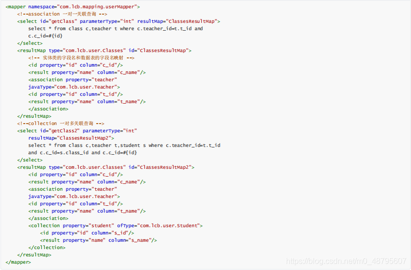

### mybatis


### 1、什么是Mybatis？

1、Mybatis是一个半ORM（对象关系映射）框架，它内部封装了JDBC，开发时只需要关注SQL语句本身，不需要花费精力去处理加载驱动、创建连接、创建statement等繁杂的过程。程序员直接编写原生态sql，可以严格控制sql执行性能，灵活度高。

2、MyBatis可以使用XML或注解来配置和映射原生信息，将POJO映射成数据库中的记录，避免了几乎所有的JDBC代码和手动设置参数以及获取结果集。

3、通过xml文件或注解的方式将要执行的各种statement配置起来，并通过java对象和statement中sql的动态参数进行映射生成最终执行的sql语句，最后由mybatis框架执行sql并将结果映射为java对象并返回。（从执行sql到返回result的过程）。

### 2、Mybaits的优点？

1、基于SQL语句编程，相当灵活，不会对应用程序或者数据库的现有设计造成任何影响，SQL写在XML里，解除sql与程序代码的耦合，便于统一管理；提供XML标签，支持编写动态SQL语句，并可重用。

2、与JDBC相比，减少了50%以上的代码量，消除了JDBC大量冗余的代码，不需要手动开关连接；

3、很好的与各种数据库兼容（因为 MyBatis 使用 JDBC 来连接数据库，所以只要JDBC支持的数据库MyBatis都支持）。

4、能够与Spring很好的集成；

5、提供映射标签，支持对象与数据库的ORM字段关系映射；提供对象关系映射标签，支持对象关系组件维护。

### 3、MyBatis框架的缺点？

1、SQL语句的编写工作量较大，尤其当字段多、关联表多时，对开发人员编写SQL语句的功底有一定要求。

2、SQL语句依赖于数据库，导致数据库移植性差，不能随意更换数据库。

### 4、MyBatis框架适用场合


1、MyBatis专注于SQL本身，是一个足够灵活的DAO层解决方案。

2、对性能的要求很高，或者需求变化较多的项目，如互联网项目，MyBatis将是不错的选择。

### 5、MyBatis与Hibernate有哪些不同？

1、Mybatis和hibernate不同，它不完全是一个ORM框架，因为MyBatis需要程序员自己编写Sql语句。

2、Mybatis直接编写原生态sql，可以严格控制sql执行性能，灵活度高，非常适合对关系数据模型要求不高的软件开发，因为这类软件需求变化频繁，一但需求变化要求迅速输出成果。但是灵活的前提是mybatis无法做到数据库无关性，如果需要实现支持多种数据库的软件，则需要自定义多套sql映射文件，工作量大。

3、Hibernate对象/关系映射能力强，数据库无关性好，对于关系模型要求高的软件，如果用hibernate开发可以节省很多代码，提高效率。

### 6、#{} 和${}的区别是什么？

#{}是预编译处理，${}是字符串替换。

Mybatis在处理#{}时，会将sql中的#{}替换为?号，调用PreparedStatement的set方法来赋值；

Mybatis在处理时 ， 就 是 把 {}时，就是把时，就是把{}替换成变量的值。

使用#{}可以有效的防止SQL注入，提高系统安全性

### 7、当实体类中的属性名和表中的字段名不一样，怎么办？

第1种： 通过在查询的sql语句中定义字段名的别名，让字段名的别名和实体类的属性名一致。

第2种： 通过来映射字段名和实体类属性名的一一对应的关系。

### 8、 模糊查询like语句该怎么写?


第1种：在Java代码中添加sql通配符。

第2种：在sql语句中拼接通配符，会引起sql注入

### 9、通常一个Xml映射文件，都会写一个Dao接口与之对应， 请问，这个Dao接口的工作原理是什么？Dao接口里的方法， 参数不同时，方法能重载吗？

Dao接口，就是人们常说的Mapper接口，接口的全限名，就是映射文件中的namespace的值，接口的方法名，就是映射文件中MappedStatement的id值，接口方法内的参数，就是传递给sql的参数。Mapper接口是没有实现类的，当调用接口方法时，接口全限名+方法名拼接字符串作为key值，可唯一定位一个MappedStatement，举例：

com.mybatis3.mappers.StudentDao.findStudentById，可以唯一找到namespace为 com.mybatis3.mappers.StudentDao下面id = findStudentById的MappedStatement。在Mybatis中，每一个、、、 标签，都会被解析为一个MappedStatement对象。 Dao接口里的方法，是不能重载的，因为是全限名+方法名的保存和寻找策略。

Dao接口的工作原理是JDK动态代理，Mybatis运行时会使用JDK动态代理为Dao接口生成代理proxy对象，代理对象proxy会拦 截接口方法，转而执行MappedStatement所代表的sql，然后将sql执行结果返回。

### 10、Mybatis是如何进行分页的？分页插件的原理是什么？


Mybatis使用RowBounds对象进行分页，它是针对ResultSet结果集执行的内存分页，而非物理分页，可以在sql内直接书写带有物理分页的参数来完成物理分页功能，也可以使用分页插件来完成物理分页。 分页插件的基本原理是使用Mybatis提供的插件接口，实现自定义插件，在插件的拦截方法内拦截待执行的sql，然后重写sql，根据dialect方言，添加对应的物理分页语句和物理分页参数。

### 11、Mybatis是如何将sql执行结果封装为目标对象并返回的？都有哪些映射形式？

答：

第一种是使用标签，逐一定义列名和对象属性名之间的映射关系。第二 种是使用sql列的别名功能，将列别名书写为对象属性名，比如T_NAME AS NAME，对象属性名一般是name，小写，但是列名不区分大小写，Mybatis会忽略列名大小 写，智能找到与之对应对象属性名，你甚至可以写成T_NAME AS NaMe，Mybatis一样可以正常工作。

有了列名与属性名的映射关系后，Mybatis通过反射创建对象，同时使用反射给对象的属性逐一赋值并返回，那些找不到映射关系的属性，是无法完成赋值的。

### 12、 Mybatis如何执行批量操作

答：

使用foreach标签

foreach的主要用在构建in条件中，它可以在SQL语句中进行迭代一个集合。foreach标签的属性主要有item，index，collection，open，separator，close。

1.item   表示集合中每一个元素进行迭代时的别名，随便起的变量名；
2.index   指定一个名字，用于表示在迭代过程中，每次迭代到的位置，不常用；
3.open   表示该语句以什么开始，常用“(”；
4.separator 表示在每次进行迭代之间以什么符号作为分隔符，常用“,”；
5.close   表示以什么结束，常用“)”。

在使用foreach的时候最关键的也是最容易出错的就是collection属性，该属性是必须指定的，但是
在不同情况下，该属性的值是不一样的，主要有一下3种情况：

如果传入的是单参数且参数类型是一个List的时候，collection属性值为list
如果传入的是单参数且参数类型是一个array数组的时候，collection的属性值为array
如果传入的参数是多个的时候，我们就需要把它们封装成一个Map了，当然单参数也可以封装成map，实际上如果你在传入参数的时候，在MyBatis里面也是会把它封装成一个Map的，map的key就是参数名，所以这个时候collection属性值就是传入的List或array对象在自己封装的map里面的key
具体用法如下：


使用ExecutorType.BATCH

1.Mybatis内置的ExecutorType有3种，默认为simple,该模式下它为每个语句的执行创建一个新的预处理语句，单条提交sql；而batch模式重复使用已经预处理的语句，并且批量执行所有更新语句，显然batch性能将更优； 但batch模式也有自己的问题，比如在Insert操作时，在事务没有提交之前，是没有办法获取到自增的id，这在某型情形下是不符合业务要求的

2.具体用法如下：


3.mapper和mapper.xml如下


### 13、如何获取自动生成的(主)键值?

答：

insert方法总是返回一个int值 ，这个值代表的是插入的行数。

如果采用自增长策略，自动生成的键 值在insert方法执行完后可以被设置到传入的参数对象中 。

示例 ：


### 14、在mapper中如何传递多个参数?

答：

1、第一种：

DAO 层的函数

```
public UserselectUser(String name,String area);
```

对应的 xml,#{0}代表接收的是 dao 层中的第一个参数，#{1}代表 dao 层中第二
参数，更多参数一致往后加即可。

<select id="selectUser"resultMap="BaseResultMap"> select * fromuser_user_t whereuser_name = #{0} anduser_area=#{1} </select>
2、第二种： 使用 @param 注解

```
public interface usermapper { user selectuser(@param(“username”) string username,@param(“hashedpassword”) string hashedpassword); }
```


然后,就可以在 xml 像下面这样使用(推荐封装为一个 map,作为单个参数传递给mapper

然后,就可以在 xml 像下面这样使用(推荐封装为一个 map,作为单个参数传递给mapper

<select id=”selectuser” resulttype=”user”> select id, username, hashedpassword from some_table where username = #{username} and hashedpassword = #{hashedpassword} </select>

3、第三种：多个参数封装成 map

```
try {//映射文件的命名空间.SQL 片段的 ID，就可以调用对应的映射文件中的SQL //由于我们的参数超过了两个，而方法中只有一个 Object 参数收集，因此我们使用 Map 集合来装载我们的参数 Map < String, Object > map = new HashMap(); map.put("start", start); map.put("end", end); return sqlSession.selectList("StudentID.pagination", map); } catch (Exception e) { e.printStackTrace(); sqlSession.rollback(); throw e; }finally { MybatisUtil.closeSqlSession(); }
```

### 15、Mybatis动态sql有什么用？执行原理？有哪些动态 sql？

答：

Mybatis动态sq可以在Xml映射文件内，以标签的形式编写动态sql，执行原理是根 据表达式的值完成逻辑判断并动态拼接sql的功能。

Mybatis提供了9种动态sql标签 ：trim | where | set | foreach | if | choose| when | otherwise | bind。

### 16、Xml映射文件中，除了常见的select|insert|updae|delete 标签之外，还有哪些标签？

答：

注：这道题出自京东面试官。 还有很多其他的标签 ， 加上动态sql的9个标签 。

trim|where|set|foreach|if|choose|when|otherwise|bind 等，其中为sql片段标签，通过标签引sql片段，为不支持自增的主键生成策略标签。

### 18、为什么说Mybatis是半自动ORM映射工具？它与全动的区别在哪里？

答：

Hibernate属于全自动ORM映射工具，使用Hibernate查询关联对象或者关联集合对象时，可以根据对象关系模型直接获取，所以它是全自动的。而Mybatis在查询关联对象或关联集合对象时，需要手动编写sql来完成，所以，称之为半自动ORM映射工具。

### 19、 一对一、一对多的关联查询 ？

  

### 20、MyBatis实现一对一有几种方式?具体怎么操作的？

答：

有联合查询和嵌套查询,联合查询是几个表联合查询,只查询一次, 通过在resultMap里面配置association节点配置一对一的类就可以完成；嵌套查询是先查一个表，根据这个表里面的结果的 外键id，去再另外一个表里面查询数据,也是通过association配置，但另外一个表的查询通过select属性配置。

### 21、MyBatis实现一对多有几种方式,怎么操作的？

答：

有联合查询和嵌套查询。联合查询是几个表联合查询,只查询一次,通过在resultMap 里面的collection节点配置一对多的类就可以完成；嵌套查询是先查一个表,根据这个表里面的结果的外键id,去再另外一个表里面查询数据,也是通过配置collection,但另外一个表的查询通过select节点配置。

### 22、Mybatis是否支持延迟加载？如果支持，它的实现原理是什么？

答：

Mybatis仅支持association关联对象和collection关联集合对象的延迟加载，association指的就是一对一，collection指的就是一对多查询。在Mybatis配置文件中，可以配置是否启用延迟加载lazyLoadingEnabled=true|false。

它的原理是，使用CGLIB创建目标对象的代理对象，当调用目标方法时，进入拦截器方法，比如调用a.getB().getName()，拦截器invoke()方法发现a.getB()是null 值，那么就会单独发送事先保存好的查询关联B对象的sql，把B查询上来，然后调用a.setB(b)，于是a的对象b属性就有值了，接着完成a.getB().getName()方法的调用。这就是延迟加载的基本原理。

当然了，不光是Mybatis，几乎所有的包括Hibernate，支持延迟加载的原理都是一样的。

### 23、Mybatis的一级、二级缓存:

答：
1）一级缓存：基于PerpetualCache的HashMap本地缓存，其存储作用域为Session，当Session flush或close之后，该 Session中的所有Cache就将清空，默认打开一级缓存。

2）二级缓存与一级缓存其机制相同，默认也是采用PerpetualCache，HashMap存储，不同在于其存储作用域为Mapper(Namespace)，并且可自定义存储源，如Ehcache。默认不打开二级缓存，要开启二级缓存，使用二级缓存属性类需要实现Serializable序列化接口(可用来保存对象的状态),可在它的映射文件中配置 ；

3）对于缓存数据更新机制，当某一个作用域(一级缓存Session/二级缓存Namespaces)的进行了C/U/D操作后，默认该作用域下所有select中的缓存将被clear。

### 24、什么是MyBatis的接口绑定？有哪些实现方式？

答：
接口绑定，就是在MyBatis中任意定义接口,然后把接口里面的方法和SQL语句绑定, 我们直接调用接口方法就可以,这样比起原来了SqlSession提供的方法我们可以有更加灵活的选择和设置。

接口绑定有两种实现方式,一种是通过注解绑定，就是在接口的方法上面加上@Select、@Update等注解，里面包含Sql语句来绑定；另外一种就是通过xml里面写SQL来绑定,在这种情况下,要指定xml 映射文件里面的namespace必须为接口的全路径名。当Sql语句比较简单时候,用注解绑定, 当SQL语句比较复杂时候,用xml绑定,一般用xml绑定的比较多。

### 25、使用MyBatis的mapper接口调用时有哪些要求？

答：

1、Mapper接口方法名和mapper.xml中定义的每个sql的id相同；

2、Mapper接口方法的输入参数类型和mapper.xml中定义的每个sql的parameterType的类型相同；

3、Mapper接口方法的输出参数类型和mapper.xml中定义的每个sql的resultType的类型相同；

4、Mapper.xml文件中的namespace即是mapper接口的类路径。

### 26、Mapper编写有哪几种方式？

答： .

第一种：接口实现类继承SqlSessionDaoSupport：使用此种方法需要编写mapper接口，mapper接口实现类、mapper.xml文件。

1、在sqlMapConfig xml中配置mapper xml的位置

```
<mappers>
<mapper resource="mapper.xml 文件的地址" />
<mapper resource="mapper.xml 文件的地址" />
</mappers>
```

2、定义mapper接口

3、实现类集成SqlSessionDaoSupport mapper方法中可以this getSqlSession()进行数据增删改查。

4、spring配置

```
<bean id=" " class="mapper 接口的实现">
<property name="sqlSessionFactory"
ref="sqlSessionFactory"></property>
</bean>
```

第二种：使用org.mybatis.spring.mapper.MapperFactoryBean：

1、在 sqlMapConfig.xml中配置mapper.xml的位置，如果mapper.xml 和mappre接口的名称相同且在同一个目录，这里可以不用配置

```
<mappers>
<mapper resource="mapper.xml 文件的地址" />
<mapper resource="mapper.xml 文件的地址" />
</mappers>
```


2、定义mapper接口：

2、定义mapper接口：

1、mapper.xml中的namespace为mapper接口的地址

2、mapper接口中的方法名和mapper.xml中的定义的statement的id保持一致

3、Spring中定义

```
<bean id="" class="org.mybatis.spring.mapper.MapperFactoryBean">
<property name="mapperInterface" value="mapper 接口地址" />
<property name="sqlSessionFactory" ref="sqlSessionFactory" />
</bean>
```


第三种：使用mapper扫描器：

1、mapper.xml文件编写：

mapper.xml中的namespace为mapper接口的地址；

mapper接口中的方法名和mapper.xml中的定义的statement的id保持一致；

如果将mapper.xml和mapper接口的名称保持一致则不用在sqlMapConfig.xml中进行配置。

2、定义mapper接口：

注意mapper.xml的文件名和mapper的接口名称保持一致，且放在同一个目录

3、配置mapper扫描器：

```
<bean class="org.mybatis.spring.mapper.MapperScannerConfigurer">
<property name="basePackage" value="mapper 接口包地址"></property>
<property name="sqlSessionFactoryBeanName" value="sqlSessionFactory"/>
</bean>
```


4、使用扫描器后从spring 容器中获取mapper的实现对象。

4、使用扫描器后从spring 容器中获取mapper的实现对象。

### 27、简述Mybatis的插件运行原理，以及如何编写一个插件？

答：
Mybatis仅可以编写针对 ParameterHandler、ResultSetHandler、StatementHandler、Executor这4种接口的插件，Mybatis使用JDK的动态代理，为需要拦截的接口生成代理对象以实现接口方法拦截功能，每当执行这4种接口对象的方法时，就会进入拦截方法，具体就是InvocationHandler的invoke()方法，当然，只会拦截那些你指定需要拦截的方法。

编写插件：实现Mybatis的Interceptor接口并复写intercept()方法，然后在给插件编写注解，指定要拦截哪一个接口的哪些方法即可，记住，别忘了在配置文件中配置你编写的插件。

### 28、什么是sql注入？

一、什么是SQL注入？
SQL注入是比较常见的网络攻击方式之一，它不是利用操作系统的BUG来实现攻击，而是针对程序员编程时的疏忽，通过SQL语句，实现无帐号登录，甚至篡改数据库。

二、SQL注入总体思路
1、寻找到SQL注入的位置
2、判断服务器类型和后台数据库类型
3、针对不通的服务器和数据库特点进行SQL注入攻击

 三、怎么防止sql注入？
1、不要图一时方便使用SQL语句直接拼接。
2、如果用SQL语句，那就使用参数化，添加Param。
3、尽可能的使用存储过程，安全性能高而且处理速度也快。
4、屏蔽SQL注入。 

### 29、JDBC编程有哪些不足之处，MyBatis是如何解决的？

      1、JDBC：数据库链接创建、释放频繁造成系统资源浪费从而影响系统性能，如果使用数据库链接池可解决此问题。
    
        MyBatis：在SqlMapConfig.xml中配置数据链接池，使用连接池管理数据库链接。
    
        2、JDBC：Sql语句写在代码中造成代码不易维护，实际应用sql变化的可能较大，sql变动需要改变java代码。
    
        MyBatis：将Sql语句配置在XXXXmapper.xml文件中与java代码分离。
        3、JDBC：向sql语句传参数麻烦，因为sql语句的where条件不一定，可能多也可能少，占位符需要和参数一一对应。
    
        MyBatis： Mybatis自动将java对象映射至sql语句。
        4，JDBC：对结果集解析麻烦，sql变化导致解析代码变化，且解析前需要遍历，如果能将数据库记录封装成pojo对象解析比较方便。
    
        MyBatis：Mybatis自动将sql执行结果映射至java对象。
### 30、MyBatis编程步骤是什么样的？

答：

1、 创建SqlSessionFactory

2、 通过SqlSessionFactory创建SqlSession

3、 通过sqlsession执行数据库操作

4、 调用session.commit()提交事务

5、 调用session.close()关闭会话

### 31、请说说MyBatis的工作原理？

答：

在学习MyBatis程序之前，需要了解一下MyBatis工作原理，以便于理解程序。MyBatis的工作原理如下图：


读取MyBatis配置文件：mybatis-config.xml为MyBatis的全局配置文件，配置了MyBatis的运行环境等信息，例如数据库连接信息。

加载映射文件。映射文件即SQL映射文件，该文件中配置了操作数据库的SQL语句，需要在MyBatis配置文件mybatis-config.xml中加载。mybatis-config.xml文件可以加载多个映射文件，每个文件对应数据库中的一张表。

构造会话工厂：通过MyBatis的环境等配置信息构建会话工厂SqlSessionFactory。

创建会话对象：由会话工厂创建SqlSession对象，该对象中包含了执行SQL语句的所有方法。

Executor执行器：MyBatis底层定义了一个Executor 接口来操作数据库，它将根据SqlSession传递的参数动态地生成需要执行的SQL语句，同时负责查询缓存的维护。

MappedStatement 对象：在Executor接口的执行方法中有一个MappedStatement类型的参数，该参数是对映射信息的封装，用于存储要映射的SQL语句的id、参数等信息。

输入参数映射：输入参数类型可以是Map、List等集合类型，也可以是基本数据类型和POJO类型。输入参数映射过程类似于 JDBC对preparedStatement对象设置参数的过程。

输出结果映射：输出结果类型可以是Map、List等集合类型，也可以是基本数据类型和POJO类型。输出结果映射过程类似于 JDBC对结果集的解析过程。

### 32、MyBatis的功能架构是怎样的？

答：

我们把Mybatis的功能架构分为三层：

API接口层：提供给外部使用的接口API，开发人员通过这些本地API来操纵数据库。接口层一接收到调用请求就会调用数据处理层来完成具体的数据处理。

数据处理层：负责具体的SQL查找、SQL解析、SQL执行和执行结果映射处理等。它主要的目的是根据调用的请求完成一次数据库操作。

基础支撑层：负责最基础的功能支撑，包括连接管理、事务管理、配置加载和缓存处理，这些都是共用的东西，将他们抽取出来作为最基础的组件。为上层的数据处理层提供最基础的支撑。

### 33、MyBatis的框架架构设计是怎么样的？

答：

这张图从上往下看。MyBatis的初始化，会从mybatis-config.xml配置文件，解析构造成Configuration这个类，就是图中的红框。

加载配置：配置来源于两个地方，一处是配置文件，一处是Java代码的注解，将SQL的配置信息加载成为一个个MappedStatement对象（包括了传入参数映射配置、执行的SQL语句、结果映射配置），存储在内存中。

SQL解析：当API接口层接收到调用请求时，会接收到传入SQL的ID和传入对象（可以是Map、JavaBean或者基本数据类型），Mybatis会根据SQL的ID找到对应的MappedStatement，然后根据传入参数对象对MappedStatement进行解析，解析后可以得到最终要执行的SQL语句和参数。

SQL执行：将最终得到的SQL和参数拿到数据库进行执行，得到操作数据库的结果。

结果映射：将操作数据库的结果按照映射的配置进行转换，可以转换成HashMap、JavaBean或者基本数据类型，并将最终结果返回。

### 34、什么是DBMS？

答：

DBMS：数据库管理系统(database management system)是一种操纵和管理数据库的大型软件，用于建立、使用和维护数zd据库，简称dbms。它对数据库进行统一的管理和控制，以保证数据库的安全性和完整性。

用户通过dbms访问数据库中的数据，数据库管理员也通过dbms进行数据库的维护工作。它可使多个应用程序和用户用不同的方法在同时版或不同时刻去建立，修改和询问数据库。

DBMS提供数据定义语言DDL（Data Definition Language）与数据操作语言DML（DataManipulation Language），供用户定义数据库的模式结构与权限约束，实现对数据的追加权、删除等操作。

### 35、为什么需要预编译？

答：

定义：

SQL预编译指的是数据库驱动在发送SQL语句和参数给DBMS之前对SQL语句进行编译，这样DBMS执行SQL时，就不需要重新编译。

为什么需要预编译

JDBC中使用对象 PreparedStatement 来抽象预编译语句，使用预编译。预编译阶段可以优化SQL的执行。预编译之后的SQL多数情况下可以直接执行，DBMS不需要再次编译，越复杂的SQL，编译的复杂度将越大，预编译阶段可以合并多次操作为一个操作。同时预编译语句对象可以重复利用。

把一个SQL预编译后产生的 PreparedStatement 对象缓存下来，下次对于同一个SQL，可以直接使用这个缓存的PreparedState对象。Mybatis默认情况下，将对所有的SQL进行预编译。还有一个重要的原因，复制SQL注入

### 36、Mybatis都有哪些Executor执行器？它们之间的区别是什么？

答：

Mybatis有三种基本的Executor执行器，SimpleExecutor、ReuseExecutor、BatchExecutor。

SimpleExecutor：每执行一次update或select，就开启一个Statement对象，用完立刻关闭Statement对象。

ReuseExecutor：执行update或select，以sql作为key查找Statement对象，存在就使用，不存在就创建，用完后，不关闭Statement对象，而是放置于Map<String, Statement>内，供下一次使用。简言之，就是重复使用Statement对象。

BatchExecutor：执行update（没有select，JDBC批处理不支持select），将所有sql都添加到批处理中（addBatch()），等待统一执行（executeBatch()），它缓存了多个Statement对象，每个Statement对象都是addBatch()完毕后，等待逐一执行executeBatch()批处理。与JDBC批处理相同。

作用范围：Executor的这些特点，都严格限制在SqlSession生命周期范围内。

### 37、Mybatis中如何指定使用哪一种Executor执行器？

答：

1.在Mybatis配置文件中，在设置（settings）可以指定默认的ExecutorType执行器类型，也可以手动DefaultSqlSessionFactory的创建SqlSession的方法传递ExecutorType类型参数，如SqlSession openSession(ExecutorType execType)。

2.配置默认的执行器。SIMPLE就是普通的执行器；REUSE执行器会重用预处理语句（preparedstatements）； BATCH 执行器将重用语句并执行批量更新。

### 38、Mybatis是否支持延迟加载？如果支持，它的实现原理是什么？

答：

1.Mybatis仅支持association关联对象和collection关联集合对象的延迟加载，association指的就是一对一，collection指的就是一对多查询。在Mybatis配置文件中，可以配置是否启用延迟加载lazyLoadingEnabled=true|false。

2.它的原理是，使用CGLIB创建目标对象的代理对象，当调用目标方法时，进入拦截器方法，比如调用a.getB().getName()，拦截器invoke()方法发现a.getB()是null值，那么就会单独发送事先保存好的查询关联B对象的sql，把B查询上来，然后调用a.setB(b)，于是a的对象b属性就有值了，接着完成a.getB().getName()方法的调用。这就是延迟加载的基本原理。

3.当然了，不光是Mybatis，几乎所有的包括Hibernate，支持延迟加载的原理都是一样的

