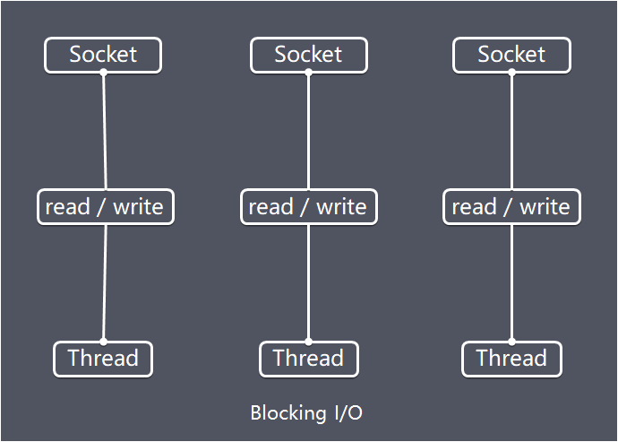
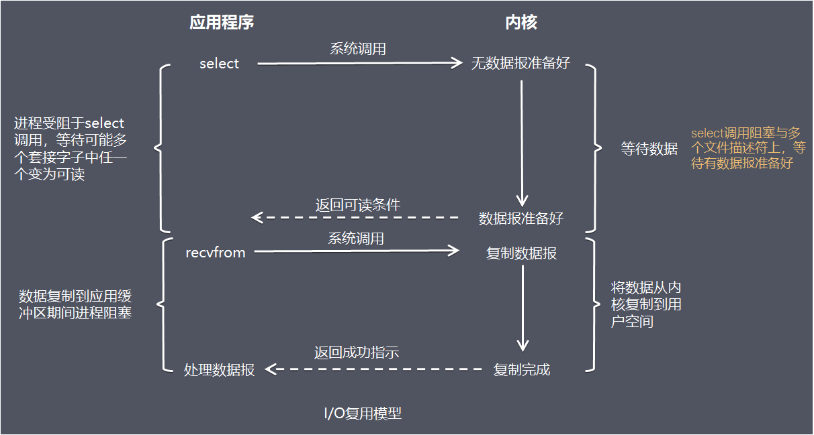
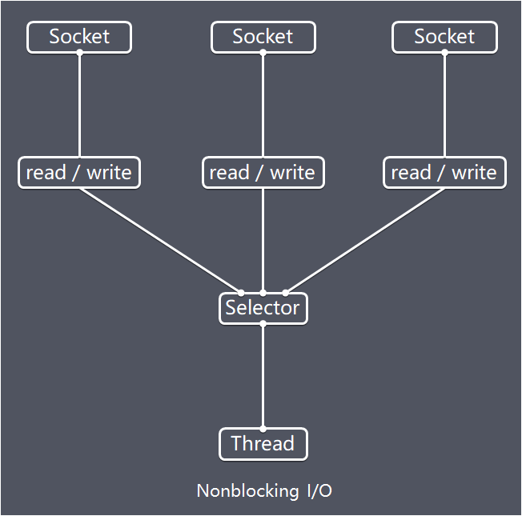
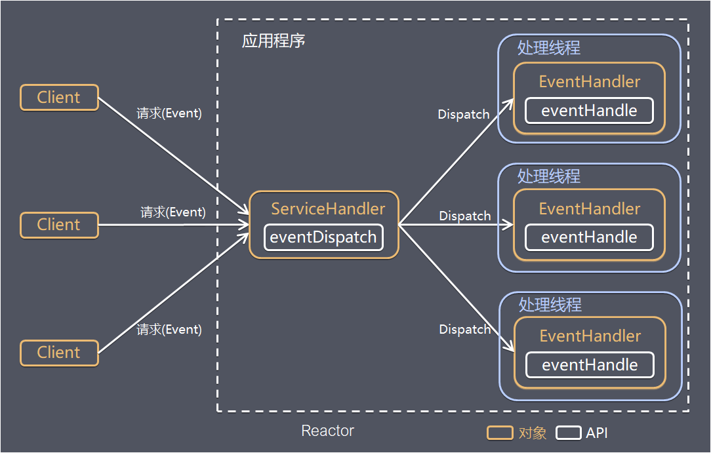
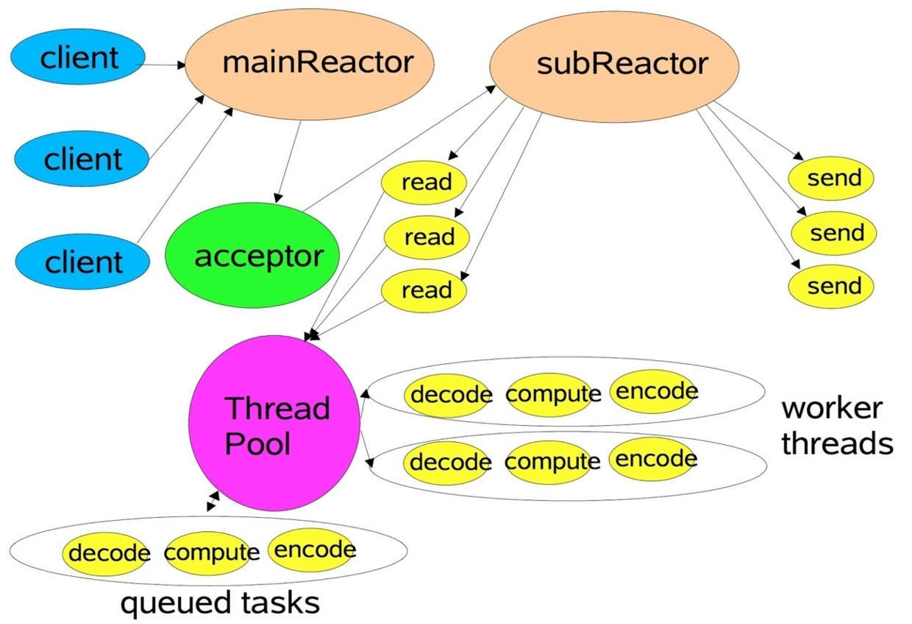
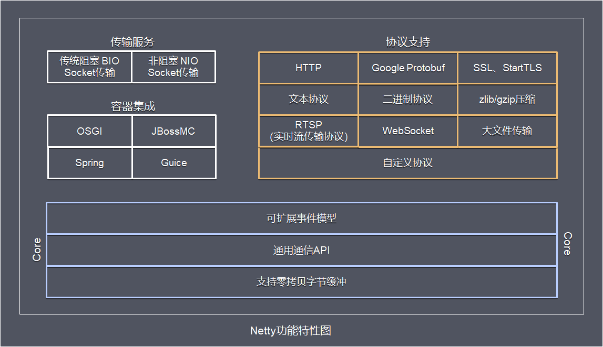
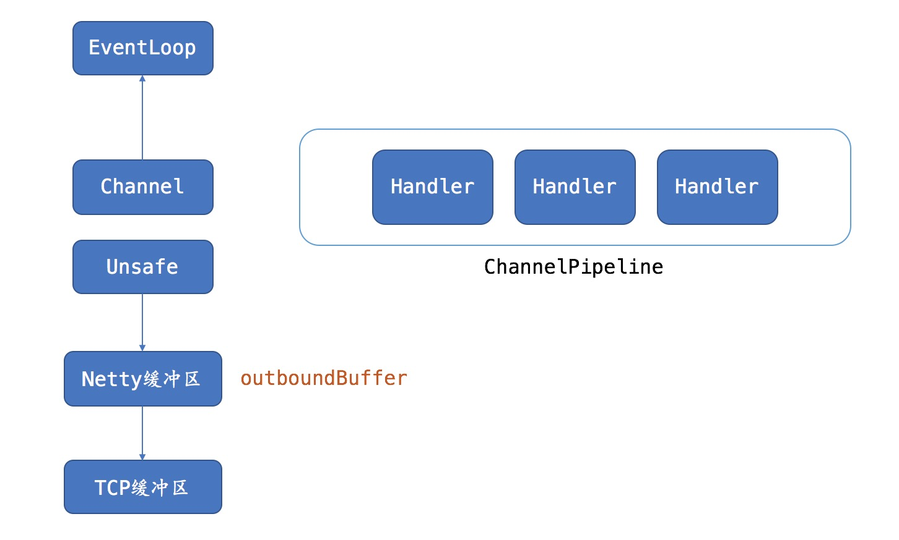
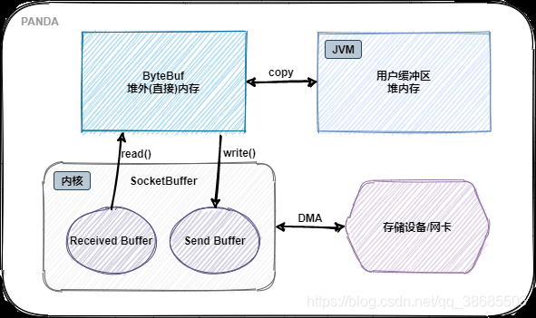

###  Netty/tomcat


### Netty 是什么？

Netty是 一个异步事件驱动的网络应用程序框架，用于快速开发可维护的高性能协议服务器和客户端。

Netty是基于nio的，它封装了jdk的nio，让我们使用起来更加方法灵活。

### 聊聊：JDK原生NIO程序的问题？

JDK原生也有一套网络应用程序API，但是存在一系列问题，主要如下：

NIO的类库和API繁杂，使用麻烦，你需要熟练掌握Selector、ServerSocketChannel、SocketChannel、ByteBuffer等

需要具备其它的额外技能做铺垫，例如熟悉Java多线程编程，因为NIO编程涉及到Reactor模式，你必须对多线程和网路编程非常熟悉，才能编写出高质量的NIO程序

可靠性能力补齐，开发工作量和难度都非常大。

例如客户端面临断连重连、网络闪断、半包读写、失败缓存、网络拥塞和异常码流的处理等等，NIO编程的特点是功能开发相对容易，但是可靠性能力补齐工作量和难度都非常大

JDK NIO的BUG，例如臭名昭著的select bug，它会导致Selector空轮询，最终导致CPU 100%。

官方声称在JDK1.6版本的update18修复了该问题，但是直到JDK1.7版本该问题仍旧存在，只不过该bug发生概率降低了一些而已，它并没有被根本解决

### Netty 的优势有哪些？

使用简单：封装了 NIO 的很多细节，使用更简单。
功能强大：预置了多种编解码功能，支持多种主流协议。
定制能力强：可以通过 ChannelHandler 对通信框架进行灵活地扩展。
性能高：通过与其他业界主流的 NIO 框架对比，Netty 的综合性能最优。
稳定：Netty 修复了已经发现的所有 NIO 的 bug，让开发人员可以专注于业务本身。
社区活跃：Netty 是活跃的开源项目，版本迭代周期短，bug 修复速度快。

### Netty 的应用场景有哪些？

典型的应用有：

阿里分布式服务框架 Dubbo，默认使用 Netty 作为基础通信组件，

还有 RocketMQ 也是使用 Netty 作为通讯的基础。

Netty常见的使用场景如下：

互联网行业 在分布式系统中，各个节点之间需要远程服务调用，高性能的RPC框架必不可少，Netty作为异步高新能的通信框架,往往作为基础通信组件被这些RPC框架使用。 典型的应用有：阿里分布式服务框架Dubbo的RPC框架使用Dubbo协议进行节点间通信，Dubbo协议默认使用Netty作为基础通信组件，用于实现各进程节点之间的内部通信。
游戏行业 无论是手游服务端还是大型的网络游戏，Java语言得到了越来越广泛的应用。Netty作为高性能的基础通信组件，它本身提供了TCP/UDP和HTTP协议栈。 非常方便定制和开发私有协议栈，账号登录服务器，地图服务器之间可以方便的通过Netty进行高性能的通信
大数据领域 经典的Hadoop的高性能通信和序列化组件Avro的RPC框架，默认采用Netty进行跨界点通信，它的Netty Service基于Netty框架二次封装实现

### Netty的特点

Netty的对JDK自带的NIO的API进行封装，解决上述问题，主要特点有：

设计优雅 适用于各种传输类型的统一API - 阻塞和非阻塞Socket 基于灵活且可扩展的事件模型，可以清晰地分离关注点 高度可定制的线程模型 - 单线程，一个或多个线程池 真正的无连接数据报套接字支持（自3.1起）

高性能 、高吞吐、低延迟、低消耗

最小化不必要的内存复制

安全 完整的SSL / TLS和StartTLS支持

高并发：Netty 是一款基于 NIO（Nonblocking IO，非阻塞IO）开发的网络通信框架，对比于 BIO（Blocking I/O，阻塞IO），他的并发性能得到了很大提高。

传输快：Netty 的传输依赖于零拷贝特性，尽量减少不必要的内存拷贝，实现了更高效率的传输。

封装好：Netty 封装了 NIO 操作的很多细节，提供了易于使用调用接口。

社区活跃，不断更新 社区活跃，版本迭代周期短，发现的BUG可以被及时修复，同时，更多的新功能会被加入

使用方便 详细记录的Javadoc，用户指南和示例 没有其他依赖项，JDK 5（Netty 3.x）或6（Netty 4.x）就足够了

### Netty 高性能表现在哪些方面？

IO 线程模型：通过多线程Reactor反应器模式，在应用层实现异步非阻塞（异步事件驱动）架构，用最少的资源做更多的事。
内存零拷贝：尽量减少不必要的内存拷贝，实现了更高效率的传输。
内存池设计：申请的内存可以重用，主要指直接内存。内部实现是用一颗二叉查找树管理内存分配情况。 （具体请参考尼恩稍后的手写内存池）
对象池设计：Java对象可以重用，主要指Minior GC非常频繁的对象，如ByteBuffer。并且，对象池使用无锁架构，性能非常高。 （具体请参考尼恩稍后的手写对象池）
mpsc无锁编程：串形化处理读写, 避免使用锁带来的性能开销。
高性能序列化协议：支持 protobuf 等高性能序列化协议。

### 聊聊：NIO的组成？

Buffer：与Channel进行交互，数据是从Channel读入缓冲区，从缓冲区写入Channel中的

flip方法 ： 反转此缓冲区，将position给limit，然后将position置为0，其实就是切换读写模式

clear方法 ：清除此缓冲区，将position置为0，把capacity的值给limit。

rewind方法 ： 重绕此缓冲区，将position置为0

DirectByteBuffer可减少一次系统空间到用户空间的拷贝。但Buffer创建和销毁的成本更高，不可控，通常会用内存池来提高性能。直接缓冲区主要分配给那些易受基础系统的本机I/O 操作影响的大型、持久的缓冲区。如果数据量比较小的中小应用情况下，可以考虑使用heapBuffer，由JVM进行管理。

Channel：表示 IO 源与目标打开的连接，是双向的，但不能直接访问数据，只能与Buffer 进行交互。通过源码可知，FileChannel的read方法和write方法都导致数据复制了两次！

Selector可使一个单独的线程管理多个Channel，open方法可创建Selector，register方法向多路复用器器注册通道，可以监听的事件类型：读、写、连接、accept。注册事件后会产生一个SelectionKey：它表示SelectableChannel 和Selector 之间的注册关系，wakeup方法：使尚未返回的第一个选择操作立即返回，唤醒的

原因是：注册了新的channel或者事件；channel关闭，取消注册；优先级更高的事件触发（如定时器事件），希望及时处理。

Selector在Linux的实现类是EPollSelectorImpl，委托给EPollArrayWrapper实现，其中三个native方法是对epoll的封装，而EPollSelectorImpl. implRegister方法，通过调用epoll_ctl向epoll实例中注册事件，还将注册的文件描述符(fd)与SelectionKey的对应关系添加到fdToKey中，这个map维护了文件描述符与SelectionKey的映射。

fdToKey有时会变得非常大，因为注册到Selector上的Channel非常多（百万连接）；过期或失效的Channel没有及时关闭。fdToKey总是串行读取的，而读取是在select方法中进行的，该方法是非线程安全的。

Pipe：两个线程之间的单向数据连接，数据会被写到sink通道，从source通道读取

NIO的服务端建立过程：Selector.open()：打开一个Selector；ServerSocketChannel.open()：创建服务端的Channel；bind()：绑定到某个端口上。并配置非阻塞模式；register()：注册Channel和关注的事件到Selector上；select()轮询拿到已经就绪的事件

### 聊聊：BIO、NIO和AIO的区别？

BIO：一个连接一个线程，客户端有连接请求时服务器端就需要启动一个线程进行处理。线程开销大。
伪异步IO：将请求连接放入线程池，一对多，但线程还是很宝贵的资源。

NIO：一个请求一个线程，但客户端发送的连接请求都会注册到多路复用器上，多路复用器轮询到连接有I/O请求时才启动一个线程进行处理。

AIO：一个有效请求一个线程，客户端的I/O请求都是由OS先完成了再通知服务器应用去启动线程进行处理，

BIO是面向流的，NIO是面向缓冲区的；

BIO的各种流是阻塞的。而NIO是非阻塞的；

BIO的Stream是单向的，而NIO的channel是双向的。

NIO的特点：事件驱动模型、单线程处理多任务、非阻塞I/O，I/O读写不再阻塞，而是返回0、基于block的传输比基于流的传输更高效、更高级的IO函数zero-copy、IO多路复用大大提高了Java网络应用的可伸缩性和实用性。基于Reactor线程模型。

在Reactor模式中，事件分发器等待某个事件或者可应用或个操作的状态发生，事件分发器就把这个事件传给事先注册的事件处理函数或者回调函数，由后者来做实际的读写操作。如在Reactor中实现读：注册读就绪事件和相应的事件处理器、事件分发器等待事件、事件到来，激活分发器，分发器调用事件对应的处理器、事件处理器完成实际的读操作，处理读到的数据，注册新的事件，然后返还控制权。

### Netty 和 Tomcat 的区别？

作用不同：Tomcat 是 Servlet 容器，可以视为 Web 服务器，而 Netty 是异步事件驱动的网络应用程序框架和工具用于简化网络编程，例如TCP和UDP套接字服务器。
协议不同：Tomcat 是基于 http 协议的 Web 服务器，而 Netty 能通过编程自定义各种协议，因为 Netty 本身自己能编码/解码字节流，所有 Netty 可以实现，HTTP 服务器、FTP 服务器、UDP 服务器、RPC 服务器、WebSocket 服务器、Redis 的 Proxy 服务器、MySQL 的 Proxy 服务器等等。
聊聊：Netty是怎么实现高性能设计的？
Netty作为高性能IO组件的扛鼎制作，

高性能设计的核心： 巧妙的 结合 高性能IO模型 和 线程模型 ，相得益彰，达到了 高性能 、高吞吐、低延迟、低消耗的目标

其I/O模型 高性能epoll/select 模型

其 线程模型为 多线程 reactor 反应器模型

I/O模型 决定如何收发数据，

线程模型 决定如何处理数据

相得益彰，在应用层达到了异步IO的效果。

### 聊聊：I/O模型

用什么样的通道将数据发送给对方，BIO、NIO或者AIO，I/O模型在很大程度上决定了框架的性能

答案请参考《Java高并发核心编程 卷1 》

书中，对io模型介绍得非常系统，并且不断完善

### 阻塞I/O

传统阻塞型I/O(BIO)可以用下图表示：

  

特点

每个请求都需要独立的线程完成数据read，业务处理，数据write的完整操作
问题

当并发数较大时，需要创建大量线程来处理连接，系统资源占用较大
连接建立后，如果当前线程暂时没有数据可读，则线程就阻塞在read操作上，造成线程资源浪费

### I/O复用模型

  


在I/O复用模型中，会用到select，这个函数也会使进程阻塞，但是和阻塞I/O所不同的的，这两个函数可以同时阻塞多个I/O操作，而且可以同时对多个读操作，多个写操作的I/O函数进行检测，直到有数据可读或可写时，才真正调用I/O操作函数

Netty的非阻塞I/O的实现关键是基于I/O复用模型，这里用Selector对象表示：

  

Netty的IO线程NioEventLoop由于聚合了多路复用器Selector，可以同时并发处理成百上千个客户端连接。当线程从某客户端Socket通道进行读写数据时，若没有数据可用时，该线程可以进行其他任务。线程通常将非阻塞 IO 的空闲时间用于在其他通道上执行 IO 操作，所以单独的线程可以管理多个输入和输出通道。

由于读写操作都是非阻塞的，这就可以充分提升IO线程的运行效率，避免由于频繁I/O阻塞导致的线程挂起，一个I/O线程可以并发处理N个客户端连接和读写操作，这从根本上解决了传统同步阻塞I/O一连接一线程模型，架构的性能、弹性伸缩能力和可靠性都得到了极大的提升。

基于buffer
传统的I/O是面向字节流或字符流的，以流式的方式顺序地从一个Stream 中读取一个或多个字节, 因此也就不能随意改变读取指针的位置。

在NIO中, 抛弃了传统的 I/O流, 而是引入了Channel和Buffer的概念. 在NIO中, 只能从Channel中读取数据到Buffer中或将数据 Buffer 中写入到 Channel。

基于buffer操作不像传统IO的顺序操作, NIO 中可以随意地读取任意位置的数据

### 聊聊：AIO 是什么？

 答案请参考[《Java高并发核心编程 卷1 》](https://www.cnblogs.com/crazymakercircle/p/14493539.html) 


### 聊聊：NIO和BIO到底有什么区别？有什么关系？

NIO是以块的方式处理数据，BIO是以字节流或者字符流的形式去处理数据。
NIO是通过缓存区和通道的方式处理数据，BIO是通过InputStream和OutputStream流的方式处理数据。
NIO的通道是双向的，BIO流的方向只能是单向的。
NIO采用的多路复用的同步非阻塞IO模型，BIO采用的是普通的同步阻塞IO模型。
NIO的效率比BIO要高，NIO适用于网络IO，BIO适用于文件IO。

### 聊聊：NIO是如何实现同步非阻塞的？

一个线程 Thread 使用一个选择器Selector监听多个通道 Channel 上的IO事件，从而让一个线程就可以处理多个IO事件。通过配置监听的通道Channel为非阻塞，那么当Channel上的IO事件还未到达时，线程会在select方法被挂起，让出CPU资源。直到监听到Channel有IO事件发生时，才会进行相应的响应和处理。

Selector能够检测多个注册的通道上是否有IO事件发生(注意:多个 Channel 以事件的方式可以注册到同一个Selector)，如果有事件发生，便获取事件然后针对每个事件进行相应的处理。这样就可以只用一个单线程去管理多个通道，也就是管理多个连接和请求。

Selector只有在通道上有真正的IO事件发生时，才会进行相应的处理，这就不必为每个连接都创建一个线程，避免线程资源的浪费和多线程之间的上下文切换导致的开销。

### 聊聊：BIO和NIO应用场景

1、BIO 方式适用于连接数目比较小且固定的架构，这种方式对服务器资源要求比较高，并发局限于应用中，JDK1.4以前的唯一选择。

2、NIO 方式适用于连接数目多且连接比较短（轻操作）的架构，比如聊天服务器，弹幕系统，服务器间通讯等。JDK1.4 开始支持。

### 聊聊：阻塞/非阻塞区别

 答案请参考[《Java高并发核心编程 卷1 》](https://www.cnblogs.com/crazymakercircle/p/14493539.html) 

### 聊聊：select、poll和epoll的区别

消息传递方式：
select：内核需要将消息传递到用户空间，需要内核的拷贝动作；

poll：同上；

epoll：通过内核和用户空间共享一块内存来实现，性能较高；

文件句柄剧增后带来的IO效率问题：
select：因为每次调用都会对连接进行线性遍历，所以随着FD剧增后会造成遍历速度的“线性下降”的性能问题；

poll：同上；

epoll：由于epoll是根据每个FD上的callable函数来实现的，只有活跃的socket才会主动调用callback，所以在活跃socket较少的情况下，使用epoll不会对性能产生线性下降的问题，如果所有socket都很活跃的情况下，可能会有性能问题；

支持一个进程所能打开的最大连接数：
select：单个进程所能打开的最大连接数，是由FD_SETSIZE宏定义的，其大小是32个整数大小（在32位的机器上，大小是3232,64位机器上FD_SETSIZE=3264），我们可以对其进行修改，然后重新编译内核，但是性能无法保证，需要做进一步测试；

poll：本质上与select没什么区别，但是他没有最大连接数限制，他是基于链表来存储的；

epoll：虽然连接数有上线，但是很大，1G内存的机器上可以打开10W左右的连接；

### 聊聊: 主要的IO线程模型有哪些?

数据报如何读取？读取之后的编解码在哪个线程进行，编解码后的消息如何派发，线程模型的不同，对性能的影响也非常大。

#### Connection Per Thread（一个线程处理一个连接）线程模式

在Java的OIO编程中，最原始的网络服务器程序，一般是用一个while循环，不断地监听端口是否有新的连接。

如果有，那么就调用一个处理函数来完成传输处理，示例代码如下：

`while(true){`

  `socket = accept(); //阻塞，接收连接`

  `handle(socket) ;  //读取数据、业务处理、写入结果`

`}` 

这种方法的最大问题是：如果前一个网络连接的handle（socket）没有处理完，那么后面的新连接没法被服务端接收，于是后面的请求就会被阻塞住，这样就导致服务器的吞吐量太低。

这对于服务器来说，这是一个严重的问题。

为了解决这个严重的连接阻塞问题，出现了一个极为经典模式：Connection Per Thread（一个线程处理一个连接）模式。示例代码如下：


       package com.crazymakercircle.iodemo.OIO;
    //...省略import导入的Java类
    class ConnectionPerThread implements Runnable {
        public void run() {
            try {
                //服务器监听socket
                ServerSocketserverSocket =
                        new ServerSocket(NioDemoConfig.SOCKET_SERVER_PORT);
                while (!Thread.interrupted()) {
                    Socket socket = serverSocket.accept();
                    //接收一个连接后，为socket连接，新建一个专属的处理器对象
                    Handler handler = new Handler(socket);
                    //创建新线程，专门负责一个连接的处理
                    new Thread(handler).start();
                }
                } catch (IOException ex) { /* 处理异常 */ }
    }
    //处理器，这里将内容回显到客户端
    static class Handler implements Runnable {
        final Socket socket;
        Handler(Socket s) {
            socket = s;
        }
        public void run() {
            while (true) {
                try {
                    byte[] input = new byte[1024];
                    /* 读取数据 */
                    socket.getInputStream().read(input);
                    /* 处理业务逻辑，获取处理结果*/
                    byte[] output =null;
                    /* 写入结果 */
                    socket.getOutputStream().write(output);
                } catch (IOException ex) { /*处理异常*/ }
            }
        }
    }
    }

以上示例代码中，对于每一个新的网络连接都分配给一个线程。每个线程都独自处理自己负责的socket连接的输入和输出。当然，服务器的监听线程也是独立的，任何的socket连接的输入和输出处理，不会阻塞到后面新socket连接的监听和建立，这样，服务器的吞吐量就得到了提升。早期版本的Tomcat服务器，就是这样实现的。

Connection Per Thread模式（一个线程处理一个连接）的优点是：解决了前面的新连接被严重阻塞的问题，在一定程度上，较大的提高了服务器的吞吐量。

Connection Per Thread模式的缺点是：对应于大量的连接，需要耗费大量的线程资源，对线程资源要求太高。在系统中，线程是比较昂贵的系统资源。如果线程的数量太多，系统无法承受。而且，线程的反复创建、销毁、线程的切换也需要代价。因此，在高并发的应用场景下，多线程OIO的缺陷是致命的。

新的问题来了：如何减少线程数量，比如说让一个线程同时负责处理多个socket连接的输入和输出，行不行呢？

看上去，没有什么不可以。但是，实际上作用不大。为什么呢？传统OIO编程中每一次socket传输的IO读写处理，都是阻塞的。在同一时刻，一个线程里只能处理一个socket的读写操作，前一个socket操作被阻塞了，其他连接的IO操作同样无法被并行处理。所以在OIO中，即使是一个线程同时负责处理多个socket连接的输入和输出，同一时刻，该线程也只能处理一个连接的IO操作。

如何解决Connection Per Thread模式的巨大缺陷呢？一个有效途径是：使用Reactor反应器模式。用反应器模式对线程的数量进行控制，做到一个线程处理大量的连接。

### Reactor线程模型

Reactor是反应堆/反应器的意思，Reactor模型，是指通过一个或多个输入同时传递给服务处理器的服务请求的事件驱动处理模式。 服务端程序处理传入多路请求，并将它们同步分派给请求对应的处理线程，Reactor模式也叫Dispatcher模式，即I/O多了复用统一监听事件，收到事件后分发(Dispatch给某进程)，是编写高性能网络服务器的必备技术之一。

Reactor模型中有2个关键组成：

Reactor Reactor在一个单独的线程中运行，负责监听和分发事件，分发给适当的处理程序来对IO事件做出反应。 它就像公司的电话接线员，它接听来自客户的电话并将线路转移到适当的联系人
Handlers 处理程序执行I/O事件要完成的实际事件，类似于客户想要与之交谈的公司中的实际官员。Reactor通过调度适当的处理程序来响应I/O事件，处理程序执行非阻塞操作

  


取决于Reactor的数量和Hanndler线程数量的不同，Reactor模型有3个变种

单Reactor单线程
单Reactor多线程
主从Reactor多线程
可以这样理解，Reactor就是一个执行while (true) { selector.select(); …}循环的线程，会源源不断的产生新的事件，称作反应堆很贴切。

### Netty线程模型

Netty主要基于主从Reactors多线程模型（如下图）做了一定的修改，其中主从Reactor多线程模型有多个Reactor：MainReactor和SubReactor：

MainReactor负责客户端的连接请求，并将请求转交给SubReactor
SubReactor负责相应通道的IO读写请求
非IO请求（具体逻辑处理）的任务则会直接写入队列，等待worker threads进行处理
这里引用Doug Lee大神的Reactor介绍：Scalable IO in Java里面关于主从Reactor多线程模型的图

  

特别说明的是： 虽然Netty的线程模型基于主从Reactor多线程，借用了MainReactor和SubReactor的结构，但是实际实现上，SubReactor和Worker线程在同一个线程池中：

```
EventLoopGroup bossGroup = new NioEventLoopGroup();
EventLoopGroup workerGroup = new NioEventLoopGroup();
ServerBootstrap server = new ServerBootstrap();
server.group(bossGroup, workerGroup)
 .channel(NioServerSocketChannel.class)
```


上面代码中的bossGroup 和workerGroup是Bootstrap构造方法中传入的两个对象，这两个group均是线程池

bossGroup线程池则只是在bind某个端口后，获得其中一个线程作为MainReactor，专门处理端口的accept事件，每个端口对应一个boss线程
workerGroup线程池会被各个SubReactor和worker线程充分利用

### 异步处理

异步的概念和同步相对。当一个异步过程调用发出后，调用者不能立刻得到结果。实际处理这个调用的部件在完成后，通过状态、通知和回调来通知调用者。

Netty中的I/O操作是异步的，包括bind、write、connect等操作会简单的返回一个ChannelFuture，调用者并不能立刻获得结果，通过Future-Listener机制，用户可以方便的主动获取或者通过通知机制获得IO操作结果。

当future对象刚刚创建时，处于非完成状态，调用者可以通过返回的ChannelFuture来获取操作执行的状态，注册监听函数来执行完成后的操，常见有如下操作：

通过isDone方法来判断当前操作是否完成
通过isSuccess方法来判断已完成的当前操作是否成功
通过getCause方法来获取已完成的当前操作失败的原因
通过isCancelled方法来判断已完成的当前操作是否被取消
通过addListener方法来注册监听器，当操作已完成(isDone方法返回完成)，将会通知指定的监听器；如果future对象已完成，则理解通知指定的监听器
例如下面的的代码中绑定端口是异步操作，当绑定操作处理完，将会调用相应的监听器处理逻辑

    serverBootstrap.bind(port).addListener(future -> {
        if (future.isSuccess()) {
            System.out.println(new Date() + ": 端口[" + port + "]绑定成功!");
        } else {
            System.err.println("端口[" + port + "]绑定失败!");
        }
    });


相比传统阻塞I/O，执行I/O操作后线程会被阻塞住, 直到操作完成；异步处理的好处是不会造成线程阻塞，线程在I/O操作期间可以执行别的程序，在高并发情形下会更稳定和更高的吞吐量。

### Netty架构设计

前面介绍完Netty相关一些理论介绍，下面从功能特性、模块组件、运作过程来介绍Netty的架构设计

功能特性

  

传输服务 支持BIO和NIO
容器集成 支持OSGI、JBossMC、Spring、Guice容器
协议支持 HTTP、Protobuf、二进制、文本、WebSocket等一系列常见协议都支持。 还支持通过实行编码解码逻辑来实现自定义协议
Core核心 可扩展事件模型、通用通信API、支持零拷贝的ByteBuf缓冲对象

### 说一下Netty 的各大组件

**组件一 NioEventLoop**
在它的底层封装了Selector, 实现多路复用, 由唯一绑定的一个线程去进行三大步骤循环操作: 监听事件,处理事件,执行任务

**组件二 NioServerSocketChannel NioSocketChannel**
一个是服务端通道, 一个是客户端通道. 接收客户端连接和处理数据读写都是通过通道进行的.

**组件三 ChannelPipeline**
每个Channel都与唯一的一个Pipeline关联. 当Channel读取到数据以后,后续的具体操作都交给管道Pipeline去进行

**组件四 Handler**
在ChannelPipeline中可以放入用户自定义的Handler,用于具体的业务处理, 这里面也包括解码器和编码器这两种重要的Handler.

当然以上四个是最重要的组件, 比较重要的组件或类还包括以下一些:

**启动类ServerBootstrap**
**负责底层数据的读写类Unsafe**
**具体的线程类FastThreadLocalThread**
**线程池NioEventLoopGroup**
**存放数据的容器ByteBuf**
学习这些组件先不要深入细节, 先有个大概的概念, 每个组件具体做啥, 然后把它们串联起来, 加深对Netty整体架构的理解.
然后再回过来深入到每个组件的细节, 反作用加深理解整个架构.

  

### 什么是 Netty 的零拷贝？

  

 传统数据拷贝方式：
（1）数据从存储设备或网卡缓冲区，拷贝到内核的received buffer
（2）数据从received buffer读到堆外内存，再拷贝到用户缓冲区
（3）数据从用户缓冲区拷贝到堆外内存，再写到内核的send buffer
（4）数据从send buffer再拷贝到网卡buffer
Netty零拷贝方式：
（1）调用java的FileChannel.transferTo()，数据从存储设备或网卡buffer利用DMA引擎拷贝到received buffer
（2）数据从received buffer读到堆外内存
（3）数据从堆外内存写到send buffer
（4）数据从send buffer再利用DMA引擎拷贝到网卡buffer
由于以上操作都不需要CPU参与，所以就达到了“零拷贝”的效果，传统拷贝都是需要CPU参与的，就会占用cpu资源，DMA拷贝是不需要CPU的。
除此之外，对于传统的ByteBuffer，如果需要将两个ByteBuffer中的数据组合到一起，我们就需要创建一个size=size1+size2大小的新的数组，然后将两个数组中的数据拷贝到新的数组中。但是使用Netty提供的组合ByteBuf（CompositeByteBuf），就可以避免这样的操作，因为CompositeByteBuf并没有真正将多个Buffer组合起来，而是保存了它们的引用，从而避免了数据的拷贝，这也是“零拷贝”的另一个体现。

### Netty 发送消息有几种方式？

1. 直接写入 Channel 中，消息从 ChannelPipeline 当中尾部开始移动；
2. 写入和 ChannelHandler 绑定的 ChannelHandlerContext 中，消息从ChannelPipeline 中的下一个 ChannelHandler 中移动


## Netty 的优势有哪些？

- 使用简单：封装了 NIO 的很多细节，使用更简单。
- 功能强大：预置了多种编解码功能，支持多种主流协议。
- 定制能力强：可以通过 ChannelHandler 对通信框架进行灵活地扩展。
- 性能高：通过与其他业界主流的 NIO 框架对比，Netty 的综合性能优。
- 稳定：Netty 修复了已经发现的所有 NIO 的 bug，让开发人员可以专注于业务 本身。
- 社区活跃：Netty 是活跃的开源项目，版本迭代周期短，bug 修复速度快


### 默认情况 Netty 起多少线程？何时启动？

 Netty 默认是 CPU 处理器数的两倍，bind 完之后启动。 

