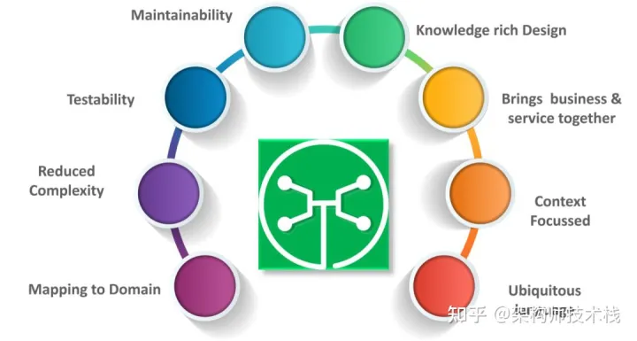

### spring cloud

### [1、为什么人们会犹豫使用微服务？](https://link.zhihu.com/?target=https%3A//gitee.com/souyunku/DevBooks/blob/master/docs/SpringCloud/SpringCloud%E6%9C%80%E6%96%B0%E9%9D%A2%E8%AF%95%E9%A2%98%E5%8F%8A%E7%AD%94%E6%A1%88%E9%99%84%E7%AD%94%E6%A1%88%E6%B1%87%E6%80%BB.md%231%E4%B8%BA%E4%BB%80%E4%B9%88%E4%BA%BA%E4%BB%AC%E4%BC%9A%E7%8A%B9%E8%B1%AB%E4%BD%BF%E7%94%A8%E5%BE%AE%E6%9C%8D%E5%8A%A1)

我见过许多开发者在这个问题上摸索。毕竟，在面试微服务架构师角色时，他们会被问到这个问题，所以承认它的缺点可能有点棘手。以下是一些很好的答案：

它们需要大量协作 - 微服务需要大量的合作。不同的微服务模块，可能分散在不同的团队，团队之间需要始终保持良好的同步。

他们需要建立繁重的架构 - 系统是分布式的，架构涉及很多。 他们需要过多的计划来处理操作开销 - 如果您计划使用微服务架构，则需要为操作开销做好准备。 需要熟练的专业人员，他们可以支持异构分布的微服务。

### [2、Spring Cloud 是什么](https://link.zhihu.com/?target=https%3A//gitee.com/souyunku/DevBooks/blob/master/docs/SpringCloud/SpringCloud%E6%9C%80%E6%96%B0%E9%9D%A2%E8%AF%95%E9%A2%98%E5%8F%8A%E7%AD%94%E6%A1%88%E9%99%84%E7%AD%94%E6%A1%88%E6%B1%87%E6%80%BB.md%232spring-cloud-%E6%98%AF%E4%BB%80%E4%B9%88)

**1、** Spring Cloud是一系列框架的有序集合。它利用SpringBoot的开发便利性巧妙地简化了分布式系统基础设施的开发，如服务发现注册、配置中心、智能路由、消息总线、负载均衡、断路器、数据监控等，都可以用SpringBoot的开发风格做到一键启动和部署。

**2、** Spring Cloud并没有重复制造轮子，它只是将各家公司开发的比较成熟、经得起实际考验的服务框架组合起来，通过SpringBoot风格进行再封装屏蔽掉了复杂的配置和实现原理，最终给开发者留出了一套简单易懂、易部署和易维护的分布式系统开发工具包。

### [3、为什么需要域驱动设计（DDD）？](https://link.zhihu.com/?target=https%3A//gitee.com/souyunku/DevBooks/blob/master/docs/SpringCloud/SpringCloud%E6%9C%80%E6%96%B0%E9%9D%A2%E8%AF%95%E9%A2%98%E5%8F%8A%E7%AD%94%E6%A1%88%E9%99%84%E7%AD%94%E6%A1%88%E6%B1%87%E6%80%BB.md%233%E4%B8%BA%E4%BB%80%E4%B9%88%E9%9C%80%E8%A6%81%E5%9F%9F%E9%A9%B1%E5%8A%A8%E8%AE%BE%E8%AE%A1ddd)

图9：我们需要DDD的因素 – 微服务面试问题

### [4、Spring Cloud和SpringBoot版本对应关系](https://link.zhihu.com/?target=https%3A//gitee.com/souyunku/DevBooks/blob/master/docs/SpringCloud/SpringCloud%E6%9C%80%E6%96%B0%E9%9D%A2%E8%AF%95%E9%A2%98%E5%8F%8A%E7%AD%94%E6%A1%88%E9%99%84%E7%AD%94%E6%A1%88%E6%B1%87%E6%80%BB.md%234spring-cloud%E5%92%8Cspringboot%E7%89%88%E6%9C%AC%E5%AF%B9%E5%BA%94%E5%85%B3%E7%B3%BB)

### [5、Spring Cloud抛弃了Dubbo 的RPC通信，采用的是基于HTTP的REST方式。](https://link.zhihu.com/?target=https%3A//gitee.com/souyunku/DevBooks/blob/master/docs/SpringCloud/SpringCloud%E6%9C%80%E6%96%B0%E9%9D%A2%E8%AF%95%E9%A2%98%E5%8F%8A%E7%AD%94%E6%A1%88%E9%99%84%E7%AD%94%E6%A1%88%E6%B1%87%E6%80%BB.md%235spring-cloud%E6%8A%9B%E5%BC%83%E4%BA%86dubbo-%E7%9A%84rpc%E9%80%9A%E4%BF%A1%E9%87%87%E7%94%A8%E7%9A%84%E6%98%AF%E5%9F%BA%E4%BA%8Ehttp%E7%9A%84rest%E6%96%B9%E5%BC%8F%E3%80%82)

严格来说，这两种方式各有优劣。虽然在一定程度上来说，后者牺牲了服务调用的性能，但也避免了上面提到的原生RPC带来的问题。而且REST相比RPC更为灵活，服务提供方和调用方的依赖只依靠一纸契约，不存在代码级别的强依赖，这在强调快速演化的微服务环境下，显得更为合适。

### [6、什么是SpringBoot？](https://link.zhihu.com/?target=https%3A//gitee.com/souyunku/DevBooks/blob/master/docs/SpringCloud/SpringCloud%E6%9C%80%E6%96%B0%E9%9D%A2%E8%AF%95%E9%A2%98%E5%8F%8A%E7%AD%94%E6%A1%88%E9%99%84%E7%AD%94%E6%A1%88%E6%B1%87%E6%80%BB.md%236%E4%BB%80%E4%B9%88%E6%98%AFspringboot)

Spring boot是微服务面试问题的主要话题。 随着新功能的加入，Spring变得越来越复杂。无论何时启动新项目，都必须添加新的构建路径或Maven依赖项。简而言之，你需要从头开始做每件事。SpringBoot是一种帮助您避免所有代码配置的解决方案。

### [7、微服务有什么特点？](https://link.zhihu.com/?target=https%3A//gitee.com/souyunku/DevBooks/blob/master/docs/SpringCloud/SpringCloud%E6%9C%80%E6%96%B0%E9%9D%A2%E8%AF%95%E9%A2%98%E5%8F%8A%E7%AD%94%E6%A1%88%E9%99%84%E7%AD%94%E6%A1%88%E6%B1%87%E6%80%BB.md%237%E5%BE%AE%E6%9C%8D%E5%8A%A1%E6%9C%89%E4%BB%80%E4%B9%88%E7%89%B9%E7%82%B9)

您可以列出微服务的特征，如下所示：

图7：微服务的特征 – 微服务访谈问题

### [8、什么是Spring Cloud Bus?](https://link.zhihu.com/?target=https%3A//gitee.com/souyunku/DevBooks/blob/master/docs/SpringCloud/SpringCloud%E6%9C%80%E6%96%B0%E9%9D%A2%E8%AF%95%E9%A2%98%E5%8F%8A%E7%AD%94%E6%A1%88%E9%99%84%E7%AD%94%E6%A1%88%E6%B1%87%E6%80%BB.md%238%E4%BB%80%E4%B9%88%E6%98%AFspring-cloud-bus)

spring cloud bus 将分布式的节点用轻量的消息代理连接起来，它可以用于广播配置文件的更改或者服务直接的通讯，也可用于监控。

如果修改了配置文件，发送一次请求，所有的客户端便会重新读取配置文件。

**使用:**

**1、** 添加依赖

**2、** 配置rabbimq

### [9、SpringBoot和springcloud认识](https://link.zhihu.com/?target=https%3A//gitee.com/souyunku/DevBooks/blob/master/docs/SpringCloud/SpringCloud%E6%9C%80%E6%96%B0%E9%9D%A2%E8%AF%95%E9%A2%98%E5%8F%8A%E7%AD%94%E6%A1%88%E9%99%84%E7%AD%94%E6%A1%88%E6%B1%87%E6%80%BB.md%239springboot%E5%92%8Cspringcloud%E8%AE%A4%E8%AF%86)

**1、** SpringBoot 是 Spring 的⼀套快速配置脚⼿架，可以基于SpringBoot 快速开发单个微服务，Spring Cloud是⼀个基于SpringBoot实现的云应⽤开发⼯具；

**2、** SpringBoot专注于快速、⽅便集成的单个微服务个体，Spring Cloud关注全局的服务治理框架；

**3、** SpringBoot使⽤了默认⼤于配置的理念，很多集成⽅案已经帮你选择好了，能不配置就不配置；

**4、** Spring Cloud很⼤的⼀部分是基于SpringBoot来实现，可以不基于SpringBoot吗？不可以。

### [10、链路跟踪Sleuth](https://link.zhihu.com/?target=https%3A//gitee.com/souyunku/DevBooks/blob/master/docs/SpringCloud/SpringCloud%E6%9C%80%E6%96%B0%E9%9D%A2%E8%AF%95%E9%A2%98%E5%8F%8A%E7%AD%94%E6%A1%88%E9%99%84%E7%AD%94%E6%A1%88%E6%B1%87%E6%80%BB.md%2310%E9%93%BE%E8%B7%AF%E8%B7%9F%E8%B8%AAsleuth)

当我们项目中引入Spring Cloud Sleuth后，每次链路请求都会添加一串追踪信息，格式是[server-name, main-traceId,sub-spanId,boolean]：

**1、** server-name：服务结点名称。

**2、** main-traceId：一条链路唯一的ID，为TraceID。

**3、** sub-spanId：链路中每一环的ID，为SpanID。

**4、** boolean：是否将信息输出到Zipkin等服务收集和展示。

Sleuth的实现是基于HTTP的，为了在数据的收集过程中不能影响到正常业务，Sleuth会在每个请求的Header上添加跟踪需求的重要信息。这样在数据收集时，只需要将Header上的相关信息发送给对应的图像工具即可，图像工具根据上传的数据，按照Span对应的逻辑进行分析、展示。

### [11、什么是有界上下文？](https://link.zhihu.com/?target=https%3A//gitee.com/souyunku/DevBooks/blob/master/docs/SpringCloud/SpringCloud%E6%9C%80%E6%96%B02021%E5%B9%B4%E9%9D%A2%E8%AF%95%E9%A2%98%EF%BC%8C%E9%AB%98%E7%BA%A7%E9%9D%A2%E8%AF%95%E9%A2%98%E5%8F%8A%E9%99%84%E7%AD%94%E6%A1%88%E8%A7%A3%E6%9E%90.md%231%E4%BB%80%E4%B9%88%E6%98%AF%E6%9C%89%E7%95%8C%E4%B8%8A%E4%B8%8B%E6%96%87)

有界上下文是域驱动设计的核心模式。DDD战略设计部门的重点是处理大型模型和团队。DDD通过将大型模型划分为不同的有界上下文并明确其相互关系来处理大型模型。

### [12、ZuulFilter常用有那些方法](https://link.zhihu.com/?target=https%3A//gitee.com/souyunku/DevBooks/blob/master/docs/SpringCloud/SpringCloud%E6%9C%80%E6%96%B02021%E5%B9%B4%E9%9D%A2%E8%AF%95%E9%A2%98%EF%BC%8C%E9%AB%98%E7%BA%A7%E9%9D%A2%E8%AF%95%E9%A2%98%E5%8F%8A%E9%99%84%E7%AD%94%E6%A1%88%E8%A7%A3%E6%9E%90.md%232zuulfilter%E5%B8%B8%E7%94%A8%E6%9C%89%E9%82%A3%E4%BA%9B%E6%96%B9%E6%B3%95)

**1、** Run()：过滤器的具体业务逻辑

**2、** shouldFilter()：判断过滤器是否有效

**3、** filterOrder()：过滤器执行顺序

**4、** filterType()：过滤器拦截位置

### [13、Spring Cloud Gateway](https://link.zhihu.com/?target=https%3A//gitee.com/souyunku/DevBooks/blob/master/docs/SpringCloud/SpringCloud%E6%9C%80%E6%96%B02021%E5%B9%B4%E9%9D%A2%E8%AF%95%E9%A2%98%EF%BC%8C%E9%AB%98%E7%BA%A7%E9%9D%A2%E8%AF%95%E9%A2%98%E5%8F%8A%E9%99%84%E7%AD%94%E6%A1%88%E8%A7%A3%E6%9E%90.md%233spring-cloud-gateway)

Spring cloud gateway是spring官方基于Spring 5.0、SpringBoot2.0和Project Reactor等技术开发的网关，Spring Cloud Gateway旨在为微服务架构提供简单、有效和统一的API路由管理方式，Spring Cloud Gateway作为Spring Cloud生态系统中的网关，目标是替代Netflix Zuul，其不仅提供统一的路由方式，并且还基于Filer链的方式提供了网关基本的功能，例如：安全、监控/埋点、限流等。

### [14、Spring Cloud Netflix](https://link.zhihu.com/?target=https%3A//gitee.com/souyunku/DevBooks/blob/master/docs/SpringCloud/SpringCloud%E6%9C%80%E6%96%B02021%E5%B9%B4%E9%9D%A2%E8%AF%95%E9%A2%98%EF%BC%8C%E9%AB%98%E7%BA%A7%E9%9D%A2%E8%AF%95%E9%A2%98%E5%8F%8A%E9%99%84%E7%AD%94%E6%A1%88%E8%A7%A3%E6%9E%90.md%234spring-cloud-netflix)

Netflix OSS 开源组件集成，包括Eureka、Hystrix、Ribbon、Feign、Zuul等核心组件。

**1、** Eureka：服务治理组件，包括服务端的注册中心和客户端的服务发现机制；

**2、** Ribbon：负载均衡的服务调用组件，具有多种负载均衡调用策略；

**3、** Hystrix：服务容错组件，实现了断路器模式，为依赖服务的出错和延迟提供了容错能力；

**4、** Feign：基于Ribbon和Hystrix的声明式服务调用组件；

**5、** Zuul：API网关组件，对请求提供路由及过滤功能。

### [15、负载均衡的意义是什么?](https://link.zhihu.com/?target=https%3A//gitee.com/souyunku/DevBooks/blob/master/docs/SpringCloud/SpringCloud%E6%9C%80%E6%96%B02021%E5%B9%B4%E9%9D%A2%E8%AF%95%E9%A2%98%EF%BC%8C%E9%AB%98%E7%BA%A7%E9%9D%A2%E8%AF%95%E9%A2%98%E5%8F%8A%E9%99%84%E7%AD%94%E6%A1%88%E8%A7%A3%E6%9E%90.md%235%E8%B4%9F%E8%BD%BD%E5%9D%87%E8%A1%A1%E7%9A%84%E6%84%8F%E4%B9%89%E6%98%AF%E4%BB%80%E4%B9%88)

在计算中，负载均衡可以改善跨计算机，计算机集群，网络链接，中央处理单元或磁盘驱动器等多种计算资源的工作负载分布。负载均衡旨在优化资源使用，最大吞吐量，最小响应时间并避免任何单一资源的过载。使用多个组件进行负载均衡而不是单个组件可能会通过冗余来提高可靠性和可用性。负载平衡通常涉及专用软件或硬件，例如多层交换机或域名系统服务进程。

### [16、Spring Cloud OpenFeign](https://link.zhihu.com/?target=https%3A//gitee.com/souyunku/DevBooks/blob/master/docs/SpringCloud/SpringCloud%E6%9C%80%E6%96%B02021%E5%B9%B4%E9%9D%A2%E8%AF%95%E9%A2%98%EF%BC%8C%E9%AB%98%E7%BA%A7%E9%9D%A2%E8%AF%95%E9%A2%98%E5%8F%8A%E9%99%84%E7%AD%94%E6%A1%88%E8%A7%A3%E6%9E%90.md%236spring-cloud-openfeign)

Feign是一个声明性的Web服务客户端。它使编写Web服务客户端变得更容易。要使用Feign，我们可以将调用的服务方法定义成抽象方法保存在本地添加一点点注解就可以了，不需要自己构建Http请求了，直接调用接口就行了，不过要注意，调用方法要和本地抽象方法的签名完全一致。

### [17、什么是耦合？](https://link.zhihu.com/?target=https%3A//gitee.com/souyunku/DevBooks/blob/master/docs/SpringCloud/SpringCloud%E6%9C%80%E6%96%B02021%E5%B9%B4%E9%9D%A2%E8%AF%95%E9%A2%98%EF%BC%8C%E9%AB%98%E7%BA%A7%E9%9D%A2%E8%AF%95%E9%A2%98%E5%8F%8A%E9%99%84%E7%AD%94%E6%A1%88%E8%A7%A3%E6%9E%90.md%237%E4%BB%80%E4%B9%88%E6%98%AF%E8%80%A6%E5%90%88)

组件之间依赖关系强度的度量被认为是耦合。一个好的设计总是被认为具有高内聚力和低耦合性。

### [18、Eureka和ZooKeeper都可以提供服务注册与发现的功能,请说说两个的区别](https://link.zhihu.com/?target=https%3A//gitee.com/souyunku/DevBooks/blob/master/docs/SpringCloud/SpringCloud%E6%9C%80%E6%96%B02021%E5%B9%B4%E9%9D%A2%E8%AF%95%E9%A2%98%EF%BC%8C%E9%AB%98%E7%BA%A7%E9%9D%A2%E8%AF%95%E9%A2%98%E5%8F%8A%E9%99%84%E7%AD%94%E6%A1%88%E8%A7%A3%E6%9E%90.md%238eureka%E5%92%8Czookeeper%E9%83%BD%E5%8F%AF%E4%BB%A5%E6%8F%90%E4%BE%9B%E6%9C%8D%E5%8A%A1%E6%B3%A8%E5%86%8C%E4%B8%8E%E5%8F%91%E7%8E%B0%E7%9A%84%E5%8A%9F%E8%83%BD%2C%E8%AF%B7%E8%AF%B4%E8%AF%B4%E4%B8%A4%E4%B8%AA%E7%9A%84%E5%8C%BA%E5%88%AB)

ZooKeeper保证的是CP,Eureka保证的是AP，ZooKeeper在选举期间注册服务瘫痪,虽然服务最终会恢复,但是选举期间不可用的。Eureka各个节点是平等关系,只要有一台Eureka就可以保证服务可用,而查询到的数据并不是最新的自我保护机制会导致Eureka不再从注册列表移除因长时间没收到心跳而应该过期的服务。Eureka仍然能够接受新服务的注册和查询请求,但是不会被同步到其他节点(高可用)。当网络稳定时,当前实例新的注册信息会被同步到其他节点中(最终一致性)。Eureka可以很好的应对因网络故障导致部分节点失去联系的情况,而不会像ZooKeeper一样使得整个注册系统瘫痪。

**1、** ZooKeeper有Leader和Follower角色,Eureka各个节点平等

**2、** ZooKeeper采用过半数存活原则,Eureka采用自我保护机制解决分区问题

**3、** Eureka本质上是一个工程,而ZooKeeper只是一个进程

### [19、网关的作用是什么](https://link.zhihu.com/?target=https%3A//gitee.com/souyunku/DevBooks/blob/master/docs/SpringCloud/SpringCloud%E6%9C%80%E6%96%B02021%E5%B9%B4%E9%9D%A2%E8%AF%95%E9%A2%98%EF%BC%8C%E9%AB%98%E7%BA%A7%E9%9D%A2%E8%AF%95%E9%A2%98%E5%8F%8A%E9%99%84%E7%AD%94%E6%A1%88%E8%A7%A3%E6%9E%90.md%239%E7%BD%91%E5%85%B3%E7%9A%84%E4%BD%9C%E7%94%A8%E6%98%AF%E4%BB%80%E4%B9%88)

统一管理微服务请求，权限控制、负载均衡、路由转发、监控、安全控制黑名单和白名单等

### [20、什么是Eureka](https://link.zhihu.com/?target=https%3A//gitee.com/souyunku/DevBooks/blob/master/docs/SpringCloud/SpringCloud%E6%9C%80%E6%96%B02021%E5%B9%B4%E9%9D%A2%E8%AF%95%E9%A2%98%EF%BC%8C%E9%AB%98%E7%BA%A7%E9%9D%A2%E8%AF%95%E9%A2%98%E5%8F%8A%E9%99%84%E7%AD%94%E6%A1%88%E8%A7%A3%E6%9E%90.md%2310%E4%BB%80%E4%B9%88%E6%98%AFeureka)

Eureka作为SpringCloud的服务注册功能服务器，他是服务注册中心，系统中的其他服务使用Eureka的客户端将其连接到Eureka Service中，并且保持心跳，这样工作人员可以通过Eureka Service来监控各个微服务是否运行正常。

### [21、什么是Spring引导的执行器？](https://link.zhihu.com/?target=https%3A//gitee.com/souyunku/DevBooks/blob/master/docs/SpringCloud/SpringCloud%E6%9C%80%E6%96%B0%E9%9D%A2%E8%AF%95%E9%A2%98%EF%BC%8C2021%E5%B9%B4%E9%9D%A2%E8%AF%95%E9%A2%98%E5%8F%8A%E7%AD%94%E6%A1%88%E6%B1%87%E6%80%BB.md%231%E4%BB%80%E4%B9%88%E6%98%AFspring%E5%BC%95%E5%AF%BC%E7%9A%84%E6%89%A7%E8%A1%8C%E5%99%A8)

SpringBoot执行程序提供了restful Web服务，以访问生产环境中运行应用程序的当前状态。在执行器的帮助下，您可以检查各种指标并监控您的应用程序。

### [22、什么是持续集成（CI）？](https://link.zhihu.com/?target=https%3A//gitee.com/souyunku/DevBooks/blob/master/docs/SpringCloud/SpringCloud%E6%9C%80%E6%96%B0%E9%9D%A2%E8%AF%95%E9%A2%98%EF%BC%8C2021%E5%B9%B4%E9%9D%A2%E8%AF%95%E9%A2%98%E5%8F%8A%E7%AD%94%E6%A1%88%E6%B1%87%E6%80%BB.md%232%E4%BB%80%E4%B9%88%E6%98%AF%E6%8C%81%E7%BB%AD%E9%9B%86%E6%88%90ci)

持续集成（CI）是每次团队成员提交版本控制更改时自动构建和测试代码的过程。这鼓励开发人员通过在每个小任务完成后将更改合并到共享版本控制存储库来共享代码和单元测试。

### [23、你对SpringBoot有什么了解？](https://link.zhihu.com/?target=https%3A//gitee.com/souyunku/DevBooks/blob/master/docs/SpringCloud/SpringCloud%E6%9C%80%E6%96%B0%E9%9D%A2%E8%AF%95%E9%A2%98%EF%BC%8C2021%E5%B9%B4%E9%9D%A2%E8%AF%95%E9%A2%98%E5%8F%8A%E7%AD%94%E6%A1%88%E6%B1%87%E6%80%BB.md%233%E4%BD%A0%E5%AF%B9springboot%E6%9C%89%E4%BB%80%E4%B9%88%E4%BA%86%E8%A7%A3)

事实上，随着新功能的增加，弹簧变得越来越复杂。如果必须启动新的spring项目，则必须添加构建路径或添加maven依赖项，配置应用程序服务器，添加spring配置。所以一切都必须从头开始。

SpringBoot是解决这个问题的方法。使用spring boot可以避免所有样板代码和配置。因此，基本上认为自己就好像你正在烘烤蛋糕一样，春天就像制作蛋糕所需的成分一样，弹簧靴就是你手中的完整蛋糕。

图10： SpringBoot的因素 – 微服务面试问题

### [24、Ribbon和Feign调用服务的区别](https://link.zhihu.com/?target=https%3A//gitee.com/souyunku/DevBooks/blob/master/docs/SpringCloud/SpringCloud%E6%9C%80%E6%96%B0%E9%9D%A2%E8%AF%95%E9%A2%98%EF%BC%8C2021%E5%B9%B4%E9%9D%A2%E8%AF%95%E9%A2%98%E5%8F%8A%E7%AD%94%E6%A1%88%E6%B1%87%E6%80%BB.md%234ribbon%E5%92%8Cfeign%E8%B0%83%E7%94%A8%E6%9C%8D%E5%8A%A1%E7%9A%84%E5%8C%BA%E5%88%AB)

**1、** 调用方式同：Ribbon需要我们自己构建Http请求，模拟Http请求然后通过RestTemplate发给其他服务，步骤相当繁琐

**2、** 而Feign则是在Ribbon的基础上进行了一次改进，采用接口的形式，将我们需要调用的服务方法定义成抽象方法保存在本地就可以了，不需要自己构建Http请求了，直接调用接口就行了，不过要注意，调用方法要和本地抽象方法的签名完全一致。

### 2[5、Spring Cloud和SpringBoot版本对应关系](https://link.zhihu.com/?target=https%3A//gitee.com/souyunku/DevBooks/blob/master/docs/SpringCloud/SpringCloud%E6%9C%80%E6%96%B0%E9%9D%A2%E8%AF%95%E9%A2%98%EF%BC%8C2021%E5%B9%B4%E9%9D%A2%E8%AF%95%E9%A2%98%E5%8F%8A%E7%AD%94%E6%A1%88%E6%B1%87%E6%80%BB.md%235spring-cloud%E5%92%8Cspringboot%E7%89%88%E6%9C%AC%E5%AF%B9%E5%BA%94%E5%85%B3%E7%B3%BB)

### 2[6、微服务有哪些特点？](https://link.zhihu.com/?target=https%3A//gitee.com/souyunku/DevBooks/blob/master/docs/SpringCloud/SpringCloud%E6%9C%80%E6%96%B0%E9%9D%A2%E8%AF%95%E9%A2%98%EF%BC%8C2021%E5%B9%B4%E9%9D%A2%E8%AF%95%E9%A2%98%E5%8F%8A%E7%AD%94%E6%A1%88%E6%B1%87%E6%80%BB.md%236%E5%BE%AE%E6%9C%8D%E5%8A%A1%E6%9C%89%E5%93%AA%E4%BA%9B%E7%89%B9%E7%82%B9)

图3：微服务的 特点 – 微服务访谈问题

解耦 – 系统内的服务很大程度上是分离的。因此，整个应用程序可以轻松构建，更改和扩展

组件化 – 微服务被视为可以轻松更换和升级的独立组件

业务能力 – 微服务非常简单，专注于单一功能

自治 – 开发人员和团队可以彼此独立工作，从而提高速度

持续交付 – 通过软件创建，测试和批准的系统自动化，允许频繁发布软件

责任 – 微服务不关注应用程序作为项目。相反，他们将应用程序视为他们负责的产品

分散治理 – 重点是使用正确的工具来做正确的工作。这意味着没有标准化模式或任何技术模式。开发人员可以自由选择最有用的工具来解决他们的问题

敏捷 – 微服务支持敏捷开发。任何新功能都可以快速开发并再次丢弃

### 2[7、Ribbon是什么？](https://link.zhihu.com/?target=https%3A//gitee.com/souyunku/DevBooks/blob/master/docs/SpringCloud/SpringCloud%E6%9C%80%E6%96%B0%E9%9D%A2%E8%AF%95%E9%A2%98%EF%BC%8C2021%E5%B9%B4%E9%9D%A2%E8%AF%95%E9%A2%98%E5%8F%8A%E7%AD%94%E6%A1%88%E6%B1%87%E6%80%BB.md%237ribbon%E6%98%AF%E4%BB%80%E4%B9%88)

**1、** Ribbon是Netflix发布的开源项目，主要功能是提供客户端的软件负载均衡算法

**2、** Ribbon客户端组件提供一系列完善的配置项，如连接超时，重试等。简单的说，就是在配置文件中列出后面所有的机器，Ribbon会自动的帮助你基于某种规则（如简单轮询，随即连接等）去连接这些机器。我们也很容易使用Ribbon实现自定义的负载均衡算法。（有点类似Nginx）

### 2[8、微服务之间是如何独立通讯的?](https://link.zhihu.com/?target=https%3A//gitee.com/souyunku/DevBooks/blob/master/docs/SpringCloud/SpringCloud%E6%9C%80%E6%96%B0%E9%9D%A2%E8%AF%95%E9%A2%98%EF%BC%8C2021%E5%B9%B4%E9%9D%A2%E8%AF%95%E9%A2%98%E5%8F%8A%E7%AD%94%E6%A1%88%E6%B1%87%E6%80%BB.md%238%E5%BE%AE%E6%9C%8D%E5%8A%A1%E4%B9%8B%E9%97%B4%E6%98%AF%E5%A6%82%E4%BD%95%E7%8B%AC%E7%AB%8B%E9%80%9A%E8%AE%AF%E7%9A%84)

**1、** 远程调用，比如feign调用，直接通过远程过程调用来访问别的service。 2.消息中间件

### [29、什么是网关?](https://link.zhihu.com/?target=https%3A//gitee.com/souyunku/DevBooks/blob/master/docs/SpringCloud/SpringCloud%E6%9C%80%E6%96%B0%E9%9D%A2%E8%AF%95%E9%A2%98%EF%BC%8C2021%E5%B9%B4%E9%9D%A2%E8%AF%95%E9%A2%98%E5%8F%8A%E7%AD%94%E6%A1%88%E6%B1%87%E6%80%BB.md%239%E4%BB%80%E4%B9%88%E6%98%AF%E7%BD%91%E5%85%B3)

网关相当于一个网络服务架构的入口，所有网络请求必须通过网关转发到具体的服务。

### [30、使用Spring Cloud有什么优势？](https://link.zhihu.com/?target=https%3A//gitee.com/souyunku/DevBooks/blob/master/docs/SpringCloud/SpringCloud%E6%9C%80%E6%96%B0%E9%9D%A2%E8%AF%95%E9%A2%98%EF%BC%8C2021%E5%B9%B4%E9%9D%A2%E8%AF%95%E9%A2%98%E5%8F%8A%E7%AD%94%E6%A1%88%E6%B1%87%E6%80%BB.md%2310%E4%BD%BF%E7%94%A8spring-cloud%E6%9C%89%E4%BB%80%E4%B9%88%E4%BC%98%E5%8A%BF)

使用SpringBoot开发分布式微服务时，我们面临以下问题

**1、** 与分布式系统相关的复杂性-这种开销包括网络问题，延迟开销，带宽问题，安全问题。

**2、** 服务发现-服务发现工具管理群集中的流程和服务如何查找和互相交谈。它涉及一个服务目录，在该目录中注册服务，然后能够查找并连接到该目录中的服务。

**3、** 冗余-分布式系统中的冗余问题。

**4、** 负载平衡 --负载平衡改善跨多个计算资源的工作负荷，诸如计算机，计算机集群，网络链路，中央处理单元，或磁盘驱动器的分布。

**5、** 性能-问题 由于各种运营开销导致的性能问题。

**6、** 部署复杂性-Devops技能的要求。https://link.zhihu.com/?target=https%3A//gitee.com/souyunku/DevBooks/blob/master/docs/index.md)

### 3[1、什么是Hystrix？它如何实现容错？](https://link.zhihu.com/?target=https%3A//gitee.com/souyunku/DevBooks/blob/master/docs/SpringCloud/SpringCloud%E6%9C%80%E6%96%B0%E9%9D%A2%E8%AF%95%E9%A2%982021%E5%B9%B4%EF%BC%8C%E5%B8%B8%E8%A7%81%E9%9D%A2%E8%AF%95%E9%A2%98%E5%8F%8A%E7%AD%94%E6%A1%88%E6%B1%87%E6%80%BB.md%231%E4%BB%80%E4%B9%88%E6%98%AFhystrix%E5%AE%83%E5%A6%82%E4%BD%95%E5%AE%9E%E7%8E%B0%E5%AE%B9%E9%94%99)

Hystrix是一个延迟和容错库，旨在隔离远程系统，服务和第三方库的访问点，当出现故障是不可避免的故障时，停止级联故障并在复杂的分布式系统中实现弹性。

通常对于使用微服务架构开发的系统，涉及到许多微服务。这些微服务彼此协作。

思考以下微服务

假设如果上图中的微服务9失败了，那么使用传统方法我们将传播一个异常。但这仍然会导致整个系统崩溃。

随着微服务数量的增加，这个问题变得更加复杂。微服务的数量可以高达1000.这是hystrix出现的地方 我们将使用Hystrix在这种情况下的Fallback方法功能。我们有两个服务employee-consumer使用由employee-consumer公开的服务。

简化图如下所示

现在假设由于某种原因，employee-producer公开的服务会抛出异常。我们在这种情况下使用Hystrix定义了一个回退方法。这种后备方法应该具有与公开服务相同的返回类型。如果暴露服务中出现异常，则回退方法将返回一些值。

### 3[2、为什么我们需要微服务容器？](https://link.zhihu.com/?target=https%3A//gitee.com/souyunku/DevBooks/blob/master/docs/SpringCloud/SpringCloud%E6%9C%80%E6%96%B0%E9%9D%A2%E8%AF%95%E9%A2%982021%E5%B9%B4%EF%BC%8C%E5%B8%B8%E8%A7%81%E9%9D%A2%E8%AF%95%E9%A2%98%E5%8F%8A%E7%AD%94%E6%A1%88%E6%B1%87%E6%80%BB.md%232%E4%B8%BA%E4%BB%80%E4%B9%88%E6%88%91%E4%BB%AC%E9%9C%80%E8%A6%81%E5%BE%AE%E6%9C%8D%E5%8A%A1%E5%AE%B9%E5%99%A8)

要管理基于微服务的应用程序，容器是最简单的选择。它帮助用户单独部署和开发。您还可以使用Docker将微服务封装到容器的镜像中。没有任何额外的依赖或工作，微服务可以使用这些元素。

### 3[3、springcloud和dubbo有哪些区别](https://link.zhihu.com/?target=https%3A//gitee.com/souyunku/DevBooks/blob/master/docs/SpringCloud/SpringCloud%E6%9C%80%E6%96%B0%E9%9D%A2%E8%AF%95%E9%A2%982021%E5%B9%B4%EF%BC%8C%E5%B8%B8%E8%A7%81%E9%9D%A2%E8%AF%95%E9%A2%98%E5%8F%8A%E7%AD%94%E6%A1%88%E6%B1%87%E6%80%BB.md%233springcloud%E5%92%8Cdubbo%E6%9C%89%E5%93%AA%E4%BA%9B%E5%8C%BA%E5%88%AB)

**1、** Dubbo具有调度、发现、监控、治理等功能，⽀持相当丰富的服务治理能⼒。Dubbo架构下，注册中⼼对等集群，并会缓存服务列表已被数据库失效时继续提供发现功能，本身的服务发现结构有很强的可⽤性与健壮性，⾜够⽀持⾼访问量的⽹站。

**2、** 虽然Dubbo ⽀持短连接⼤数据量的服务提供模式，但绝⼤多数情况下都是使⽤⻓连接⼩数据量的模式提供服务使⽤的。所以，对于类似于电商等同步调⽤场景多并且能⽀撑搭建Dubbo 这套⽐较复杂环境的成本的产品⽽⾔，Dubbo 确实是⼀个可以考虑的选择。但如果产品业务中由于后台业务逻辑复杂、时间⻓⽽导致异步逻辑⽐较多的话，可能Dubbo 并不合适。同时，对于⼈⼿不⾜的初创产品⽽⾔，这么重的架构维护起来也不是很⽅便。

**3、** Spring Cloud由众多⼦项⽬组成，如Spring Cloud Config、Spring Cloud Netflix、Spring Cloud Consul 等，提供了搭建分布式系统及微服务常⽤的⼯具，如配置管理、服务发现、断路器、智能路由、微代理、控制总线、⼀次性token、全局锁、选主、分布式会话和集群状态等，满⾜了构建微服务所需的所有解决⽅案。⽐如使⽤Spring Cloud Config 可以实现统⼀配置中⼼，对配置进⾏统⼀管理；使⽤Spring Cloud Netflix 可以实现Netflix 组件的功能 - 服务发现（Eureka）、智能路由（Zuul）、客户端负载均衡（Ribbon）。

**4、** Dubbo 提供了各种 Filter，对于上述中“⽆”的要素，可以通过扩展 Filter 来完善。

**5、** dubbo的开发难度较⼤，原因是dubbo的jar包依赖问题很多⼤型⼯程⽆法解决。

### 3[4、SpringCloud Config 可以实现实时刷新吗？](https://link.zhihu.com/?target=https%3A//gitee.com/souyunku/DevBooks/blob/master/docs/SpringCloud/SpringCloud%E6%9C%80%E6%96%B0%E9%9D%A2%E8%AF%95%E9%A2%982021%E5%B9%B4%EF%BC%8C%E5%B8%B8%E8%A7%81%E9%9D%A2%E8%AF%95%E9%A2%98%E5%8F%8A%E7%AD%94%E6%A1%88%E6%B1%87%E6%80%BB.md%234springcloud-config-%E5%8F%AF%E4%BB%A5%E5%AE%9E%E7%8E%B0%E5%AE%9E%E6%97%B6%E5%88%B7%E6%96%B0%E5%90%97)

springcloud config实时刷新采用SpringCloud Bus消息总线。

### 3[5、Zookeeper如何 保证CP](https://link.zhihu.com/?target=https%3A//gitee.com/souyunku/DevBooks/blob/master/docs/SpringCloud/SpringCloud%E6%9C%80%E6%96%B0%E9%9D%A2%E8%AF%95%E9%A2%982021%E5%B9%B4%EF%BC%8C%E5%B8%B8%E8%A7%81%E9%9D%A2%E8%AF%95%E9%A2%98%E5%8F%8A%E7%AD%94%E6%A1%88%E6%B1%87%E6%80%BB.md%235zookeeper%E5%A6%82%E4%BD%95-%E4%BF%9D%E8%AF%81cp)

当向注册中⼼查询服务列表时，我们可以容忍注册中⼼返回的是⼏分钟以前的注册信息，但不能接受服务直接down掉不可⽤。也就是说，服务注册功能对可⽤性的要求要⾼于⼀致性。但是zk会出现这样⼀种情况，当master节点因为⽹络故障与其他节点失去联系时，剩余节点会重新进⾏leader选举。问题在于，选举leader的时间太⻓，30 ~ 120s, 且选举期间整个zk集群都是不可⽤的，这就导致在选举期间注册服务瘫痪。在云部署的环境下，因⽹络问题使得zk集群失去master节点是较⼤概率会发⽣的事，虽然服务能够最终恢复，但是漫⻓的选举时间导致的注册⻓期不可⽤是不能容忍的。

### 3[6、微服务之间如何独立通讯的?](https://link.zhihu.com/?target=https%3A//gitee.com/souyunku/DevBooks/blob/master/docs/SpringCloud/SpringCloud%E6%9C%80%E6%96%B0%E9%9D%A2%E8%AF%95%E9%A2%982021%E5%B9%B4%EF%BC%8C%E5%B8%B8%E8%A7%81%E9%9D%A2%E8%AF%95%E9%A2%98%E5%8F%8A%E7%AD%94%E6%A1%88%E6%B1%87%E6%80%BB.md%236%E5%BE%AE%E6%9C%8D%E5%8A%A1%E4%B9%8B%E9%97%B4%E5%A6%82%E4%BD%95%E7%8B%AC%E7%AB%8B%E9%80%9A%E8%AE%AF%E7%9A%84)

同步通信：dobbo通过 RPC 远程过程调用、springcloud通过 REST 接口json调用 等。

异步：消息队列，如：RabbitMq、ActiveM、Kafka 等。

### 3[7、什么是OAuth？](https://link.zhihu.com/?target=https%3A//gitee.com/souyunku/DevBooks/blob/master/docs/SpringCloud/SpringCloud%E6%9C%80%E6%96%B0%E9%9D%A2%E8%AF%95%E9%A2%982021%E5%B9%B4%EF%BC%8C%E5%B8%B8%E8%A7%81%E9%9D%A2%E8%AF%95%E9%A2%98%E5%8F%8A%E7%AD%94%E6%A1%88%E6%B1%87%E6%80%BB.md%237%E4%BB%80%E4%B9%88%E6%98%AFoauth)

OAuth 代表开放授权协议。这允许通过在HTTP服务上启用客户端应用程序（例如第三方提供商Facebook，GitHub等）来访问资源所有者的资源。因此，您可以在不使用其凭据的情况下与另一个站点共享存储在一个站点上的资源。

### 3[8、eureka服务注册与发现原理](https://link.zhihu.com/?target=https%3A//gitee.com/souyunku/DevBooks/blob/master/docs/SpringCloud/SpringCloud%E6%9C%80%E6%96%B0%E9%9D%A2%E8%AF%95%E9%A2%982021%E5%B9%B4%EF%BC%8C%E5%B8%B8%E8%A7%81%E9%9D%A2%E8%AF%95%E9%A2%98%E5%8F%8A%E7%AD%94%E6%A1%88%E6%B1%87%E6%80%BB.md%238eureka%E6%9C%8D%E5%8A%A1%E6%B3%A8%E5%86%8C%E4%B8%8E%E5%8F%91%E7%8E%B0%E5%8E%9F%E7%90%86)

**1、** 每30s发送⼼跳检测重新进⾏租约，如果客户端不能多次更新租约，它将在90s内从服务器注册中⼼移除。

**2、** 注册信息和更新会被复制到其他Eureka 节点，来⾃任何区域的客户端可以查找到注册中⼼信息，每30s发⽣⼀次复制来定位他们的服务，并进⾏远程调⽤。

**3、** 客户端还可以缓存⼀些服务实例信息，所以即使Eureka全挂掉，客户端也是可以定位到服务地址的。

### 3[9、Zuul与Nginx有什么区别？](https://link.zhihu.com/?target=https%3A//gitee.com/souyunku/DevBooks/blob/master/docs/SpringCloud/SpringCloud%E6%9C%80%E6%96%B0%E9%9D%A2%E8%AF%95%E9%A2%982021%E5%B9%B4%EF%BC%8C%E5%B8%B8%E8%A7%81%E9%9D%A2%E8%AF%95%E9%A2%98%E5%8F%8A%E7%AD%94%E6%A1%88%E6%B1%87%E6%80%BB.md%239zuul%E4%B8%8Enginx%E6%9C%89%E4%BB%80%E4%B9%88%E5%8C%BA%E5%88%AB)

Zuul是java语言实现的，主要为java服务提供网关服务，尤其在微服务架构中可以更加灵活的对网关进行操作。Nginx是使用C语言实现，性能高于Zuul，但是实现自定义操作需要熟悉lua语言，对程序员要求较高，可以使用Nginx做Zuul集群。

### [40、什么是Spring Cloud？](https://link.zhihu.com/?target=https%3A//gitee.com/souyunku/DevBooks/blob/master/docs/SpringCloud/SpringCloud%E6%9C%80%E6%96%B0%E9%9D%A2%E8%AF%95%E9%A2%982021%E5%B9%B4%EF%BC%8C%E5%B8%B8%E8%A7%81%E9%9D%A2%E8%AF%95%E9%A2%98%E5%8F%8A%E7%AD%94%E6%A1%88%E6%B1%87%E6%80%BB.md%2310%E4%BB%80%E4%B9%88%E6%98%AFspring-cloud)

在微服务中，SpringCloud是一个提供与外部系统集成的系统。它是一个敏捷的框架，可以短平快构建应用程序。与有限数量的数据处理相关联，它在微服务体系结构中起着非常重要的作用。 **以下为 Spring Cloud 的核心特性**：

**1、** 版本化/分布式配置。

**2、** 服务注册和发现。

**3、** 服务和服务之间的调用。

**4、** 路由。

**5、** 断路器和负载平衡。

**6、** 分布式消息传递。

### 4[1、什么是 Hystrix 断路器？我们需要它吗？](https://link.zhihu.com/?target=https%3A//gitee.com/souyunku/DevBooks/blob/master/docs/SpringCloud/SpringCloud%E6%9C%80%E6%96%B02021%E5%B9%B4%E9%9D%A2%E8%AF%95%E9%A2%98%E9%99%84%E7%AD%94%E6%A1%88%E8%A7%A3%E6%9E%90%EF%BC%8C%E5%A4%A7%E6%B1%87%E6%80%BB.md%231%E4%BB%80%E4%B9%88%E6%98%AF-hystrix-%E6%96%AD%E8%B7%AF%E5%99%A8%E6%88%91%E4%BB%AC%E9%9C%80%E8%A6%81%E5%AE%83%E5%90%97)

由于某些原因，employee-consumer 公开服务会引发异常。在这种情况下使用 Hystrix 我们定义了一个回退方法。如果在公开服务中发生异常，则回退方法返回一些默认值

中断，并且员工使用者将一起跳过 firtsPage 方法，并直接调用回退方法。 断路器的目的是给第一页方法或第一页方法可能调用的其他方法留出时间，并导致异常恢复。可能发生的情况是，在负载较小的情况下，导致异常的问题有更好的恢复机会 。

### 4[2、springcloud如何实现服务的注册?](https://link.zhihu.com/?target=https%3A//gitee.com/souyunku/DevBooks/blob/master/docs/SpringCloud/SpringCloud%E6%9C%80%E6%96%B02021%E5%B9%B4%E9%9D%A2%E8%AF%95%E9%A2%98%E9%99%84%E7%AD%94%E6%A1%88%E8%A7%A3%E6%9E%90%EF%BC%8C%E5%A4%A7%E6%B1%87%E6%80%BB.md%232springcloud%E5%A6%82%E4%BD%95%E5%AE%9E%E7%8E%B0%E6%9C%8D%E5%8A%A1%E7%9A%84%E6%B3%A8%E5%86%8C)

**1、** 服务发布时，指定对应的服务名,将服务注册到 注册中心(eureka zookeeper)

**2、** 注册中心加@EnableEurekaServer,服务用@EnableDiscoveryClient，然后用ribbon或feign进行服务直接的调用发现。

### 4[3、微服务架构如何运作？](https://link.zhihu.com/?target=https%3A//gitee.com/souyunku/DevBooks/blob/master/docs/SpringCloud/SpringCloud%E6%9C%80%E6%96%B02021%E5%B9%B4%E9%9D%A2%E8%AF%95%E9%A2%98%E9%99%84%E7%AD%94%E6%A1%88%E8%A7%A3%E6%9E%90%EF%BC%8C%E5%A4%A7%E6%B1%87%E6%80%BB.md%233%E5%BE%AE%E6%9C%8D%E5%8A%A1%E6%9E%B6%E6%9E%84%E5%A6%82%E4%BD%95%E8%BF%90%E4%BD%9C)

微服务架构具有以下组件：

图5：微服务 架构 – 微服务面试问题

客户端 – 来自不同设备的不同用户发送请求。

身份提供商 – 验证用户或客户身份并颁发安全令牌。

API网关 – 处理客户端请求。

静态内容 – 容纳系统的所有内容。

管理 – 在节点上平衡服务并识别故障。

服务发现 – 查找微服务之间通信路径的指南。

内容交付网络 – 代理服务器及其数据中心的分布式网络。

远程服务 – 启用驻留在IT设备网络上的远程访问信息。

### 4[4、Web，RESTful API在微服务中的作用是什么？](https://link.zhihu.com/?target=https%3A//gitee.com/souyunku/DevBooks/blob/master/docs/SpringCloud/SpringCloud%E6%9C%80%E6%96%B02021%E5%B9%B4%E9%9D%A2%E8%AF%95%E9%A2%98%E9%99%84%E7%AD%94%E6%A1%88%E8%A7%A3%E6%9E%90%EF%BC%8C%E5%A4%A7%E6%B1%87%E6%80%BB.md%234webrestful-api%E5%9C%A8%E5%BE%AE%E6%9C%8D%E5%8A%A1%E4%B8%AD%E7%9A%84%E4%BD%9C%E7%94%A8%E6%98%AF%E4%BB%80%E4%B9%88)

微服务架构基于一个概念，其中所有服务应该能够彼此交互以构建业务功能。因此，要实现这一点，每个微服务必须具有接口。这使得Web API成为微服务的一个非常重要的推动者。RESTful API基于Web的开放网络原则，为构建微服务架构的各个组件之间的接口提供了最合理的模型。

### 4[5、什么是服务降级](https://link.zhihu.com/?target=https%3A//gitee.com/souyunku/DevBooks/blob/master/docs/SpringCloud/SpringCloud%E6%9C%80%E6%96%B02021%E5%B9%B4%E9%9D%A2%E8%AF%95%E9%A2%98%E9%99%84%E7%AD%94%E6%A1%88%E8%A7%A3%E6%9E%90%EF%BC%8C%E5%A4%A7%E6%B1%87%E6%80%BB.md%235%E4%BB%80%E4%B9%88%E6%98%AF%E6%9C%8D%E5%8A%A1%E9%99%8D%E7%BA%A7)

consumer 端：consumer 如果发现某个provider出现异常情况，⽐如，经常超时(可能是熔断引起的降级)，数据错误，这时，consumer可以采取⼀定的策略，降级provider的逻辑，基本的有直接返回固定的数据。

provider 端：当provider 发现流量激增的时候，为了保护⾃身的稳定性，也可能考虑降级服务。

**1、** 直接给consumer返回固定数据

**2、** 需要实时写⼊数据库的，先缓存到队列⾥，异步写⼊数据库。

### 4[6、什么是Eureka的自我保护模式，](https://link.zhihu.com/?target=https%3A//gitee.com/souyunku/DevBooks/blob/master/docs/SpringCloud/SpringCloud%E6%9C%80%E6%96%B02021%E5%B9%B4%E9%9D%A2%E8%AF%95%E9%A2%98%E9%99%84%E7%AD%94%E6%A1%88%E8%A7%A3%E6%9E%90%EF%BC%8C%E5%A4%A7%E6%B1%87%E6%80%BB.md%236%E4%BB%80%E4%B9%88%E6%98%AFeureka%E7%9A%84%E8%87%AA%E6%88%91%E4%BF%9D%E6%8A%A4%E6%A8%A1%E5%BC%8F)

默认情况下，如果Eureka Service在一定时间内没有接收到某个微服务的心跳，Eureka Service会进入自我保护模式，在该模式下Eureka Service会保护服务注册表中的信息，不在删除注册表中的数据，当网络故障恢复后，Eureka Servic 节点会自动退出自我保护模式

### 4[7、什么是不同类型的双因素身份认证？](https://link.zhihu.com/?target=https%3A//gitee.com/souyunku/DevBooks/blob/master/docs/SpringCloud/SpringCloud%E6%9C%80%E6%96%B02021%E5%B9%B4%E9%9D%A2%E8%AF%95%E9%A2%98%E9%99%84%E7%AD%94%E6%A1%88%E8%A7%A3%E6%9E%90%EF%BC%8C%E5%A4%A7%E6%B1%87%E6%80%BB.md%237%E4%BB%80%E4%B9%88%E6%98%AF%E4%B8%8D%E5%90%8C%E7%B1%BB%E5%9E%8B%E7%9A%84%E5%8F%8C%E5%9B%A0%E7%B4%A0%E8%BA%AB%E4%BB%BD%E8%AE%A4%E8%AF%81)

执行双因素身份验证需要三种类型的凭据：

**1、** 一件你知道的事情——比如密码、密码或屏幕锁定模式。

**2、** 您拥有的物理凭证，如OTP、电话或ATM卡，换句话说，您在外部或第三方设备中拥有的任何类型的凭证。

**3、** 您的物理身份–如语音认证或生物特征安全，如指纹或眼睛扫描仪。

### 4[8、Spring Cloud Sleuth](https://link.zhihu.com/?target=https%3A//gitee.com/souyunku/DevBooks/blob/master/docs/SpringCloud/SpringCloud%E6%9C%80%E6%96%B02021%E5%B9%B4%E9%9D%A2%E8%AF%95%E9%A2%98%E9%99%84%E7%AD%94%E6%A1%88%E8%A7%A3%E6%9E%90%EF%BC%8C%E5%A4%A7%E6%B1%87%E6%80%BB.md%238spring-cloud-sleuth)

Spring Cloud应用程序的分布式请求链路跟踪，支持使用Zipkin、HTrace和基于日志（例如ELK）的跟踪。

### 4[9、你所知道微服务的技术栈有哪些？列举一二](https://link.zhihu.com/?target=https%3A//gitee.com/souyunku/DevBooks/blob/master/docs/SpringCloud/SpringCloud%E6%9C%80%E6%96%B02021%E5%B9%B4%E9%9D%A2%E8%AF%95%E9%A2%98%E9%99%84%E7%AD%94%E6%A1%88%E8%A7%A3%E6%9E%90%EF%BC%8C%E5%A4%A7%E6%B1%87%E6%80%BB.md%239%E4%BD%A0%E6%89%80%E7%9F%A5%E9%81%93%E5%BE%AE%E6%9C%8D%E5%8A%A1%E7%9A%84%E6%8A%80%E6%9C%AF%E6%A0%88%E6%9C%89%E5%93%AA%E4%BA%9B%E5%88%97%E4%B8%BE%E4%B8%80%E4%BA%8C)

### [50、Spring Cloud Bus](https://link.zhihu.com/?target=https%3A//gitee.com/souyunku/DevBooks/blob/master/docs/SpringCloud/SpringCloud%E6%9C%80%E6%96%B02021%E5%B9%B4%E9%9D%A2%E8%AF%95%E9%A2%98%E9%99%84%E7%AD%94%E6%A1%88%E8%A7%A3%E6%9E%90%EF%BC%8C%E5%A4%A7%E6%B1%87%E6%80%BB.md%2310spring-cloud-bus)

用于传播集群状态变化的消息总线，使用轻量级消息代理链接分布式系统中的节点，可以用来动态刷新集群中的服务配置。https://link.zhihu.com/?target=https%3A//gitee.com/souyunku/DevBooks/blob/master/docs/index.md)

### 5[1、设计微服务的最佳实践是什么？](https://link.zhihu.com/?target=https%3A//gitee.com/souyunku/DevBooks/blob/master/docs/SpringCloud/SpringCloud%E6%9C%80%E6%96%B02021%E5%B9%B4%E9%9D%A2%E8%AF%95%E9%A2%98%E5%A4%A7%E6%B1%87%E6%80%BB%EF%BC%8C%E9%99%84%E7%AD%94%E6%A1%88.md%231%E8%AE%BE%E8%AE%A1%E5%BE%AE%E6%9C%8D%E5%8A%A1%E7%9A%84%E6%9C%80%E4%BD%B3%E5%AE%9E%E8%B7%B5%E6%98%AF%E4%BB%80%E4%B9%88)

以下是设计微服务的最佳实践：

图4：设计微服务的最佳实践 – 微服务访谈问题

### 5[2、什么是REST / RESTful以及它的用途是什么？](https://link.zhihu.com/?target=https%3A//gitee.com/souyunku/DevBooks/blob/master/docs/SpringCloud/SpringCloud%E6%9C%80%E6%96%B02021%E5%B9%B4%E9%9D%A2%E8%AF%95%E9%A2%98%E5%A4%A7%E6%B1%87%E6%80%BB%EF%BC%8C%E9%99%84%E7%AD%94%E6%A1%88.md%232%E4%BB%80%E4%B9%88%E6%98%AFrest-/-restful%E4%BB%A5%E5%8F%8A%E5%AE%83%E7%9A%84%E7%94%A8%E9%80%94%E6%98%AF%E4%BB%80%E4%B9%88)

Representational State Transfer（REST）/ RESTful Web服务是一种帮助计算机系统通过Internet进行通信的架构风格。这使得微服务更容易理解和实现。

微服务可以使用或不使用RESTful API实现，但使用RESTful API构建松散耦合的微服务总是更容易。

### 5[3、什么是feigin？它的优点是什么？](https://link.zhihu.com/?target=https%3A//gitee.com/souyunku/DevBooks/blob/master/docs/SpringCloud/SpringCloud%E6%9C%80%E6%96%B02021%E5%B9%B4%E9%9D%A2%E8%AF%95%E9%A2%98%E5%A4%A7%E6%B1%87%E6%80%BB%EF%BC%8C%E9%99%84%E7%AD%94%E6%A1%88.md%233%E4%BB%80%E4%B9%88%E6%98%AFfeigin%E5%AE%83%E7%9A%84%E4%BC%98%E7%82%B9%E6%98%AF%E4%BB%80%E4%B9%88)

**1、** feign采用的是基于接口的注解

**2、** feign整合了ribbon，具有负载均衡的能力

**3、** 整合了Hystrix，具有熔断的能力

**使用:**

**1、** 添加pom依赖。

**2、** 启动类添加[@EnableFeignClients](https://link.zhihu.com/?target=https%3A//gitee.com/souyunku/DevBooks/blob/master/EnableFeignClients)

**3、** 定义一个接口@FeignClient(name=“xxx”)指定调用哪个服务

### 5[4、负载平衡的意义什么？](https://link.zhihu.com/?target=https%3A//gitee.com/souyunku/DevBooks/blob/master/docs/SpringCloud/SpringCloud%E6%9C%80%E6%96%B02021%E5%B9%B4%E9%9D%A2%E8%AF%95%E9%A2%98%E5%A4%A7%E6%B1%87%E6%80%BB%EF%BC%8C%E9%99%84%E7%AD%94%E6%A1%88.md%234%E8%B4%9F%E8%BD%BD%E5%B9%B3%E8%A1%A1%E7%9A%84%E6%84%8F%E4%B9%89%E4%BB%80%E4%B9%88)

在计算中，负载平衡可以改善跨计算机，计算机集群，网络链接，中央处理单元或磁盘驱动器等多种计算资源的工作负载分布。负载平衡旨在优化资源使用，最大化吞吐量，最小化响应时间并避免任何单一资源的过载。使用多个组件进行负载平衡而不是单个组件可能会通过冗余来提高可靠性和可用性。负载平衡通常涉及专用软件或硬件，例如多层交换机或域名系统服务器进程。

### 5[5、服务网关的作用](https://link.zhihu.com/?target=https%3A//gitee.com/souyunku/DevBooks/blob/master/docs/SpringCloud/SpringCloud%E6%9C%80%E6%96%B02021%E5%B9%B4%E9%9D%A2%E8%AF%95%E9%A2%98%E5%A4%A7%E6%B1%87%E6%80%BB%EF%BC%8C%E9%99%84%E7%AD%94%E6%A1%88.md%235%E6%9C%8D%E5%8A%A1%E7%BD%91%E5%85%B3%E7%9A%84%E4%BD%9C%E7%94%A8)

**1、** 简化客户端调用复杂度，统一处理外部请求。

**2、** 数据裁剪以及聚合，根据不同的接口需求，对数据加工后对外。

**3、** 多渠道支持，针对不同的客户端提供不同的网关支持。

**4、** 遗留系统的微服务化改造，可以作为新老系统的中转组件。

**5、** 统一处理调用过程中的安全、权限问题。

### 5[6、服务降级底层是如何实现的？](https://link.zhihu.com/?target=https%3A//gitee.com/souyunku/DevBooks/blob/master/docs/SpringCloud/SpringCloud%E6%9C%80%E6%96%B02021%E5%B9%B4%E9%9D%A2%E8%AF%95%E9%A2%98%E5%A4%A7%E6%B1%87%E6%80%BB%EF%BC%8C%E9%99%84%E7%AD%94%E6%A1%88.md%236%E6%9C%8D%E5%8A%A1%E9%99%8D%E7%BA%A7%E5%BA%95%E5%B1%82%E6%98%AF%E5%A6%82%E4%BD%95%E5%AE%9E%E7%8E%B0%E7%9A%84)

Hystrix实现服务降级的功能是通过重写HystrixCommand中的getFallback()方法，当Hystrix的run方法或construct执行发生错误时转而执行getFallback()方法。

### 5[7、微服务的端到端测试意味着什么？](https://link.zhihu.com/?target=https%3A//gitee.com/souyunku/DevBooks/blob/master/docs/SpringCloud/SpringCloud%E6%9C%80%E6%96%B02021%E5%B9%B4%E9%9D%A2%E8%AF%95%E9%A2%98%E5%A4%A7%E6%B1%87%E6%80%BB%EF%BC%8C%E9%99%84%E7%AD%94%E6%A1%88.md%237%E5%BE%AE%E6%9C%8D%E5%8A%A1%E7%9A%84%E7%AB%AF%E5%88%B0%E7%AB%AF%E6%B5%8B%E8%AF%95%E6%84%8F%E5%91%B3%E7%9D%80%E4%BB%80%E4%B9%88)

端到端测试 验证工作流中的所有流程，以检查一切是否按预期工作。它还确保系统以统一的方式工作，从而满足业务需求。

### 5[8、spring cloud 断路器的作用是什么？](https://link.zhihu.com/?target=https%3A//gitee.com/souyunku/DevBooks/blob/master/docs/SpringCloud/SpringCloud%E6%9C%80%E6%96%B02021%E5%B9%B4%E9%9D%A2%E8%AF%95%E9%A2%98%E5%A4%A7%E6%B1%87%E6%80%BB%EF%BC%8C%E9%99%84%E7%AD%94%E6%A1%88.md%238spring-cloud-%E6%96%AD%E8%B7%AF%E5%99%A8%E7%9A%84%E4%BD%9C%E7%94%A8%E6%98%AF%E4%BB%80%E4%B9%88)

在分布式架构中，断路器模式的作用也是类似的，当某个服务单元发生故障（类似用电器发生短路）之后，通过断路器的故障监控（类似熔断保险丝），向调用方返回一个错误响应，而不是长时间的等待。这样就不会使得线程因调用故障服务被长时间占用不释放，避免了故障在分布式系统中的蔓延。

### 5[9、什么是端到端微服务测试？](https://link.zhihu.com/?target=https%3A//gitee.com/souyunku/DevBooks/blob/master/docs/SpringCloud/SpringCloud%E6%9C%80%E6%96%B02021%E5%B9%B4%E9%9D%A2%E8%AF%95%E9%A2%98%E5%A4%A7%E6%B1%87%E6%80%BB%EF%BC%8C%E9%99%84%E7%AD%94%E6%A1%88.md%239%E4%BB%80%E4%B9%88%E6%98%AF%E7%AB%AF%E5%88%B0%E7%AB%AF%E5%BE%AE%E6%9C%8D%E5%8A%A1%E6%B5%8B%E8%AF%95)

端到端测试验证了工作流中的每个流程都正常运行。这可确保系统作为一个整体协同工作并满足所有要求。

通俗地说，你可以说端到端测试是一种测试，在特定时期后测试所有东西。

图14：测试层次 – 微服务面试问题

### [60、Spring Cloud Security](https://link.zhihu.com/?target=https%3A//gitee.com/souyunku/DevBooks/blob/master/docs/SpringCloud/SpringCloud%E6%9C%80%E6%96%B02021%E5%B9%B4%E9%9D%A2%E8%AF%95%E9%A2%98%E5%A4%A7%E6%B1%87%E6%80%BB%EF%BC%8C%E9%99%84%E7%AD%94%E6%A1%88.md%2310spring-cloud-security)

安全工具包，对Zuul代理中的负载均衡OAuth2客户端及登录认证进行支持。

### 6[1、Spring Cloud和各子项目版本对应关系](https://link.zhihu.com/?target=https%3A//gitee.com/souyunku/DevBooks/blob/master/docs/SpringCloud/SpringCloud%E6%9C%80%E6%96%B02021%E5%B9%B4%E9%9D%A2%E8%AF%95%E9%A2%98%E5%8F%8A%E7%AD%94%E6%A1%88%EF%BC%8C%E6%B1%87%E6%80%BB%E7%89%88.md%231spring-cloud%E5%92%8C%E5%90%84%E5%AD%90%E9%A1%B9%E7%9B%AE%E7%89%88%E6%9C%AC%E5%AF%B9%E5%BA%94%E5%85%B3%E7%B3%BB)

**1、** Edgware.SR6：我理解为最低版本号

**2、** Greenwich.SR2 :我理解为最高版本号

**3、** Greenwich.BUILD-SNAPSHOT（快照）：是一种特殊的版本，指定了某个当前的开发进度的副本。不同于常规的版本，几乎每天都要提交更新的版本，如果每次提交都申明一个版本号那不是版本号都不够用？

### 6[2、什么是客户证书？](https://link.zhihu.com/?target=https%3A//gitee.com/souyunku/DevBooks/blob/master/docs/SpringCloud/SpringCloud%E6%9C%80%E6%96%B02021%E5%B9%B4%E9%9D%A2%E8%AF%95%E9%A2%98%E5%8F%8A%E7%AD%94%E6%A1%88%EF%BC%8C%E6%B1%87%E6%80%BB%E7%89%88.md%232%E4%BB%80%E4%B9%88%E6%98%AF%E5%AE%A2%E6%88%B7%E8%AF%81%E4%B9%A6)

客户端系统用于向远程服务器发出经过身份验证的请求的一种数字证书称为客户端证书。客户端证书在许多相互认证设计中起着非常重要的作用，为请求者的身份提供了强有力的保证。

### 6[3、Spring Cloud OpenFeign](https://link.zhihu.com/?target=https%3A//gitee.com/souyunku/DevBooks/blob/master/docs/SpringCloud/SpringCloud%E6%9C%80%E6%96%B02021%E5%B9%B4%E9%9D%A2%E8%AF%95%E9%A2%98%E5%8F%8A%E7%AD%94%E6%A1%88%EF%BC%8C%E6%B1%87%E6%80%BB%E7%89%88.md%233spring-cloud-openfeign)

基于Ribbon和Hystrix的声明式服务调用组件，可以动态创建基于Spring MVC注解的接口实现用于服务调用，在Spring Cloud 2.0中已经取代Feign成为了一等公民。

Spring Cloud的版本关系

Spring Cloud是一个由许多子项目组成的综合项目，各子项目有不同的发布节奏。为了管理Spring Cloud与各子项目的版本依赖关系，发布了一个清单，其中包括了某个Spring Cloud版本对应的子项目版本。

为了避免Spring Cloud版本号与子项目版本号混淆，Spring Cloud版本采用了名称而非版本号的命名，这些版本的名字采用了伦敦地铁站的名字，根据字母表的顺序来对应版本时间顺序，例如Angel是第一个版本，Brixton是第二个版本。

当Spring Cloud的发布内容积累到临界点或者一个重大BUG被解决后，会发布一个"service releases"版本，简称SRX版本，比如Greenwich.SR2就是Spring Cloud发布的Greenwich版本的第2个SRX版本。目前Spring Cloud的最新版本是Hoxton。

### 6[4、在使用微服务架构时，您面临哪些挑战？](https://link.zhihu.com/?target=https%3A//gitee.com/souyunku/DevBooks/blob/master/docs/SpringCloud/SpringCloud%E6%9C%80%E6%96%B02021%E5%B9%B4%E9%9D%A2%E8%AF%95%E9%A2%98%E5%8F%8A%E7%AD%94%E6%A1%88%EF%BC%8C%E6%B1%87%E6%80%BB%E7%89%88.md%234%E5%9C%A8%E4%BD%BF%E7%94%A8%E5%BE%AE%E6%9C%8D%E5%8A%A1%E6%9E%B6%E6%9E%84%E6%97%B6%E6%82%A8%E9%9D%A2%E4%B8%B4%E5%93%AA%E4%BA%9B%E6%8C%91%E6%88%98)

开发一些较小的微服务听起来很容易，但开发它们时经常遇到的挑战如下。

自动化组件：难以自动化，因为有许多较小的组件。因此，对于每个组件，我们必须遵循Build，Deploy和Monitor的各个阶段。

易感性：将大量组件维护在一起变得难以部署，维护，监控和识别问题。它需要在所有组件周围具有很好的感知能力。

配置管理：有时在各种环境中维护组件的配置变得困难。

调试：很难找到错误的每一项服务。维护集中式日志记录和仪表板以调试问题至关重要。

### [65、springcloud核⼼组件及其作⽤，以及springcloud⼯作原理：](https://link.zhihu.com/?target=https%3A//gitee.com/souyunku/DevBooks/blob/master/docs/SpringCloud/SpringCloud%E6%9C%80%E6%96%B02021%E5%B9%B4%E9%9D%A2%E8%AF%95%E9%A2%98%E5%8F%8A%E7%AD%94%E6%A1%88%EF%BC%8C%E6%B1%87%E6%80%BB%E7%89%88.md%235springcloud%E6%A0%B8%E2%BC%BC%E7%BB%84%E4%BB%B6%E5%8F%8A%E5%85%B6%E4%BD%9C%E2%BD%A4%E4%BB%A5%E5%8F%8Aspringcloud%E2%BC%AF%E4%BD%9C%E5%8E%9F%E7%90%86%EF%BC%9A)

**springcloud由以下⼏个核⼼组件构成：**

**1、** Eureka：各个服务启动时，Eureka Client都会将服务注册到Eureka Server，并且Eureka Client还可以反过来从Eureka Server拉取注册表，从⽽知道其他服务在哪⾥

**2、** Ribbon：服务间发起请求的时候，基于Ribbon做负载均衡，从⼀个服务的多台机器中选择⼀台

**3、** Feign：基于Feign的动态代理机制，根据注解和选择的机器，拼接请求URL地址，发起请求

**4、** Hystrix：发起请求是通过Hystrix的线程池来⾛的，不同的服务⾛不同的线程池，实现了不同服务调⽤的隔离，避免了服务雪崩的问题

**5、** Zuul：如果前端、移动端要调⽤后端系统，统⼀从Zuul⽹关进⼊，由Zuul⽹关转发请求给对应的服务

### 6[6、接⼝限流⽅法？](https://link.zhihu.com/?target=https%3A//gitee.com/souyunku/DevBooks/blob/master/docs/SpringCloud/SpringCloud%E6%9C%80%E6%96%B02021%E5%B9%B4%E9%9D%A2%E8%AF%95%E9%A2%98%E5%8F%8A%E7%AD%94%E6%A1%88%EF%BC%8C%E6%B1%87%E6%80%BB%E7%89%88.md%236%E6%8E%A5%E2%BC%9D%E9%99%90%E6%B5%81%E2%BD%85%E6%B3%95)

**限制 总并发数（⽐如 数据库连接池、线程池）**

**1、** 限制 瞬时并发数（如 nginx 的 limit_conn 模块，⽤来限制 瞬时并发连接数）

**2、** 限制 时间窗⼝内的平均速率（如 Guava 的 RateLimiter、nginx 的 limit_req模块，限制每秒的平均速率）

**3、** 限制 远程接⼝ 调⽤速率

**4、** 限制 MQ 的消费速率

**5、** 可以根据⽹络连接数、⽹络流量、CPU或内存负载等来限流

### 67、Spring Cloud Task

Spring Cloud Task的目标是为SpringBoot应用程序提供创建短运行期微服务的功能。在Spring Cloud Task中，我们可以灵活地动态运行任何任务，按需分配资源并在任务完成后检索结果。Tasks是Spring Cloud Data Flow中的一个基础项目，允许用户将几乎任何SpringBoot应用程序作为一个短期任务执行。

### 6[8、什么是Oauth？](https://link.zhihu.com/?target=https%3A//gitee.com/souyunku/DevBooks/blob/master/docs/SpringCloud/SpringCloud%E6%9C%80%E6%96%B02021%E5%B9%B4%E9%9D%A2%E8%AF%95%E9%A2%98%E5%8F%8A%E7%AD%94%E6%A1%88%EF%BC%8C%E6%B1%87%E6%80%BB%E7%89%88.md%238%E4%BB%80%E4%B9%88%E6%98%AFoauth)

开放授权协议，这允许通过在HTTP服务上启用客户端应用程序（例如第三方提供商Facebook，GitHub等）来访问资源所有者的资源。因此，您可以在不使用其凭据的情况下与另一个站点共享存储在一个站点上的资源。

OAuth允许像Facebook这样的第三方使用最终用户的帐户信息，同时保证其安全（不使用或暴露用户的密码）。它更像是代表用户的中介，同时为服务器提供访问所需信息的令牌。

### 6[9、为什么在微服务中需要Reports报告和Dashboards仪表板？](https://link.zhihu.com/?target=https%3A//gitee.com/souyunku/DevBooks/blob/master/docs/SpringCloud/SpringCloud%E6%9C%80%E6%96%B02021%E5%B9%B4%E9%9D%A2%E8%AF%95%E9%A2%98%E5%8F%8A%E7%AD%94%E6%A1%88%EF%BC%8C%E6%B1%87%E6%80%BB%E7%89%88.md%239%E4%B8%BA%E4%BB%80%E4%B9%88%E5%9C%A8%E5%BE%AE%E6%9C%8D%E5%8A%A1%E4%B8%AD%E9%9C%80%E8%A6%81reports%E6%8A%A5%E5%91%8A%E5%92%8Cdashboards%E4%BB%AA%E8%A1%A8%E6%9D%BF)

报告和仪表板主要用于监视和维护微服务。有多种工具可以帮助实现此目的。报告 和仪表板可用于： 找出哪些微服务公开了哪些资源。 找出组件发生变化时受影响的服务。 提供一个简单的点，只要需要文档，就可以访问它。 部署的组件的版本。

### [70、什么是微服务架构中的DRY？](https://link.zhihu.com/?target=https%3A//gitee.com/souyunku/DevBooks/blob/master/docs/SpringCloud/SpringCloud%E6%9C%80%E6%96%B02021%E5%B9%B4%E9%9D%A2%E8%AF%95%E9%A2%98%E5%8F%8A%E7%AD%94%E6%A1%88%EF%BC%8C%E6%B1%87%E6%80%BB%E7%89%88.md%2310%E4%BB%80%E4%B9%88%E6%98%AF%E5%BE%AE%E6%9C%8D%E5%8A%A1%E6%9E%B6%E6%9E%84%E4%B8%AD%E7%9A%84dry)

DRY代表不要重复自己。它基本上促进了重用代码的概念。这导致开发和共享库，这反过来导致紧密耦合。

### https://link.zhihu.com/?target=https%3A//gitee.com/souyunku/DevBooks/blob/master/docs/index.md)

## 更多120道 SpringCloud面试题

**01、** [什么是Spring Cloud Bus?](https://link.zhihu.com/?target=https%3A//gitee.com/souyunku/NewDevBooks/blob/master/docs/SpringCloud/SpringCloud%E4%B8%AD%E7%BA%A7%E9%9D%A2%E8%AF%95%E9%A2%98%E9%99%84%E7%AD%94%E6%A1%88%E6%B1%87%E6%80%BB%EF%BC%882021%E5%B9%B4SpringCloud%E9%9D%A2%E8%AF%95%E9%A2%98%E5%8F%8A%E7%AD%94%E6%A1%88%E5%A4%A7%E5%85%A8%EF%BC%89.md%231%E4%BB%80%E4%B9%88%E6%98%AFspring-cloud-bus)
**02、** [微服务限流 dubbo限流：dubbo提供了多个和请求相关的filter：ActiveLimitFilter ExecuteLimitFilter TPSLimiterFilter](https://link.zhihu.com/?target=https%3A//gitee.com/souyunku/NewDevBooks/blob/master/docs/SpringCloud/SpringCloud%E4%B8%AD%E7%BA%A7%E9%9D%A2%E8%AF%95%E9%A2%98%E9%99%84%E7%AD%94%E6%A1%88%E6%B1%87%E6%80%BB%EF%BC%882021%E5%B9%B4SpringCloud%E9%9D%A2%E8%AF%95%E9%A2%98%E5%8F%8A%E7%AD%94%E6%A1%88%E5%A4%A7%E5%85%A8%EF%BC%89.md%232%E5%BE%AE%E6%9C%8D%E5%8A%A1%E9%99%90%E6%B5%81-dubbo%E9%99%90%E6%B5%81%EF%BC%9Adubbo%E6%8F%90%E4%BE%9B%E4%BA%86%E5%A4%9A%E4%B8%AA%E5%92%8C%E8%AF%B7%E6%B1%82%E7%9B%B8%E5%85%B3%E7%9A%84filter%EF%BC%9Aactivelimitfilter-executelimitfilter-tpslimiterfilter)
**03、** [微服务设计的基础是什么？](https://link.zhihu.com/?target=https%3A//gitee.com/souyunku/NewDevBooks/blob/master/docs/SpringCloud/SpringCloud%E4%B8%AD%E7%BA%A7%E9%9D%A2%E8%AF%95%E9%A2%98%E9%99%84%E7%AD%94%E6%A1%88%E6%B1%87%E6%80%BB%EF%BC%882021%E5%B9%B4SpringCloud%E9%9D%A2%E8%AF%95%E9%A2%98%E5%8F%8A%E7%AD%94%E6%A1%88%E5%A4%A7%E5%85%A8%EF%BC%89.md%233%E5%BE%AE%E6%9C%8D%E5%8A%A1%E8%AE%BE%E8%AE%A1%E7%9A%84%E5%9F%BA%E7%A1%80%E6%98%AF%E4%BB%80%E4%B9%88)
**04、** [eureka服务注册与发现原理](https://link.zhihu.com/?target=https%3A//gitee.com/souyunku/NewDevBooks/blob/master/docs/SpringCloud/SpringCloud%E4%B8%AD%E7%BA%A7%E9%9D%A2%E8%AF%95%E9%A2%98%E9%99%84%E7%AD%94%E6%A1%88%E6%B1%87%E6%80%BB%EF%BC%882021%E5%B9%B4SpringCloud%E9%9D%A2%E8%AF%95%E9%A2%98%E5%8F%8A%E7%AD%94%E6%A1%88%E5%A4%A7%E5%85%A8%EF%BC%89.md%234eureka%E6%9C%8D%E5%8A%A1%E6%B3%A8%E5%86%8C%E4%B8%8E%E5%8F%91%E7%8E%B0%E5%8E%9F%E7%90%86)
**05、** [为什么在微服务中需要Reports报告和Dashboards仪表板？](https://link.zhihu.com/?target=https%3A//gitee.com/souyunku/NewDevBooks/blob/master/docs/SpringCloud/SpringCloud%E4%B8%AD%E7%BA%A7%E9%9D%A2%E8%AF%95%E9%A2%98%E9%99%84%E7%AD%94%E6%A1%88%E6%B1%87%E6%80%BB%EF%BC%882021%E5%B9%B4SpringCloud%E9%9D%A2%E8%AF%95%E9%A2%98%E5%8F%8A%E7%AD%94%E6%A1%88%E5%A4%A7%E5%85%A8%EF%BC%89.md%235%E4%B8%BA%E4%BB%80%E4%B9%88%E5%9C%A8%E5%BE%AE%E6%9C%8D%E5%8A%A1%E4%B8%AD%E9%9C%80%E8%A6%81reports%E6%8A%A5%E5%91%8A%E5%92%8Cdashboards%E4%BB%AA%E8%A1%A8%E6%9D%BF)
**06、** [列举微服务技术栈](https://link.zhihu.com/?target=https%3A//gitee.com/souyunku/NewDevBooks/blob/master/docs/SpringCloud/SpringCloud%E4%B8%AD%E7%BA%A7%E9%9D%A2%E8%AF%95%E9%A2%98%E9%99%84%E7%AD%94%E6%A1%88%E6%B1%87%E6%80%BB%EF%BC%882021%E5%B9%B4SpringCloud%E9%9D%A2%E8%AF%95%E9%A2%98%E5%8F%8A%E7%AD%94%E6%A1%88%E5%A4%A7%E5%85%A8%EF%BC%89.md%236%E5%88%97%E4%B8%BE%E5%BE%AE%E6%9C%8D%E5%8A%A1%E6%8A%80%E6%9C%AF%E6%A0%88)
**07、** [什么是Eureka的自我保护模式，](https://link.zhihu.com/?target=https%3A//gitee.com/souyunku/NewDevBooks/blob/master/docs/SpringCloud/SpringCloud%E4%B8%AD%E7%BA%A7%E9%9D%A2%E8%AF%95%E9%A2%98%E9%99%84%E7%AD%94%E6%A1%88%E6%B1%87%E6%80%BB%EF%BC%882021%E5%B9%B4SpringCloud%E9%9D%A2%E8%AF%95%E9%A2%98%E5%8F%8A%E7%AD%94%E6%A1%88%E5%A4%A7%E5%85%A8%EF%BC%89.md%237%E4%BB%80%E4%B9%88%E6%98%AFeureka%E7%9A%84%E8%87%AA%E6%88%91%E4%BF%9D%E6%8A%A4%E6%A8%A1%E5%BC%8F)
**08、** [微服务有哪些特点？](https://link.zhihu.com/?target=https%3A//gitee.com/souyunku/NewDevBooks/blob/master/docs/SpringCloud/SpringCloud%E4%B8%AD%E7%BA%A7%E9%9D%A2%E8%AF%95%E9%A2%98%E9%99%84%E7%AD%94%E6%A1%88%E6%B1%87%E6%80%BB%EF%BC%882021%E5%B9%B4SpringCloud%E9%9D%A2%E8%AF%95%E9%A2%98%E5%8F%8A%E7%AD%94%E6%A1%88%E5%A4%A7%E5%85%A8%EF%BC%89.md%238%E5%BE%AE%E6%9C%8D%E5%8A%A1%E6%9C%89%E5%93%AA%E4%BA%9B%E7%89%B9%E7%82%B9)
**09、** [为什么人们会犹豫使用微服务？](https://link.zhihu.com/?target=https%3A//gitee.com/souyunku/NewDevBooks/blob/master/docs/SpringCloud/SpringCloud%E4%B8%AD%E7%BA%A7%E9%9D%A2%E8%AF%95%E9%A2%98%E9%99%84%E7%AD%94%E6%A1%88%E6%B1%87%E6%80%BB%EF%BC%882021%E5%B9%B4SpringCloud%E9%9D%A2%E8%AF%95%E9%A2%98%E5%8F%8A%E7%AD%94%E6%A1%88%E5%A4%A7%E5%85%A8%EF%BC%89.md%239%E4%B8%BA%E4%BB%80%E4%B9%88%E4%BA%BA%E4%BB%AC%E4%BC%9A%E7%8A%B9%E8%B1%AB%E4%BD%BF%E7%94%A8%E5%BE%AE%E6%9C%8D%E5%8A%A1)
**10、** [Spring Cloud和各子项目版本对应关系](https://link.zhihu.com/?target=https%3A//gitee.com/souyunku/NewDevBooks/blob/master/docs/SpringCloud/SpringCloud%E4%B8%AD%E7%BA%A7%E9%9D%A2%E8%AF%95%E9%A2%98%E9%99%84%E7%AD%94%E6%A1%88%E6%B1%87%E6%80%BB%EF%BC%882021%E5%B9%B4SpringCloud%E9%9D%A2%E8%AF%95%E9%A2%98%E5%8F%8A%E7%AD%94%E6%A1%88%E5%A4%A7%E5%85%A8%EF%BC%89.md%2310spring-cloud%E5%92%8C%E5%90%84%E5%AD%90%E9%A1%B9%E7%9B%AE%E7%89%88%E6%9C%AC%E5%AF%B9%E5%BA%94%E5%85%B3%E7%B3%BB)
**11、** [Spring Cloud和SpringBoot版本对应关系](https://link.zhihu.com/?target=https%3A//gitee.com/souyunku/NewDevBooks/blob/master/docs/SpringCloud/SpringCloud%E4%B8%AD%E7%BA%A7%E9%9D%A2%E8%AF%95%E9%A2%98%E9%99%84%E7%AD%94%E6%A1%88%E6%B1%87%E6%80%BB%EF%BC%882021%E5%B9%B4SpringCloud%E9%9D%A2%E8%AF%95%E9%A2%98%E5%8F%8A%E7%AD%94%E6%A1%88%E5%A4%A7%E5%85%A8%EF%BC%89.md)
**12、** [Spring Cloud Gateway](https://link.zhihu.com/?target=https%3A//gitee.com/souyunku/NewDevBooks/blob/master/docs/SpringCloud/SpringCloud%E4%B8%AD%E7%BA%A7%E9%9D%A2%E8%AF%95%E9%A2%98%E9%99%84%E7%AD%94%E6%A1%88%E6%B1%87%E6%80%BB%EF%BC%882021%E5%B9%B4SpringCloud%E9%9D%A2%E8%AF%95%E9%A2%98%E5%8F%8A%E7%AD%94%E6%A1%88%E5%A4%A7%E5%85%A8%EF%BC%89.md)
**13、** [微服务之间是如何独⽴通讯的](https://link.zhihu.com/?target=https%3A//gitee.com/souyunku/NewDevBooks/blob/master/docs/SpringCloud/SpringCloud%E4%B8%AD%E7%BA%A7%E9%9D%A2%E8%AF%95%E9%A2%98%E9%99%84%E7%AD%94%E6%A1%88%E6%B1%87%E6%80%BB%EF%BC%882021%E5%B9%B4SpringCloud%E9%9D%A2%E8%AF%95%E9%A2%98%E5%8F%8A%E7%AD%94%E6%A1%88%E5%A4%A7%E5%85%A8%EF%BC%89.md)
**14、** [eureka和zookeeper都可以提供服务注册与发现的功能，请说说两个的区别？](https://link.zhihu.com/?target=https%3A//gitee.com/souyunku/NewDevBooks/blob/master/docs/SpringCloud/SpringCloud%E4%B8%AD%E7%BA%A7%E9%9D%A2%E8%AF%95%E9%A2%98%E9%99%84%E7%AD%94%E6%A1%88%E6%B1%87%E6%80%BB%EF%BC%882021%E5%B9%B4SpringCloud%E9%9D%A2%E8%AF%95%E9%A2%98%E5%8F%8A%E7%AD%94%E6%A1%88%E5%A4%A7%E5%85%A8%EF%BC%89.md)
**15、** [什么是Spring Cloud？](https://link.zhihu.com/?target=https%3A//gitee.com/souyunku/NewDevBooks/blob/master/docs/SpringCloud/SpringCloud%E4%B8%AD%E7%BA%A7%E9%9D%A2%E8%AF%95%E9%A2%98%E9%99%84%E7%AD%94%E6%A1%88%E6%B1%87%E6%80%BB%EF%BC%882021%E5%B9%B4SpringCloud%E9%9D%A2%E8%AF%95%E9%A2%98%E5%8F%8A%E7%AD%94%E6%A1%88%E5%A4%A7%E5%85%A8%EF%BC%89.md)
**16、** [我们如何在测试中消除非决定论？](https://link.zhihu.com/?target=https%3A//gitee.com/souyunku/NewDevBooks/blob/master/docs/SpringCloud/SpringCloud%E4%B8%AD%E7%BA%A7%E9%9D%A2%E8%AF%95%E9%A2%98%E9%99%84%E7%AD%94%E6%A1%88%E6%B1%87%E6%80%BB%EF%BC%882021%E5%B9%B4SpringCloud%E9%9D%A2%E8%AF%95%E9%A2%98%E5%8F%8A%E7%AD%94%E6%A1%88%E5%A4%A7%E5%85%A8%EF%BC%89.md)
**17、** [服务网关的作用](https://link.zhihu.com/?target=https%3A//gitee.com/souyunku/NewDevBooks/blob/master/docs/SpringCloud/SpringCloud%E4%B8%AD%E7%BA%A7%E9%9D%A2%E8%AF%95%E9%A2%98%E9%99%84%E7%AD%94%E6%A1%88%E6%B1%87%E6%80%BB%EF%BC%882021%E5%B9%B4SpringCloud%E9%9D%A2%E8%AF%95%E9%A2%98%E5%8F%8A%E7%AD%94%E6%A1%88%E5%A4%A7%E5%85%A8%EF%BC%89.md)
**18、** [多个消费者调⽤同⼀接⼝，eruka默认的分配⽅式是什么？](https://link.zhihu.com/?target=https%3A//gitee.com/souyunku/NewDevBooks/blob/master/docs/SpringCloud/SpringCloud%E4%B8%AD%E7%BA%A7%E9%9D%A2%E8%AF%95%E9%A2%98%E9%99%84%E7%AD%94%E6%A1%88%E6%B1%87%E6%80%BB%EF%BC%882021%E5%B9%B4SpringCloud%E9%9D%A2%E8%AF%95%E9%A2%98%E5%8F%8A%E7%AD%94%E6%A1%88%E5%A4%A7%E5%85%A8%EF%BC%89.md)
**19、** [SpringBoot和springcloud认识](https://link.zhihu.com/?target=https%3A//gitee.com/souyunku/NewDevBooks/blob/master/docs/SpringCloud/SpringCloud%E4%B8%AD%E7%BA%A7%E9%9D%A2%E8%AF%95%E9%A2%98%E9%99%84%E7%AD%94%E6%A1%88%E6%B1%87%E6%80%BB%EF%BC%882021%E5%B9%B4SpringCloud%E9%9D%A2%E8%AF%95%E9%A2%98%E5%8F%8A%E7%AD%94%E6%A1%88%E5%A4%A7%E5%85%A8%EF%BC%89.md)
**20、** [谈一下领域驱动设计](https://link.zhihu.com/?target=https%3A//gitee.com/souyunku/NewDevBooks/blob/master/docs/SpringCloud/SpringCloud%E4%B8%AD%E7%BA%A7%E9%9D%A2%E8%AF%95%E9%A2%98%E9%99%84%E7%AD%94%E6%A1%88%E6%B1%87%E6%80%BB%EF%BC%882021%E5%B9%B4SpringCloud%E9%9D%A2%E8%AF%95%E9%A2%98%E5%8F%8A%E7%AD%94%E6%A1%88%E5%A4%A7%E5%85%A8%EF%BC%89.md)
**21、** [SpringCloud主要项目](https://link.zhihu.com/?target=https%3A//gitee.com/souyunku/NewDevBooks/blob/master/docs/SpringCloud/SpringCloud%E4%B8%AD%E7%BA%A7%E9%9D%A2%E8%AF%95%E9%A2%98%E9%99%84%E7%AD%94%E6%A1%88%E6%B1%87%E6%80%BB%EF%BC%882021%E5%B9%B4SpringCloud%E9%9D%A2%E8%AF%95%E9%A2%98%E5%8F%8A%E7%AD%94%E6%A1%88%E5%A4%A7%E5%85%A8%EF%BC%89.md)
**22、** [为什么我们需要微服务容器？](https://link.zhihu.com/?target=https%3A//gitee.com/souyunku/NewDevBooks/blob/master/docs/SpringCloud/SpringCloud%E4%B8%AD%E7%BA%A7%E9%9D%A2%E8%AF%95%E9%A2%98%E9%99%84%E7%AD%94%E6%A1%88%E6%B1%87%E6%80%BB%EF%BC%882021%E5%B9%B4SpringCloud%E9%9D%A2%E8%AF%95%E9%A2%98%E5%8F%8A%E7%AD%94%E6%A1%88%E5%A4%A7%E5%85%A8%EF%BC%89.md)
**23、** [什么是不同类型的双因素身份认证？](https://link.zhihu.com/?target=https%3A//gitee.com/souyunku/NewDevBooks/blob/master/docs/SpringCloud/SpringCloud%E4%B8%AD%E7%BA%A7%E9%9D%A2%E8%AF%95%E9%A2%98%E9%99%84%E7%AD%94%E6%A1%88%E6%B1%87%E6%80%BB%EF%BC%882021%E5%B9%B4SpringCloud%E9%9D%A2%E8%AF%95%E9%A2%98%E5%8F%8A%E7%AD%94%E6%A1%88%E5%A4%A7%E5%85%A8%EF%BC%89.md)
**24、** [什么是领域驱动设计？](https://link.zhihu.com/?target=https%3A//gitee.com/souyunku/NewDevBooks/blob/master/docs/SpringCloud/SpringCloud%E4%B8%AD%E7%BA%A7%E9%9D%A2%E8%AF%95%E9%A2%98%E9%99%84%E7%AD%94%E6%A1%88%E6%B1%87%E6%80%BB%EF%BC%882021%E5%B9%B4SpringCloud%E9%9D%A2%E8%AF%95%E9%A2%98%E5%8F%8A%E7%AD%94%E6%A1%88%E5%A4%A7%E5%85%A8%EF%BC%89.md)
**25、** [缓存机制：](https://link.zhihu.com/?target=https%3A//gitee.com/souyunku/NewDevBooks/blob/master/docs/SpringCloud/SpringCloud%E4%B8%AD%E7%BA%A7%E9%9D%A2%E8%AF%95%E9%A2%98%E9%99%84%E7%AD%94%E6%A1%88%E6%B1%87%E6%80%BB%EF%BC%882021%E5%B9%B4SpringCloud%E9%9D%A2%E8%AF%95%E9%A2%98%E5%8F%8A%E7%AD%94%E6%A1%88%E5%A4%A7%E5%85%A8%EF%BC%89.md)
**26、** [Mock或Stub有什么区别？](https://link.zhihu.com/?target=https%3A//gitee.com/souyunku/NewDevBooks/blob/master/docs/SpringCloud/SpringCloud%E4%B8%AD%E7%BA%A7%E9%9D%A2%E8%AF%95%E9%A2%98%E9%99%84%E7%AD%94%E6%A1%88%E6%B1%87%E6%80%BB%EF%BC%882021%E5%B9%B4SpringCloud%E9%9D%A2%E8%AF%95%E9%A2%98%E5%8F%8A%E7%AD%94%E6%A1%88%E5%A4%A7%E5%85%A8%EF%BC%89.md)
**27、** [合同测试你懂什么？](https://link.zhihu.com/?target=https%3A//gitee.com/souyunku/NewDevBooks/blob/master/docs/SpringCloud/SpringCloud%E4%B8%AD%E7%BA%A7%E9%9D%A2%E8%AF%95%E9%A2%98%E9%99%84%E7%AD%94%E6%A1%88%E6%B1%87%E6%80%BB%EF%BC%882021%E5%B9%B4SpringCloud%E9%9D%A2%E8%AF%95%E9%A2%98%E5%8F%8A%E7%AD%94%E6%A1%88%E5%A4%A7%E5%85%A8%EF%BC%89.md)
**28、** [Spring Cloud Security](https://link.zhihu.com/?target=https%3A//gitee.com/souyunku/NewDevBooks/blob/master/docs/SpringCloud/SpringCloud%E4%B8%AD%E7%BA%A7%E9%9D%A2%E8%AF%95%E9%A2%98%E9%99%84%E7%AD%94%E6%A1%88%E6%B1%87%E6%80%BB%EF%BC%882021%E5%B9%B4SpringCloud%E9%9D%A2%E8%AF%95%E9%A2%98%E5%8F%8A%E7%AD%94%E6%A1%88%E5%A4%A7%E5%85%A8%EF%BC%89.md)
**29、** [Spring Cloud的版本关系](https://link.zhihu.com/?target=https%3A//gitee.com/souyunku/NewDevBooks/blob/master/docs/SpringCloud/SpringCloud%E4%B8%AD%E7%BA%A7%E9%9D%A2%E8%AF%95%E9%A2%98%E9%99%84%E7%AD%94%E6%A1%88%E6%B1%87%E6%80%BB%EF%BC%882021%E5%B9%B4SpringCloud%E9%9D%A2%E8%AF%95%E9%A2%98%E5%8F%8A%E7%AD%94%E6%A1%88%E5%A4%A7%E5%85%A8%EF%BC%89.md)
**30、** [DiscoveryClient的作用](https://link.zhihu.com/?target=https%3A//gitee.com/souyunku/NewDevBooks/blob/master/docs/SpringCloud/SpringCloud%E4%B8%AD%E7%BA%A7%E9%9D%A2%E8%AF%95%E9%A2%98%E9%99%84%E7%AD%94%E6%A1%88%E6%B1%87%E6%80%BB%EF%BC%882021%E5%B9%B4SpringCloud%E9%9D%A2%E8%AF%95%E9%A2%98%E5%8F%8A%E7%AD%94%E6%A1%88%E5%A4%A7%E5%85%A8%EF%BC%89.md)

**31、** [负载平衡的意义什么？](https://link.zhihu.com/?target=https%3A//gitee.com/souyunku/NewDevBooks/blob/master/docs/SpringCloud/SpringCloud%E9%9D%A2%E8%AF%95%E9%A2%98%E6%B1%87%E6%80%BB%E5%8F%8A%E7%AD%94%E6%A1%88%EF%BC%882021%E5%B9%B4SpringCloud%E9%9D%A2%E8%AF%95%E9%A2%98%E5%8F%8A%E7%AD%94%E6%A1%88%E5%A4%A7%E5%85%A8%EF%BC%89.md%231%E8%B4%9F%E8%BD%BD%E5%B9%B3%E8%A1%A1%E7%9A%84%E6%84%8F%E4%B9%89%E4%BB%80%E4%B9%88)
**32、** [Spring Cloud Zookeeper](https://link.zhihu.com/?target=https%3A//gitee.com/souyunku/NewDevBooks/blob/master/docs/SpringCloud/SpringCloud%E9%9D%A2%E8%AF%95%E9%A2%98%E6%B1%87%E6%80%BB%E5%8F%8A%E7%AD%94%E6%A1%88%EF%BC%882021%E5%B9%B4SpringCloud%E9%9D%A2%E8%AF%95%E9%A2%98%E5%8F%8A%E7%AD%94%E6%A1%88%E5%A4%A7%E5%85%A8%EF%BC%89.md%232spring-cloud-zookeeper)
**33、** [为什么需要学习Spring Cloud](https://link.zhihu.com/?target=https%3A//gitee.com/souyunku/NewDevBooks/blob/master/docs/SpringCloud/SpringCloud%E9%9D%A2%E8%AF%95%E9%A2%98%E6%B1%87%E6%80%BB%E5%8F%8A%E7%AD%94%E6%A1%88%EF%BC%882021%E5%B9%B4SpringCloud%E9%9D%A2%E8%AF%95%E9%A2%98%E5%8F%8A%E7%AD%94%E6%A1%88%E5%A4%A7%E5%85%A8%EF%BC%89.md%233%E4%B8%BA%E4%BB%80%E4%B9%88%E9%9C%80%E8%A6%81%E5%AD%A6%E4%B9%A0spring-cloud)
**34、** [微服务架构如何运作？](https://link.zhihu.com/?target=https%3A//gitee.com/souyunku/NewDevBooks/blob/master/docs/SpringCloud/SpringCloud%E9%9D%A2%E8%AF%95%E9%A2%98%E6%B1%87%E6%80%BB%E5%8F%8A%E7%AD%94%E6%A1%88%EF%BC%882021%E5%B9%B4SpringCloud%E9%9D%A2%E8%AF%95%E9%A2%98%E5%8F%8A%E7%AD%94%E6%A1%88%E5%A4%A7%E5%85%A8%EF%BC%89.md%234%E5%BE%AE%E6%9C%8D%E5%8A%A1%E6%9E%B6%E6%9E%84%E5%A6%82%E4%BD%95%E8%BF%90%E4%BD%9C)
**35、** [22。你能否给出关于休息和微服务的要点？](https://link.zhihu.com/?target=https%3A//gitee.com/souyunku/NewDevBooks/blob/master/docs/SpringCloud/SpringCloud%E9%9D%A2%E8%AF%95%E9%A2%98%E6%B1%87%E6%80%BB%E5%8F%8A%E7%AD%94%E6%A1%88%EF%BC%882021%E5%B9%B4SpringCloud%E9%9D%A2%E8%AF%95%E9%A2%98%E5%8F%8A%E7%AD%94%E6%A1%88%E5%A4%A7%E5%85%A8%EF%BC%89.md%23522%E3%80%82%E4%BD%A0%E8%83%BD%E5%90%A6%E7%BB%99%E5%87%BA%E5%85%B3%E4%BA%8E%E4%BC%91%E6%81%AF%E5%92%8C%E5%BE%AE%E6%9C%8D%E5%8A%A1%E7%9A%84%E8%A6%81%E7%82%B9)
**36、** [什么是有界上下文？](https://link.zhihu.com/?target=https%3A//gitee.com/souyunku/NewDevBooks/blob/master/docs/SpringCloud/SpringCloud%E9%9D%A2%E8%AF%95%E9%A2%98%E6%B1%87%E6%80%BB%E5%8F%8A%E7%AD%94%E6%A1%88%EF%BC%882021%E5%B9%B4SpringCloud%E9%9D%A2%E8%AF%95%E9%A2%98%E5%8F%8A%E7%AD%94%E6%A1%88%E5%A4%A7%E5%85%A8%EF%BC%89.md%236%E4%BB%80%E4%B9%88%E6%98%AF%E6%9C%89%E7%95%8C%E4%B8%8A%E4%B8%8B%E6%96%87)
**37、** [Spring Cloud Consul](https://link.zhihu.com/?target=https%3A//gitee.com/souyunku/NewDevBooks/blob/master/docs/SpringCloud/SpringCloud%E9%9D%A2%E8%AF%95%E9%A2%98%E6%B1%87%E6%80%BB%E5%8F%8A%E7%AD%94%E6%A1%88%EF%BC%882021%E5%B9%B4SpringCloud%E9%9D%A2%E8%AF%95%E9%A2%98%E5%8F%8A%E7%AD%94%E6%A1%88%E5%A4%A7%E5%85%A8%EF%BC%89.md%237spring-cloud-consul)
**38、** [什么是消费者驱动的合同（CDC）？](https://link.zhihu.com/?target=https%3A//gitee.com/souyunku/NewDevBooks/blob/master/docs/SpringCloud/SpringCloud%E9%9D%A2%E8%AF%95%E9%A2%98%E6%B1%87%E6%80%BB%E5%8F%8A%E7%AD%94%E6%A1%88%EF%BC%882021%E5%B9%B4SpringCloud%E9%9D%A2%E8%AF%95%E9%A2%98%E5%8F%8A%E7%AD%94%E6%A1%88%E5%A4%A7%E5%85%A8%EF%BC%89.md%238%E4%BB%80%E4%B9%88%E6%98%AF%E6%B6%88%E8%B4%B9%E8%80%85%E9%A9%B1%E5%8A%A8%E7%9A%84%E5%90%88%E5%90%8Ccdc)
**39、** [您对Mike Cohn的测试金字塔了解多少？](https://link.zhihu.com/?target=https%3A//gitee.com/souyunku/NewDevBooks/blob/master/docs/SpringCloud/SpringCloud%E9%9D%A2%E8%AF%95%E9%A2%98%E6%B1%87%E6%80%BB%E5%8F%8A%E7%AD%94%E6%A1%88%EF%BC%882021%E5%B9%B4SpringCloud%E9%9D%A2%E8%AF%95%E9%A2%98%E5%8F%8A%E7%AD%94%E6%A1%88%E5%A4%A7%E5%85%A8%EF%BC%89.md%239%E6%82%A8%E5%AF%B9mike-cohn%E7%9A%84%E6%B5%8B%E8%AF%95%E9%87%91%E5%AD%97%E5%A1%94%E4%BA%86%E8%A7%A3%E5%A4%9A%E5%B0%91)
**40、** [Spring Cloud OpenFeign](https://link.zhihu.com/?target=https%3A//gitee.com/souyunku/NewDevBooks/blob/master/docs/SpringCloud/SpringCloud%E9%9D%A2%E8%AF%95%E9%A2%98%E6%B1%87%E6%80%BB%E5%8F%8A%E7%AD%94%E6%A1%88%EF%BC%882021%E5%B9%B4SpringCloud%E9%9D%A2%E8%AF%95%E9%A2%98%E5%8F%8A%E7%AD%94%E6%A1%88%E5%A4%A7%E5%85%A8%EF%BC%89.md%2310spring-cloud-openfeign)
**41、** [SpringCloud 和 Dubbo 有哪些区别?](https://link.zhihu.com/?target=https%3A//gitee.com/souyunku/NewDevBooks/blob/master/docs/SpringCloud/SpringCloud%E9%9D%A2%E8%AF%95%E9%A2%98%E6%B1%87%E6%80%BB%E5%8F%8A%E7%AD%94%E6%A1%88%EF%BC%882021%E5%B9%B4SpringCloud%E9%9D%A2%E8%AF%95%E9%A2%98%E5%8F%8A%E7%AD%94%E6%A1%88%E5%A4%A7%E5%85%A8%EF%BC%89.md)
**42、** [微服务的端到端测试意味着什么？](https://link.zhihu.com/?target=https%3A//gitee.com/souyunku/NewDevBooks/blob/master/docs/SpringCloud/SpringCloud%E9%9D%A2%E8%AF%95%E9%A2%98%E6%B1%87%E6%80%BB%E5%8F%8A%E7%AD%94%E6%A1%88%EF%BC%882021%E5%B9%B4SpringCloud%E9%9D%A2%E8%AF%95%E9%A2%98%E5%8F%8A%E7%AD%94%E6%A1%88%E5%A4%A7%E5%85%A8%EF%BC%89.md)
**43、** [谈谈服务降级、熔断、服务隔离](https://link.zhihu.com/?target=https%3A//gitee.com/souyunku/NewDevBooks/blob/master/docs/SpringCloud/SpringCloud%E9%9D%A2%E8%AF%95%E9%A2%98%E6%B1%87%E6%80%BB%E5%8F%8A%E7%AD%94%E6%A1%88%EF%BC%882021%E5%B9%B4SpringCloud%E9%9D%A2%E8%AF%95%E9%A2%98%E5%8F%8A%E7%AD%94%E6%A1%88%E5%A4%A7%E5%85%A8%EF%BC%89.md)
**44、** [如何实现动态Zuul网关路由转发](https://link.zhihu.com/?target=https%3A//gitee.com/souyunku/NewDevBooks/blob/master/docs/SpringCloud/SpringCloud%E9%9D%A2%E8%AF%95%E9%A2%98%E6%B1%87%E6%80%BB%E5%8F%8A%E7%AD%94%E6%A1%88%EF%BC%882021%E5%B9%B4SpringCloud%E9%9D%A2%E8%AF%95%E9%A2%98%E5%8F%8A%E7%AD%94%E6%A1%88%E5%A4%A7%E5%85%A8%EF%BC%89.md)
**45、** [什么是服务熔断](https://link.zhihu.com/?target=https%3A//gitee.com/souyunku/NewDevBooks/blob/master/docs/SpringCloud/SpringCloud%E9%9D%A2%E8%AF%95%E9%A2%98%E6%B1%87%E6%80%BB%E5%8F%8A%E7%AD%94%E6%A1%88%EF%BC%882021%E5%B9%B4SpringCloud%E9%9D%A2%E8%AF%95%E9%A2%98%E5%8F%8A%E7%AD%94%E6%A1%88%E5%A4%A7%E5%85%A8%EF%BC%89.md)
**46、** [为什么要使用 Spring Cloud 熔断器？](https://link.zhihu.com/?target=https%3A//gitee.com/souyunku/NewDevBooks/blob/master/docs/SpringCloud/SpringCloud%E9%9D%A2%E8%AF%95%E9%A2%98%E6%B1%87%E6%80%BB%E5%8F%8A%E7%AD%94%E6%A1%88%EF%BC%882021%E5%B9%B4SpringCloud%E9%9D%A2%E8%AF%95%E9%A2%98%E5%8F%8A%E7%AD%94%E6%A1%88%E5%A4%A7%E5%85%A8%EF%BC%89.md)
**47、** [什么是微服务架构](https://link.zhihu.com/?target=https%3A//gitee.com/souyunku/NewDevBooks/blob/master/docs/SpringCloud/SpringCloud%E9%9D%A2%E8%AF%95%E9%A2%98%E6%B1%87%E6%80%BB%E5%8F%8A%E7%AD%94%E6%A1%88%EF%BC%882021%E5%B9%B4SpringCloud%E9%9D%A2%E8%AF%95%E9%A2%98%E5%8F%8A%E7%AD%94%E6%A1%88%E5%A4%A7%E5%85%A8%EF%BC%89.md)
**48、** [springcloud如何实现服务的注册?](https://link.zhihu.com/?target=https%3A//gitee.com/souyunku/NewDevBooks/blob/master/docs/SpringCloud/SpringCloud%E9%9D%A2%E8%AF%95%E9%A2%98%E6%B1%87%E6%80%BB%E5%8F%8A%E7%AD%94%E6%A1%88%EF%BC%882021%E5%B9%B4SpringCloud%E9%9D%A2%E8%AF%95%E9%A2%98%E5%8F%8A%E7%AD%94%E6%A1%88%E5%A4%A7%E5%85%A8%EF%BC%89.md)
**49、** [Ribbon底层实现原理](https://link.zhihu.com/?target=https%3A//gitee.com/souyunku/NewDevBooks/blob/master/docs/SpringCloud/SpringCloud%E9%9D%A2%E8%AF%95%E9%A2%98%E6%B1%87%E6%80%BB%E5%8F%8A%E7%AD%94%E6%A1%88%EF%BC%882021%E5%B9%B4SpringCloud%E9%9D%A2%E8%AF%95%E9%A2%98%E5%8F%8A%E7%AD%94%E6%A1%88%E5%A4%A7%E5%85%A8%EF%BC%89.md)
**50、** [什么是网关?](https://link.zhihu.com/?target=https%3A//gitee.com/souyunku/NewDevBooks/blob/master/docs/SpringCloud/SpringCloud%E9%9D%A2%E8%AF%95%E9%A2%98%E6%B1%87%E6%80%BB%E5%8F%8A%E7%AD%94%E6%A1%88%EF%BC%882021%E5%B9%B4SpringCloud%E9%9D%A2%E8%AF%95%E9%A2%98%E5%8F%8A%E7%AD%94%E6%A1%88%E5%A4%A7%E5%85%A8%EF%BC%89.md)
**51、** [微服务的优点](https://link.zhihu.com/?target=https%3A//gitee.com/souyunku/NewDevBooks/blob/master/docs/SpringCloud/SpringCloud%E9%9D%A2%E8%AF%95%E9%A2%98%E6%B1%87%E6%80%BB%E5%8F%8A%E7%AD%94%E6%A1%88%EF%BC%882021%E5%B9%B4SpringCloud%E9%9D%A2%E8%AF%95%E9%A2%98%E5%8F%8A%E7%AD%94%E6%A1%88%E5%A4%A7%E5%85%A8%EF%BC%89.md)
**52、** [什么是Spring Cloud Config?](https://link.zhihu.com/?target=https%3A//gitee.com/souyunku/NewDevBooks/blob/master/docs/SpringCloud/SpringCloud%E9%9D%A2%E8%AF%95%E9%A2%98%E6%B1%87%E6%80%BB%E5%8F%8A%E7%AD%94%E6%A1%88%EF%BC%882021%E5%B9%B4SpringCloud%E9%9D%A2%E8%AF%95%E9%A2%98%E5%8F%8A%E7%AD%94%E6%A1%88%E5%A4%A7%E5%85%A8%EF%BC%89.md)
**53、** [Spring Cloud和SpringBoot版本对应关系](https://link.zhihu.com/?target=https%3A//gitee.com/souyunku/NewDevBooks/blob/master/docs/SpringCloud/SpringCloud%E9%9D%A2%E8%AF%95%E9%A2%98%E6%B1%87%E6%80%BB%E5%8F%8A%E7%AD%94%E6%A1%88%EF%BC%882021%E5%B9%B4SpringCloud%E9%9D%A2%E8%AF%95%E9%A2%98%E5%8F%8A%E7%AD%94%E6%A1%88%E5%A4%A7%E5%85%A8%EF%BC%89.md)
**54、** [Actuator在SpringBoot中的作用](https://link.zhihu.com/?target=https%3A//gitee.com/souyunku/NewDevBooks/blob/master/docs/SpringCloud/SpringCloud%E9%9D%A2%E8%AF%95%E9%A2%98%E6%B1%87%E6%80%BB%E5%8F%8A%E7%AD%94%E6%A1%88%EF%BC%882021%E5%B9%B4SpringCloud%E9%9D%A2%E8%AF%95%E9%A2%98%E5%8F%8A%E7%AD%94%E6%A1%88%E5%A4%A7%E5%85%A8%EF%BC%89.md)
**55、** [Spring Cloud 实现服务注册和发现的原理是什么？](https://link.zhihu.com/?target=https%3A//gitee.com/souyunku/NewDevBooks/blob/master/docs/SpringCloud/SpringCloud%E9%9D%A2%E8%AF%95%E9%A2%98%E6%B1%87%E6%80%BB%E5%8F%8A%E7%AD%94%E6%A1%88%EF%BC%882021%E5%B9%B4SpringCloud%E9%9D%A2%E8%AF%95%E9%A2%98%E5%8F%8A%E7%AD%94%E6%A1%88%E5%A4%A7%E5%85%A8%EF%BC%89.md)
**56、** [Ribbon和Feign的区别？](https://link.zhihu.com/?target=https%3A//gitee.com/souyunku/NewDevBooks/blob/master/docs/SpringCloud/SpringCloud%E9%9D%A2%E8%AF%95%E9%A2%98%E6%B1%87%E6%80%BB%E5%8F%8A%E7%AD%94%E6%A1%88%EF%BC%882021%E5%B9%B4SpringCloud%E9%9D%A2%E8%AF%95%E9%A2%98%E5%8F%8A%E7%AD%94%E6%A1%88%E5%A4%A7%E5%85%A8%EF%BC%89.md)
**57、** [Spring Cloud Stream](https://link.zhihu.com/?target=https%3A//gitee.com/souyunku/NewDevBooks/blob/master/docs/SpringCloud/SpringCloud%E9%9D%A2%E8%AF%95%E9%A2%98%E6%B1%87%E6%80%BB%E5%8F%8A%E7%AD%94%E6%A1%88%EF%BC%882021%E5%B9%B4SpringCloud%E9%9D%A2%E8%AF%95%E9%A2%98%E5%8F%8A%E7%AD%94%E6%A1%88%E5%A4%A7%E5%85%A8%EF%BC%89.md)
**58、** [分布式配置中心有那些框架？](https://link.zhihu.com/?target=https%3A//gitee.com/souyunku/NewDevBooks/blob/master/docs/SpringCloud/SpringCloud%E9%9D%A2%E8%AF%95%E9%A2%98%E6%B1%87%E6%80%BB%E5%8F%8A%E7%AD%94%E6%A1%88%EF%BC%882021%E5%B9%B4SpringCloud%E9%9D%A2%E8%AF%95%E9%A2%98%E5%8F%8A%E7%AD%94%E6%A1%88%E5%A4%A7%E5%85%A8%EF%BC%89.md)
**59、** [你所知道微服务的技术栈有哪些？列举一二](https://link.zhihu.com/?target=https%3A//gitee.com/souyunku/NewDevBooks/blob/master/docs/SpringCloud/SpringCloud%E9%9D%A2%E8%AF%95%E9%A2%98%E6%B1%87%E6%80%BB%E5%8F%8A%E7%AD%94%E6%A1%88%EF%BC%882021%E5%B9%B4SpringCloud%E9%9D%A2%E8%AF%95%E9%A2%98%E5%8F%8A%E7%AD%94%E6%A1%88%E5%A4%A7%E5%85%A8%EF%BC%89.md)
**60、** [什么是微服务架构中的DRY？](https://link.zhihu.com/?target=https%3A//gitee.com/souyunku/NewDevBooks/blob/master/docs/SpringCloud/SpringCloud%E9%9D%A2%E8%AF%95%E9%A2%98%E6%B1%87%E6%80%BB%E5%8F%8A%E7%AD%94%E6%A1%88%EF%BC%882021%E5%B9%B4SpringCloud%E9%9D%A2%E8%AF%95%E9%A2%98%E5%8F%8A%E7%AD%94%E6%A1%88%E5%A4%A7%E5%85%A8%EF%BC%89.md)

**61、** [@LoadBalanced注解的作用](https://link.zhihu.com/?target=https%3A//gitee.com/souyunku/NewDevBooks/blob/master/docs/SpringCloud/SpringCloud%E9%9D%A2%E8%AF%95%E9%A2%98%E9%99%84%E7%AD%94%E6%A1%88%EF%BC%882021%E5%B9%B4SpringCloud%E9%9D%A2%E8%AF%95%E9%A2%98%E5%8F%8A%E7%AD%94%E6%A1%88%E5%A4%A7%E6%B1%87%E6%80%BB%EF%BC%89.md%231%40loadbalanced%E6%B3%A8%E8%A7%A3%E7%9A%84%E4%BD%9C%E7%94%A8)
**62、** [什么是Spring Cloud？](https://link.zhihu.com/?target=https%3A//gitee.com/souyunku/NewDevBooks/blob/master/docs/SpringCloud/SpringCloud%E9%9D%A2%E8%AF%95%E9%A2%98%E9%99%84%E7%AD%94%E6%A1%88%EF%BC%882021%E5%B9%B4SpringCloud%E9%9D%A2%E8%AF%95%E9%A2%98%E5%8F%8A%E7%AD%94%E6%A1%88%E5%A4%A7%E6%B1%87%E6%80%BB%EF%BC%89.md%232%E4%BB%80%E4%B9%88%E6%98%AFspring-cloud)
**63、** [Spring Cloud Bus](https://link.zhihu.com/?target=https%3A//gitee.com/souyunku/NewDevBooks/blob/master/docs/SpringCloud/SpringCloud%E9%9D%A2%E8%AF%95%E9%A2%98%E9%99%84%E7%AD%94%E6%A1%88%EF%BC%882021%E5%B9%B4SpringCloud%E9%9D%A2%E8%AF%95%E9%A2%98%E5%8F%8A%E7%AD%94%E6%A1%88%E5%A4%A7%E6%B1%87%E6%80%BB%EF%BC%89.md%233spring-cloud-bus)
**64、** [负载平衡的意义什么？](https://link.zhihu.com/?target=https%3A//gitee.com/souyunku/NewDevBooks/blob/master/docs/SpringCloud/SpringCloud%E9%9D%A2%E8%AF%95%E9%A2%98%E9%99%84%E7%AD%94%E6%A1%88%EF%BC%882021%E5%B9%B4SpringCloud%E9%9D%A2%E8%AF%95%E9%A2%98%E5%8F%8A%E7%AD%94%E6%A1%88%E5%A4%A7%E6%B1%87%E6%80%BB%EF%BC%89.md%234%E8%B4%9F%E8%BD%BD%E5%B9%B3%E8%A1%A1%E7%9A%84%E6%84%8F%E4%B9%89%E4%BB%80%E4%B9%88)
**65、** [Web，RESTful API在微服务中的作用是什么？](https://link.zhihu.com/?target=https%3A//gitee.com/souyunku/NewDevBooks/blob/master/docs/SpringCloud/SpringCloud%E9%9D%A2%E8%AF%95%E9%A2%98%E9%99%84%E7%AD%94%E6%A1%88%EF%BC%882021%E5%B9%B4SpringCloud%E9%9D%A2%E8%AF%95%E9%A2%98%E5%8F%8A%E7%AD%94%E6%A1%88%E5%A4%A7%E6%B1%87%E6%80%BB%EF%BC%89.md%235webrestful-api%E5%9C%A8%E5%BE%AE%E6%9C%8D%E5%8A%A1%E4%B8%AD%E7%9A%84%E4%BD%9C%E7%94%A8%E6%98%AF%E4%BB%80%E4%B9%88)
**66、** [什么是Spring Cloud Zuul（服务网关）](https://link.zhihu.com/?target=https%3A//gitee.com/souyunku/NewDevBooks/blob/master/docs/SpringCloud/SpringCloud%E9%9D%A2%E8%AF%95%E9%A2%98%E9%99%84%E7%AD%94%E6%A1%88%EF%BC%882021%E5%B9%B4SpringCloud%E9%9D%A2%E8%AF%95%E9%A2%98%E5%8F%8A%E7%AD%94%E6%A1%88%E5%A4%A7%E6%B1%87%E6%80%BB%EF%BC%89.md%236%E4%BB%80%E4%B9%88%E6%98%AFspring-cloud-zuul%E6%9C%8D%E5%8A%A1%E7%BD%91%E5%85%B3)
**67、** [过渡到微服务时的常见错误](https://link.zhihu.com/?target=https%3A//gitee.com/souyunku/NewDevBooks/blob/master/docs/SpringCloud/SpringCloud%E9%9D%A2%E8%AF%95%E9%A2%98%E9%99%84%E7%AD%94%E6%A1%88%EF%BC%882021%E5%B9%B4SpringCloud%E9%9D%A2%E8%AF%95%E9%A2%98%E5%8F%8A%E7%AD%94%E6%A1%88%E5%A4%A7%E6%B1%87%E6%80%BB%EF%BC%89.md%237%E8%BF%87%E6%B8%A1%E5%88%B0%E5%BE%AE%E6%9C%8D%E5%8A%A1%E6%97%B6%E7%9A%84%E5%B8%B8%E8%A7%81%E9%94%99%E8%AF%AF)
**68、** [微服务之间如何独立通讯的?](https://link.zhihu.com/?target=https%3A//gitee.com/souyunku/NewDevBooks/blob/master/docs/SpringCloud/SpringCloud%E9%9D%A2%E8%AF%95%E9%A2%98%E9%99%84%E7%AD%94%E6%A1%88%EF%BC%882021%E5%B9%B4SpringCloud%E9%9D%A2%E8%AF%95%E9%A2%98%E5%8F%8A%E7%AD%94%E6%A1%88%E5%A4%A7%E6%B1%87%E6%80%BB%EF%BC%89.md%238%E5%BE%AE%E6%9C%8D%E5%8A%A1%E4%B9%8B%E9%97%B4%E5%A6%82%E4%BD%95%E7%8B%AC%E7%AB%8B%E9%80%9A%E8%AE%AF%E7%9A%84)
**69、** [什么是Spring Cloud Gateway?](https://link.zhihu.com/?target=https%3A//gitee.com/souyunku/NewDevBooks/blob/master/docs/SpringCloud/SpringCloud%E9%9D%A2%E8%AF%95%E9%A2%98%E9%99%84%E7%AD%94%E6%A1%88%EF%BC%882021%E5%B9%B4SpringCloud%E9%9D%A2%E8%AF%95%E9%A2%98%E5%8F%8A%E7%AD%94%E6%A1%88%E5%A4%A7%E6%B1%87%E6%80%BB%EF%BC%89.md%239%E4%BB%80%E4%B9%88%E6%98%AFspring-cloud-gateway)
**70、** [Spring Cloud Config](https://link.zhihu.com/?target=https%3A//gitee.com/souyunku/NewDevBooks/blob/master/docs/SpringCloud/SpringCloud%E9%9D%A2%E8%AF%95%E9%A2%98%E9%99%84%E7%AD%94%E6%A1%88%EF%BC%882021%E5%B9%B4SpringCloud%E9%9D%A2%E8%AF%95%E9%A2%98%E5%8F%8A%E7%AD%94%E6%A1%88%E5%A4%A7%E6%B1%87%E6%80%BB%EF%BC%89.md%2310spring-cloud-config)
**71、** [谈谈服务雪崩效应](https://link.zhihu.com/?target=https%3A//gitee.com/souyunku/NewDevBooks/blob/master/docs/SpringCloud/SpringCloud%E9%9D%A2%E8%AF%95%E9%A2%98%E9%99%84%E7%AD%94%E6%A1%88%EF%BC%882021%E5%B9%B4SpringCloud%E9%9D%A2%E8%AF%95%E9%A2%98%E5%8F%8A%E7%AD%94%E6%A1%88%E5%A4%A7%E6%B1%87%E6%80%BB%EF%BC%89.md)
**72、** [第⼆层缓存：](https://link.zhihu.com/?target=https%3A//gitee.com/souyunku/NewDevBooks/blob/master/docs/SpringCloud/SpringCloud%E9%9D%A2%E8%AF%95%E9%A2%98%E9%99%84%E7%AD%94%E6%A1%88%EF%BC%882021%E5%B9%B4SpringCloud%E9%9D%A2%E8%AF%95%E9%A2%98%E5%8F%8A%E7%AD%94%E6%A1%88%E5%A4%A7%E6%B1%87%E6%80%BB%EF%BC%89.md)
**73、** [你对SpringBoot有什么了解？](https://link.zhihu.com/?target=https%3A//gitee.com/souyunku/NewDevBooks/blob/master/docs/SpringCloud/SpringCloud%E9%9D%A2%E8%AF%95%E9%A2%98%E9%99%84%E7%AD%94%E6%A1%88%EF%BC%882021%E5%B9%B4SpringCloud%E9%9D%A2%E8%AF%95%E9%A2%98%E5%8F%8A%E7%AD%94%E6%A1%88%E5%A4%A7%E6%B1%87%E6%80%BB%EF%BC%89.md)
**74、** [微服务之间是如何独立通讯的?](https://link.zhihu.com/?target=https%3A//gitee.com/souyunku/NewDevBooks/blob/master/docs/SpringCloud/SpringCloud%E9%9D%A2%E8%AF%95%E9%A2%98%E9%99%84%E7%AD%94%E6%A1%88%EF%BC%882021%E5%B9%B4SpringCloud%E9%9D%A2%E8%AF%95%E9%A2%98%E5%8F%8A%E7%AD%94%E6%A1%88%E5%A4%A7%E6%B1%87%E6%80%BB%EF%BC%89.md)
**75、** [Spring Cloud Zookeeper](https://link.zhihu.com/?target=https%3A//gitee.com/souyunku/NewDevBooks/blob/master/docs/SpringCloud/SpringCloud%E9%9D%A2%E8%AF%95%E9%A2%98%E9%99%84%E7%AD%94%E6%A1%88%EF%BC%882021%E5%B9%B4SpringCloud%E9%9D%A2%E8%AF%95%E9%A2%98%E5%8F%8A%E7%AD%94%E6%A1%88%E5%A4%A7%E6%B1%87%E6%80%BB%EF%BC%89.md)
**76、** [使用Spring Cloud有什么优势？](https://link.zhihu.com/?target=https%3A//gitee.com/souyunku/NewDevBooks/blob/master/docs/SpringCloud/SpringCloud%E9%9D%A2%E8%AF%95%E9%A2%98%E9%99%84%E7%AD%94%E6%A1%88%EF%BC%882021%E5%B9%B4SpringCloud%E9%9D%A2%E8%AF%95%E9%A2%98%E5%8F%8A%E7%AD%94%E6%A1%88%E5%A4%A7%E6%B1%87%E6%80%BB%EF%BC%89.md)
**77、** [什么是Hystrix?](https://link.zhihu.com/?target=https%3A//gitee.com/souyunku/NewDevBooks/blob/master/docs/SpringCloud/SpringCloud%E9%9D%A2%E8%AF%95%E9%A2%98%E9%99%84%E7%AD%94%E6%A1%88%EF%BC%882021%E5%B9%B4SpringCloud%E9%9D%A2%E8%AF%95%E9%A2%98%E5%8F%8A%E7%AD%94%E6%A1%88%E5%A4%A7%E6%B1%87%E6%80%BB%EF%BC%89.md)
**78、** [使⽤中碰到的坑](https://link.zhihu.com/?target=https%3A//gitee.com/souyunku/NewDevBooks/blob/master/docs/SpringCloud/SpringCloud%E9%9D%A2%E8%AF%95%E9%A2%98%E9%99%84%E7%AD%94%E6%A1%88%EF%BC%882021%E5%B9%B4SpringCloud%E9%9D%A2%E8%AF%95%E9%A2%98%E5%8F%8A%E7%AD%94%E6%A1%88%E5%A4%A7%E6%B1%87%E6%80%BB%EF%BC%89.md)
**79、** [springcloud和dubbo有哪些区别](https://link.zhihu.com/?target=https%3A//gitee.com/souyunku/NewDevBooks/blob/master/docs/SpringCloud/SpringCloud%E9%9D%A2%E8%AF%95%E9%A2%98%E9%99%84%E7%AD%94%E6%A1%88%EF%BC%882021%E5%B9%B4SpringCloud%E9%9D%A2%E8%AF%95%E9%A2%98%E5%8F%8A%E7%AD%94%E6%A1%88%E5%A4%A7%E6%B1%87%E6%80%BB%EF%BC%89.md)
**80、** [服务雪崩？](https://link.zhihu.com/?target=https%3A//gitee.com/souyunku/NewDevBooks/blob/master/docs/SpringCloud/SpringCloud%E9%9D%A2%E8%AF%95%E9%A2%98%E9%99%84%E7%AD%94%E6%A1%88%EF%BC%882021%E5%B9%B4SpringCloud%E9%9D%A2%E8%AF%95%E9%A2%98%E5%8F%8A%E7%AD%94%E6%A1%88%E5%A4%A7%E6%B1%87%E6%80%BB%EF%BC%89.md)
**81、** [如何覆盖SpringBoot项目的默认属性？](https://link.zhihu.com/?target=https%3A//gitee.com/souyunku/NewDevBooks/blob/master/docs/SpringCloud/SpringCloud%E9%9D%A2%E8%AF%95%E9%A2%98%E9%99%84%E7%AD%94%E6%A1%88%EF%BC%882021%E5%B9%B4SpringCloud%E9%9D%A2%E8%AF%95%E9%A2%98%E5%8F%8A%E7%AD%94%E6%A1%88%E5%A4%A7%E6%B1%87%E6%80%BB%EF%BC%89.md)
**82、** [Spring Cloud 和dubbo区别?](https://link.zhihu.com/?target=https%3A//gitee.com/souyunku/NewDevBooks/blob/master/docs/SpringCloud/SpringCloud%E9%9D%A2%E8%AF%95%E9%A2%98%E9%99%84%E7%AD%94%E6%A1%88%EF%BC%882021%E5%B9%B4SpringCloud%E9%9D%A2%E8%AF%95%E9%A2%98%E5%8F%8A%E7%AD%94%E6%A1%88%E5%A4%A7%E6%B1%87%E6%80%BB%EF%BC%89.md)
**83、** [Container在微服务中的用途是什么？](https://link.zhihu.com/?target=https%3A//gitee.com/souyunku/NewDevBooks/blob/master/docs/SpringCloud/SpringCloud%E9%9D%A2%E8%AF%95%E9%A2%98%E9%99%84%E7%AD%94%E6%A1%88%EF%BC%882021%E5%B9%B4SpringCloud%E9%9D%A2%E8%AF%95%E9%A2%98%E5%8F%8A%E7%AD%94%E6%A1%88%E5%A4%A7%E6%B1%87%E6%80%BB%EF%BC%89.md)
**84、** [康威定律是什么？](https://link.zhihu.com/?target=https%3A//gitee.com/souyunku/NewDevBooks/blob/master/docs/SpringCloud/SpringCloud%E9%9D%A2%E8%AF%95%E9%A2%98%E9%99%84%E7%AD%94%E6%A1%88%EF%BC%882021%E5%B9%B4SpringCloud%E9%9D%A2%E8%AF%95%E9%A2%98%E5%8F%8A%E7%AD%94%E6%A1%88%E5%A4%A7%E6%B1%87%E6%80%BB%EF%BC%89.md)
**85、** [Docker的目的是什么？](https://link.zhihu.com/?target=https%3A//gitee.com/souyunku/NewDevBooks/blob/master/docs/SpringCloud/SpringCloud%E9%9D%A2%E8%AF%95%E9%A2%98%E9%99%84%E7%AD%94%E6%A1%88%EF%BC%882021%E5%B9%B4SpringCloud%E9%9D%A2%E8%AF%95%E9%A2%98%E5%8F%8A%E7%AD%94%E6%A1%88%E5%A4%A7%E6%B1%87%E6%80%BB%EF%BC%89.md)
**86、** [Nginx与Ribbon的区别](https://link.zhihu.com/?target=https%3A//gitee.com/souyunku/NewDevBooks/blob/master/docs/SpringCloud/SpringCloud%E9%9D%A2%E8%AF%95%E9%A2%98%E9%99%84%E7%AD%94%E6%A1%88%EF%BC%882021%E5%B9%B4SpringCloud%E9%9D%A2%E8%AF%95%E9%A2%98%E5%8F%8A%E7%AD%94%E6%A1%88%E5%A4%A7%E6%B1%87%E6%80%BB%EF%BC%89.md)
**87、** [使用 SpringBoot 开发分布式微服务时，我们面临什么问题](https://link.zhihu.com/?target=https%3A//gitee.com/souyunku/NewDevBooks/blob/master/docs/SpringCloud/SpringCloud%E9%9D%A2%E8%AF%95%E9%A2%98%E9%99%84%E7%AD%94%E6%A1%88%EF%BC%882021%E5%B9%B4SpringCloud%E9%9D%A2%E8%AF%95%E9%A2%98%E5%8F%8A%E7%AD%94%E6%A1%88%E5%A4%A7%E6%B1%87%E6%80%BB%EF%BC%89.md)
**88、** [ZuulFilter常用有那些方法](https://link.zhihu.com/?target=https%3A//gitee.com/souyunku/NewDevBooks/blob/master/docs/SpringCloud/SpringCloud%E9%9D%A2%E8%AF%95%E9%A2%98%E9%99%84%E7%AD%94%E6%A1%88%EF%BC%882021%E5%B9%B4SpringCloud%E9%9D%A2%E8%AF%95%E9%A2%98%E5%8F%8A%E7%AD%94%E6%A1%88%E5%A4%A7%E6%B1%87%E6%80%BB%EF%BC%89.md)
**89、** [服务注册和发现是什么意思？Spring Cloud 如何实现？](https://link.zhihu.com/?target=https%3A//gitee.com/souyunku/NewDevBooks/blob/master/docs/SpringCloud/SpringCloud%E9%9D%A2%E8%AF%95%E9%A2%98%E9%99%84%E7%AD%94%E6%A1%88%EF%BC%882021%E5%B9%B4SpringCloud%E9%9D%A2%E8%AF%95%E9%A2%98%E5%8F%8A%E7%AD%94%E6%A1%88%E5%A4%A7%E6%B1%87%E6%80%BB%EF%BC%89.md)
**90、** [Spring Cloud Config](https://link.zhihu.com/?target=https%3A//gitee.com/souyunku/NewDevBooks/blob/master/docs/SpringCloud/SpringCloud%E9%9D%A2%E8%AF%95%E9%A2%98%E9%99%84%E7%AD%94%E6%A1%88%EF%BC%882021%E5%B9%B4SpringCloud%E9%9D%A2%E8%AF%95%E9%A2%98%E5%8F%8A%E7%AD%94%E6%A1%88%E5%A4%A7%E6%B1%87%E6%80%BB%EF%BC%89.md)

**91、** [什么是凝聚力？](https://link.zhihu.com/?target=https%3A//gitee.com/souyunku/NewDevBooks/blob/master/docs/SpringCloud/SpringCloud%E9%9D%A2%E8%AF%95%E9%A2%98%E5%B8%A6%E7%AD%94%E6%A1%88%EF%BC%882021%E5%B9%B4SpringCloud%E9%9D%A2%E8%AF%95%E9%A2%98%E5%8F%8A%E7%AD%94%E6%A1%88%E5%A4%A7%E6%B1%87%E6%80%BB%EF%BC%89.md%231%E4%BB%80%E4%B9%88%E6%98%AF%E5%87%9D%E8%81%9A%E5%8A%9B)
**92、** [为什么需要域驱动设计（DDD）？](https://link.zhihu.com/?target=https%3A//gitee.com/souyunku/NewDevBooks/blob/master/docs/SpringCloud/SpringCloud%E9%9D%A2%E8%AF%95%E9%A2%98%E5%B8%A6%E7%AD%94%E6%A1%88%EF%BC%882021%E5%B9%B4SpringCloud%E9%9D%A2%E8%AF%95%E9%A2%98%E5%8F%8A%E7%AD%94%E6%A1%88%E5%A4%A7%E6%B1%87%E6%80%BB%EF%BC%89.md%232%E4%B8%BA%E4%BB%80%E4%B9%88%E9%9C%80%E8%A6%81%E5%9F%9F%E9%A9%B1%E5%8A%A8%E8%AE%BE%E8%AE%A1ddd)
**93、** [eureka和zookeeper都可以提供服务注册与发现的功能，请说说两个的区别？](https://link.zhihu.com/?target=https%3A//gitee.com/souyunku/NewDevBooks/blob/master/docs/SpringCloud/SpringCloud%E9%9D%A2%E8%AF%95%E9%A2%98%E5%B8%A6%E7%AD%94%E6%A1%88%EF%BC%882021%E5%B9%B4SpringCloud%E9%9D%A2%E8%AF%95%E9%A2%98%E5%8F%8A%E7%AD%94%E6%A1%88%E5%A4%A7%E6%B1%87%E6%80%BB%EF%BC%89.md%233eureka%E5%92%8Czookeeper%E9%83%BD%E5%8F%AF%E4%BB%A5%E6%8F%90%E4%BE%9B%E6%9C%8D%E5%8A%A1%E6%B3%A8%E5%86%8C%E4%B8%8E%E5%8F%91%E7%8E%B0%E7%9A%84%E5%8A%9F%E8%83%BD%E8%AF%B7%E8%AF%B4%E8%AF%B4%E4%B8%A4%E4%B8%AA%E7%9A%84%E5%8C%BA%E5%88%AB)
**94、** [服务降级底层是如何实现的？](https://link.zhihu.com/?target=https%3A//gitee.com/souyunku/NewDevBooks/blob/master/docs/SpringCloud/SpringCloud%E9%9D%A2%E8%AF%95%E9%A2%98%E5%B8%A6%E7%AD%94%E6%A1%88%EF%BC%882021%E5%B9%B4SpringCloud%E9%9D%A2%E8%AF%95%E9%A2%98%E5%8F%8A%E7%AD%94%E6%A1%88%E5%A4%A7%E6%B1%87%E6%80%BB%EF%BC%89.md%234%E6%9C%8D%E5%8A%A1%E9%99%8D%E7%BA%A7%E5%BA%95%E5%B1%82%E6%98%AF%E5%A6%82%E4%BD%95%E5%AE%9E%E7%8E%B0%E7%9A%84)
**95、** [什么是持续集成（CI）？](https://link.zhihu.com/?target=https%3A//gitee.com/souyunku/NewDevBooks/blob/master/docs/SpringCloud/SpringCloud%E9%9D%A2%E8%AF%95%E9%A2%98%E5%B8%A6%E7%AD%94%E6%A1%88%EF%BC%882021%E5%B9%B4SpringCloud%E9%9D%A2%E8%AF%95%E9%A2%98%E5%8F%8A%E7%AD%94%E6%A1%88%E5%A4%A7%E6%B1%87%E6%80%BB%EF%BC%89.md%235%E4%BB%80%E4%B9%88%E6%98%AF%E6%8C%81%E7%BB%AD%E9%9B%86%E6%88%90ci)
**96、** [第⼀层缓存：](https://link.zhihu.com/?target=https%3A//gitee.com/souyunku/NewDevBooks/blob/master/docs/SpringCloud/SpringCloud%E9%9D%A2%E8%AF%95%E9%A2%98%E5%B8%A6%E7%AD%94%E6%A1%88%EF%BC%882021%E5%B9%B4SpringCloud%E9%9D%A2%E8%AF%95%E9%A2%98%E5%8F%8A%E7%AD%94%E6%A1%88%E5%A4%A7%E6%B1%87%E6%80%BB%EF%BC%89.md%236%E7%AC%AC%E2%BC%80%E5%B1%82%E7%BC%93%E5%AD%98%EF%BC%9A)
**97、** [微服务测试的主要障碍是什么？](https://link.zhihu.com/?target=https%3A//gitee.com/souyunku/NewDevBooks/blob/master/docs/SpringCloud/SpringCloud%E9%9D%A2%E8%AF%95%E9%A2%98%E5%B8%A6%E7%AD%94%E6%A1%88%EF%BC%882021%E5%B9%B4SpringCloud%E9%9D%A2%E8%AF%95%E9%A2%98%E5%8F%8A%E7%AD%94%E6%A1%88%E5%A4%A7%E6%B1%87%E6%80%BB%EF%BC%89.md%237%E5%BE%AE%E6%9C%8D%E5%8A%A1%E6%B5%8B%E8%AF%95%E7%9A%84%E4%B8%BB%E8%A6%81%E9%9A%9C%E7%A2%8D%E6%98%AF%E4%BB%80%E4%B9%88)
**98、** [接⼝限流⽅法？](https://link.zhihu.com/?target=https%3A//gitee.com/souyunku/NewDevBooks/blob/master/docs/SpringCloud/SpringCloud%E9%9D%A2%E8%AF%95%E9%A2%98%E5%B8%A6%E7%AD%94%E6%A1%88%EF%BC%882021%E5%B9%B4SpringCloud%E9%9D%A2%E8%AF%95%E9%A2%98%E5%8F%8A%E7%AD%94%E6%A1%88%E5%A4%A7%E6%B1%87%E6%80%BB%EF%BC%89.md%238%E6%8E%A5%E2%BC%9D%E9%99%90%E6%B5%81%E2%BD%85%E6%B3%95)
**99、** [什么是feigin？它的优点是什么？](https://link.zhihu.com/?target=https%3A//gitee.com/souyunku/NewDevBooks/blob/master/docs/SpringCloud/SpringCloud%E9%9D%A2%E8%AF%95%E9%A2%98%E5%B8%A6%E7%AD%94%E6%A1%88%EF%BC%882021%E5%B9%B4SpringCloud%E9%9D%A2%E8%AF%95%E9%A2%98%E5%8F%8A%E7%AD%94%E6%A1%88%E5%A4%A7%E6%B1%87%E6%80%BB%EF%BC%89.md%239%E4%BB%80%E4%B9%88%E6%98%AFfeigin%E5%AE%83%E7%9A%84%E4%BC%98%E7%82%B9%E6%98%AF%E4%BB%80%E4%B9%88)
**100、** [设计微服务的最佳实践是什么？](https://link.zhihu.com/?target=https%3A//gitee.com/souyunku/NewDevBooks/blob/master/docs/SpringCloud/SpringCloud%E9%9D%A2%E8%AF%95%E9%A2%98%E5%B8%A6%E7%AD%94%E6%A1%88%EF%BC%882021%E5%B9%B4SpringCloud%E9%9D%A2%E8%AF%95%E9%A2%98%E5%8F%8A%E7%AD%94%E6%A1%88%E5%A4%A7%E6%B1%87%E6%80%BB%EF%BC%89.md%2310%E8%AE%BE%E8%AE%A1%E5%BE%AE%E6%9C%8D%E5%8A%A1%E7%9A%84%E6%9C%80%E4%BD%B3%E5%AE%9E%E8%B7%B5%E6%98%AF%E4%BB%80%E4%B9%88)
**101、** [服务雪崩效应产生的原因](https://link.zhihu.com/?target=https%3A//gitee.com/souyunku/NewDevBooks/blob/master/docs/SpringCloud/SpringCloud%E9%9D%A2%E8%AF%95%E9%A2%98%E5%B8%A6%E7%AD%94%E6%A1%88%EF%BC%882021%E5%B9%B4SpringCloud%E9%9D%A2%E8%AF%95%E9%A2%98%E5%8F%8A%E7%AD%94%E6%A1%88%E5%A4%A7%E6%B1%87%E6%80%BB%EF%BC%89.md)
**102、** [单片，SOA和微服务架构有什么区别？](https://link.zhihu.com/?target=https%3A//gitee.com/souyunku/NewDevBooks/blob/master/docs/SpringCloud/SpringCloud%E9%9D%A2%E8%AF%95%E9%A2%98%E5%B8%A6%E7%AD%94%E6%A1%88%EF%BC%882021%E5%B9%B4SpringCloud%E9%9D%A2%E8%AF%95%E9%A2%98%E5%8F%8A%E7%AD%94%E6%A1%88%E5%A4%A7%E6%B1%87%E6%80%BB%EF%BC%89.md)
**103、** [Zuul与Nginx有什么区别？](https://link.zhihu.com/?target=https%3A//gitee.com/souyunku/NewDevBooks/blob/master/docs/SpringCloud/SpringCloud%E9%9D%A2%E8%AF%95%E9%A2%98%E5%B8%A6%E7%AD%94%E6%A1%88%EF%BC%882021%E5%B9%B4SpringCloud%E9%9D%A2%E8%AF%95%E9%A2%98%E5%8F%8A%E7%AD%94%E6%A1%88%E5%A4%A7%E6%B1%87%E6%80%BB%EF%BC%89.md)
**104、** [如何配置SpringBoot应用程序日志记录？](https://link.zhihu.com/?target=https%3A//gitee.com/souyunku/NewDevBooks/blob/master/docs/SpringCloud/SpringCloud%E9%9D%A2%E8%AF%95%E9%A2%98%E5%B8%A6%E7%AD%94%E6%A1%88%EF%BC%882021%E5%B9%B4SpringCloud%E9%9D%A2%E8%AF%95%E9%A2%98%E5%8F%8A%E7%AD%94%E6%A1%88%E5%A4%A7%E6%B1%87%E6%80%BB%EF%BC%89.md)
**105、** [康威定律是什么？](https://link.zhihu.com/?target=https%3A//gitee.com/souyunku/NewDevBooks/blob/master/docs/SpringCloud/SpringCloud%E9%9D%A2%E8%AF%95%E9%A2%98%E5%B8%A6%E7%AD%94%E6%A1%88%EF%BC%882021%E5%B9%B4SpringCloud%E9%9D%A2%E8%AF%95%E9%A2%98%E5%8F%8A%E7%AD%94%E6%A1%88%E5%A4%A7%E6%B1%87%E6%80%BB%EF%BC%89.md)
**106、** [SOA和微服务架构之间的主要区别是什么？](https://link.zhihu.com/?target=https%3A//gitee.com/souyunku/NewDevBooks/blob/master/docs/SpringCloud/SpringCloud%E9%9D%A2%E8%AF%95%E9%A2%98%E5%B8%A6%E7%AD%94%E6%A1%88%EF%BC%882021%E5%B9%B4SpringCloud%E9%9D%A2%E8%AF%95%E9%A2%98%E5%8F%8A%E7%AD%94%E6%A1%88%E5%A4%A7%E6%B1%87%E6%80%BB%EF%BC%89.md)
**107、** [什么是Semantic监控？](https://link.zhihu.com/?target=https%3A//gitee.com/souyunku/NewDevBooks/blob/master/docs/SpringCloud/SpringCloud%E9%9D%A2%E8%AF%95%E9%A2%98%E5%B8%A6%E7%AD%94%E6%A1%88%EF%BC%882021%E5%B9%B4SpringCloud%E9%9D%A2%E8%AF%95%E9%A2%98%E5%8F%8A%E7%AD%94%E6%A1%88%E5%A4%A7%E6%B1%87%E6%80%BB%EF%BC%89.md)
**108、** [服务注册和发现是什么意思？Spring Cloud如何实现？](https://link.zhihu.com/?target=https%3A//gitee.com/souyunku/NewDevBooks/blob/master/docs/SpringCloud/SpringCloud%E9%9D%A2%E8%AF%95%E9%A2%98%E5%B8%A6%E7%AD%94%E6%A1%88%EF%BC%882021%E5%B9%B4SpringCloud%E9%9D%A2%E8%AF%95%E9%A2%98%E5%8F%8A%E7%AD%94%E6%A1%88%E5%A4%A7%E6%B1%87%E6%80%BB%EF%BC%89.md)
**109、** [架构师在微服务架构中的角色是什么？](https://link.zhihu.com/?target=https%3A//gitee.com/souyunku/NewDevBooks/blob/master/docs/SpringCloud/SpringCloud%E9%9D%A2%E8%AF%95%E9%A2%98%E5%B8%A6%E7%AD%94%E6%A1%88%EF%BC%882021%E5%B9%B4SpringCloud%E9%9D%A2%E8%AF%95%E9%A2%98%E5%8F%8A%E7%AD%94%E6%A1%88%E5%A4%A7%E6%B1%87%E6%80%BB%EF%BC%89.md)
**110、** [Spring Cloud Consul](https://link.zhihu.com/?target=https%3A//gitee.com/souyunku/NewDevBooks/blob/master/docs/SpringCloud/SpringCloud%E9%9D%A2%E8%AF%95%E9%A2%98%E5%B8%A6%E7%AD%94%E6%A1%88%EF%BC%882021%E5%B9%B4SpringCloud%E9%9D%A2%E8%AF%95%E9%A2%98%E5%8F%8A%E7%AD%94%E6%A1%88%E5%A4%A7%E6%B1%87%E6%80%BB%EF%BC%89.md)
**111、** [微服务架构有哪些优势？](https://link.zhihu.com/?target=https%3A//gitee.com/souyunku/NewDevBooks/blob/master/docs/SpringCloud/SpringCloud%E9%9D%A2%E8%AF%95%E9%A2%98%E5%B8%A6%E7%AD%94%E6%A1%88%EF%BC%882021%E5%B9%B4SpringCloud%E9%9D%A2%E8%AF%95%E9%A2%98%E5%8F%8A%E7%AD%94%E6%A1%88%E5%A4%A7%E6%B1%87%E6%80%BB%EF%BC%89.md)
**112、** [Spring Cloud Sleuth](https://link.zhihu.com/?target=https%3A//gitee.com/souyunku/NewDevBooks/blob/master/docs/SpringCloud/SpringCloud%E9%9D%A2%E8%AF%95%E9%A2%98%E5%B8%A6%E7%AD%94%E6%A1%88%EF%BC%882021%E5%B9%B4SpringCloud%E9%9D%A2%E8%AF%95%E9%A2%98%E5%8F%8A%E7%AD%94%E6%A1%88%E5%A4%A7%E6%B1%87%E6%80%BB%EF%BC%89.md)
**113、** [PACT如何运作？](https://link.zhihu.com/?target=https%3A//gitee.com/souyunku/NewDevBooks/blob/master/docs/SpringCloud/SpringCloud%E9%9D%A2%E8%AF%95%E9%A2%98%E5%B8%A6%E7%AD%94%E6%A1%88%EF%BC%882021%E5%B9%B4SpringCloud%E9%9D%A2%E8%AF%95%E9%A2%98%E5%8F%8A%E7%AD%94%E6%A1%88%E5%A4%A7%E6%B1%87%E6%80%BB%EF%BC%89.md)
**114、** [Spring Cloud Bus](https://link.zhihu.com/?target=https%3A//gitee.com/souyunku/NewDevBooks/blob/master/docs/SpringCloud/SpringCloud%E9%9D%A2%E8%AF%95%E9%A2%98%E5%B8%A6%E7%AD%94%E6%A1%88%EF%BC%882021%E5%B9%B4SpringCloud%E9%9D%A2%E8%AF%95%E9%A2%98%E5%8F%8A%E7%AD%94%E6%A1%88%E5%A4%A7%E6%B1%87%E6%80%BB%EF%BC%89.md)
**115、1** [什么是SpringBoot？](https://link.zhihu.com/?target=https%3A//gitee.com/souyunku/NewDevBooks/blob/master/docs/SpringCloud/SpringCloud%E9%9D%A2%E8%AF%95%E9%A2%98%E5%B8%A6%E7%AD%94%E6%A1%88%EF%BC%882021%E5%B9%B4SpringCloud%E9%9D%A2%E8%AF%95%E9%A2%98%E5%8F%8A%E7%AD%94%E6%A1%88%E5%A4%A7%E6%B1%87%E6%80%BB%EF%BC%89.md)
**116、** [网关的作用是什么](https://link.zhihu.com/?target=https%3A//gitee.com/souyunku/NewDevBooks/blob/master/docs/SpringCloud/SpringCloud%E9%9D%A2%E8%AF%95%E9%A2%98%E5%B8%A6%E7%AD%94%E6%A1%88%EF%BC%882021%E5%B9%B4SpringCloud%E9%9D%A2%E8%AF%95%E9%A2%98%E5%8F%8A%E7%AD%94%E6%A1%88%E5%A4%A7%E6%B1%87%E6%80%BB%EF%BC%89.md)
**1117、** [什么是服务降级](https://link.zhihu.com/?target=https%3A//gitee.com/souyunku/NewDevBooks/blob/master/docs/SpringCloud/SpringCloud%E9%9D%A2%E8%AF%95%E9%A2%98%E5%B8%A6%E7%AD%94%E6%A1%88%EF%BC%882021%E5%B9%B4SpringCloud%E9%9D%A2%E8%AF%95%E9%A2%98%E5%8F%8A%E7%AD%94%E6%A1%88%E5%A4%A7%E6%B1%87%E6%80%BB%EF%BC%89.md)
**118、** [Spring Cloud Task](https://link.zhihu.com/?target=https%3A//gitee.com/souyunku/NewDevBooks/blob/master/docs/SpringCloud/SpringCloud%E9%9D%A2%E8%AF%95%E9%A2%98%E5%B8%A6%E7%AD%94%E6%A1%88%EF%BC%882021%E5%B9%B4SpringCloud%E9%9D%A2%E8%AF%95%E9%A2%98%E5%8F%8A%E7%AD%94%E6%A1%88%E5%A4%A7%E6%B1%87%E6%80%BB%EF%BC%89.md)
**119、** [Eureka如何 保证AP](https://link.zhihu.com/?target=https%3A//gitee.com/souyunku/NewDevBooks/blob/master/docs/SpringCloud/SpringCloud%E9%9D%A2%E8%AF%95%E9%A2%98%E5%B8%A6%E7%AD%94%E6%A1%88%EF%BC%882021%E5%B9%B4SpringCloud%E9%9D%A2%E8%AF%95%E9%A2%98%E5%8F%8A%E7%AD%94%E6%A1%88%E5%A4%A7%E6%B1%87%E6%80%BB%EF%BC%89.md)
**120、** [负载均衡的意义是什么?](https://link.zhihu.com/?target=https%3A//gitee.com/souyunku/NewDevBooks/blob/master/docs/SpringCloud/SpringCloud%E9%9D%A2%E8%AF%95%E9%A2%98%E5%B8%A6%E7%AD%94%E6%A1%88%EF%BC%882021%E5%B9%B4SpringCloud%E9%9D%A2%E8%AF%95%E9%A2%98%E5%8F%8A%E7%AD%94%E6%A1%88%E5%A4%A7%E6%B1%87%E6%80%BB%EF%BC%89.md)