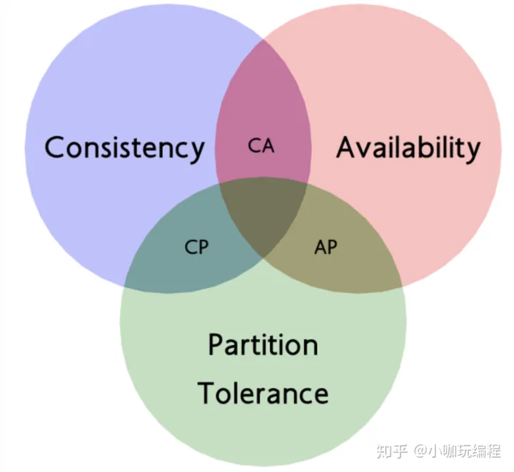

### ZooKeeper
1. ### **1.CAP理论？**

   - C : Consistency 一致性,数据在多个副本之间似否能够保持一致的特性。
   - A: Availability 可用性，系统服务必须一直处于可用状态，对每个请求总是在指定的时间返回结果。
   - P:Partition tolerance 分区容错性,遇到分区网络故障时，仍能对外提供一致性和可用性的服务。

   

   不能同时满足3个要求，只能满足其中的两个。

   ### **2.BASE理论？**

   Basically Available(基本可用)、Soft state(软状态) 和 Eventuanlly consistent （最终一致性）3个短语的简写。

   - 基本可用：系统出现不可预知的故障时，允许损失部分可用性。
   - 弱（软）状态：数据的中间状态，并认为改状态存在不会一项系统整体可用性，允许不同节点数据副本数据同步过程中的延时。
   - 最终一致性：系统中所有数据副本，在一段时间的同步后，最终数据能够到一致性的状态。

   ### **3.什么是ZooKeeper?**

   ZooKeeper是一个开源分布式协同服务系统，Zookeeper的设计目标是将那些复杂容易出错的分布式一致性服务封装起来，构成一个高效可用的原语集，并提供一系列简单接口给用户使用。

   ### **4.ZooKeeper可以实现哪些功能？**

   - 数据发布/订阅
   - 负载均衡
   - 命名服务
   - 分布式协调/通知
   - 集群管理
   - Master 选举
   - 分布式锁
   - 分布式队列

   ### **5.ZooKeeper可以保证哪些分布式一致性特性？**

   - 顺序一致性
   - 原子性
   - 单一视图
   - 可靠性
   - 实时性

   ### **6.ZooKeeper的数据模型？**

   共享的、树形结构，由一系列的 ZNode数据节点组成，类似文件系统(目录不能存数据）。ZNode存有数据信息，如版本号等等。ZNode之间的层级关系，像文件系统中的目录结构一样。并且它是将数据存在内存中，这样可以提高吞吐、减少延迟。

   ### **7.如何识别请求的先后顺序？**

   ZooKeeper会给每个更新请求，分配一个全局唯一的递增编号（zxid)，编号的大小体现事务操作的先后顺序。

   ### **8.为什么叫ZooKeeper?**

   哈哈，这个面试不一定问，不过知道以后可能会觉得更亲切。ZooKeeper最早起源于雅虎研究院的一个研究小组，在立项初期，发现很多项目都是用动物的名字来起的，当时首席科学家觉得不能再继续起动物的名字了，把它起名叫动物园管理员，正好它分布式协同服务的特性很相符，所以ZooKeeper诞生了。

   ### **9.A是根节点，如何表达A子节点下的B节点？**

   /A/B

   ### **10.集群角色？**

   Leader、Follower、Observer

   ### **11.ZNode的类型？**

   持久节点：一旦创建，除非主动移除，否则会一直保存在ZooKeeper。

   临时节点：生命周期和客户端会话绑定，会话失效，相关的临时节点被移除。

   持久顺序性：同时具备顺序性。

   临时顺序性：同时具备顺序性。

   ### **12.Stat记录了哪些版本相关数据？**

   version:当前ZNode版本

   cversion:当前ZNode子节点版本

   aversion:当前ZNode的ACL版本

   ### **12.权限控制?**

   Access Control Lists ,ACL。类似于UNIX文件系统的权限控制。

   ### **14.ZooKeeper定义了几种权限？**

   - CREATE
   - READ
   - WRITE
   - DELETE
   - ADMIN

   ### **15.Zookeeper 专门设计的一种支持崩溃恢复的原子广 播协议是?**

   ZAB

   ### **16.ZAB的两种基本模式？**

   崩溃恢复：在正常情况下运行非常良好，一旦Leader出现崩溃或者由于网络原因导致Leader服务器失去了与过半Follower的联系，那么就会进入崩溃恢复模式。为了程序的正确运行，整个恢复过程后需要选举出一个新的Leader,因此需要一个高效可靠的选举方法快速选举出一个Leader。

   消息广播：类似一个两阶段提交过程，针对客户端的事务请求， Leader服务器会为其生成对应的事务Proposal,并将其发送给集群中的其余所有机器，再分别收集各自的选票，最后进行事务提交。

   ### **17.哪些情况会导致ZAB进入恢复模式并选取新的Leader?**

   启动过程或Leader出现网络中断、崩溃退出与重启等异常情况时。

   当选举出新的Leader后，同时集群中已有过半的机器与该Leader服务器完成了状态同步之后,ZAB就会退出恢复模式。

   ### **18.Zookeeper默认端口？**

   2181

   ### **19.如何创建一个ZNode?**

   create /app

   -e 临时

   -s 顺序

   ### **20.几种部署方式？**

   单机、伪集群、集群

   ### **21.如何查看子节点？**

   ls path [watch]

   path : 节点路径

   ```text
   [zk: localhost:2181(CONNECTED) 5] ls /app
   [book]
   ```

   ### **22.获取指定节点信息？**

   get path [watch]

   ```text
   [zk: localhost:2181(CONNECTED) 1] get /app
   123
   ```

   ### **23.更新指定节点信息？**

   set path data [version]

   ```text
   [zk: localhost:2181(CONNECTED) 6] set /app 222
   [zk: localhost:2181(CONNECTED) 7] get /app
   222
   ```

   ### **24.删除指定节点？注意？**

   delete path [version]

   ```text
   [zk: localhost:2181(CONNECTED) 8] delete /app
   Node not empty: /app
   ```

   如果没有子节点，就能删除成功。如果有会提示，该节点不为空。

   ### **25.什么是会话Session?**

   指的是客户端会话，客户端启动时，会与服务器建议TCP链接，连接成功后，客户端的生命周期开始，客户端和服务器通过心跳检测保持有效的的会话以及发请求并响应、监听Watch事件等。

   ### **26.在sessionTimeout之内的会话，因服务器压力大、网络故障或客户端主动断开情况下，之前的会话还有效吗？**

   有效。

   ### **27.Watcher事件监听器？**

   ZooKeeper允许用户在指定节点上注册Watcher,当触发特定事件时，ZooKeeper服务端会把相应的事件通知到相应的客户端上，属于ZooKeeper一个重要的特性。

   ### **28.Quorum?**

   当集群中过半UP状态的进程组成了进程子集后，就可以正常的消息传播了，这样的一个子集我们称为Quorum。

   ### **29.同进程组的两个进程消息网络通信有哪两个特性？**

   - 完整性： 如果进程a收到进程b的消息msg,那么b一定发送了消息msg。
   - 前置性：如果msg1是msg2的前置消息，那么当前进程务必先接收到msg1,在接受msg2。

   ### **30.ZAB三个阶段？**

   - 发现 (Discovery)
   - 同步 (Synchronization)
   - 广播 (Broadcast)

   ### **31.发现?**

   Follower把自己最后的接受事务的Proposal值(CEPOCH(F.p)发送给Leader。

   当收到过半Follower的消息后，Leader生成NEWEPOCH(e')给这些过半的Follower。

   tips: e' = Max((CEPOCH(F.p)) + 1

   Follower收到消息后，如果自己值小于e',则同步e'的值，同时向Leader发Ack消息。

   ### **32.服务器的3中角色？**

   Leader角色：

   Follower角色：

   Observer角色：

   ### **33.数据发布/订阅？**

   发布者将数据发布到ZooKeeper上一个或多个节点上，订阅者从中订阅数据，从而动态获取数据的目的，实现配置信息的集中式管理和数据动态更新。

   ### **34.发布订阅的两种设计模式？**

   推(Push) :服务端主动推数据给所有定于的客户端。

   拉(Pull):客户端主动发请求来获取最新数据。

   ### **35.ZooKeeper用推/拉模式？**

   推拉结合

   ### **36.客户端如何获取配置信息？**

   启动时主动到服务端拉取信息，同时，在制定节点注册Watcher监听。一旦有配置变化，服务端就会实时通知订阅它的所有客户端。