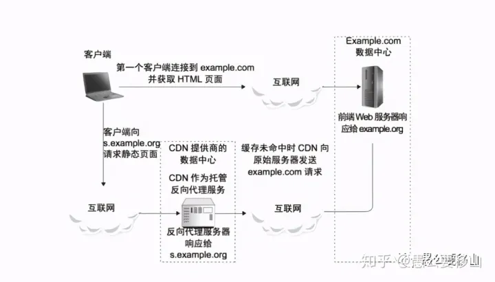
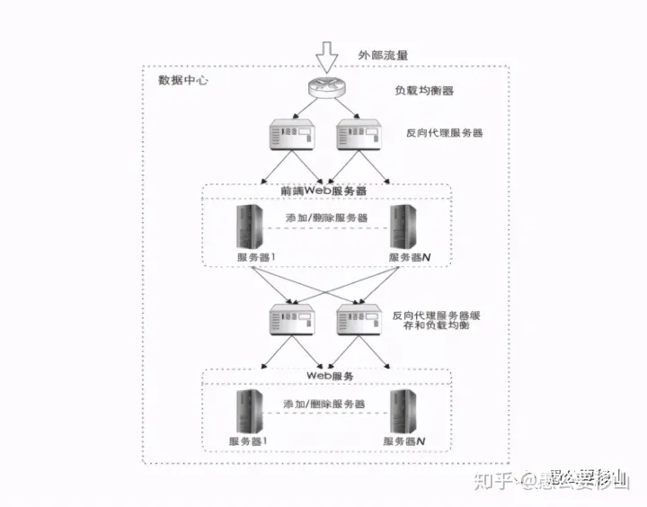
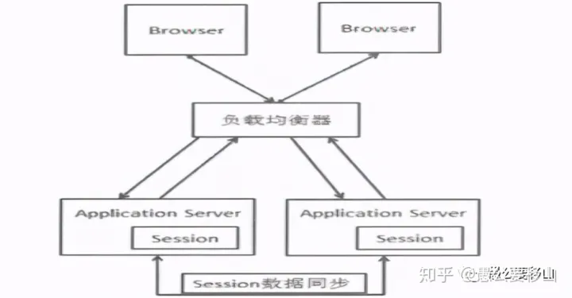
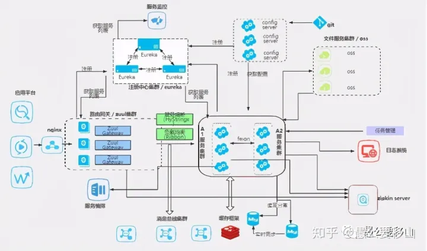
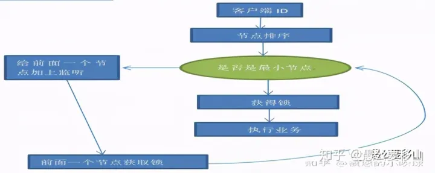
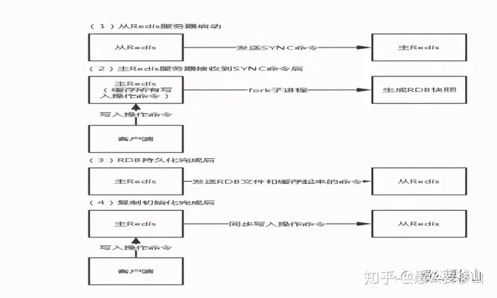
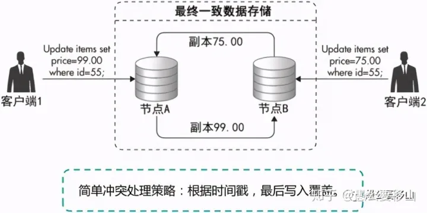
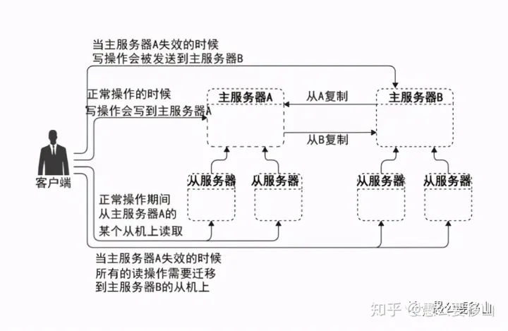
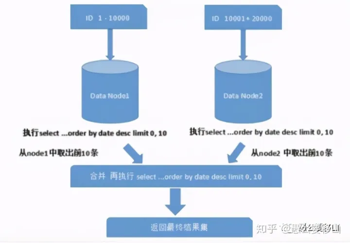

### 系统设计/方案设计
## 一、客户端缓存优化

## **1、添加CDN缓存**

CDN 缓存也叫作网络访问的“第一跳”，用户请求先到达的是互联网网络服务商的机房。在机房里面部署 CDN 服务器，提供缓存服务。缓存了一些静态资源。如果存在用户请求的内容，直接通过CDN进行返回；没有的话继续向下请求

## **2、正向代理缓存**

正向代理缓存保存在客户端，代理客户端访问互联网，比如访问谷歌，直接访问不到，我们就可以使用一个代理服务器，将请求转发给代理服务器，代理服务器能够访问谷歌，这样由代理去谷歌取到返回数据，再返回给我们。

既然正向代理服务器可以取得谷歌的数据，他就可以缓存这些数据同时记录下客户端身份，当下次请求的时候通过客户端身份验证，就可以直接找到这些缓存的数据了。

## **3、反向代理缓存**

反向代理是在服务器这一端的，用户通过互联网连接到数据中心的时候，连接的通常是一个反向代理服务器，反向代理服务器根据用户的请求，在本地的反向代理缓存中查找是否有用户请求的数据，如果有就直接返回这个数据，如果没有再把这个请求向下继续转发。

## **二、服务端优化**

## **1、应用程序分布式部署**

分布式部署的意思是同一个应用程序分布在不同的服务器上，一块对外提供服务。他们之间的等位相等。

## **（1）负载均衡算法访问不同应用程序，避免单一应用程序的压力**

客户端通过反向代理执行负载均衡算法去访问不同的应用程序

①随机均衡算法 ②多权重负载 ③session 粘连

## **（2）不同的应用程序其实是同一个，如何解决session问题**

注意，不同功能的应用程序也要解决session功能，

## **第一种：粘性session**

原理：粘性Session是指将用户锁定到某一个服务器上，比如，用户第一次请求时，负载均衡器将用户的请求转发到了A服务器上，第二次访问时，反向代理根据sessionID通过hash算法，转发到A服务器上。

缺点：缺乏容错性，如果当前访问的服务器发生故障，用户被转移到第二个服务器上时，他的session信息都将失效。

## **第二种：session同步**

原理：任何一个服务器上的session发生改变（增删改），会广播给所有其它节点，不管其他服务器需不需要session，以此来保证Session同步。

缺点：会对网络负荷造成一定压力，如果session量大的话可能会造成网络堵塞，拖慢服务器性能。

## **第三种：持久化到缓存数据库**

原理：拿出一个缓存数据库，存储session信息，并设置相应的失效时间。每次访问的时候不管是负载到了哪一个服务器都会先从缓存数据库里面查询session

## 2、应用程序拆分成微服务 

## **（1）微服务的注册与发现Eureka**

既然是微服务，就要有一个中心去管理，有了中心之后，我们就可以将各种服务往里面注册使得各个服务可以相互感知到。

Springcloud有一个Eureka注册与发现中心，保存了各个微服务的名称、IP地址、端口号等信息。这个时候，服务之间进行交流与交互。

一般注册中心会采取集群的策略，进行容错；

## **（2）微服务的通信**

## **①Ribbon**

本质是一个带有负载均衡功能的http客户端，在每次请求的时候会通过负载均衡算法Round Robin轮询算法选择一台机器，均匀的把请求分发到各台机器上。这是从每一个微服务搭建成了分布式的系统来考虑的。

实现原理：Ribbon会从 Eureka Client里获取到对应的服务注册表，也就知道了所有的服务都部署在了哪些机器上，在监听哪些端口号；然后Ribbon就可以使用默认的Round Robin算法，从中选择一台机器。

## **②Feign**

两个不同的微服务就可以使用Feign来通信，Feign集成了Ribbon。底层使用的是动态代理的功能：

Feign的工作原理：

第一：对某个接口定义了@FeignClient注解，Feign就会针对这个接口创建一个动态代理；

第二：接着你要是调用那个接口，本质就是会调用 Feign创建的动态代理

第三：Feign的动态代理会根据你在接口上的@RequestMapping等注解，来动态构造出你要请求的服务的地址；

第四：Feign中的Ribbon拿到这个地址，通过负载均衡算法调用相应的微服务的相应方法；

## **（3）微服务的容错机制Hystrix**

这个功能的微服务即使是搭建了集群可能也会出错，从而造成服务雪崩；Springcloud提供了熔断和服务降级的策略进行容错；

## **①降级**

如果调用的远端服务出现问题（超时或异常），则返回一个结果，用于提示。一般都是返回一个默认值；

## **②熔断**

如果调用的远端服务出现问题，则在一段时间之内直接返回提示信息（不再调远端的服务），一段时间后陆续调用远端服务，如果不再出现问题，则恢复正常调用远端服务。

## **（4）微服务的网关Zuul**

这么多微服务部署在不同的服务器上地址是不一样的，可以通过网关Zuul把所有的服务接口统一起来暴露出去给客户用。在这里我们可以过滤用户的一些信息或者是做权限验证等等工作；

## **（5）微服务的属性配置SpringCloud Config**

服务一多，改配置太麻烦了，需要有个东西来管理，最好还能在线修改配置，这时候分布式配置中心（Spring Cloud Config）就出现了，它实现了将所有服务的配置文件都抽取到一个统一的地方

## **（6）微服务消息总线Springcloud Bus**

想要更改配置的时候，服务能够知道并且热更新配置，那么就需要一个消息传递工具——消息总线（Spring Cloud Bus），通过这个总线向其他服务传递消息

## **（7）微服务的链路追踪**

我们想要知道各个服务之间的调用关系间接得到服务之间的依赖，那么就需要服务追踪组件（zipkin ，SpringCloud Sleuth集成了zipkin）了。

## **3、微服务会出现的问题**

## **（1）Session问题：解决方式同上**

## **（2）大规模的增删改查，如何抵抗住压力**

①采用消息队列对用户访问进行削峰处理

②服务的熔断和降级策略

## **（3）分布式事务**

比如：例如在下单场景下，库存和订单如果不在同一个节点上，涉及分布式事务。

分布式事务的最主要特点是需要跨节点进行通信，解决办法如下：

首先基于CAP理论，保证BASE特性。接下来看看如何解决：

## **①在设计微服务架构的时候尽可能的保证微服务的独立性。**

## **②2pc协议模型**

引入协调者（Coordinator）来协调参与者的行为，并最终决定这些参与者是否要真正执行事务。

第一阶段是表决阶段，所有参与者都将本事务能否成功的信息反馈发给协调者；

第二阶段是执行阶段，协调者根据所有参与者的反馈，通知所有参与者，步调一致地在所有分支上提交或者回滚。

2pc的缺点：

（1）第一阶段到第二阶段有一个时间差，时间太久了之后，第一节点的某些参与者可能不能成功执行事务了，但是之前告诉协调者说我可以成功发送，这就造成了错误。

（2）协调者在整个两阶段提交过程中扮演着举足轻重的作用，一旦协调者所在服务器宕机，那么就会影响整个数据库集群的正常运行，比如在第二阶段中，如果协调者因为故障不能正常发送事务提交或回滚通知，那么参与者们将一直处于阻塞状态，整个数据库集群将无法提供服务。

（3）同步阻塞：两阶段提交执行过程中，所有的参与者都需要听从协调者的统一调度，期间处于阻塞状态而不能从事其他操作，这样效率及其低下。

## **③基于消息队列的最终一致性方案**

消息一致性方案是通过消息中间件保证上、下游应用数据操作的一致性。基本思路是将本地操作和发送消息放在一个事务中，保证本地操作和消息发送要么两者都成功或者都失败。下游应用向消息系统订阅该消息，收到消息后执行相应操作。

基本思路如下：

（1）将事务操作进行封装

（2）上游业务（订单服务）先执行事务操作，成功之后将数据发送到消息队列

（3）下游服务（库存服务）监听消息队列，然后去执行，执行成功或者是失败都通过ACK告诉上游业务，上游业务根据这个ACK信息决定是否回滚或提交。

但是可能会出现异常的情况：

## **（1）直接无法到达消息队列**

网络断了，抛出异常，上游业务直接回滚即可。

## **（2）消息已经到达消息队列，但返回的时候出现异常**

MQ提供了确认ack机制，可以用来确认消息是否有返回。因此我们可以在发送前在数据库中先存一下消息，如果ack异常则进行重发

## **（3）消息送达后，消息服务自己挂了**

先操作数据库，然后再往消息队列发送

## **（4）未送达消费者**

消息队列收到消息后，消费者去消费，此时消息队列会处于"UNACK"的状态，直到客户端确认消息

## **（5）确认消息丢失**

消息返回时假设确认消息丢失了，那么消息队列认为消息没有到达消费者会重发消息。

## **（6）消费者业务处理异常**

消费者接受消息并处理，假设抛异常了，先重试，重试到一定的次数之后进行返回事务执行失败。

## **（4）分布式锁**

关于分布式锁的设计，从以下四个角度考虑：

第一：互斥性。在任意时刻，只有一个客户端能持有锁。

第二：不会发生死锁。即使有一个客户端在持有锁的期间崩溃而没有主动解锁，也能保证后续其他客户端能加锁。

第三：具有容错性。只要大部分的节点正常运行，客户端就可以加锁和解锁。

第四：加锁和解锁必须是同一个客户端，客户端自己不能把别人加的锁给解了。

常见的，分布式锁有三种实现方式：

## **第一：数据库乐观锁；**

利用表的唯一索引行级锁进行加解锁，加锁：

加锁：insert into methodLock(method_name,desc) values (‘method_name’,‘desc’)

解锁：delete from methodLock where method_name ='method_nam

## **第二：基于Redis的分布式锁；**

jedis.setnx(String key, String value, String nxxx, String expx, int time)

## **第三：基于ZooKeeper的分布式锁**

zk 是一种提供配置管理、分布式协同以及命名的中心化服务，用于集群配置中心管理，服务的注册监听等。zookeeper 分布式锁的实现利用zookeeper 管理配置中心的watcher机制（观察者模式），对竞争分布式锁的客户端维护了一张临时顺序表。表中每个节点代表一个客户端。

## **三、缓存数据库Redis**

## **1、主从复制：实现高可用**

一个缓存数据库压力太大，读写分离，通过哨兵机制监控各个节点和相互监督；

## **（1）哨兵模式原理**

## **①哨兵如何实现相互监督的功能**

第一：哨兵通过发布订阅__sentinel__:hello channel来实现这个功能。每个哨兵每隔2s会向自己监控的所有主从Redis节点发送hello message，包括自己的IP、端口、运行ID、自己监控的Master节点IP、Master节点端口。

第二：所有主从Redis节点也会反馈这样的信息

## **②哨兵如何故障检测**

第一：某个哨兵节点判定master节点故障，他会投出一票S_DOWN，

第二：当有足够多的sentinel节点判定master节点故障都投出S_DOWN票时，master节点会被认为是真正的下线了。

也就是基于多数投票原则

**③哨兵模式如何实现故障恢复**

故障恢复需要完成如下几步操作：

第一：通过选主机制选择新的Master节点替换掉原来的故障节点

第二：其他的节点成为Slave节点用于主从复制，也就是不变

第三：告知客户端新的master节点地址信息，同时执行必要的脚本来通知系统管理员。

## **（2）选主机制**

## **过程：**

sentinel的选举过程基本上是Raft协议的实现，即所有节点会随机休眠一段时间，然后发起拉票，当某个节点获得的票数超过max(sentinel|/2 + 1), qurom时，该节点就被推选为leader节点。注意是哨兵去从节点里面选。

## **到底选谁呢？**

**①根据指定的优先级选择**

管理员在启动redis从节点的时候，指定了其优先级，哨兵会先从优先级高的从节点去选择。

②**根据数据更新程度选择**

优先级相同，所有slave节点复制数据的时候都会记录复制偏移量，值越大说明与master节点的数据更一致。所以哨兵会选择复制偏移量最大的节点。

③**根据runid选择：**

到了这一步节点的孰优孰劣就没什么区别了，每个节点启动的时候都会有一个唯一的runId, 那么我们就选择runid最小的节点好了。

## **2、集群策略**

## **（1）基本实现**

Redis Cluster中，Sharding采用slot(槽)的概念，一共分成16384个槽，分布在不同的Redis数据库中，对于每个进入Redis的键值对，根据CRC16后16384取模hash映射，分配到这16384个slot中的某一个中。

## **缺点**

要保证16384个槽对应的node都正常工作，如果某个node发生故障，那它负责的slots也就失效，整个集群将不能工作。

## **（2）更好的方案一致性哈希算法，解决扩容问题jedis：**

Jedis里面有一致性哈希算法，首先构建一个一致性哈希环的结构。一致性哈希环的大小是我们计算机中无符号整型值的取值范围，

将一个数据库服务器虚拟成若干个虚拟节点，把这些虚拟节点的 hash 值放到环上去。在实践中通常是把一个服务器节点虚拟成 200 个虚拟节点，然后把 200 个虚拟节点放到环上。用户的key过来时，顺时针的查找距离它最近的虚拟节点，找到虚拟节点以后，根据映射关系找到真正的物理节点。

## **3、Redis可能出现的问题**

## **（1）缓存雪崩**

## **原理：**

缓存同一时间大面积的失效，从而导致所有请求都去查数据库，导致数据库CPU和内存负载过高，甚至宕机。

## **解决方案：**

1）主从复制

2）根据一些关键数据进行自动降级

3）提前数据预热

## **（2）缓存穿透**

## **原理：**

缓存穿透是指查询一个一不存在的数据。例如：从缓存redis没有命中，需要从mysql数据库查询，查不到数据则不写入缓存，这将导致这个不存在的数据每次请求都要到数据库去查询，造成缓存穿透。

## **解决办法：**

1）布隆过滤器

当用户想要查询的时候，使用布隆过滤器发现不在集合中，就直接丢弃，不再对持久层查询。

2）缓存空对象

缓存中没有就回去存储层获取，此时即使数据库返回的空对象也将其缓存起来，同时会设置一个过期时间，之后再访问这个数据将会从缓存中获取

## **（3）缓存击穿**

缓存击穿是指一个key非常热点，在不停的扛着大并发，大并发集中对这一个点进行访问，当这个key在失效的瞬间，持续的大并发就穿破缓存，直接请求数据库，瞬间对数据库的访问压力增大。

解决方案：在查询缓存的时候和查询数据库的过程加锁，只能第一个进来的请求进行执行，当第一个请求把该数据放进缓存中，接下来的访问就会直接集中缓存，防止了缓存击穿。

## **（4）Redis缓存与数据库数据一致性**

不管是先写MySQL数据库，再删除Redis缓存；还是先删除缓存，再写库，都有可能出现数据不一致的情况。举一个例子：

1.如果删除了缓存Redis，还没有来得及写库MySQL，另一个线程就来读取，发现缓存为空，则去数据库中读取数据写入缓存，此时缓存中为脏数据。

2.如果先写了库，在删除缓存前，写库的线程宕机了，没有删除掉缓存，则也会出现数据不一致情况。

怎么保证缓存一致性？：读直接去缓存读，没有的话就读数据库，写直接写数据库，然后失效缓存中对应的数据

## **第一种方案：延时双删策略+缓存超时设置**

在写库前后都进行redis.del(key)操作，并且设定合理的超时时间。

**具体的步骤就是：**

1）先删除缓存；

2）再写数据库；

3）休眠一段时间；

4）再次删除缓存。

**设置缓存过期时间**

所有的写操作以数据库为准，只要到达缓存过期时间，则后面的读请求自然会从数据库中读取新值然后回填缓存。也就是看到写请求就执行上面的策略。

## **第二种方案：异步更新缓存(基于订阅binlog的同步机制)**

MySQL binlog增量订阅消费+消息队列+增量数据更新到redis

一旦MySQL中产生了新的写入、更新、删除等操作，就可以把binlog相关的消息通过消息队列推送至Redis，Redis再根据binlog中的记录，对Redis进行更新。

## **（5）redis的热key问题如何解决**

## **第一：热Key的概念**

所谓热key问题就是，突然有几十万的请求去访问redis上的某个特定key。那么，这样会造成流量过于集中，达到物理网卡上限，从而导致这台redis的服务器宕机。那接下来这个key的请求，就会直接怼到你的数据库上，导致你的服务不可用。

## **第二：怎么发现热key**

方法一:凭借业务经验，进行预估哪些是热key 其实这个方法还是挺有可行性的。比如某商品在做秒杀，那这个商品的key就可以判断出是热key。缺点很明显，并非所有业务都能预估出哪些key是热key。

方法二:在客户端进行收集 这个方式就是在操作redis之前，加入一行代码进行数据统计。那么这个数据统计的方式有很多种，也可以是给外部的通讯系统发送一个通知信息。缺点就是对客户端代码造成入侵。

方法三:在Proxy层做收集 有些集群架构是下面这样的，Proxy可以是Twemproxy，是统一的入口。可以在Proxy层做收集上报，但是缺点很明显，并非所有的redis集群架构都有proxy。

方法四:用redis自带命令

(1)monitor命令，该命令可以实时抓取出redis服务器接收到的命令，然后写代码统计出热key是啥。当然，也有现成的分析工具可以给你使用，比如redis-faina。但是该命令在高并发的条件下，有内存增暴增的隐患，还会降低redis的性能。

(2)hotkeys参数，redis 4.0.3提供了redis-cli的热点key发现功能，执行redis-cli时加上–hotkeys选项即可。但是该参数在执行的时候，如果key比较多，执行起来比较慢。

方法五:自己抓包评估

Redis客户端使用TCP协议与服务端进行交互，通信协议采用的是RESP。自己写程序监听端口，按照RESP协议规则解析数据，进行分析。缺点就是开发成本高，维护困难，有丢包可能性。

以上五种方案，各有优缺点。根据自己业务场景进行选择即可。那么发现热key后，如何解决呢？

## **三：如何解决**

目前业内的方案有两种

(1)利用二级缓存 比如利用ehcache，或者一个HashMap都可以。在你发现热key以后，把热key加载到系统的JVM中。

针对这种热key请求，会直接从jvm中取，而不会走到redis层。假设此时有十万个针对同一个key的请求过来,如果没有本地缓存，这十万个请求就直接怼到同一台redis上了。

现在假设，你的应用层有50台机器，OK，你也有jvm缓存了。这十万个请求平均分散开来，每个机器有2000个请求，会从JVM中取到value值，然后返回数据。避免了十万个请求怼到同一台redis上的情形。

(2)备份热key 这个方案也很简单。不要让key走到同一台redis上不就行了。我们把这个key，在多个redis上都存一份不就好了。接下来，有热key请求进来的时候，我们就在有备份的redis上随机选取一台，进行访问取值，返回数据。

## **四、数据库优化**

## **1、主从复制**

主从复制一般采用多主多从的方案

## （1）多主条件下数据一致性问题

也就是两台主数据库同时更新了数据，以谁的为主

**①一种方法是根据时间戳进行判断**

最后写入的，也就是时间戳在后面的，覆盖时间戳在前面的。

**②还有一种冲突的解决方案是通过投票进行解决**。

## **（2）主节点挂掉了怎么办？**

多主多从模式中，几台主服务器相互监督观察，只要对面的有更新自己也更新；

## **2、分库分表**

## **（1）垂直分库分表**

垂直分表意味着对这个表大部分增删改查的操作需要跨库，系统开销太大，一般不使用。垂直分库也会带来事务等问题，解决办法是2pc

## **（2）水平分库分表**

实现方案如下：

## **1、根据数值范围**

按照时间区间或ID区间来切分。例如：将userId为1~9999的记录分到第一个库，10000~20000的分到第二个库，以此类推。

**优点：**

（1）单表大小可控

（2）天然便于水平扩展，后期如果想对整个分片集群扩容时，只需要添加节点即可，无需对其他分片的数据进行迁移

（3）使用分片字段进行范围查找时，连续分片可快速定位分片进行快速查询，有效避免跨分片查询的问题。

**缺点：**

热点数据可能较为集中，造成压力。

## **2、根据数值取模**

例如：将 Customer 表根据 no字段切分到4个库中，余数为0的放到第一个库，余数为1的放到第二个库，以此类推。

**优点：**

数据分片相对比较均匀，不容易出现热点和并发访问的瓶颈

**缺点：**

（1）扩容比较麻烦，新增加一个数据库时，需要重新hash

## **3、分库分表出现的问题**

## **（1）事务一致性问题（垂直分库问题）**

## **分布式事务**

当更新内容同时分布在不同库中，垂直分库，不可避免会带来跨库事务问题。跨分片事务也是分布式事务，没有简单的方案，一般可使用"XA协议"和"两阶段提交"处理。

## **最终一致性**

只要在允许的时间段内达到最终一致性即可，可采用事务补偿的方式。也就是基于日志，进行同步；

## **2、跨节点关联查询 join 问题（垂直分库问题）**

## **1）全局表**

全局表，也可看做是"数据字典表"，就是系统中所有模块都可能依赖的一些表，为了避免跨库join查询，可以将这类表在每个数据库中都保存一份。这些数据通常很少会进行修改，所以也不担心一致性的问题。

## **2）字段冗余**

利用空间换时间，为了性能而避免join查询。例如：订单表保存userId时候，也将userName冗余保存一份，这样查询订单详情时就不需要再去查询"买家user表"了。

## **3）数据组装，多次请求**

在系统层面，分两次查询，第一次查询的结果集中找出关联数据id，然后根据id发起第二次请求得到关联数据。最后将获得到的数据进行字段拼装。

## **4）ER分片**

关系型数据库中，如果可以先确定表之间的关联关系，并将那些存在关联关系的表记录存放在同一个分片上，

## **3、跨节点分页、排序、函数问题（水平分库问题）**

## **（1）分页问题**

需要先在不同的分片节点中将数据进行排序并返回，然后将不同分片返回的结果集进行汇总和再次排序，最终返回给用户。

## **（2）函数问题**

在使用Max、Min、Sum、Count之类的函数进行计算的时候，也需要先在每个分片上执行相应的函数，然后将各个分片的结果集进行汇总和再次计算，最终将结果返回。

## **4、分布式ID问题（水平分库问题）**

在分库分表的环境中，数据分布在不同的分片上，不能再借助数据库自增长特性直接生成，否则会造成不同分片上的数据表主键会重复。简单介绍下使用和了解过的几种 ID 生成算法。

## **（1）Twitter 的 Snowflake（又名“雪花算法”）**

这种方案把64-bit分别划分成多段，分开来标示机器、时间等，如下图所示：

这种分配方式可以保证在任何一个IDC的任何一台机器在任意毫秒内生成的ID都是不同的。根据这个算法的逻辑，只需要将这个算法用Java语言实现出来，封装为一个工具方法，那么各个业务应用可以直接使用该工具方法来获取分布式ID，只需保证每个业务应用有自己的工作机器id即可，而不需要单独去搭建一个获取分布式ID的应用。

## **（2）利用zookeeper生成唯一ID**

zookeeper主要通过其znode数据版本来生成序列号，可以生成32位和64位的数据版本号，客户端可以使用这个版本号来作为唯一的序列号。

## **（3）Redis生成ID**

这主要依赖于Redis是单线程的，所以也可以用生成全局唯一的ID。可以用Redis的原子操作 INCR和INCRBY来实现。

## 四、谈谈如何设计秒杀系统。

谈谈如何设计秒杀系统。

 [面试必考：秒杀系统如何设计？ - 腾讯云开发者社区-腾讯云 (tencent.com)](https://cloud.tencent.com/developer/article/1863530) 

## 五、一千万的用户实时排名如何实现；

**Redis sorted set 排名**

**千万用户排名**

使用Redis排名非常简单对于百万级别的用户不用耗费太多内存即可实现高效快速的排名，对于用户只有百万的产品，基本设计一个简单的排名基本够用。但大多数游戏不会只有一个排名，都会有多个排名，战斗力排名，消耗金币排名，副本打怪次数都可能成一个榜单，所以使用Redis需要维护大量的排名榜单。现在情景假设你的单节点Redis资源不是很充沛，但允许你搭建Redis集群。上千万用户，仅靠一个**sorted set**不能够满足你的快速需要。

**分桶排名**

当用户足够多时，我们需要对排行榜的score依据你的系统用户已有的排名得分数据进行直方图统计，统计出每个score用户数量，然后对score进行合理范围拆分，比如score在0~100万范围，根据直方图统计后 0~10w， 10w~25w， 25w~30w，... ,50w~100w ,10个区间能将一千万用户拆成100w用户一个分桶范围，将对应得分用户分别储存在响应范围的分桶sorted set中。排名时简单缓存每个分桶**sorted set**的用户总数。对于查询top 排名时，只要查看最高分区桶**sorted set**排名即可， 对于查询个体用户的排名，需要外加一份用户得分记录存储于MySQL等数据库中，用于查询到单用户的得分，然后依据得分查找到得分存储在相应redis sorted set分桶排名，然后把高于当前分桶范围的分桶用户相加得到相关用户的排名。

更新用户得分时，首先需要查询到原有得分，然后如果用户的现在的得分比较如果得分分布的sorted set分桶已经不是原来的分桶，这是需要删除原桶用户记录，然后在新桶sorted set入录得分记录。

## 六、五万人并发抢票怎么实现

高并发秒杀-并发抢票-高并发的艺术_元宇宙玩家的博客-CSDN博客](https://blog.csdn.net/qq_35042060/article/details/102893914) 

## 七、12306网站的订票系统如何实现，如何保证不会票不被超卖。

 [12306抢票系统详解_大数据技术之路---花火的博客-CSDN博客_抢票系统](https://blog.csdn.net/qq_37095882/article/details/102777226) 

## 八、如果有几十亿的白名单，每天白天需要高并发查询，晚上需要更新一次，如何设计这个功能。

 这是一个典型的读多写少场景，可以在数据前加一层NoSql缓存来优化查询效率。具体NoSql中如何组织数据需要根据查询条件来设计 

## 九、接口的幂等性如何设计

 [阿里面试官：接口的幂等性怎么设计？ - 知乎 (zhihu.com)](https://zhuanlan.zhihu.com/p/345512692) 

## 10.如何设计存储海量数据的存储系统

 [海量数据存储方案 - 0giant - 博客园 (cnblogs.com)](https://www.cnblogs.com/LUO77/p/8567623.html) 

## 11.分布式session如何管理，你有哪些方案

 [分布式Session的几种解决方案，你中意哪种？ - 腾讯云开发者社区-腾讯云 (tencent.com)](https://cloud.tencent.com/developer/article/1841639) 

## 12.讲一下如何给高并发系统做限流？

 [高并发系统的限流方案如何实现 - 知乎 (zhihu.com)](https://zhuanlan.zhihu.com/p/103173946) 

## 13.使用SpringBoot如何开发邮件发送系统？

 [如何使用 Spring Boot 开发邮件系统？ - 腾讯云开发者社区-腾讯云 (tencent.com)](https://cloud.tencent.com/developer/article/1357868) 

## 14..设计一个分布式自增id生成服务

 [一口气说出9种分布式ID生成方式，阿里面试官都懵了 - 知乎 (zhihu.com)](https://zhuanlan.zhihu.com/p/152179727) 

## 15.如何设计一个高并发的系统？

 [如何设计一个高并发系统架构_宁内疚不迁就的博客-CSDN博客](https://blog.csdn.net/admin19921022/article/details/90599155) 

## 16.数据量大的情况下分页查询很慢，有什么优化方案？

 [面试官：数据量很大，分页查询很慢，怎么优化？ - 腾讯云开发者社区-腾讯云 (tencent.com)](https://cloud.tencent.com/developer/article/1477574) 

## 17.设计一个秒杀系统，30分钟没付款就自动关闭交易。

 [淘宝订单未支付30分钟自动取消是如何实现的？ - 知乎 (zhihu.com)](https://zhuanlan.zhihu.com/p/339528948) 

## 18.如何使用redis和zookeeper实现分布式锁？有什么区别优缺点，会有什么问题，分别适用什么

 [ Zookeeper和Redis实现的分布式锁的区别，应用场景（字节一面，阿里中间件面试题）_梁 锋的博客-CSDN博客](https://blog.csdn.net/qq_22256565/article/details/104147826) 

## 19.如何设计一个安全的API接口。

 [如何设计一个安全的API接口 - Tammytan - 博客园 (cnblogs.com)](https://www.cnblogs.com/tx1185498724/p/15479340.html) 

## 20.线上系统突然变得异常缓慢，你如何查找问题。

 [教你如何排查Java系统运行缓慢等问题 附详细思路 | w3c笔记 (w3cschool.cn)](https://appapi.w3cschool.cn/article/66414768.html#:~:text=1 如果是接口调用比较耗时，并且是不定时出现，则可以通过压测的方式加大阻塞点出现的频率，从而通过jstack查看堆栈信息，找到阻塞点； 2,如果是某个功能突然出现停滞的状况，这种情况也无法复现，此时可以通过多次导出jstack日志的方式对比哪些用户线程是一直都处于等待状态，这些线程就是可能存在问题的线程； 3 如果通过jstack可以查看到死锁状态，则可以检查产生死锁的两个线程的具体阻塞点，从而处理相应的问题。) 

## 21.1000个线程同时运行，怎么防止不卡

## 22.后台系统怎么防止请求重复提交

 [分布式系统后台如何防止重复提交 | IT瘾 (itindex.net)](https://itindex.net/detail/58529-分布-系统-后台) 

