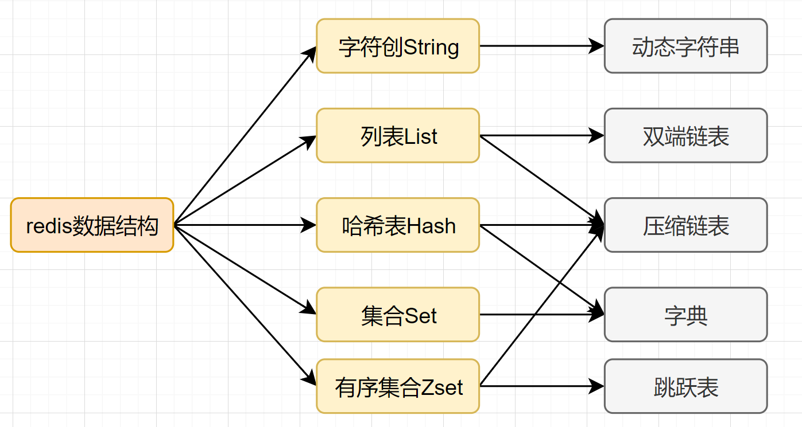

### 缓存/Redis

### 什么是Redis？它主要用来什么的？

Redis，英文全称是**Remote Dictionary Server**（远程字典服务），是一个开源的使用ANSI C语言编写、支持网络、可基于内存亦可持久化的日志型、Key-Value数据库，并提供多种语言的API。

与MySQL数据库不同的是，Redis的数据是存在内存中的。它的读写速度非常快，每秒可以处理超过10万次读写操作。因此redis被**广泛应用于缓存**，另外，Redis也经常用来做分布式锁。除此之外，Redis支持事务、持久化、LUA 脚本、LRU 驱动事件、多种集群方案。

### 1、redis和memcached什么区别？为什么高并发下有时单线程的redis比多线程的memcached效率要高？

区别：

1. memcached可缓存图片和视频。redis支持除k/v更多的数据结构；
2. redis可以使用虚拟内存，redis可持久化和aof灾难恢复，redis通过主从支持数据备份；

3.redis可以做消息队列。

原因：memcached多线程模型引入了缓存一致性和锁，加锁带来了性能损耗。

### 2、redis主从复制如何实现的？redis的集群模式如何实现？redis的key是如何寻址的？

主从复制实现：主节点将自己内存中的数据做一份快照，将快照发给从节点，从节点将数据恢复到内存中。之后再每次增加新数据的时候，主节点以类似于mysql的二进制日志方式将语句发送给从节点，从节点拿到主节点发送过来的语句进行重放。

分片方式：

1. 客户端分片
2. 基于代理的分片
3. Twemproxy
4. codis
5. 路由查询分片
6. Redis-cluster体身提供了自动将数据分散到RedisCluster不同节点的能力，整个数据集合的某个数据子集存储在哪个节点对于用户来说是透明的）
7. redis-cluster分片原理：Cluster中有一个16384长度的槽（虚拟槽），编号分别为0-16383。每个Master节点都会负责一部分的槽，当有某个key被映射到某个Master负责的槽，那么这个Master负责为这个key提供服务，至于哪个Master节点负责哪个槽，可以由用户指定，也可以在初始化的时候自动生成，只有Master才拥有槽的所有权。Master节点维护着一个16384/8字节的位序列，Master节点用bit来标识对于某个槽自己是否拥有。比如对于编号为1的槽，Master只要判断序列的第二位（索引从0开始）是不是为1即可。这种结构很容易添加或者删除节点。比如如果我想新添加个节点D，我需要从节点A、B、C中得部分槽到D上。

### 3、使用redis如何设计分布式锁？说一下实现思路？使用zk可以吗？如何实现？这两种有什么区别？

redis：

1. 线程Asetnx（上锁的对象超时时的时间戳tl），如果返回true，获得锁。
2. 线程B用get获取t1，与当前时间戳比较，判断是是否超时，没超时false，若超时执行第3步；
3. 计算新的超时时间t2，使用getset命令返回t3（该值可能其他线程已经修改过），如果t1==t3，获得锁，如果t1!=t3说明锁被其他线程获取了。
4. 获取锁后，处理完业务逻辑，再去判断锁是否超时，如果没超时删除锁，如果已超时，不用处理（防止删除其他线程的锁）。

zk：

1. 客户端对某个方法加锁时，在zk上的与该方法对应的指定节点的目录下，生成一个唯一的瞬时有序节点node1；
2. 客户端获取该路径下所有已经创建的子节点，如果发现自己创建的node1的序号是最小的，就认为这个客户端获得了锁。
3. 如果发现node1不是最小的，则监听比自己创建节点序号小的最大的节点，进入等待。
4. 获取锁后，处理完逻辑，删除自己创建的node1即可。区别：zk性能差一些，开销大，实现简单。

### 4、知道redis的持久化吗？底层如何实现的？有什么优点缺点？

RDB（RedisDataBase：在不同的时间点将redis的数据生成的快照同步到磁盘等介质上）：内存到硬盘的快照，定期更新。缺点：耗时，耗性能（fork+io操作），易丢失数据。

AOF（AppendOnlyFile：将redis所执行过的所有指令都记录下来，在下次redis重启时，只需要执行指令就可以了）：写日志。缺点：体积大，恢复速度慢。

bgsave做镜像全量持久化，aof做增量持久化。因为bgsave会消耗比较长的时间，不够实时，在停机的时候会导致大量的数据丢失，需要aof来配合，在redis实例重启时，优先使用aof来恢复内存的状态，如果没有aof日志，就会使用rdb文件来恢复。Redis会定期做aof重写，压缩aof文件日志大小。Redis4.0之后有了混合持久化的功能，将bgsave的全量和aof的增量做了融合处理，这样既保证了恢复的效率又兼顾了数据的安全性。bgsave的原理，fork和cow，fork是指redis通过创建子进程来进行bgsave操作，cow指的是copyonwrite，子进程创建后，父子进程共享数据段，父进程继续提供读写服务，写脏的页面数据会逐渐和子进程分囲开来。

### 5、redis过期策略都有哪些？LRU算法知道吗？写一下java代码实现？

过期策略：

定时过期（一key一定时器），惰性过期：只有使用key时才判断key是否已过期，过期则清除。定期过期：前两者折中。

LRU：newLinkedHashMap<K，V>（capacity，DEFAULT_LOAD_FACTORY，true）；第三个参数置为true，代表linkedlist按访问顺序排序，可作为LRU缓存；设为false代表按插入顺序排序，可作为FIFO缓存

LRU算法实现：

1. 通过双向链表来实现，新数据插入到链表头部；
2. 每当缓存命中（即缓存数据被访问），则将数据移到链表头部；
3. 当链表满的时候，将链表尾部的数据丢弃。

LinkedHashMap：HashMap和双向链表合二为一即是LinkedHashMap。HashMap是无序的，LinkedHashMap通过维护一个额外的双向链表保证了迭代顺序。该迭代顺序可以是插入顺序（默认），也可以是访问顺序。

### 6、缓存穿透、缓存击穿、缓存雪崩解决方案？

**缓存穿透：**指查询一个一定不存在的数据，如果从存储层查不到数据则不写入缓存，这将导致这个不存在的数据每次请求都要到DB去查询，可能导致DB挂掉。

解决方案：

1. 查询返回的数据为空，仍把这个空结果进行缓存，但过期时间会比较短；
2. 布隆过滤器：将所有可能存在的数据哈希到一个足够大的bitmap中，一个一定不存在的数据会被这个bitmap拦截掉，从而避免了对DB的查询。

**缓存击穿：**对于设置了过期时间的key，缓存在某个时间点过期的时候，恰好这时间点对这个Key有大量的并发请求过来，这些请求发现缓存过期一般都会从后端DB加载数据并回设到缓存，这个时候大并发的请求可能会瞬间把DB压垮。

解决方案：

1. 使用互斥锁：当缓存失效时，不立即去Ioaddb，先使用如Redis的setnx去设置一个互斥锁，当操作成功返回时再进行Ioaddb的操作并回设缓存，否则重试get缓存的方法。
2. 永远不过期：物理不过期，但逻辑过期（后台异步线程去刷新）。缓存雪崩：设置缓存时采用了相同的过期时间，导致缓存在某一时刻同时失效，请求全部转发到DB，DB瞬时压力过重雪崩。与缓存击穿的区别：雪崩是很多key，击穿是某一个key缓存。

解决方案：

将缓存失效时间分散开，比如可以在原有的失效时间基础上增加一个随机值，比如1-5分钟随机，这样每一个缓存的过期时间的重复率就会降低，就很难引发集体失效的事件。

### 7、在选择缓存时，什么时候选择redis，什么时候选择memcached

选择redis的情况：

1. 复杂数据结构，value的数据是哈希，列表，集合，有序集合等这种情况下，会选择redis，因为memcache无法满足这些数据结构，最典型的的使用场景是，用户订单列表，用户消息，帖子评论等。
2. 需要进行数据的持久化功能，但是注意，不要把redis当成数据库使用，如果redis挂了，内存能够快速恢复热数据，不会将压力瞬间压在数据库上，没有cache预热的过程。对于只读和数据一致性要求不高的场景可以采用持久化存储
3. 高可用，redis支持集群，可以实现主动复制，读写分离，而对于memcache如果想要实现高可用，需要进行二次开发。
4. 存储的内容比较大，memcache存储的value最大为1M。

选择memcache的场景：

纯KV，数据量非常大的业务，使用memcache更合适，原因是：

1. memcache的内存分配采用的是预分配内存池的管理方式，能够省去内存分配的时间，redis是临时申请空间，可能导致碎片化。
2. 虚拟内存使用，memcache将所有的数据存储在物理内存里，redis有自己的vm机制，理论上能够存储比物理内存更多的数据，当数据超量时，引发swap，把冷数据刷新到磁盘上，从这点上，数据量大时，memcache更快
3. 网络模型，memcache使用非阻塞的10复用模型，redis也是使用非阻塞的I。复用模型，但是redis还提供了一些非KV存储之外的排序，聚合功能，复杂的CPU计算，会阻塞整个I0调度，从这点上由于redis提供的功能较多，memcache更快些
4. 线程模型，memcache使用多线程，主线程监听，worker子线程接受请求，执行读写，这个过程可能存在锁冲突。redis使用的单线程，虽然无锁冲突，但是难以利用多核的特性提升吞吐量。

### 8、缓存与数据库不一致怎么办？

假设采用的主存分离，读写分离的数据库，
如果一个线程A先删除缓存数据，然后将数据写入到主库当中，这个时候，主库和从库同步没有完成，线程B从缓存当中读取数据失败，从从库当中读取到旧数据，然后更新至缓存，这个时候，缓存当中的就是旧的数据。

发生上述不一致的原因在于，主从库数据不一致问题，加入了缓存之后，主从不一致的时间被拉长了。

处理思路：在从库有数据更新之后，将缓存当中的数据也同时进行更新，即当从库发生了数据更新之后，向缓存发出删除，淘汰这段时间写入的旧数据。

### 9、主从数据库不一致如何解决？

场景描述，对于主从库，读写分离，如果主从库更新同步有时差，就会导致主从库数据的不一致

1. 忽略这个数据不一致，在数据一致性要求不高的业务下，未必需要时时一致性
2. 强制读主库，使用一个高可用的主库，数据库读写都在主库，添加一个缓存，提升数据读取的性能。
3. 选择性读主库，添加一个缓存，用来记录必须读主库的数据，将哪个库，哪个表，哪个主键，作为缓存的key，设置缓存失效的时间为主从库同步的时间，如果缓存当中有这个数据，直接读取主库，如果缓存当中没有这个主键，就到对应的从库中读取。

### 10、Redis常见的性能问题和解决方案

1. 、master最好不要做持久化工作，如RDB内存快照和AOF日志文件
2. 如果数据比较重要，某个slave开启AOF备份，策略设置成每秒同步一次
3. 为了主从复制的速度和连接的稳定性，master和Slave最好在一个局域网内
4. 尽量避免在压力大得主库上增加从库
5. 主从复制不要米用网状结构，尽量是线性结构，Master<–Slave1<—Slave2…

### 11、Redis的数据淘汰策略有哪些

voltile-lru从已经设置过期时间的数据集中挑选最近最少使用的数据淘汰

voltile-ttl从已经设置过期时间的数据库集当中挑选将要过期的数据

voltile-random从已经设置过期时间的数据集任意选择淘汰数据

allkeys-lru从数据集中挑选最近最少使用的数据淘汰

allkeys-random从数据集中任意选择淘汰的数据

no-eviction禁止驱逐数据

### 12、Redis当中有哪些数据结构

字符串String、字典Hash、列表List、集合Set、有序集合SortedSet。如果是咼级用户，那么还会有，如果你是Redis中高级用户，还需要加上下面几种数据结构HyperLogLog、Geo、Pub/Sub。

### 13、假如Redis里面有1亿个key，其中有10w个key是以某个固定的已知的前缀开头的，如果将它们全部找出来？

使用keys指令可以扫出指定模式的key列表。

对方接着追问：如果这个redis正在给线上的业务提供服务，那使用keys指令会有什么问题？

这个时候你要回答redis关键的一个特性：redis的单线程的。keys指令会导致线程阻塞一段时间，线上服务会停顿，直到指令执行完毕，服务才能恢复。这个时候可以使用scan指令，scan指令可以无阻塞的提取出指定模式的key列表，但是会有一定的重复概率，在客户端做一次去重就可以了，但是整体所花费的时间会比直接用keys指令长。

### 14、使用Redis做过异步队列吗，是如何实现的

使用list类型保存数据信息，rpush生产消息，lpop消费消息，当lpop没有消息时，可以sleep一段时间，然后再检查有没有信息，如果不想sleep的话，可以使用blpop，在没有信息的时候，会一直阻塞，直到信息的到来。redis可以通过pub/sub主题订阅模式实现一个生产者，多个消费者，当然也存在一定的缺点，当消费者下线时，生产的消息会丢失。

### 15、Redis如何实现延时队列

使用sortedset，使用时间戳做score，消息内容作为key，调用zadd来生产消息，消费者使用zrangbyscore获取n秒之前的数据做轮询处理。

### 16、什么是Redis？简述它的优缺点？

Redis本质上是一个Key-Value类型的内存数据库，很像memcached，整个数据库统统加载在内存当中进行操作，定期通过异步操作把数据库数据flush到硬盘上进行保存。

因为是纯内存操作，Redis的性能非常出色，每秒可以处理超过10万次读写操作，是已知性能最快的Key-ValueDB。

Redis的出色之处不仅仅是性能，Redis最大的魅力是支持保存多种数据
结构，此外单个value的最大限制是1GB，不像memcached只能保存1MB的数据，因此Redis可以用来实现很多有用的功能。

比方说用他的List来做FIFO双向链表，实现一个轻量级的高性能消息队列服务，用他的Set可以做高性能的tag系统等等。

另外Redis也可以对存入的Key-Value设置expire时间，因此也可以被当作一个功能加强版的memcached来用。Redis的主要缺点是数据库容量受到物理内存的限制，不能用作海量数据的高性能读写，因此Redis适合的场景主要局限在较小数据量的高性能操作和运算上。

### 17、Redis相比memcached有哪些优势？

1. memcached所有的值均是简单的字符串，redis作为其替代者，支持更为丰富数据类型
2. Redis的速度比memcached快很多
3. redis可以持久化其数据

### 18、Redis支持哪几种数据类型？

String、List、Set、SortedSet、hashes

### 19、Redis主要消耗什么物理资源？

内存。

### 20、Redis的全称是什么？

Remote Dictionary Server

### 21、Redis有哪几种数据淘汰策略？

noeviction：返回错误当内存限制达到并且客户端尝试执行会让更多内存被使用的命令(大部分的写入指令，但DEL和几个例外)

allkeys-lru：尝试回收最少使用的键(LRU)，使得新添加的数据有空间存放。

volatile-lru：尝试回收最少使用的键(LRU)，但仅限于在过期集合的键，使得新添加的数据有空间存放。

allkeys-random：回收随机的键使得新添加的数据有空间存放。

volatile-random：回收随机的键使得新添加的数据有空间存放，但仅限于在过期集合的键。

volatile-ttl：回收在过期集合的键，并且优先回收存活时间(TTL)较短的键，使得新添加的数据有空间存放。

### 22、Redis官方为什么不提供Windows版本？

因为目前Linux版本已经相当稳定，而且用户量很大，无需开发windows版本，反而会带来兼容性等问题。

### 23、一个字符串类型的值能存储最大容量是多少？

512M

### 24、为什么Redis需要把所有数据放到内存中？

Redis为了达到最快的读写速度将数据都读到内存中，并通过异步的方式将数据写入磁盘。

所以redis具有快速和数据持久化的特征。如果不将数据放在内存中，磁盘I/O速度为严重影响redis的性能。

在内存越来越便宜的今天，redis将会越来越受欢迎。如果设置了最大使用的内存，则数据已有记录数达到内存限值后不能继续插入新值。

### 25、Redis集群方案应该怎么做？都有哪些方案？

1. codis。
   目前用的最多的集群方案，基本和twemproxy一致的效果，但它支持在节点数量改变情况下，旧节点数据可恢复到新hash节点。
2. rediscluster3.0自带的集群，特点在于他的分布式算法不是一致性hash，而是hash槽的概念，以及自身支持节点设置从节点。具体看官方文档介绍。
3. 在业务代码层实现，起几个毫无关联的redis实例，在代码层，对key进行hash计算，然后去对应的redis实例操作数据。这种方式对hash层代码要求比较高，考虑部分包括，节点失效后的替代算法方案，数据震荡后的自动脚本恢复，实例的监控，等等。

### 26、Redis集群方案什么情况下会导致整个集群不可用？

有A，B，C三个节点的集群，在没有复制模型的情况下，如果节点B失败了，那么整个集群就会以为缺少5501-11000这个范围的槽而不可用。

### 27、MySQL里有2000w数据，redis中只存20w的数据，如何保证redis中的数据都是热点数据？

redis内存数据集大小上升到一定大小的时候，就会施行数据淘汰策略。

### 28、Redis有哪些适合的场景？

1. 会话缓存(SessionCache)
   最常用的一种使用Redis的情景是会话缓存(sessioncache)。用Redis缓存会话比其他存储(如Memcached)的优势在于：Redis提供持久化。当维护一个不是严格要求一致性的缓存时，如果用户的购物车信息全部丢失，大部分人都会不高兴的，现在，他们还会这样吗？

幸运的是，随着Redis这些年的改进，很容易找到怎么恰当的使用Redis来缓存会话的文档。甚至广为人知的商业平台Magento也提供Redis的插件。

1. 全页缓存(FPC)
   除基本的会话token之外，Redis还提供很简便的FPC平台。回到一致性问题，即使重启了Redis实例，因为有磁盘的持久化，用户也不会看到页面加载速度的下降，这是一个极大改进，类似PHP本地FPC。

再次以Magento为例，Magento提供一个插件来使用Redis作为全页缓存后端。
此外，对WordPress的用户来说，Pantheon有一个非常好的插件wp-redis，这个插件能帮助你以最快速度加载你曾浏览过的页面。

1. 队列
   Reids在内存存储引擎领域的一大优点是提供list和set操作，这使得Redis能作为一个很好的消息队列平台来使用。Redis作为队列使用的操作，就类似于本地程序语言(如Python)对list的push/pop操作。

如果你快速的在Google中搜索"Redisqueues"，你马上就能找到大量的开源项目，这些项目的目的就是利用Redis创建非常好的后端工具，以满足各种队列需求。例如，Celery有一个后台就是使用Redis作为broker，你可以从这里去查看。

1. 排行榜/计数器
   Redis在内存中对数字进行递增或递减的操作实现的非常好。集合(Set)和有序集合(SortedSet)也使得我们在执行这些操作的时候变的非常简单，Redis只是正好提供了这两种数据结构。所以，我们要从排序集合中获取到排名最靠前的10个用户-我们称之为“user_scores”，我们只需要像下面一样执行即可：

当然，这是假定你是根据你用户的分数做递增的排序。如果你想返回用户及用户的分数，你需要这样执行：
ZRANGEuser_scores010WITHSCORES
AgoraGames就是一个很好的例子，用Ruby实现的，它的排行榜就是使用Redis来存储数据的，你可以在这里看到。

1. 发布/订阅
   最后(但肯定不是最不重要的)是Redis的发布/订阅功能。发布/订阅的使用场景确实非常多。我已看见人们在社交网络连接中使用，还可作为基于发布/订阅的脚本触发器，甚至用Redis的发布/订阅功能来建立聊天系统！

### 29、Redis支持的Java客户端都有哪些？官方推荐用哪个？

Redisson、Jedis、lettuce等等，官方推荐使用Redisson。

### 30、Redis和Redisson有什么关系？

Redisson是一个高级的分布式协调Redis客服端，能帮助用户在分布式环境中轻松实现一些Java的对象(Bloomfilter，BitSet，Set，SetMultimap，ScoredSortedSet，SortedSet，Map，ConcurrentMap，List，ListMultimap，Queue，BlockingQueue，Deque，BlockingDeque，Semaphore，Lock，ReadWriteLock，AtomicLong，CountDownLatch，Publish/Subscribe，HyperLogLog)。

### 31、Jedis与Redisson对比有什么优缺点？

Jedis是Redis的Java实现的客户端，其API提供了比较全面的Redis命令的支持；
Redisson实现了分布式和可扩展的Java数据结构，和Jedis相比，功能较为简单，不支持字符串操作，不支持排序、事务、管道、分区等Redis特性。Redisson的宗旨是促进使用者对Redis的关注分离，从而让使用者能够将精力更集中地放在处理业务逻辑上。

### 32、Redis如何设置密码及验证密码？

设置密码：config set require pass 123456 授权密码：auth123456

### 33、说说Redis哈希槽的概念？

Redis集群没有使用一致性hash，而是引入了哈希槽的概念，Redis集群有16384个哈希槽，每个key通过CRC16校验后对16384取模来决定放置哪个槽，集群的每个节点负责一部分hash槽。

### 34、Redis集群的主从复制模型是怎样的？

为了使在部分节点失败或者大部分节点无法通信的情况下集群仍然可用，所以集群使用了主从复制模型，每个节点都会有N-1个复制品.

### 35、Redis集群会有写操作丢失吗？为什么？

Redis并不能保证数据的强一致性，这意味这在实际中集群在特定的条件下可能会丢失写操作。

### 36、Redis集群之间是如何复制的？

异步复制

### 37、Redis集群最大节点个数是多少？

16384个。

### 38、Redis集群如何选择数据库？

Redis集群目前无法做数据库选择，默认在0数据库。

### 39、怎么测试Redis的连通性？

ping

### 40、Redis中的管道有什么用？

一次请求/响应服务器能实现处理新的请求即使旧的请求还未被响应。这样就可以将多个命令发送到服务器，而不用等待回复，最后在一个步骤中读取该答复。

这就是管道(pipelining)，是一种几十年来广泛使用的技术。例如许多POP3协议已经实现支持这个功能，大大加快了从服务器下载新邮件的过程。

### 41、怎么理解Redis事务？

事务是一个单独的隔离操作：事务中的所有命令都会序列化、按顺序地执行。事务在执行的过程中，不会被其他客户端发送来的命令请求所打断。事务是一个原子操作：事务中的命令要么全部被执行，要么全部都不执行。

### 42、Redis事务相关的命令有哪几个？

MULTI、EXEC、DISCARD、WATCH

### 43、Rediskey的过期时间和永久有效分别怎么设置？

EXPIRE和PERSIST命令。

### 44、Redis如何做内存优化？

尽可能使用散列表(hashes)，散列表(是说散列表里面存储的数少)使用的内存非常小，所以你应该尽可能的将你的数据模型抽象到一个散列表里面。比如你的web系统中有一个用户对象，不要为这个用户的名称，姓氏，邮箱，密码设置单独的key，而是应该把这个用户的所有信息存储到一张散列表里面。

### 45、Redis回收进程如何工作的？

一个客户端运行了新的命令，添加了新的数据。
Redi检查内存使用情况，如果大于maxmemory的限制，则根据设定好的策略进行回收。一个新的命令被执行，等等。

所以我们不断地穿越内存限制的边界，通过不断达到边界然后不断地回收回到边界以下。

如果一个命令的结果导致大量内存被使用(例如很大的集合的交集保存到一个新的键)，不用多久内存限制就会被这个内存使用量超越

### 46.使用过Redisson嘛？说说它的原理

**分布式锁**可能存在**锁过期释放，业务没执行完的问题**。有些小伙伴认为，稍微把锁过期时间设置长一些就可以啦。其实我们设想一下，是否可以给获得锁的线程，开启一个定时守护线程，每隔一段时间检查锁是否还存在，存在则对锁的过期时间延长，防止锁过期提前释放。

当前**开源框架Redisson**就解决了这个分布式锁问题。我们一起来看下Redisson底层原理是怎样的吧：


只要线程一加锁成功，就会启动一个`watch dog`看门狗，它是一个后台线程，会每隔10秒检查一下，如果线程1还持有锁，那么就会不断的延长锁key的生存时间。因此，Redisson就是使用Redisson解决了**锁过期释放，业务没执行完**问题。

## 怎么实现Redis的高可用？

我们在项目中使用Redis，肯定不会是单点部署Redis服务的。因为，单点部署一旦宕机，就不可用了。为了实现高可用，通常的做法是，将数据库复制多个副本以部署在不同的服务器上，其中一台挂了也可以继续提供服务。Redis 实现高可用有三种部署模式：**主从模式，哨兵模式，集群模式**。

### 9.1 主从模式

主从模式中，Redis部署了多台机器，有主节点，负责读写操作，有从节点，只负责读操作。从节点的数据来自主节点，实现原理就是**主从复制机制**

主从复制包括全量复制，增量复制两种。一般当slave第一次启动连接master，或者认为是第一次连接，就采用**全量复制**，全量复制流程如下：


- 1.slave发送sync命令到master。
- 2.master接收到SYNC命令后，执行bgsave命令，生成RDB全量文件。
- 3.master使用缓冲区，记录RDB快照生成期间的所有写命令。
- 4.master执行完bgsave后，向所有slave发送RDB快照文件。
- 5.slave收到RDB快照文件后，载入、解析收到的快照。
- 6.master使用缓冲区，记录RDB同步期间生成的所有写的命令。
- 7.master快照发送完毕后，开始向slave发送缓冲区中的写命令;
- 8.salve接受命令请求，并执行来自master缓冲区的写命令

redis2.8版本之后，已经使用**psync来替代sync**，因为sync命令非常消耗系统资源，psync的效率更高。

slave与master全量同步之后，master上的数据，如果再次发生更新，就会触发**增量复制**。

当master节点发生数据增减时，就会触发`replicationFeedSalves()`函数，接下来在 Master节点上调用的每一个命令会使用`replicationFeedSlaves()`来同步到Slave节点。执行此函数之前呢，master节点会判断用户执行的命令是否有数据更新，如果有数据更新的话，并且slave节点不为空，就会执行此函数。这个函数作用就是：**把用户执行的命令发送到所有的slave节点**，让slave节点执行。流程如下：


### 9.2 哨兵模式

主从模式中，一旦主节点由于故障不能提供服务，需要人工将从节点晋升为主节点，同时还要通知应用方更新主节点地址。显然，多数业务场景都不能接受这种故障处理方式。Redis从2.8开始正式提供了Redis Sentinel（哨兵）架构来解决这个问题。

**哨兵模式**，由一个或多个Sentinel实例组成的Sentinel系统，它可以监视所有的Redis主节点和从节点，并在被监视的主节点进入下线状态时，**自动将下线主服务器属下的某个从节点升级为新的主节点**。但是呢，一个哨兵进程对Redis节点进行监控，就可能会出现问题（**单点问题**），因此，可以使用多个哨兵来进行监控Redis节点，并且各个哨兵之间还会进行监控。


Sentinel哨兵模式

简单来说，哨兵模式就三个作用：

- 发送命令，等待Redis服务器（包括主服务器和从服务器）返回监控其运行状态；
- 哨兵监测到主节点宕机，会自动将从节点切换成主节点，然后通过发布订阅模式通知其他的从节点，修改配置文件，让它们切换主机；
- 哨兵之间还会相互监控，从而达到高可用。

**故障切换的过程是怎样的呢**

> 假设主服务器宕机，哨兵1先检测到这个结果，系统并不会马上进行 failover 过程，仅仅是哨兵1主观的认为主服务器不可用，这个现象成为主观下线。当后面的哨兵也检测到主服务器不可用，并且数量达到一定值时，那么哨兵之间就会进行一次投票，投票的结果由一个哨兵发起，进行 failover 操作。切换成功后，就会通过发布订阅模式，让各个哨兵把自己监控的从服务器实现切换主机，这个过程称为客观下线。这样对于客户端而言，一切都是透明的。

哨兵的工作模式如下：

1. 每个Sentinel以每秒钟一次的频率向它所知的Master，Slave以及其他Sentinel实例发送一个 PING命令。
2. 如果一个实例（instance）距离最后一次有效回复 PING 命令的时间超过 down-after-milliseconds 选项所指定的值， 则这个实例会被 Sentinel标记为主观下线。
3. 如果一个Master被标记为主观下线，则正在监视这个Master的所有 Sentinel 要以每秒一次的频率确认Master的确进入了主观下线状态。
4. 当有足够数量的 Sentinel（大于等于配置文件指定的值）在指定的时间范围内确认Master的确进入了主观下线状态， 则Master会被标记为客观下线。
5. 在一般情况下， 每个 Sentinel 会以每10秒一次的频率向它已知的所有Master，Slave发送 INFO 命令。
6. 当Master被 Sentinel 标记为客观下线时，Sentinel 向下线的 Master 的所有 Slave 发送 INFO 命令的频率会从 10 秒一次改为每秒一次
7. 若没有足够数量的 Sentinel同意Master已经下线， Master的客观下线状态就会被移除；若Master 重新向 Sentinel 的 PING 命令返回有效回复， Master 的主观下线状态就会被移除。

### 9.3 Cluster集群模式

哨兵模式基于主从模式，实现读写分离，它还可以自动切换，系统可用性更高。但是它每个节点存储的数据是一样的，浪费内存，并且不好在线扩容。因此，Cluster集群应运而生，它在Redis3.0加入的，实现了Redis的**分布式存储**。对数据进行分片，也就是说**每台Redis节点上存储不同的内容**，来解决在线扩容的问题。并且，它也提供复制和故障转移的功能。

#### Cluster集群节点的通讯

一个Redis集群由多个节点组成，**各个节点之间是怎么通信的呢**？通过**Gossip协议**！

Redis Cluster集群通过Gossip协议进行通信，节点之前不断交换信息，交换的信息内容包括节点出现故障、新节点加入、主从节点变更信息、slot信息等等。常用的Gossip消息分为4种，分别是：ping、pong、meet、fail。


> - meet消息：通知新节点加入。消息发送者通知接收者加入到当前集群，meet消息通信正常完成后，接收节点会加入到集群中并进行周期性的ping、pong消息交换。
> - ping消息：集群内交换最频繁的消息，集群内每个节点每秒向多个其他节点发送ping消息，用于检测节点是否在线和交换彼此状态信息。
> - pong消息：当接收到ping、meet消息时，作为响应消息回复给发送方确认消息正常通信。pong消息内部封装了自身状态数据。节点也可以向集群内广播自身的pong消息来通知整个集群对自身状态进行更新。
> - fail消息：当节点判定集群内另一个节点下线时，会向集群内广播一个fail消息，其他节点接收到fail消息之后把对应节点更新为下线状态。

特别的，每个节点是通过**集群总线(cluster bus)** 与其他的节点进行通信的。通讯时，使用特殊的端口号，即对外服务端口号加10000。例如如果某个node的端口号是6379，那么它与其它nodes通信的端口号是 16379。nodes 之间的通信采用特殊的二进制协议。

#### Hash Slot插槽算法

既然是分布式存储，Cluster集群使用的分布式算法是**一致性Hash**嘛？并不是，而是**Hash Slot插槽算法**。

**插槽算法**把整个数据库被分为16384个slot（槽），每个进入Redis的键值对，根据key进行散列，分配到这16384插槽中的一个。使用的哈希映射也比较简单，用CRC16算法计算出一个16 位的值，再对16384取模。数据库中的每个键都属于这16384个槽的其中一个，集群中的每个节点都可以处理这16384个槽。

集群中的每个节点负责一部分的hash槽，比如当前集群有A、B、C个节点，每个节点上的哈希槽数 =16384/3，那么就有：

- 节点A负责0~5460号哈希槽
- 节点B负责5461~10922号哈希槽
- 节点C负责10923~16383号哈希槽

#### Redis Cluster集群

Redis Cluster集群中，需要确保16384个槽对应的node都正常工作，如果某个node出现故障，它负责的slot也会失效，整个集群将不能工作。

因此为了保证高可用，Cluster集群引入了主从复制，一个主节点对应一个或者多个从节点。当其它主节点 ping 一个主节点 A 时，如果半数以上的主节点与 A 通信超时，那么认为主节点 A 宕机了。如果主节点宕机时，就会启用从节点。

在Redis的每一个节点上，都有两个玩意，一个是插槽（slot），它的取值范围是0~16383。另外一个是cluster，可以理解为一个集群管理的插件。当我们存取的key到达时，Redis 会根据CRC16算法得出一个16 bit的值，然后把结果对16384取模。酱紫每个key都会对应一个编号在 0~16383 之间的哈希槽，通过这个值，去找到对应的插槽所对应的节点，然后直接自动跳转到这个对应的节点上进行存取操作。

虽然数据是分开存储在不同节点上的，但是对客户端来说，整个集群Cluster，被看做一个整体。客户端端连接任意一个node，看起来跟操作单实例的Redis一样。当客户端操作的key没有被分配到正确的node节点时，Redis会返回转向指令，最后指向正确的node，这就有点像浏览器页面的302 重定向跳转。


#### 故障转移

Redis集群实现了高可用，当集群内节点出现故障时，通过**故障转移**，以保证集群正常对外提供服务。

redis集群通过ping/pong消息，实现故障发现。这个环境包括**主观下线和客观下线**。

**主观下线：** 某个节点认为另一个节点不可用，即下线状态，这个状态并不是最终的故障判定，只能代表一个节点的意见，可能存在误判情况。


主观下线

**客观下线：** 指标记一个节点真正的下线，集群内多个节点都认为该节点不可用，从而达成共识的结果。如果是持有槽的主节点故障，需要为该节点进行故障转移。

- 假如节点A标记节点B为主观下线，一段时间后，节点A通过消息把节点B的状态发到其它节点，当节点C接受到消息并解析出消息体时，如果发现节点B的pfail状态时，会触发客观下线流程；
- 当下线为主节点时，此时Redis Cluster集群为统计持有槽的主节点投票，看投票数是否达到一半，当下线报告统计数大于一半时，被标记为**客观下线**状态。

流程如下：


客观下线

**故障恢复**：故障发现后，如果下线节点的是主节点，则需要在它的从节点中选一个替换它，以保证集群的高可用。流程如下：


- 资格检查：检查从节点是否具备替换故障主节点的条件。
- 准备选举时间：资格检查通过后，更新触发故障选举时间。
- 发起选举：到了故障选举时间，进行选举。
- 选举投票：只有持有槽的**主节点**才有票，从节点收集到足够的选票（大于一半），触发**替换主节点操作**

### 71.redis为什么这么快？

#### 基于内存实现

我们都知道内存读写是比磁盘读写快很多的。Redis是基于内存存储实现的数据库，相对于数据存在磁盘的数据库，就省去磁盘磁盘I/O的消耗。MySQL等磁盘数据库，需要建立索引来加快查询效率，而Redis数据存放在内存，直接操作内存，所以就很快。


#### 高效的数据结构

我们知道，MySQL索引为了提高效率，选择了B+树的数据结构。其实合理的数据结构，就是可以让你的应用/程序更快。先看下Redis的数据结构&内部编码图：





#### SDS简单动态字符串


```
struct sdshdr { //SDS简单动态字符串
    int len;    //记录buf中已使用的空间
    int free;   // buf中空闲空间长度
    char buf[]; //存储的实际内容
}
```


#### 字符串长度处理

在C语言中，要获取```捡田螺的小男孩```这个字符串的长度，需要从头开始遍历，复杂度为O（n）;
在Redis中， 已经有一个**len**字段记录当前字符串的长度啦，直接获取即可，时间复杂度为O(1)。

#### 减少内存重新分配的次数

在C语言中，修改一个字符串，需要重新分配内存，修改越频繁，内存分配就越频繁，而分配内存是会**消耗性能**的。而在Redis中，SDS提供了两种优化策略：空间预分配和惰性空间释放。

**空间预分配**

当SDS简单动态字符串修改和空间扩充时，除了分配必需的内存空间，还会额外分配未使用的空间。分配规则是酱紫的：

> - SDS修改后，len的长度小于1M，那么将额外分配与len相同长度的未使用空间。比如len=100，重新分配后，buf 的实际长度会变为100(已使用空间)+100(额外空间)+1(空字符)=201。
> - SDS修改后, len长度大于1M，那么程序将分配1M的未使用空间。

**惰性空间释放**

当SDS缩短时，不是回收多余的内存空间，而是用free记录下多余的空间。后续再有修改操作，直接使用free中的空间，减少内存分配。

#### 哈希

Redis 作为一个K-V的内存数据库，它使用用一张全局的哈希来保存所有的键值对。这张哈希表，有多个哈希桶组成，哈希桶中的entry元素保存了```*key```和```*value```指针，其中```*key```指向了实际的键，```*value```指向了实际的值。


哈希表查找速率很快的，有点类似于Java中的**HashMap**，它让我们在**O(1)** 的时间复杂度快速找到键值对。首先通过key计算哈希值，找到对应的哈希桶位置，然后定位到entry，在entry找到对应的数据。

有些小伙伴可能会有疑问：你往哈希表中写入大量数据时，不是会遇到**哈希冲突**问题嘛，那效率就会降下来啦。

> **哈希冲突：** 通过不同的key，计算出一样的哈希值，导致落在同一个哈希桶中。

Redis为了解决哈希冲突，采用了**链式哈希**。链式哈希是指同一个哈希桶中，多个元素用一个链表来保存，它们之间依次用指针连接。


有些小伙伴可能还会有疑问：哈希冲突链上的元素只能通过指针逐一查找再操作。当往哈希表插入数据很多，冲突也会越多，冲突链表就会越长，那查询效率就会降低了。

为了保持高效，Redis 会对哈希表做**rehash操作**，也就是增加哈希桶，减少冲突。为了rehash更高效，Redis还默认使用了两个全局哈希表，一个用于当前使用，称为主哈希表，一个用于扩容，称为备用哈希表。

#### 跳跃表

跳跃表是Redis特有的数据结构，它其实就是在**链表的基础上，增加多级索引**，以提高查找效率。跳跃表的简单原理图如下:


- 每一层都有一条有序的链表，最底层的链表包含了所有的元素。
- 跳跃表支持平均 O（logN）,最坏 O（N）复杂度的节点查找，还可以通过顺序性操作批量处理节点。


#### 压缩列表ziplist

压缩列表ziplist是列表键和字典键的的底层实现之一。它是由一系列特殊编码的内存块构成的列表， 一个ziplist可以包含多个entry， 每个entry可以保存一个长度受限的字符数组或者整数，如下：


- zlbytes ：记录整个压缩列表占用的内存字节数
- zltail: 尾节点至起始节点的偏移量
- zllen : 记录整个压缩列表包含的节点数量
- entryX: 压缩列表包含的各个节点
- zlend : 特殊值0xFF(十进制255)，用于标记压缩列表末端

由于内存是**连续分配**的，所以遍历速度很快。。


####  合理的数据编码

Redis支持多种数据基本类型，每种基本类型对应不同的数据结构，每种数据结构对应不一样的编码。为了提高性能，Redis设计者总结出，数据结构最适合的编码搭配。

Redis是使用对象（redisObject）来表示数据库中的键值，当我们在 Redis 中创建一个键值对时，至少创建两个对象，一个对象是用做键值对的键对象，另一个是键值对的值对象。

```
//关注公众号：捡田螺的小男孩
typedef struct redisObject{
    //类型
   unsigned type:4;
   //编码
   unsigned encoding:4;
   //指向底层数据结构的指针
   void *ptr;
    //...
 }robj;
```

redisObject中，**type** 对应的是对象类型，包含String对象、List对象、Hash对象、Set对象、zset对象。**encoding** 对应的是编码。

- String：如果存储数字的话，是用int类型的编码;如果存储非数字，小于等于39字节的字符串，是embstr；大于39个字节，则是raw编码。
- List：如果列表的元素个数小于512个，列表每个元素的值都小于64字节（默认），使用ziplist编码，否则使用linkedlist编码
- Hash：哈希类型元素个数小于512个，所有值小于64字节的话，使用ziplist编码,否则使用hashtable编码。
- Set：如果集合中的元素都是整数且元素个数小于512个，使用intset编码，否则使用hashtable编码。
- Zset：当有序集合的元素个数小于128个，每个元素的值小于64字节时，使用ziplist编码，否则使用skiplist（跳跃表）编码

#### 合理的线程模型


#### 单线程模型：避免了上下文切换

Redis是单线程的，其实是指**Redis的网络IO和键值对读写**是由一个线程来完成的。但Redis的其他功能，比如持久化、异步删除、集群数据同步等等，实际是由额外的线程执行的。

Redis的单线程模型，避免了**CPU不必要的上下文切换**和**竞争锁的消耗**。也正因为是单线程，如果某个命令执行过长（如hgetall命令），会造成阻塞。Redis是面向快速执行场景的内存数据库，所以要慎用如lrange和smembers、hgetall等命令。

什么是**上下文切换**？举个粟子：

> - 比如你在看一本英文小说，你看到某一页，发现有个单词不会读，你加了个书签，然后去查字典。查完字典后，你回来从书签那里继续开始读，这个流程就很舒畅。
> - 如果你一个人读这本书，肯定没啥问题。但是如果你去查字典的时候，别的小伙伴翻了一下你的书，然后溜了。你再回来看的时候，发现书不是你看的那一页了，你得花时间找到你的那一页。
> - 一本书，你一个人怎么看怎么打标签都没事，但是人多了翻来翻去，这本书各种标记就很乱了。可能这个解释很粗糙，但是道理应该是一样的。


#### I/O 多路复用

什么是I/O多路复用？

- I/O ：网络 I/O
- 多路 ：多个网络连接
- 复用：复用同一个线程。
- IO多路复用其实就是一种同步IO模型，它实现了一个线程可以监视多个文件句柄；一旦某个文件句柄就绪，就能够通知应用程序进行相应的读写操作；而没有文件句柄就绪时,就会阻塞应用程序，交出cpu。


> 多路I/O复用技术可以让单个线程高效的处理多个连接请求，而Redis使用用epoll作为I/O多路复用技术的实现。并且Redis自身的事件处理模型将epoll中的连接、读写、关闭都转换为事件，不在网络I/O上浪费过多的时间。

## 虚拟内存机制

Redis直接自己构建了VM机制 ，不会像一般的系统会调用系统函数处理，会浪费一定的时间去移动和请求。

**Redis的虚拟内存机制是啥呢？** 

> 虚拟内存机制就是暂时把不经常访问的数据(冷数据)从内存交换到磁盘中，从而腾出宝贵的内存空间用于其它需要访问的数据(热数据)。通过VM功能可以实现冷热数据分离，使热数据仍在内存中、冷数据保存到磁盘。这样就可以避免因为内存不足而造成访问速度下降的问题。

### 参考与感谢

- [Redis之VM机制](https://www.codenong.com/cs106843764/)
- [一文揭秘单线程的Redis为什么这么快?](https://zhuanlan.zhihu.com/p/57089960)
- [洞察|Redis是单线程的，但Redis为什么这么快？](